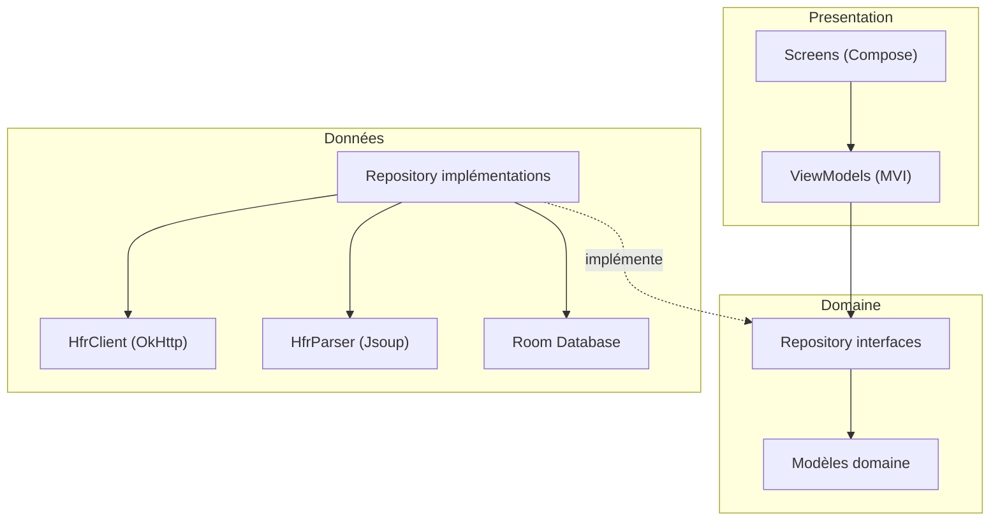
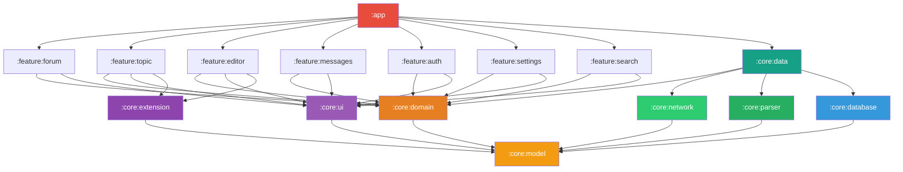
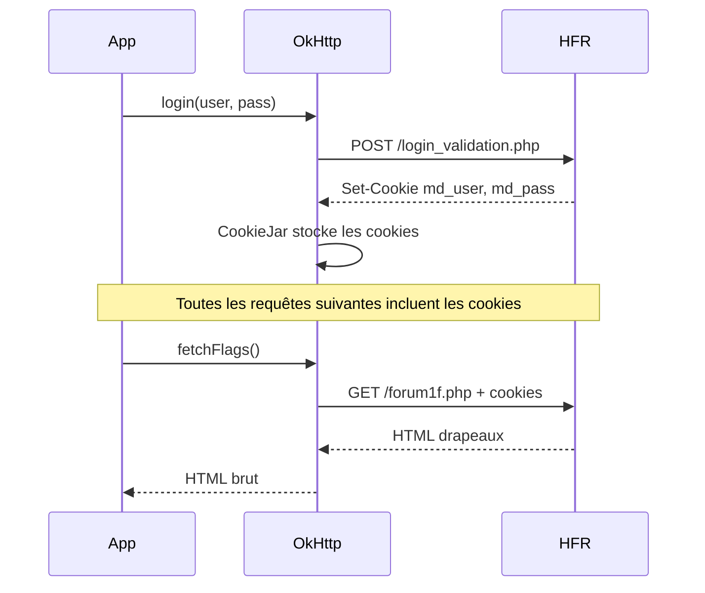

# Architecture
{: .fs-8 }

Modules Gradle, couches, data flow et stratégie de cache.
{: .fs-5 .fw-300 }

---

## Couches

L'application suit une architecture en 3 couches strictes. Chaque couche ne peut dépendre que de la couche en dessous. Les frontières sont **enforces par les modules Gradle** — pas de convention implicite.



- **Presentation** (`:feature:*`) : Compose UI + ViewModels MVI. Ne connait que les interfaces de repositories et les modèles domaine.
- **Domaine** (`:core:domain` + `:core:model`) : Interfaces de repositories + modèles purs. Aucune dépendance framework. Frontière de compilation.
- **Données** (`:core:data` + `:core:network` + `:core:parser` + `:core:database`) : Implémentations concrètes. Les features ne dépendent jamais de cette couche directement — Hilt injecte les implémentations.

---

## Modules Gradle



### Modules core

| Module | Responsabilité | Dépend de |
|--------|---------------|-----------|
| `:core:model` | Modèles domaine purs (`Topic`, `Post`, `Category`, `Flag`, `MP`). Aucune dépendance Android. | rien |
| `:core:domain` | Interfaces de repositories (`TopicRepository`, `FlagRepository`, `AuthRepository`...) et règles métier partagées. Aucune dépendance framework. | `:core:model` |
| `:core:data` | Implémentations des repositories. Orchestre réseau, parser et cache. Fournit les bindings Hilt. | `:core:domain`, `:core:network`, `:core:parser`, `:core:database` |
| `:core:network` | `HfrClient` : requêtes HTTP, cookies, session, login. Encapsule OkHttp. | `:core:model` |
| `:core:parser` | `HfrParser` : transforme le HTML HFR en modèles domaine via Jsoup. | `:core:model` |
| `:core:database` | Room DB, DAOs, entities, mappers entity↔model. Cache locale + cache MPStorage. | `:core:model` |
| `:core:ui` | Thème Material 3 (6 sous-packages : `theme/`, `components/`, `adaptive/`, `semantics/`, `util/`, `extensions/`), composants partagés, `PostRenderer` (BBCode → Compose). Seul module autorisé à instancier `ColorScheme`, `Typography`, `Shapes`. | `:core:model` |
| `:core:extension` | Interfaces d'extension : `PostDecorator`, `TopicToolbarContributor`, `EditorToolbarContributor`. | `:core:model` |

### Modules feature (base)

Les features ne dépendent que de `:core:domain` (interfaces) et `:core:ui` (composants partagés). Elles ne connaissent pas la couche données — Hilt injecte les implémentations depuis `:core:data`.

| Module | Écrans | Dépend de |
|--------|--------|-----------|
| `:feature:forum` | Catégories, sous-catégories, liste de topics | `:core:domain`, `:core:ui` |
| `:feature:topic` | Lecture de topic, pagination | `:core:domain`, `:core:ui`, `:core:extension` |
| `:feature:editor` | Reply, edit, edit FP, preview BBCode, création topic | `:core:domain`, `:core:ui`, `:core:extension` |
| `:feature:messages` | MPs classiques, MultiMPs, création MP/MultiMP | `:core:domain`, `:core:ui` |
| `:feature:auth` | Login HFR | `:core:domain`, `:core:ui` |
| `:feature:search` | Recherche dans les topics et posts, filtres | `:core:domain`, `:core:ui` |
| `:feature:settings` | Préférences, thème, gestion cache | `:core:domain`, `:core:ui` |

### Modules feature (extensions communautaires — Phase 4)

Les 8 modules extension arrivent en **Phase 4** uniquement. En Phases 0 à 3, le projet compte 15 modules (8 core + 7 features base). Les extensions sont des modules Gradle isolés qui s'enregistrent via Hilt `@IntoSet` — ajouter une extension ne demande aucune modification du code existant.

| Module | Fonction | Dépend de |
|--------|----------|-----------|
| `:feature:bookmarks` | Sauvegarder des posts | `:core:extension`, `:core:model`, `:core:database` |
| `:feature:blacklist` | Masquer des utilisateurs | `:core:extension`, `:core:model`, `:core:database` |
| `:feature:qualitay` | Signaler un post remarquable | `:core:extension`, `:core:model`, `:core:network` |
| `:feature:redflag` | Alertes intelligentes (via CF Worker) | `:core:extension`, `:core:model`, `:core:network` |
| `:feature:colortag` | Colorer et annoter les pseudos | `:core:extension`, `:core:model`, `:core:database` |
| `:feature:imagehost` | Upload et bibliothèque d'images | `:core:model`, `:core:network`, `:core:ui` |
| `:feature:gifpicker` | Recherche et insertion de GIFs | `:core:model`, `:core:network`, `:core:ui` |
| `:feature:stats` | Statistiques utilisateur | `:core:model`, `:core:network` |

### Module app

`:app` est le point d'entrée. Il :
- Configure Hilt (DI) — inclut `:core:data` pour le wiring des implémentations
- Définit le `NavGraph` (navigation globale)
- Contient `MainActivity`
- Dépend de tous les modules feature (base + extensions)

---

## Séparation des responsabilités

### `:core:domain` — interfaces

Les interfaces de repositories vivent dans le module domaine. Aucune dépendance framework.

```kotlin
// Dans :core:domain — le contrat
interface TopicRepository {
    suspend fun getTopic(cat: Int, post: Int, page: Int): Result<Topic>
    suspend fun prefetchNextPage(cat: Int, post: Int, page: Int)
}

interface FlagRepository {
    suspend fun getFlags(): Result<List<FlaggedTopic>>
    suspend fun removeFlag(topic: FlaggedTopic): Result<Unit>
}

interface AuthRepository {
    suspend fun login(username: String, password: String): Result<Unit>
    suspend fun isLoggedIn(): Boolean
}
```

### `:core:network` — HfrClient

Le client HTTP ne parse rien. Il retourne du HTML brut ou des confirmations d'action.

```kotlin
class HfrClient @Inject constructor(
    private val okHttpClient: OkHttpClient,
) {
    suspend fun fetchTopicPage(cat: Int, post: Int, page: Int): String
    suspend fun fetchFlags(): String
    suspend fun postReply(cat: Int, post: Int, content: String): Result<Unit>
    suspend fun editPost(cat: Int, post: Int, numreponse: Int, content: String): Result<Unit>
    suspend fun login(username: String, password: String): Result<Unit>
    // ...
}
```

### `:core:parser` — HfrParser

Le parser transforme le HTML en modèles domaine. Isolé de toute logique réseau.

```kotlin
class HfrParser @Inject constructor() {
    fun parseTopicPage(html: String): Topic
    fun parseFlags(html: String): List<FlaggedTopic>
    fun parseCategories(html: String): List<Category>
    fun parseEditPage(html: String): EditInfo
    fun parseMessageList(html: String): List<PrivateMessage>
    // ...
}
```

### `:core:data` — implémentations

Les implémentations de repositories orchestrent réseau, parser et cache. Elles vivent dans `:core:data`, jamais dans les features.

```kotlin
// Dans :core:data — l'implémentation
class TopicRepositoryImpl @Inject constructor(
    private val client: HfrClient,
    private val parser: HfrParser,
    private val topicDao: TopicDao,
) : TopicRepository {

    override suspend fun getTopic(cat: Int, post: Int, page: Int): Result<Topic> {
        // 1. Vérifier le cache
        topicDao.getCached(cat, post, page)?.let { return Result.success(it) }

        // 2. Fetch + parse
        return runCatching {
            val html = client.fetchTopicPage(cat, post, page)
            val topic = parser.parseTopicPage(html)

            // 3. Mettre en cache
            topicDao.insert(topic.toEntity())

            topic
        }
    }
}
```

Le binding Hilt connecte l'interface à l'implémentation :

```kotlin
// Dans :core:data
@Module
@InstallIn(SingletonComponent::class)
abstract class RepositoryModule {
    @Binds
    abstract fun bindTopicRepository(impl: TopicRepositoryImpl): TopicRepository

    @Binds
    abstract fun bindFlagRepository(impl: FlagRepositoryImpl): FlagRepository
}
```

Les ViewModels dans les features ne connaissent que l'interface :

```kotlin
// Dans :feature:topic — ne dépend que de :core:domain
@HiltViewModel
class TopicViewModel @Inject constructor(
    private val topicRepository: TopicRepository,  // interface, pas impl
) : ViewModel() { ... }
```

---

## Stratégie de cache

| Donnée | Stratégie | Durée |
|--------|-----------|-------|
| Topics lus | Cache Room, invalidation au refresh | Jusqu'au refresh |
| Drapeaux | Cache Room, refresh au lancement + pull-to-refresh | 5 min TTL |
| Catégories | Cache Room, rarement change | 24h TTL |
| Smileys | Cache Coil, ne changent jamais | Infini |
| Avatars | Cache Coil, ETag | 1h TTL |
| MultiMP flags | Room, jamais expire (donnée locale) | Permanent |
| Préférences | DataStore | Permanent |

### Prefetch intelligent

Pour donner l'impression que le forum est local :

```
Utilisateur lit la page 3 d'un topic
  → Prefetch page 4 en arrière-plan
  → Quand il scroll vers le bas, la page 4 est déjà prête

Utilisateur ouvre ses drapeaux
  → Prefetch les 3 premiers topics (ceux qu'il ouvre le plus souvent)
```

Le prefetch respecte les conditions réseau : désactivé en mode économie de données ou réseau lent.

#### Règle critique : prefetch non-authentifié

Les requêtes de prefetch ne doivent **jamais** inclure les cookies de session — sinon HFR marque silencieusement les topics comme lus. Implémentation avec deux instances `OkHttpClient` (`@AuthenticatedClient` / `@AnonymousClient`) et test Konsist d'enforcement : voir [protocol-hfr.md § Règle critique prefetch non-authentifié]({{ site.baseurl }}/protocol-hfr#règle-critique--prefetch-non-authentifié).

---

## Gestion de session

HFR utilise des cookies de session. Le flow d'authentification :



Les cookies sont persistés via un `PersistentCookieJar` adossé au DataStore chiffré (voir § Stockage sécurisé ci-dessous) pour éviter de se re-logguer à chaque lancement.

### Stockage sécurisé des credentials

Les cookies et credentials HFR sont chiffrés au repos via **DataStore + Google Tink + Android Keystore**.

> **Note** : `EncryptedSharedPreferences` (AndroidX Security) est **déprécié depuis avril 2025** (`security-crypto 1.1.0-alpha07`). Raisons officielles Google : StrictMode violations sur le thread principal, crashs "keyset corruption" sur certains OEMs. Le remplacement recommandé est DataStore + Tink + Keystore.

Architecture de stockage :

```kotlin
// 1. Clé maître dans Android Keystore (non extractible)
private fun getOrCreateMasterKey(): SecretKey { ... }

// 2. Tink pour le chiffrement AEAD des valeurs
private fun buildAead(masterKey: SecretKey): Aead { ... }

// 3. DataStore (Proto ou Preferences) pour la persistance
@Serializable
data class SecureCredentials(
    val cookies: List<SerializedCookie>,  // cookies HFR
    val hashedPassword: ByteArray,         // chiffré via Aead
)

val secureStore: DataStore<SecureCredentials> = context.dataStore(
    filename = "hfr_credentials.pb",
    serializer = EncryptedSerializer(aead),
)
```

Le `PersistentCookieJar` sérialise les cookies dans ce DataStore chiffré. Le mot de passe HFR (pour le re-login automatique en cas d'expiration de session) y est également stocké.

L'utilisation de la **Biometric API** pour protéger l'accès à l'app est envisagée pour une version ultérieure. Le stockage est conçu pour qu'une clé biométrique puisse être ajoutée sans migration (Keystore supporte les clés biometric-gated nativement).

---

## Gestion des erreurs

### Session expirée

Un `Interceptor` OkHttp détecte la redirection vers la page de login (HTTP 302 ou absence du cookie `md_user` dans la réponse). Il tente un re-login transparent avec les credentials stockés. Si le re-login échoue, un événement `SessionExpired` est émis et le `NavGraph` redirige vers l'écran de login.

### HFR indisponible

Le repository retourne `Result.failure` → le ViewModel affiche les données du cache Room + une bannière "HFR indisponible, données en cache". Retry automatique avec backoff exponentiel (2s, 4s, 8s, max 60s).

### Rate limiting

Interceptor OkHttp avec détection des réponses HTTP 429 et des patterns de blocage HFR. File d'attente côté client avec rate limit (max 2 req/s vers HFR). Backoff automatique sur 429.

### Breakage du parser

`HfrParser` wrappe chaque méthode dans `runCatching`. Sur échec, le HTML brut est loggé en mode debug pour diagnostic. Un smoke test CI hebdomadaire vérifie que les sélecteurs CSS critiques (`HfrSelectors`) matchent toujours sur une vraie page HFR publique.

---

## Enforcement architecture au build

Les règles d'architecture décrites plus haut (3 couches strictes, features → `:core:domain` + `:core:ui` uniquement, tokens M3 centralisés dans `:core:ui`) sont **enforcées mécaniquement** par **[Konsist](https://docs.konsist.lemonappdev.com/)** (Kotlin-first, AST parsing) — pas par une convention markdown.

Choix Konsist plutôt que ArchUnit :
- Konsist voit les spécificités Kotlin : `sealed`/`data`/`internal`/`object`, extensions, expect/actual KMP.
- ArchUnit lit le bytecode (post-`javac`/`kotlinc`) et perd la sémantique Kotlin.
- Konsist est Kotlin-first, intègre plus simplement avec la stack Redface 2.

Règles prévues dans `build-logic/src/main/kotlin/redface/Architecture.kt` (exemples) :

```kotlin
class ArchitectureTest {
    @Test fun `features n'importent pas :core:data`() {
        Konsist.scopeFromProject()
            .files
            .filter { it.path.contains("/feature/") }
            .imports
            .assertFalse { it.name.startsWith("redface.core.data.") }
    }

    @Test fun `ColorScheme Typography Shapes instantiés uniquement dans :core:ui`() {
        Konsist.scopeFromProject()
            .files
            .filter { !it.path.contains("/core/ui/") }
            .functions()
            .assertFalse { func ->
                func.hasReturnType { it.name in setOf("ColorScheme", "Typography", "Shapes") }
            }
    }

    @Test fun `prefetch utilise AnonymousClient`() {
        Konsist.scopeFromProject()
            .functions()
            .filter { it.name.startsWith("prefetch") }
            .assertTrue { fn ->
                fn.parameters.any { it.hasAnnotationOf(AnonymousClient::class) }
            }
    }
}
```

Les tests Konsist tournent en CI dès Phase 0 et bloquent les PR qui violent les règles.

---

## Protocole HFR

HFR n'a pas d'API publique. Redface 2 fait du scraping HTML et doit respecter plusieurs invariants (CSRF `hash_check`, anti-bot `verifrequet`, `numreponse` par catégorie, cookies de session, prefetch non-authentifié).

**Source de vérité** : [protocol-hfr.md]({{ site.baseurl }}/protocol-hfr) — endpoints (`forum1.php`, `forum2.php`, `bddpost.php`, …), form fields par endpoint, `hash_check`, `verifrequet`, `numreponse`, `listenumreponse`, sessions, smileys, edge cases (posts supprimés, emails obfusqués, pagination, `cryptlink`), fixtures.
