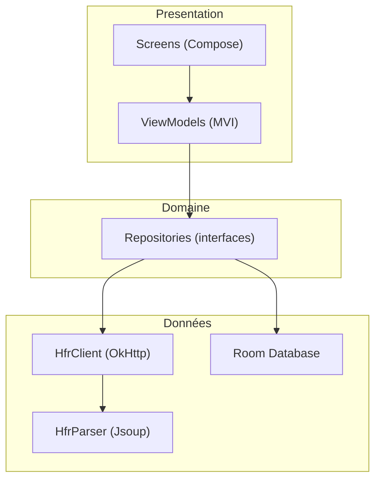
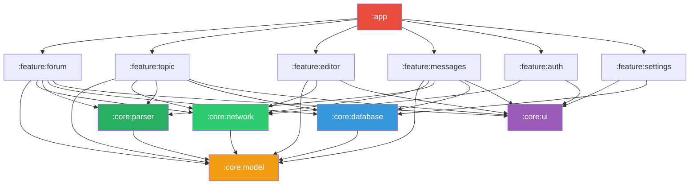

# Architecture
{: .fs-8 }

Modules Gradle, couches, data flow et stratégie de cache.
{: .fs-5 .fw-300 }

---

## Couches

L'application suit une architecture en 3 couches strictes. Chaque couche ne peut dépendre que de la couche en dessous.



- **Presentation** : Compose UI + ViewModels MVI. Ne connait pas OkHttp, Jsoup ou Room.
- **Domaine** : Interfaces de repositories + modèles. Aucune dépendance framework.
- **Données** : Implémentations concrètes. Gère le réseau, le parsing et le cache.

---

## Modules Gradle



### Modules core

| Module | Responsabilité | Dépend de |
|--------|---------------|-----------|
| `:core:model` | Modèles domaine purs (`Topic`, `Post`, `Category`, `Flag`, `MP`). Aucune dépendance Android. | rien |
| `:core:network` | `HfrClient` : requêtes HTTP, cookies, session, login. Encapsule OkHttp. | `:core:model` |
| `:core:parser` | `HfrParser` : transforme le HTML HFR en modèles domaine via Jsoup. | `:core:model` |
| `:core:database` | Room DB, DAOs, entities, mappers entity↔model. Cache locale + cache MPStorage. | `:core:model` |
| `:core:ui` | Thème Material 3, composants partagés, `PostRenderer` (BBCode → Compose). | `:core:model` |

### Modules feature

| Module | Écrans | Dépend de |
|--------|--------|-----------|
| `:feature:forum` | Catégories, sous-catégories, liste de topics | `:core:*` |
| `:feature:topic` | Lecture de topic, pagination, création de topic | `:core:*` |
| `:feature:editor` | Reply, edit, edit FP (sujet, sondage), preview BBCode | `:core:model`, `:core:network`, `:core:ui` |
| `:feature:messages` | MPs classiques, MultiMPs (vue drapeaux), création MP/MultiMP | `:core:*` |
| `:feature:auth` | Login HFR | `:core:network`, `:core:ui` |
| `:feature:settings` | Préférences, thème, gestion cache | `:core:ui`, `:core:database` |

### Module app

`:app` est le point d'entrée. Il :
- Configure Hilt (DI)
- Définit le `NavGraph` (navigation globale)
- Contient `MainActivity`
- Dépend de tous les modules feature

---

## Séparation des responsabilités

### `:core:network` — HfrClient

Le client HTTP ne parse rien. Il retourne du HTML brut ou des confirmations d'action.

```kotlin
class HfrClient @Inject constructor(
    private val okHttpClient: OkHttpClient,
) {
    suspend fun fetchTopicPage(cat: Int, post: Int, page: Int): String
    suspend fun fetchFlags(): String
    suspend fun postReply(cat: Int, post: Int, content: String): Result<Unit>
    suspend fun editPost(cat: Int, post: Int, numreponse: Int, content: String): Result<Unit>
    suspend fun login(username: String, password: String): Result<Unit>
    // ...
}
```

### `:core:parser` — HfrParser

Le parser transforme le HTML en modèles domaine. Isolé de toute logique réseau.

```kotlin
class HfrParser @Inject constructor() {
    fun parseTopicPage(html: String): Topic
    fun parseFlags(html: String): List<FlaggedTopic>
    fun parseCategories(html: String): List<Category>
    fun parseEditPage(html: String): EditInfo
    fun parseMessageList(html: String): List<PrivateMessage>
    // ...
}
```

### Repository — assemble le tout

```kotlin
class TopicRepository @Inject constructor(
    private val client: HfrClient,
    private val parser: HfrParser,
    private val topicDao: TopicDao,
) {
    suspend fun getTopic(cat: Int, post: Int, page: Int): Result<Topic> {
        // 1. Vérifier le cache
        topicDao.getCached(cat, post, page)?.let { return Result.success(it) }

        // 2. Fetch + parse
        return runCatching {
            val html = client.fetchTopicPage(cat, post, page)
            val topic = parser.parseTopicPage(html)

            // 3. Mettre en cache
            topicDao.insert(topic.toEntity())

            topic
        }
    }
}
```

---

## Stratégie de cache

| Donnée | Stratégie | Durée |
|--------|-----------|-------|
| Topics lus | Cache Room, invalidation au refresh | Jusqu'au refresh |
| Drapeaux | Cache Room, refresh au lancement + pull-to-refresh | 5 min TTL |
| Catégories | Cache Room, rarement change | 24h TTL |
| Smileys | Cache Coil, ne changent jamais | Infini |
| Avatars | Cache Coil, ETag | 1h TTL |
| MultiMP flags | Room, jamais expire (donnée locale) | Permanent |
| Préférences | DataStore | Permanent |

### Prefetch intelligent

Pour donner l'impression que le forum est local :

```
Utilisateur lit la page 3 d'un topic
  → Prefetch page 4 en arrière-plan
  → Quand il scroll vers le bas, la page 4 est déjà prête

Utilisateur ouvre ses drapeaux
  → Prefetch les 3 premiers topics (ceux qu'il ouvre le plus souvent)
```

Le prefetch respecte les conditions réseau : désactivé en mode économie de données ou réseau lent.

---

## Gestion de session

HFR utilise des cookies de session. Le flow d'authentification :

```mermaid
sequenceDiagram
    participant App
    participant OkHttp
    participant HFR

    App->>OkHttp: login(user, pass)
    OkHttp->>HFR: POST /login_validation.php
    HFR-->>OkHttp: Set-Cookie: md_user=...; md_pass=...
    OkHttp->>OkHttp: CookieJar stocke les cookies

    Note over App,HFR: Toutes les requêtes suivantes incluent les cookies

    App->>OkHttp: fetchFlags()
    OkHttp->>HFR: GET /forum1f.php (+ cookies)
    HFR-->>OkHttp: HTML (drapeaux)
    OkHttp-->>App: HTML brut
```

Les cookies sont persistés via un `PersistentCookieJar` (Room ou fichier) pour éviter de se re-logguer à chaque lancement.
