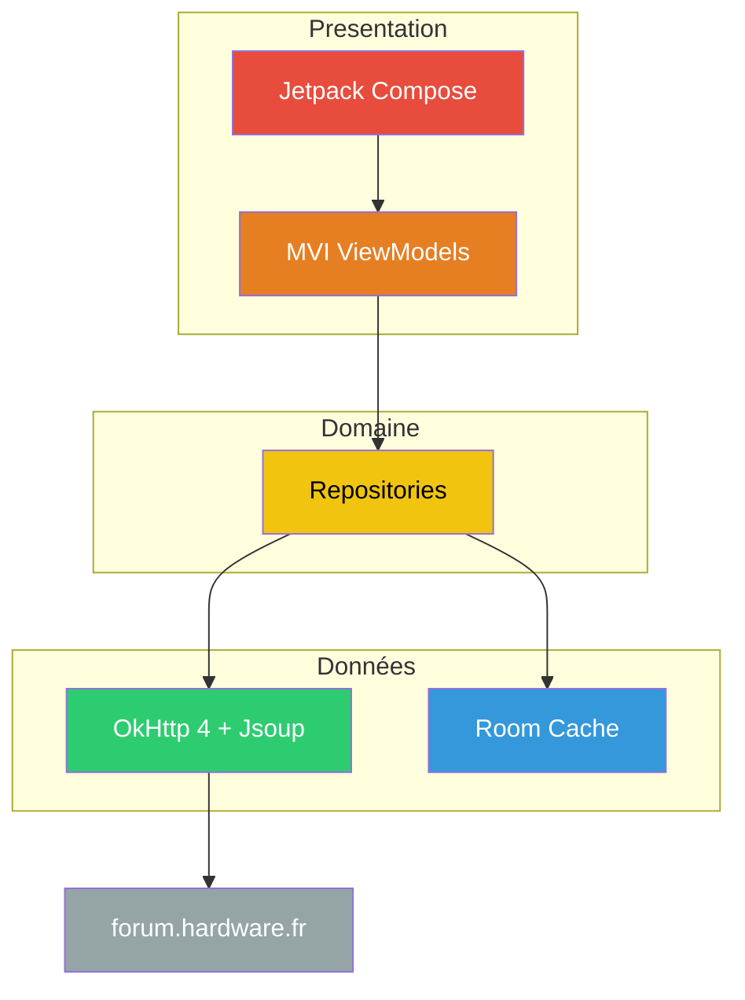

# Redface 2
{: .fs-9 }

Le futur client Android pour Hardware.fr.
{: .fs-6 .fw-300 }

[Voir la stack technique]({{ site.baseurl }}/stack){: .btn .btn-primary .fs-5 .mb-4 .mb-md-0 .mr-2 }
[Voir sur GitHub](https://github.com/ForumHFR/redface2){: .btn .fs-5 .mb-4 .mb-md-0 }

---

## Pourquoi une réécriture ?

Redface v1 a rendu service à la communauté HFR pendant des années. Mais sa stack technique a atteint ses limites :

| | Redface v1 | Redface 2 |
|---|---|---|
| Langage | Java 11 | **Kotlin** |
| UI | XML + ButterKnife | **Jetpack Compose** |
| Réseau | Retrofit 1.9 (!), OkHttp 3 | **OkHttp 4** |
| Async | RxJava 1 | **Coroutines + Flow** |
| Injection | Dagger 2 | **Hilt (KSP)** |
| Event bus | Otto | **StateFlow** |
| minSdk | 16 (Android 4.1, 2012) | **29 (Android 10, 2019)** |

Retrofit 1.9 n'est plus maintenu depuis 2016. RxJava 1 depuis 2018. ButterKnife est officiellement déprécié. Le minSdk 16 empêche d'utiliser les APIs modernes.

**Un refactoring incrémental serait plus coûteux qu'une réécriture.** Chaque brique dépend des autres — migrer Retrofit demande de migrer RxJava, qui demande de migrer les patterns async, qui touche toute l'architecture.

## Vision

Redface 2 est conçu pour :

- **La vitesse** — Scroll fluide à 120fps, prefetch intelligent, cache agressif. L'objectif : que le forum semble local.
- **Les features communautaires** — Les meilleurs ajouts des userscripts HFR (alertes qualitay, bookmarks, blacklist, redflag...) intégrés nativement.
- **La maintenabilité** — Architecture modulaire, testable, où chaque feature est isolée. Facile à comprendre pour un nouveau contributeur.
- **L'ouverture** — Système d'extensions pour que la communauté ajoute ses propres features sans toucher au cœur de l'app.

## Vue d'ensemble

## État du projet

Ce repository est en phase de **spécification**. Aucun code n'est encore écrit. L'objectif est de :

1. Verrouiller les choix techniques avec la communauté
2. Définir l'architecture en détail
3. Planifier les phases de développement
4. Commencer le dev sur des bases solides

Les contributions aux specs sont les bienvenues — ouvrez une issue ou commentez les existantes.

---

## Sommaire

- [Stack technique]({{ site.baseurl }}/stack) — Pourquoi chaque techno a été choisie
- [Architecture]({{ site.baseurl }}/architecture) — Couches, modules, data flow
- [Navigation]({{ site.baseurl }}/navigation) — Écrans, flows, deep linking
- [Modèles de données]({{ site.baseurl }}/models) — Structures du domaine
- [Pattern MVI]({{ site.baseurl }}/mvi) — Architecture UI en détail
- [Features communautaires]({{ site.baseurl }}/features) — Les addons userscript qui deviennent natifs
- [Nommage]({{ site.baseurl }}/naming) — Le futur nom de l'app
- [Roadmap]({{ site.baseurl }}/roadmap) — Phases de développement
- [Contribuer]({{ site.baseurl }}/contributing) — Comment participer
