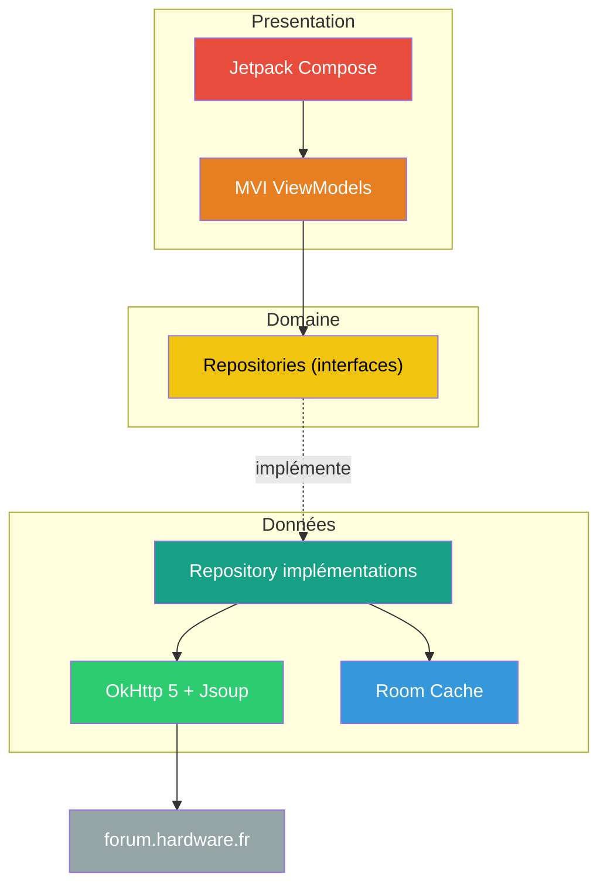

# Redface 2
{: .fs-9 }

Le futur client Android pour Hardware.fr.
{: .fs-6 .fw-300 }

[Voir les spécifications]({{ site.baseurl }}/specs){: .btn .btn-primary .fs-5 .mb-4 .mb-md-0 .mr-2 }
[Voir les guides]({{ site.baseurl }}/guides){: .btn .fs-5 .mb-4 .mb-md-0 .mr-2 }
[Voir sur GitHub](https://github.com/ForumHFR/redface2){: .btn .fs-5 .mb-4 .mb-md-0 }

---

## Pourquoi une réécriture ?

Redface v1 a rendu service à la communauté HFR pendant des années. Mais sa stack technique a atteint ses limites :

| | Redface v1 | Redface 2 |
|---|---|---|
| Langage | Java 11 | **Kotlin** |
| UI | XML + ButterKnife | **Jetpack Compose** |
| Réseau | Retrofit 1.9 (!), OkHttp 3 | **OkHttp 5** |
| Async | RxJava 1 | **Coroutines + Flow** |
| Injection | Dagger 2 | **Hilt (KSP)** |
| Event bus | Otto | **StateFlow** |
| minSdk | 16 (Android 4.1, 2012) | **29 (Android 10, 2019)** |

Retrofit 1.9 n'est plus maintenu depuis 2016. RxJava 1 depuis 2018. ButterKnife est officiellement déprécié. Le minSdk 16 empêche d'utiliser les APIs modernes.

**Un refactoring incrémental serait plus coûteux qu'une réécriture.** Chaque brique dépend des autres — migrer Retrofit demande de migrer RxJava, qui demande de migrer les patterns async, qui touche toute l'architecture.

## Vision

Redface 2 est conçu pour :

- **La vitesse** — Scroll fluide à 120fps, prefetch intelligent, cache agressif. L'objectif : que le forum semble local.
- **Les extensions communautaires** — Les meilleurs ajouts des userscripts HFR (alertes qualitay, bookmarks, blacklist, redflag...) intégrés nativement.
- **La maintenabilité** — Architecture modulaire, testable, où chaque feature est isolée. Facile à comprendre pour un nouveau contributeur.
- **L'ouverture** — Système d'extensions pour que la communauté ajoute ses propres features sans toucher au cœur de l'app.

## Vue d'ensemble

```mermaid
graph TB
    subgraph "Presentation"
        A[Jetpack Compose] --> B[MVI ViewModels]
    end
    subgraph "Domaine"
        B --> C["Repositories (interfaces)"]
    end
    subgraph "Données"
        D["Repository implémentations"]
        D --> E[OkHttp 5 + Jsoup]
        D --> G[Room Cache]
    end
    C -.->|implémente| D
    E --> F["forum.hardware.fr"]
    style A fill:#e74c3c,color:#fff
    style B fill:#e67e22,color:#fff
    style C fill:#f1c40f,color:#000
    style D fill:#16a085,color:#fff
    style E fill:#2ecc71,color:#fff
    style G fill:#3498db,color:#fff
    style F fill:#95a5a6,color:#fff
```

## État du projet

Phase courante : **Phase 4 — Extensions + refonte UI** ([roadmap]({{ site.baseurl }}/specs/roadmap)). Phases 1 (lecture), 2 (écriture) et 3 (messages) sont **livrées** : login, drapeaux, forum, topics, cache, deep links, recherche, écriture/édition/citation/création, MPs classiques et MultiMPs (lecture, réponse ; citation simple par message livrée en 1:1, non prouvée en DT — fail-closed ; citation multiple encore absente, cf. [roadmap]({{ site.baseurl }}/specs/roadmap) Phase 3), onglet DT, MPStorage lecture **et écriture** (opt-in). La **bêta 0.37.0** (refontes des vues Drapeaux #603 et Topic #604, passe images #876) est publiée (Play open testing + F-Droid) ; seule la sync MPStorage bidirectionnelle complète reste reportée (#6). En cours : itération 2 des vues Topic et Éditeur.

Les specs restent la source de vérité du projet, mais elles doivent désormais refléter le code réel : tout écart entre une page canonique et le repo est traité comme un bug de spec, pas comme une dette future. Voir [`/spec-reality`](https://github.com/ForumHFR/redface2/blob/main/.agents/skills/spec-reality/SKILL.md) pour la procédure d'audit cross-fichier.

Les contributions sont les bienvenues : ouvrez une issue, commentez les existantes ou proposez une PR sur le slice courant.

---

## Sommaire

### Spécifications

- [Méthodologie]({{ site.baseurl }}/specs/methodology) — Comment le projet spécifie, prototype et teste
- [Scope fonctionnel]({{ site.baseurl }}/specs/scope) — Ce que l'app doit permettre de faire
- [Stack technique]({{ site.baseurl }}/specs/stack) — Pourquoi chaque techno a été choisie
- [Architecture]({{ site.baseurl }}/specs/architecture) — Couches, modules, data flow
- [Navigation]({{ site.baseurl }}/specs/navigation) — Écrans, flows, deep linking
- [Modèles de données]({{ site.baseurl }}/specs/models) — Structures du domaine
- [Pattern MVI]({{ site.baseurl }}/specs/mvi) — Architecture UI en détail
- [Protocole HFR]({{ site.baseurl }}/specs/protocol-hfr) — Contrats externes, endpoints et edge cases
- [Roadmap]({{ site.baseurl }}/specs/roadmap) — Phases de développement
- [Parité de lecture Topic ↔ MP]({{ site.baseurl }}/specs/reading-parity) — L'état de chaque fonction de lecture côté MP/DT
- [Extensions communautaires]({{ site.baseurl }}/specs/extensions) — Les addons userscript qui deviennent natifs
- [ADRs]({{ site.baseurl }}/adr) — Les décisions structurantes déjà prises

### Guides

- [Contribuer]({{ site.baseurl }}/guides/contributing) — Comment participer
- [Pourquoi Redface 2 ?]({{ site.baseurl }}/guides/rationale) — Le contexte et les doutes assumés
- [Nommage]({{ site.baseurl }}/guides/naming) — Le futur nom de l'app
- [Références écosystème HFR]({{ site.baseurl }}/guides/references) — Clients tiers, docs MesDiscussions, outillage compagnon
- [Proxy utilisateur]({{ site.baseurl }}/guides/proxy) — Router le trafic HFR via un proxy configurable dans l'app
