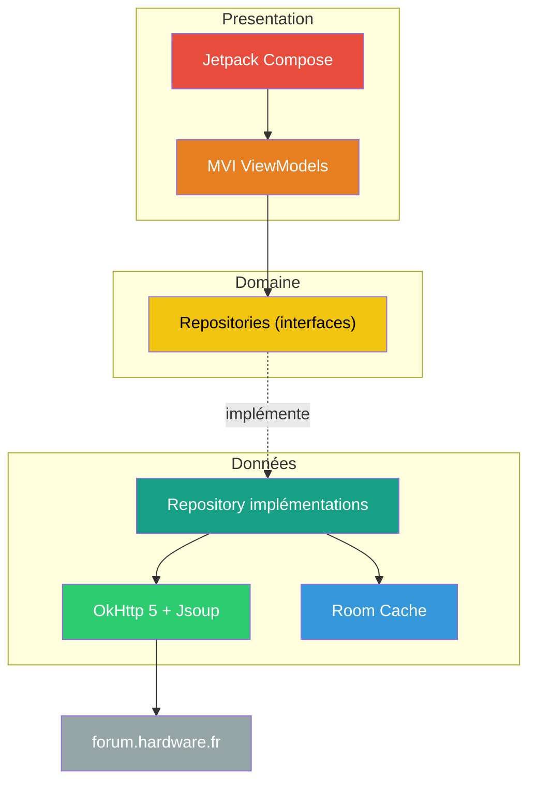

# Redface 2
{: .fs-9 }

Le client Android communautaire pour Hardware.fr, en bêta publique.
{: .fs-6 .fw-300 }

[Voir les spécifications]({{ site.baseurl }}/specs){: .btn .btn-primary .fs-5 .mb-4 .mb-md-0 .mr-2 }
[Voir les guides]({{ site.baseurl }}/guides){: .btn .fs-5 .mb-4 .mb-md-0 .mr-2 }
[Voir sur GitHub](https://github.com/ForumHFR/redface2){: .btn .fs-5 .mb-4 .mb-md-0 }

---

## Pourquoi une réécriture ?

Redface v1 a rendu service à la communauté HFR pendant des années. Mais sa stack technique a atteint ses limites :

| | Redface v1 | Redface 2 |
|---|---|---|
| Langage | Java 11 | **Kotlin** |
| UI | XML + ButterKnife | **Jetpack Compose** |
| Réseau | Retrofit 1.9 (!), OkHttp 3 | **OkHttp 5** |
| Async | RxJava 1 | **Coroutines + Flow** |
| Injection | Dagger 2 | **Hilt (KSP)** |
| Event bus | Otto | **StateFlow** |
| minSdk | 16 (Android 4.1, 2012) | **29 (Android 10, 2019)** |

Retrofit 1.9 n'est plus maintenu depuis 2016. RxJava 1 depuis 2018. ButterKnife est officiellement déprécié. Le minSdk 16 empêche d'utiliser les APIs modernes.

**Un refactoring incrémental serait plus coûteux qu'une réécriture.** Chaque brique dépend des autres — migrer Retrofit demande de migrer RxJava, qui demande de migrer les patterns async, qui touche toute l'architecture.

## Vision

Redface 2 est conçu pour :

- **La vitesse** — Scroll fluide à 120fps, prefetch intelligent, cache agressif. L'objectif : que le forum semble local.
- **Les extensions communautaires** — Les meilleurs ajouts des userscripts HFR (alertes qualitay, bookmarks, blacklist, redflag...) intégrés nativement.
- **La maintenabilité** — Architecture modulaire, testable, où chaque feature est isolée. Facile à comprendre pour un nouveau contributeur.
- **L'ouverture** — Système d'extensions pour que la communauté ajoute ses propres features sans toucher au cœur de l'app.

## Vue d'ensemble

```mermaid
graph TB
    subgraph "Presentation"
        A[Jetpack Compose] --> B[MVI ViewModels]
    end
    subgraph "Domaine"
        B --> C["Repositories (interfaces)"]
    end
    subgraph "Données"
        D["Repository implémentations"]
        D --> E[OkHttp 5 + Jsoup]
        D --> G[Room Cache]
    end
    C -.->|implémente| D
    E --> F["forum.hardware.fr"]
    style A fill:#e74c3c,color:#fff
    style B fill:#e67e22,color:#fff
    style C fill:#f1c40f,color:#000
    style D fill:#16a085,color:#fff
    style E fill:#2ecc71,color:#fff
    style G fill:#3498db,color:#fff
    style F fill:#95a5a6,color:#fff
```

## État du projet

- **Bêta publique 0.50.2** (1er septembre 2026, Play test ouvert + F-Droid) : sondages (vote, clôture par le créateur), liens HFR (ouverture externe sans rebond, gestionnaire par défaut), modération et rôles du staff, vue forum, citations et fiabilité. Détail par version dans [`app/CHANGELOG.md`](https://github.com/ForumHFR/redface2/blob/main/app/CHANGELOG.md).
- **Canal dev 0.52.x** : Réglages → Affichage → Couleurs (huit presets d'accent, hexa, tons de fond clair et sombre, AMOLED, couleurs du système), zoom pincé interactif, largeur maximale des images et viewer plein écran (pinch/pan/double-tap).
- **Livré** : les phases 0 à 3 de la [roadmap]({{ site.baseurl }}/specs/roadmap) (bootstrap ; lecture ; écriture ; messages privés et MultiMP, MPStorage en lecture et en écriture opt-in) et la refonte UI de la phase 4 (vues Drapeaux [#603](https://github.com/ForumHFR/redface2/issues/603) et Topic [#604](https://github.com/ForumHFR/redface2/issues/604), passe images [#876](https://github.com/ForumHFR/redface2/issues/876), EgoQuote et EgoPost [#874](https://github.com/ForumHFR/redface2/issues/874), surface de lecture partagée Topic → MP/DT [#1040](https://github.com/ForumHFR/redface2/issues/1040)). L'état fonction par fonction côté MP se lit dans la [matrice de parité]({{ site.baseurl }}/specs/reading-parity).
- **Pilotage** : depuis juin 2026 le travail est suivi par milestones de vue (*Vue · Topic 2*, *Vue · Éditeur 2*, *Vue · Drapeaux 2*, *Vue · MP 1*, *Vue · Réglages 1*, *Vue · Compte HFR 1*, *Infra & dette*), les phases restant des épics thématiques. Restent ouverts en fond : l'architecture d'extensions ([#7](https://github.com/ForumHFR/redface2/issues/7)) et la sync MPStorage entre appareils ([#6](https://github.com/ForumHFR/redface2/issues/6)).

Les specs restent la source de vérité du projet, mais elles doivent refléter le code réel : tout écart entre une page canonique et le repo est traité comme un bug de spec, pas comme une dette future. Voir [`/spec-reality`](https://github.com/ForumHFR/redface2/blob/main/.agents/skills/spec-reality/SKILL.md) pour la procédure d'audit cross-fichier.

Les contributions sont les bienvenues : ouvrez une issue, commentez les existantes ou proposez une PR sur `dev`. Les retours de test passent par le [topic bêta](https://forum.hardware.fr/forum2.php?config=hfr.inc&cat=23&post=35395&page=1) et le [topic dev](https://forum.hardware.fr/forum2.php?config=hfr.inc&cat=23&post=35421&page=1) sur HFR.

---

## Sommaire

### Spécifications

- [Méthodologie]({{ site.baseurl }}/specs/methodology) — Comment le projet spécifie, prototype et teste
- [Scope fonctionnel]({{ site.baseurl }}/specs/scope) — Ce que l'app doit permettre de faire
- [Stack technique]({{ site.baseurl }}/specs/stack) — Pourquoi chaque techno a été choisie
- [Architecture]({{ site.baseurl }}/specs/architecture) — Couches, modules, data flow
- [Navigation]({{ site.baseurl }}/specs/navigation) — Écrans, flows, deep linking
- [Modèles de données]({{ site.baseurl }}/specs/models) — Structures du domaine
- [Pattern MVI]({{ site.baseurl }}/specs/mvi) — Architecture UI en détail
- [Protocole HFR]({{ site.baseurl }}/specs/protocol-hfr) — Contrats externes, endpoints et edge cases
- [Roadmap]({{ site.baseurl }}/specs/roadmap) — Phases de développement
- [Parité de lecture Topic ↔ MP]({{ site.baseurl }}/specs/reading-parity) — L'état de chaque fonction de lecture côté MP/DT
- [Extensions communautaires]({{ site.baseurl }}/specs/extensions) — Les addons userscript qui deviennent natifs
- [ADRs]({{ site.baseurl }}/adr) — Les décisions structurantes déjà prises

### Guides

- [Installation]({{ site.baseurl }}/guides/installation) — Play, F-Droid (bêta et dev), GitHub Releases, signatures et cohabitation
- [Contribuer]({{ site.baseurl }}/guides/contributing) — Environnement, tests, rendu visuel, Git
- [Release]({{ site.baseurl }}/guides/release) — Canaux bêta et dev, registre `app-v<N>`, promotion `dev → main`
- [Limitations connues]({{ site.baseurl }}/guides/known-issues) — Compromis assumés et limites plateforme
- [Pourquoi Redface 2 ?]({{ site.baseurl }}/guides/rationale) — Le contexte et les doutes assumés
- [Nommage]({{ site.baseurl }}/guides/naming) — Historique du choix du nom
- [Références écosystème HFR]({{ site.baseurl }}/guides/references) — Clients tiers, docs MesDiscussions, outillage compagnon
- [Proxy utilisateur]({{ site.baseurl }}/guides/proxy) — Router le trafic HFR via un proxy configurable dans l'app
- [Profiling]({{ site.baseurl }}/guides/profiling) — Mesurer avant d'optimiser
- [Icône de l'application]({{ site.baseurl }}/guides/app-icon) — Sources et déclinaisons de l'icône
- [Capturer une fixture de citation MP]({{ site.baseurl }}/guides/capture-fixture-citation-mp) — Procédure de capture live
