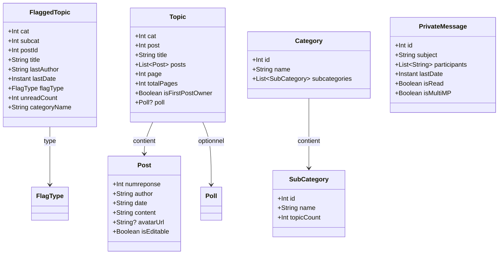

# Modeles de donnees
{: .fs-8 }

Structures du domaine metier.
{: .fs-5 .fw-300 }

---

## Vue d'ensemble



---

## Drapeaux

```kotlin
data class FlaggedTopic(
    val cat: Int,
    val subcat: Int,
    val postId: Int,
    val title: String,
    val lastAuthor: String,
    val lastDate: Instant,
    val flagType: FlagType,
    val unreadCount: Int,
    val categoryName: String,
)

enum class FlagType {
    CYAN,       // l'utilisateur a participe au topic
    FAVORITE,   // marque d'une etoile jaune
    READ,       // drapeau rouge, marque de lecture
}
```

---

## Topics et Posts

```kotlin
data class Topic(
    val cat: Int,
    val post: Int,
    val title: String,
    val posts: List<Post>,
    val page: Int,
    val totalPages: Int,
    val isFirstPostOwner: Boolean,
    val poll: Poll?,
)

data class Post(
    val numreponse: Int,
    val author: String,
    val date: String,
    val content: String,
    val avatarUrl: String?,
    val isEditable: Boolean,
)
```

---

## Creation et edition

```kotlin
data class NewTopic(
    val cat: Int,
    val subcat: Int,
    val subject: String,
    val content: String,
    val poll: PollData?,
)

data class FirstPostData(
    val subject: String,
    val content: String,
    val poll: PollData?,
)

data class PollData(
    val question: String,
    val options: List<String>,
    val multipleChoice: Boolean,
)
```

---

## Categories

```kotlin
data class Category(
    val id: Int,
    val name: String,
    val subcategories: List<SubCategory>,
)

data class SubCategory(
    val id: Int,
    val name: String,
    val topicCount: Int,
)
```

---

## Messages prives

```kotlin
data class PrivateMessage(
    val id: Int,
    val subject: String,
    val participants: List<String>,
    val lastDate: Instant,
    val isRead: Boolean,
    val isMultiMP: Boolean,
)

data class NewMP(
    val recipient: String,
    val subject: String,
    val content: String,
)

data class NewMultiMP(
    val recipients: List<String>,
    val subject: String,
    val content: String,
)
```

---

## MultiMP Storage

HFR ne gere pas nativement l'etat lu/non-lu des MultiMPs. L'app stocke cette information localement.

```kotlin
data class MultiMPFlag(
    val mpId: Int,
    val lastReadDate: Instant,
    val pinned: Boolean,
)
```

Le calcul du non-lu : `lastDate du MP > lastReadDate du flag` → non lu.

Cette approche remplace le MPStorage des userscripts (qui utilisait `localStorage` ou un worker Cloudflare) par une base Room locale, plus fiable et plus rapide.

---

## Recherche

```kotlin
data class SearchQuery(
    val text: String,
    val cat: Int? = null,
    val author: String? = null,
    val dateFrom: LocalDate? = null,
    val dateTo: LocalDate? = null,
)

data class SearchResult(
    val postId: Int,
    val topicTitle: String,
    val author: String,
    val date: String,
    val preview: String,
    val cat: Int,
    val post: Int,
    val numreponse: Int,
)
```
