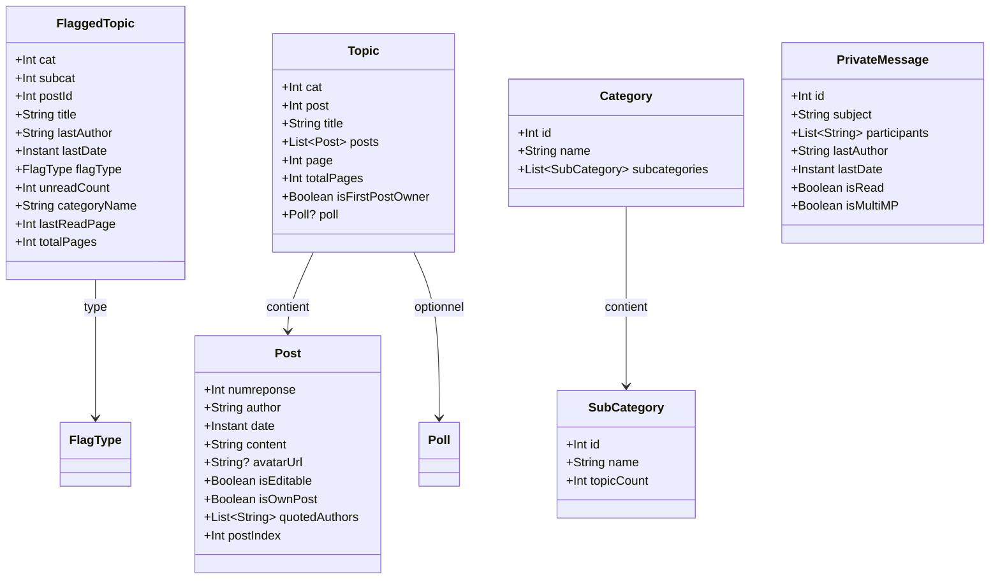

# Modèles de données
{: .fs-8 }

Structures du domaine métier.
{: .fs-5 .fw-300 }

---

## À définir avec les écrans

Certains modèles référencés dans `navigation.md` et `extensions.md` sont volontairement laissés à définir au moment d'implémenter leurs écrans, pour éviter la dette de spec pré-code :

- **`TopicSummary`** — une ligne dans une liste de topics (titre, auteur, dernière date, nombre non-lus). ≠ `Topic` qui contient tous les posts d'une page. Nécessaire Phase 1 pour le Forum et la liste des topics d'une sous-catégorie.
- **`UserProfile`** — données du popup profil rapide (avatar, date inscription, nombre posts, localisation). Nécessaire Phase 1 pour la feature "Infos profil rapides".
- **`UserStats`** — statistiques détaillées utilisateur (posts par cat, activité, topics créés). Nécessaire Phase 4 pour la feature "Stats utilisateur".

Ces modèles émergeront du premier prototype de chaque écran. Pas de spec préventive à faire maintenant.

---

## Vue d'ensemble



---

## Drapeaux

```kotlin
data class FlaggedTopic(
    val cat: Int,
    val subcat: Int,
    val postId: Int,
    val title: String,
    val lastAuthor: String,
    val lastDate: Instant,
    val flagType: FlagType,
    val unreadCount: Int,
    val categoryName: String,
    val lastReadPage: Int,      // page de la dernière lecture
    val totalPages: Int,        // nombre total de pages
)

enum class FlagType {
    CYAN,       // l'utilisateur a participé au topic
    FAVORITE,   // marque d'une étoile jaune
    READ,       // drapeau rouge, marque de lecture
}
```

---

## Topics et Posts

```kotlin
data class Topic(
    val cat: Int,
    val post: Int,
    val title: String,
    val posts: List<Post>,
    val page: Int,
    val totalPages: Int,
    val isFirstPostOwner: Boolean,
    val poll: Poll?,
)

data class Post(
    val numreponse: Int,                 // unique par (cat), PAS globalement — clé composite (cat, numreponse) au niveau base
    val author: String,
    val date: Instant,                   // parsé depuis "dd-MM-yyyy à HH:mm:ss"
    val content: String,                 // BBCode brut, rendu par PostRenderer
    val avatarUrl: String?,
    val isEditable: Boolean,             // calculé client-side : post.author == currentUser && !isLocked
    val isOwnPost: Boolean,              // calculé client-side : post.author == currentUser
    val quotedAuthors: List<String>,     // extraits des [quotemsg=]
    val postIndex: Int,                  // (page-1) * postsPerPage + position — postsPerPage vient des préférences HFR de l'utilisateur, PAS une constante (voir UserSettings)
)
```

---

## Création et édition

```kotlin
data class NewTopic(
    val cat: Int,
    val subcat: Int,
    val subject: String,
    val content: String,
    val poll: PollData?,
)

data class FirstPostData(
    val subject: String,
    val content: String,
    val poll: PollData?,
)

data class PollData(
    val question: String,
    val options: List<String>,
    val multipleChoice: Boolean,
)

data class Poll(
    val question: String,
    val options: List<PollOption>,
    val multipleChoice: Boolean,
    val totalVotes: Int,
    val hasVoted: Boolean,
)

data class PollOption(
    val text: String,
    val votes: Int,
    val percentage: Float,
)
```

`EditInfo` est retourné par `HfrParser.parseEditPage(html)` (cf. [architecture.md]({{ site.baseurl }}/architecture#core-parser--hfrparser)). Il capture l'état pré-rempli du formulaire d'édition HFR et ce qui doit être renvoyé côté `bdd.php` (cf. [protocol-hfr.md]({{ site.baseurl }}/protocol-hfr#post-bddphp-edit)).

```kotlin
data class EditInfo(
    val cat: Int,
    val post: Int,                   // ID topic
    val numreponse: Int,             // ID post édité (unique par cat)
    val content: String,             // BBCode brut pré-rempli dans le textarea
    val isFirstPost: Boolean,        // édition du premier post (FP) ?
    val subject: String?,            // non-null uniquement si isFirstPost
    val subcat: Int?,                // non-null uniquement si isFirstPost (change de sous-cat possible)
    val poll: Poll?,                 // non-null si isFirstPost avec sondage existant
)
```

---

## Catégories

```kotlin
data class Category(
    val id: Int,
    val name: String,
    val subcategories: List<SubCategory>,
)

data class SubCategory(
    val id: Int,
    val name: String,
    val topicCount: Int,
)
```

---

## Messages privés

```kotlin
data class PrivateMessage(
    val id: Int,
    val subject: String,
    val participants: List<String>,
    val lastAuthor: String,         // dernier expéditeur
    val lastDate: Instant,
    val isRead: Boolean,            // HFR natif (classic) ou MPStorage (multi)
    val isMultiMP: Boolean,
    val messages: List<PMMessage>,  // conversation chargée à l'ouverture, peut être vide dans les listes
    val page: Int = 1,              // page courante dans la conversation
    val totalPages: Int = 1,
)

data class PMMessage(
    val numreponse: Int,
    val author: String,
    val date: Instant,
    val content: String,            // BBCode brut, rendu par PostRenderer
    val isEditable: Boolean,        // calculé client-side : author == currentUser
)

data class NewMP(
    val recipient: String,
    val subject: String,
    val content: String,
)

data class NewMultiMP(
    val recipients: List<String>,
    val subject: String,
    val content: String,
)
```

---

## MPStorage

MPStorage est une bibliothèque cross-plateforme qui utilise un **MP HFR dédié** comme backend de stockage. Les données (drapeaux MultiMP, bookmarks, préférences) sont sérialisées en JSON dans le corps de ce message privé. Cela permet la synchronisation entre appareils sans serveur tiers.

```kotlin
// Données stockées dans le MP de stockage (format JSON)
data class MPStorageData(
    val multiMPFlags: Map<Int, MultiMPFlag>,  // clé = mpId
    val bookmarks: List<Bookmark>,
    val settings: MPStorageSettings,
)

data class MultiMPFlag(
    // mpId est la clé du Map, pas besoin de le dupliquer
    val lastReadDate: Instant,
    val pinned: Boolean,
)

data class MPStorageSettings(
    val compactFlags: Boolean = false,
    val defaultImageHost: String = "diberie",
)

data class Bookmark(
    val cat: Int,
    val post: Int,              // topic ID
    val numreponse: Int,        // post ID
    val topicTitle: String,
    val author: String,
    val preview: String,
    val createdAt: Instant,
)
```

L'app synchronise ces données avec le MP de stockage HFR et les cache localement dans Room pour des accès rapides. Cela garantit la compatibilité avec les userscripts existants qui utilisent le même mécanisme.

---

## Paramètres utilisateur

`UserSettings` capture les réglages du compte HFR qui influencent le rendu côté client. Le parser lit ces valeurs depuis `editprofil.php?page=3` à la connexion et les stocke en cache (Room + DataStore). **Aucun champ ne doit être hardcodé** dans le code applicatif — notamment `postsPerPage` (cf. [protocol-hfr.md]({{ site.baseurl }}/protocol-hfr#postsperpage-configurable)).

```kotlin
data class UserSettings(
    val postsPerPage: Int,           // 20 / 40 / 60 — réglable HFR, défaut 40
    val showAvatars: Boolean,        // affichage des avatars dans les topics
    val showSignatures: Boolean,     // affichage des signatures
    val timezone: String,            // ex: "Europe/Paris"
    val language: String,            // "fr" | "en"
)
```

**Note** : le modèle est volontairement minimaliste pour la Phase 1. Les réglages secondaires (thème CSS HFR, jeu d'icônes, notifications MP, notifications mots-clés, fuseau numérique, réglages de signature) seront ajoutés Phase 2+ lors de l'implémentation de l'écran Paramètres, suivant la règle prototype-first de la méthodologie.

---

## Recherche

```kotlin
data class SearchQuery(
    val text: String,
    val cat: Int? = null,
    val author: String? = null,
    val dateFrom: LocalDate? = null,
    val dateTo: LocalDate? = null,
)

data class SearchResult(
    val cat: Int,
    val post: Int,              // topic ID
    val numreponse: Int,        // post ID dans la catégorie
    val topicTitle: String,
    val author: String,
    val date: Instant,
    val preview: String,
)
```

---

## Hébergement d'images

```kotlin
data class HostedImage(
    val id: String,
    val url: String,
    val thumbnailUrl: String?,
    val originalUrl: String?,
    val providerId: String,         // identifiant du provider ayant servi l'upload ou le rehost
    val deleteToken: String?,       // null si le provider ne supporte pas la suppression (ex : rehost)
    val uploadedAt: Instant,
    val sizeBytes: Long,
    val topicRef: TopicRef?,
)

data class TopicRef(
    val cat: Int,
    val post: Int,
    val title: String,
)
```

### Providers — interfaces séparées

Les capacités varient d'un provider à l'autre : certains supportent l'upload **et** le rehost, d'autres uniquement le rehost. Une seule interface `ImageProvider` avec des méthodes qui échouent sur certains providers serait fragile. On sépare en **deux interfaces distinctes**, implémentées indépendamment :

```kotlin
// :core:domain
interface UploadProvider {
    val id: String                  // "diberie", "superh", "imgur"
    val displayName: String

    /** Upload une image depuis les octets bruts. Retourne l'image hébergée. */
    suspend fun upload(bytes: ByteArray, filename: String?): Result<HostedImage>

    /** Supprime une image si le provider le supporte et si deleteToken est valide. */
    suspend fun delete(image: HostedImage): Result<Unit>
}

interface RehostProvider {
    val id: String                  // "rehost", "diberie-rehost", "superh-rehost"
    val displayName: String

    /** Rehost une image déjà en ligne par son URL. Retourne l'image copiée. */
    suspend fun rehost(sourceUrl: String): Result<HostedImage>
}
```

Un provider peut implémenter **les deux** interfaces si HFR expose les deux flux (exemple : `DiberieUploadProvider` implémente `UploadProvider`, `DiberieRehostProvider` implémente `RehostProvider`, ils peuvent partager un `HttpClient` commun).

Providers prévus en Phase 2 :

| `id` | Interface(s) | Notes |
|---|---|---|
| `diberie` | `UploadProvider` + `RehostProvider` | Rehost by dib (communauté HFR) |
| `superh` | `UploadProvider` + `RehostProvider` | super-h.fr |
| `imgur` | `UploadProvider` | API Imgur, fallback |
| `rehost` | `RehostProvider` | reho.st historique (plus d'upload manuel) |

Enregistrement via Hilt `@IntoSet` (cf. [extensions.md]({{ site.baseurl }}/extensions#architecture-dextensions)) : ajouter un provider ne modifie pas le code existant.
