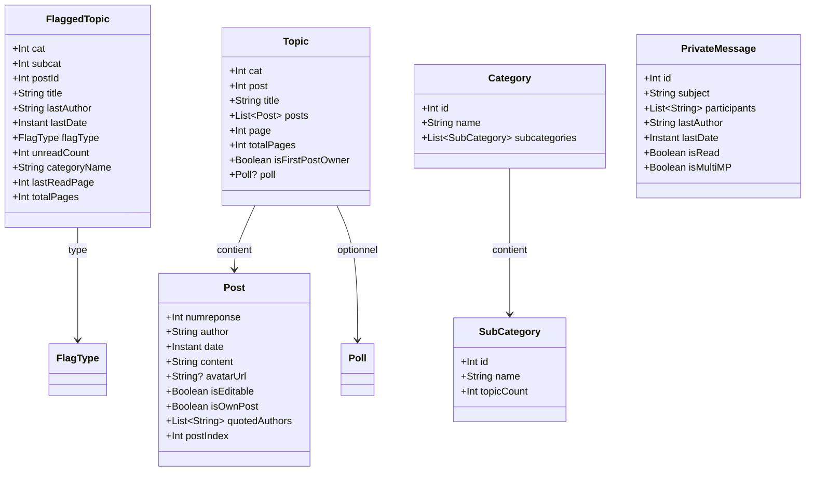

# Modèles de données
{: .fs-8 }

Structures du domaine métier.
{: .fs-5 .fw-300 }

---

## Vue d'ensemble



---

## Drapeaux

```kotlin
data class FlaggedTopic(
    val cat: Int,
    val subcat: Int,
    val postId: Int,
    val title: String,
    val lastAuthor: String,
    val lastDate: Instant,
    val flagType: FlagType,
    val unreadCount: Int,
    val categoryName: String,
    val lastReadPage: Int,      // page de la dernière lecture
    val totalPages: Int,        // nombre total de pages
)

enum class FlagType {
    CYAN,       // l'utilisateur a participé au topic
    FAVORITE,   // marque d'une étoile jaune
    READ,       // drapeau rouge, marque de lecture
}
```

---

## Topics et Posts

```kotlin
data class Topic(
    val cat: Int,
    val post: Int,
    val title: String,
    val posts: List<Post>,
    val page: Int,
    val totalPages: Int,
    val isFirstPostOwner: Boolean,
    val poll: Poll?,
)

data class Post(
    val numreponse: Int,                 // unique par (cat), PAS globalement — clé composite (cat, numreponse) au niveau base
    val author: String,
    val date: Instant,                   // parsé depuis "dd-MM-yyyy à HH:mm:ss"
    val content: String,                 // BBCode brut, rendu par PostRenderer
    val avatarUrl: String?,
    val isEditable: Boolean,             // calculé client-side : post.author == currentUser && !isLocked
    val isOwnPost: Boolean,              // calculé client-side : post.author == currentUser
    val quotedAuthors: List<String>,     // extraits des [quotemsg=]
    val postIndex: Int,                  // (page-1) * postsPerPage + position — postsPerPage vient des préférences HFR de l'utilisateur, PAS une constante (voir UserSettings)
)
```

---

## Création et édition

```kotlin
data class NewTopic(
    val cat: Int,
    val subcat: Int,
    val subject: String,
    val content: String,
    val poll: PollData?,
)

data class FirstPostData(
    val subject: String,
    val content: String,
    val poll: PollData?,
)

data class PollData(
    val question: String,
    val options: List<String>,
    val multipleChoice: Boolean,
)

data class Poll(
    val question: String,
    val options: List<PollOption>,
    val multipleChoice: Boolean,
    val totalVotes: Int,
    val hasVoted: Boolean,
)

data class PollOption(
    val text: String,
    val votes: Int,
    val percentage: Float,
)
```

---

## Catégories

```kotlin
data class Category(
    val id: Int,
    val name: String,
    val subcategories: List<SubCategory>,
)

data class SubCategory(
    val id: Int,
    val name: String,
    val topicCount: Int,
)
```

---

## Messages privés

```kotlin
data class PrivateMessage(
    val id: Int,
    val subject: String,
    val participants: List<String>,
    val lastAuthor: String,     // dernier expéditeur
    val lastDate: Instant,
    val isRead: Boolean,        // HFR natif (classic) ou MPStorage (multi)
    val isMultiMP: Boolean,
)

data class NewMP(
    val recipient: String,
    val subject: String,
    val content: String,
)

data class NewMultiMP(
    val recipients: List<String>,
    val subject: String,
    val content: String,
)
```

---

## MPStorage

MPStorage est une bibliothèque cross-plateforme qui utilise un **MP HFR dédié** comme backend de stockage. Les données (drapeaux MultiMP, bookmarks, préférences) sont sérialisées en JSON dans le corps de ce message privé. Cela permet la synchronisation entre appareils sans serveur tiers.

```kotlin
// Données stockées dans le MP de stockage (format JSON)
data class MPStorageData(
    val multiMPFlags: Map<Int, MultiMPFlag>,  // clé = mpId
    val bookmarks: List<Bookmark>,
    val settings: MPStorageSettings,
)

data class MultiMPFlag(
    // mpId est la clé du Map, pas besoin de le dupliquer
    val lastReadDate: Instant,
    val pinned: Boolean,
)

data class MPStorageSettings(
    val compactFlags: Boolean = false,
    val defaultImageHost: String = "diberie",
)

data class Bookmark(
    val cat: Int,
    val post: Int,              // topic ID
    val numreponse: Int,        // post ID
    val topicTitle: String,
    val author: String,
    val preview: String,
    val createdAt: Instant,
)
```

L'app synchronise ces données avec le MP de stockage HFR et les cache localement dans Room pour des accès rapides. Cela garantit la compatibilité avec les userscripts existants qui utilisent le même mécanisme.

---

## Recherche

```kotlin
data class SearchQuery(
    val text: String,
    val cat: Int? = null,
    val author: String? = null,
    val dateFrom: LocalDate? = null,
    val dateTo: LocalDate? = null,
)

data class SearchResult(
    val cat: Int,
    val post: Int,              // topic ID
    val numreponse: Int,        // post ID dans la catégorie
    val topicTitle: String,
    val author: String,
    val date: Instant,
    val preview: String,
)
```

---

## Hébergement d'images

```kotlin
data class HostedImage(
    val id: String,
    val url: String,
    val thumbnailUrl: String?,
    val originalUrl: String?,
    val provider: ImageProvider,
    val deleteToken: String?,
    val uploadedAt: Instant,
    val sizeBytes: Long,
    val topicRef: TopicRef?,
)

enum class ImageProvider {
    DIBERIE,    // rehost by dib
    SUPER_H,    // super-h.fr
    IMGUR,      // imgur.com
    REHOST,     // reho.st (rehost par préfixe URL uniquement, plus d'upload manuel)
}

data class TopicRef(
    val cat: Int,
    val post: Int,
    val title: String,
)
```
