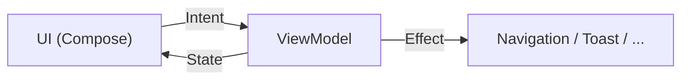

# Pattern MVI
{: .fs-8 }

Model-View-Intent : le pattern d'architecture UI de Redface 2.
{: .fs-5 .fw-300 }

---

## Principe

MVI impose un **flux de données unidirectionnel**. L'utilisateur émet des Intents, le ViewModel produit un nouveau State, Compose dessine le State.



Trois concepts :

- **State** : l'état complet de l'écran. Immutable. Un seul objet `data class`.
- **Intent** : une action de l'utilisateur. `sealed interface`. Pur, sans logique.
- **Effect** : un événement one-shot (navigation, snackbar, vibration). Ne fait pas partie du state car il ne doit pas être rejoué à la recomposition.

---

## Écran Drapeaux (accueil)

```kotlin
// ── State ──────────────────────────────────────────
data class FlagsState(
    val flags: List<FlaggedTopic> = emptyList(),
    val filteredFlags: List<FlaggedTopic> = emptyList(),
    val sortMode: SortMode = SortMode.BY_DATE,
    val filter: FlagFilter = FlagFilter.ALL,
    val isLoading: Boolean = false,
    val isRefreshing: Boolean = false,
    val error: String? = null,
)

enum class SortMode { BY_DATE, BY_CATEGORY }
enum class FlagFilter { ALL, CYAN, FAVORITE, READ }

// ── Intents ────────────────────────────────────────
sealed interface FlagsIntent {
    data object Refresh : FlagsIntent
    data class SetSort(val mode: SortMode) : FlagsIntent
    data class SetFilter(val filter: FlagFilter) : FlagsIntent
    data class OpenTopic(val topic: FlaggedTopic) : FlagsIntent
    data class RemoveFlag(val topic: FlaggedTopic) : FlagsIntent
    data class UndoRemoveFlag(val topic: FlaggedTopic) : FlagsIntent
}

// ── Effects ────────────────────────────────────────
sealed interface FlagsEffect {
    data class NavigateToTopic(val cat: Int, val post: Int, val page: Int) : FlagsEffect
    data class ShowUndo(val topic: FlaggedTopic) : FlagsEffect
    data class Error(val message: String) : FlagsEffect
}
```

### ViewModel

```kotlin
@HiltViewModel
class FlagsViewModel @Inject constructor(
    private val flagRepository: FlagRepository,
) : ViewModel() {

    private val _state = MutableStateFlow(FlagsState())
    val state = _state.asStateFlow()

    private val _effects = Channel<FlagsEffect>()
    val effects = _effects.receiveAsFlow()

    init { send(FlagsIntent.Refresh) }

    fun send(intent: FlagsIntent) {
        when (intent) {
            is FlagsIntent.Refresh -> refresh()
            is FlagsIntent.SetSort -> {
                _state.update { it.copy(sortMode = intent.mode) }
                updateFilteredFlags()
            }
            is FlagsIntent.SetFilter -> {
                _state.update { it.copy(filter = intent.filter) }
                updateFilteredFlags()
            }
            is FlagsIntent.OpenTopic -> openTopic(intent.topic)
            is FlagsIntent.RemoveFlag -> removeFlag(intent.topic)
            is FlagsIntent.UndoRemoveFlag -> undoRemoveFlag(intent.topic)
        }
    }

    private fun refresh() {
        viewModelScope.launch {
            _state.update { it.copy(isRefreshing = true) }
            flagRepository.getFlags()
                .onSuccess { flags ->
                    _state.update { it.copy(flags = flags, isRefreshing = false, error = null) }
                    updateFilteredFlags()
                }
                .onFailure { e ->
                    _state.update { it.copy(isRefreshing = false, error = e.message) }
                }
        }
    }

    private fun openTopic(topic: FlaggedTopic) {
        viewModelScope.launch {
            _effects.send(FlagsEffect.NavigateToTopic(topic.cat, topic.postId, topic.lastReadPage))
        }
    }

    private val pendingRemovals = mutableMapOf<Int, Job>()

    private fun removeFlag(topic: FlaggedTopic) {
        // 1. Retirer de l'UI immédiatement
        _state.update { it.copy(flags = it.flags - topic) }
        updateFilteredFlags()

        // 2. Lancer un timer avec undo
        val job = viewModelScope.launch {
            _effects.send(FlagsEffect.ShowUndo(topic))
            delay(5_000)

            // 3. Timeout expiré → exécuter côté serveur
            flagRepository.removeFlag(topic)
                .onFailure {
                    // Rollback si le réseau échoue
                    _state.update { it.copy(flags = it.flags + topic) }
                    updateFilteredFlags()
                    _effects.send(FlagsEffect.Error("Impossible de retirer le drapeau"))
                }
        }
        pendingRemovals[topic.postId] = job
    }

    private fun undoRemoveFlag(topic: FlaggedTopic) {
        pendingRemovals.remove(topic.postId)?.cancel()
        _state.update { it.copy(flags = it.flags + topic) }
        updateFilteredFlags()
    }

    private fun updateFilteredFlags() {
        _state.update { state ->
            val filtered = state.flags
                .filter { matchesFilter(it, state.filter) }
                .sortedWith(comparatorFor(state.sortMode))
            state.copy(filteredFlags = filtered)
        }
    }
}
```

### Screen (Compose)

```kotlin
@Composable
fun FlagsScreen(
    viewModel: FlagsViewModel = hiltViewModel(),
    onNavigateToTopic: (cat: Int, post: Int, page: Int) -> Unit,
) {
    val state by viewModel.state.collectAsStateWithLifecycle()

    // Effects one-shot, lifecycle-aware (ne traite pas en arrière-plan)
    ObserveAsEvents(viewModel.effects) { effect ->
        when (effect) {
            is FlagsEffect.NavigateToTopic ->
                onNavigateToTopic(effect.cat, effect.post, effect.page)
            is FlagsEffect.ShowUndo -> { /* snackbar */ }
            is FlagsEffect.Error -> { /* snackbar */ }
        }
    }

    FlagsContent(
        state = state,
        onIntent = viewModel::send,
    )
}

@Composable
private fun FlagsContent(
    state: FlagsState,
    onIntent: (FlagsIntent) -> Unit,
) {
    Column {
        // Toolbar : tri + filtre
        FlagsToolbar(
            sortMode = state.sortMode,
            filter = state.filter,
            onSortChange = { onIntent(FlagsIntent.SetSort(it)) },
            onFilterChange = { onIntent(FlagsIntent.SetFilter(it)) },
        )

        // Liste des drapeaux
        PullToRefreshBox(
            isRefreshing = state.isRefreshing,
            onRefresh = { onIntent(FlagsIntent.Refresh) },
        ) {
            LazyColumn {
                items(state.filteredFlags) { topic ->
                    FlagItem(
                        topic = topic,
                        onClick = { onIntent(FlagsIntent.OpenTopic(topic)) },
                        onDismiss = { onIntent(FlagsIntent.RemoveFlag(topic)) },
                    )
                }
            }
        }
    }
}
```

---

## Écran Topic (lecture)

```kotlin
data class TopicState(
    val title: String = "",
    val posts: List<Post> = emptyList(),
    val currentPage: Int = 1,
    val totalPages: Int = 1,
    val isLoading: Boolean = false,
    val isFirstPostOwner: Boolean = false,
    val poll: Poll? = null,
    val error: String? = null,
)

sealed interface TopicIntent {
    data class LoadPage(val page: Int) : TopicIntent
    data object NextPage : TopicIntent
    data object PrevPage : TopicIntent
    data object Refresh : TopicIntent
    data class QuotePost(val numreponse: Int) : TopicIntent
    data class EditPost(val numreponse: Int) : TopicIntent
    data object EditFirstPost : TopicIntent
    data class FlagTopic(val type: FlagType) : TopicIntent
    data class OpenImage(val url: String) : TopicIntent
}

sealed interface TopicEffect {
    data class NavigateToReply(val cat: Int, val post: Int, val quote: String?) : TopicEffect
    data class NavigateToEdit(val cat: Int, val post: Int, val numreponse: Int) : TopicEffect
    data class NavigateToEditFP(val cat: Int, val post: Int) : TopicEffect
    data class NavigateToImage(val url: String) : TopicEffect
    data class Error(val message: String) : TopicEffect
}
```

---

## Écran Editor (reply / edit / FP)

L'éditeur est partagé entre reply, edit et edit FP. Le mode détermine les champs visibles.

```kotlin
data class EditorState(
    val mode: EditorMode = EditorMode.Reply,
    val content: String = "",
    val subject: String = "",           // visible en mode EditFP
    val poll: PollData? = null,         // visible en mode EditFP
    val isSending: Boolean = false,
    val preview: String? = null,        // rendu BBCode preview
    val error: String? = null,
)

enum class EditorMode {
    Reply,      // nouveau message
    Edit,       // éditer un post existant
    EditFP,     // éditer le first post (sujet + sondage)
    NewTopic,   // créer un topic
}

sealed interface EditorIntent {
    data class UpdateContent(val text: String) : EditorIntent
    data class UpdateSubject(val text: String) : EditorIntent
    data class InsertBBCode(val tag: String) : EditorIntent
    data object Preview : EditorIntent
    data object Send : EditorIntent
}
```

---

## Écran Messages

```kotlin
data class MessagesState(
    val activeTab: MessageTab = MessageTab.CLASSIC,
    val classicMPs: List<PrivateMessage> = emptyList(),
    val multiMPs: List<PrivateMessage> = emptyList(),
    val isLoading: Boolean = false,
    val error: String? = null,
)

enum class MessageTab { CLASSIC, MULTI }

sealed interface MessagesIntent {
    data class SwitchTab(val tab: MessageTab) : MessagesIntent
    data object Refresh : MessagesIntent
    data class OpenMP(val mp: PrivateMessage) : MessagesIntent
    data object NewMP : MessagesIntent
    data object NewMultiMP : MessagesIntent
}
```

---

## Convention

Chaque feature suit la même structure de fichiers :

```
feature/topic/
  ├── TopicScreen.kt        // @Composable, collecte state + effects
  ├── TopicContent.kt       // @Composable stateless, previewable
  ├── TopicViewModel.kt     // MVI ViewModel
  └── TopicState.kt         // State + Intent + Effect
```

Cette convention garantit la cohérence et facilite l'onboarding des contributeurs.

---

## Utilitaire : ObserveAsEvents

Helper lifecycle-aware pour collecter les effects sans les traiter en arrière-plan. Vit dans `:core:ui` et est utilisé par tous les screens.

```kotlin
@Composable
fun <T> ObserveAsEvents(
    flow: Flow<T>,
    onEvent: (T) -> Unit,
) {
    val lifecycleOwner = LocalLifecycleOwner.current
    LaunchedEffect(flow, lifecycleOwner) {
        lifecycleOwner.repeatOnLifecycle(Lifecycle.State.STARTED) {
            flow.collect(onEvent)
        }
    }
}
```

Sans ce helper, les effects émis pendant que l'app est en arrière-plan seraient traités immédiatement (navigation fantôme, snackbars invisibles). `repeatOnLifecycle(STARTED)` garantit que les effects ne sont consommés que quand l'écran est au premier plan.
