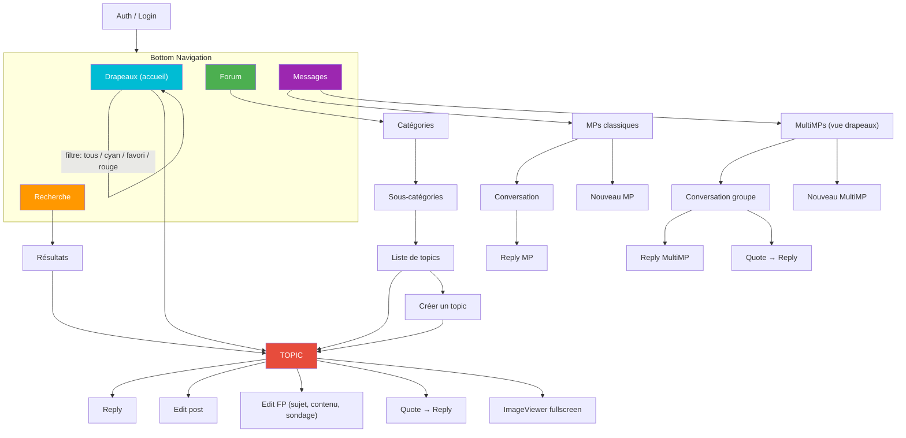
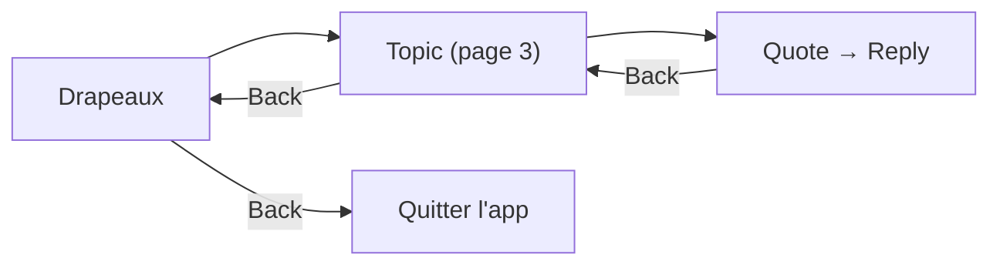

# Navigation
{: .fs-8 }

Écrans, flows, deep linking et bottom navigation.
{: .fs-5 .fw-300 }

---

## Bottom Navigation

L'application utilise une barre de navigation en bas avec 4 onglets principaux + les réglages accessibles depuis chaque écran.

```
┌───────────┬───────────┬───────────┬───────────┐
│  Drapeaux │  Forum    │  Recherche│  Messages  │
│  (accueil)│           │           │            │
└───────────┴───────────┴───────────┴────────────┘
```

**Drapeaux** est l'écran d'accueil. C'est le point d'entrée principal — la plupart des utilisateurs HFR ouvrent l'app pour vérifier "quoi de neuf sur mes topics suivis".

---

## Navigation Graph



---

## Écrans en détail

### Drapeaux (accueil)

L'écran le plus important de l'app. Affiche les topics suivis par l'utilisateur.

**Tri :**
- **Par date** (défaut) : tous les topics mélangés, triés par dernier message
- **Par catégorie** : groupes par cat/subcat, chaque groupe trie par date

**Filtres :**
- **Tous** : tous les drapeaux confondus
- **Cyan** : topics où l'utilisateur a participé
- **Favori** : topics marqués d'une étoile jaune
- **Rouge** : marque de lecture (dernière position lue)

**Actions sur un topic :**
- Tap → ouvrir le topic à la dernière position non lue
- Long press → menu contextuel (retirer drapeau, copier URL, partager)
- Swipe → retirer le drapeau (avec undo)

### Topic (lecture)

L'écran central de l'app. Affiche les posts d'un topic avec pagination.

**Navigation dans le topic :**
- Scroll vertical pour lire les posts
- Boutons page précédente / suivante
- Saut direct à une page (champ numéro)
- Saut au premier / dernier post
- Indicateur de page courante / total

**Actions sur un post :**
- **Quoter** → ouvre l'éditeur avec la citation pré-remplie
- **Editer** (si c'est notre post) → ouvre l'éditeur avec le contenu actuel
- **Editer le FP** (si `isFirstPostOwner`) → éditeur spécial avec sujet + sondage
- **Copier le texte**
- **Voir l'image en plein écran**
- **Partager le lien du post**

### Forum (catégories)

Navigation hiérarchique dans le forum.

```
Catégories
  └── Hardware
       ├── HFR
       ├── Overclocking
       └── ...
  └── Programmation
       ├── C/C++
       ├── Java
       └── ...
```

Chaque catégorie affiche le nombre de topics et l'activité récente.

### Création de topic

Formulaire complet :
- **Catégorie** : sélecteur hiérarchique
- **Sous-catégorie** : dépend de la catégorie choisie
- **Sujet** : titre du topic
- **Contenu** : éditeur BBCode avec toolbar
- **Sondage** (optionnel) : question + options + choix multiple oui/non
- **Preview** : avant-première du rendu BBCode

### Messages

Deux onglets :

**MPs classiques :**
- Inbox : liste des conversations 1-to-1, triées par date
- Chaque MP affiche : sujet, correspondant, date, lu/non-lu
- Nouveau MP : destinataire + sujet + contenu

**MultiMPs :**
- Vue style drapeaux : fils de groupe triés par dernier message
- État lu/non-lu géré via **MPStorage** (données synchronisées depuis un MP HFR dédié, cachées en Room)
- Chaque MultiMP se comporte comme un topic : pagination, quote, reply
- Nouveau MultiMP : destinataires (2+) + sujet + contenu

### Recherche

- Recherche dans les topics (titre) et dans les posts (contenu)
- Filtres : catégorie, auteur, date
- Résultats avec preview du contexte

---

## Deep Linking

Les URLs HFR doivent ouvrir directement le bon écran dans l'app.

| Pattern URL | Écran cible |
|-------------|-------------|
| `forum.hardware.fr/forum1.php?cat=X&post=Y&page=Z` | Topic page Z |
| `forum.hardware.fr/forum1.php?cat=X&post=Y` | Topic page 1 |
| `forum.hardware.fr/forum2.php?config=hfr.inc&cat=X&subcat=Y` | Liste topics |
| `forum.hardware.fr/forum1f.php` | Drapeaux |
| `forum.hardware.fr/forum1.php?cat=X&post=Y#t12345` | Post spécifique (traitement custom, voir ci-dessous) |

Implémentation via **Compose Navigation 3** (1.1.0+, stable depuis 08/04/2026). Les routes sont des types `@Serializable` qui implémentent `NavKey` :

```kotlin
// Routes type-safe
@Serializable data object FlagsListRoute : NavKey
@Serializable data class TopicRoute(
    val cat: Int,
    val post: Int,
    val page: Int = 1,
    val scrollTo: Int? = null,  // numreponse cible pour #t{numreponse}
) : NavKey
@Serializable data class CategoryRoute(val cat: Int, val subcat: Int? = null) : NavKey
@Serializable data class EditorRoute(val mode: EditorMode, val cat: Int, val post: Int? = null) : NavKey
@Serializable data object MessagesRoute : NavKey
```

Le back stack est porté par `NavBackStack<NavKey>`, transformé en `NavEntry`, puis rendu via `rememberSceneState` + `NavDisplay` :

```kotlin
@Composable
fun RedfaceNavHost(backStack: NavBackStack<NavKey>) {
    val entries = rememberDecoratedNavEntries(
        backStack = backStack,
        entryDecorators = listOf(rememberSaveableStateHolderNavEntryDecorator()),
    ) { key ->
        NavEntry(key) {
            when (val route = key) {
                FlagsListRoute -> FlagsScreen(
                    onOpenTopic = { topic ->
                        backStack.add(TopicRoute(topic.cat, topic.postId, topic.lastReadPage))
                    },
                )
                is TopicRoute -> TopicScreen(
                    cat = route.cat,
                    post = route.post,
                    page = route.page,
                    scrollTo = route.scrollTo,
                    onReply = { postId ->
                        backStack.add(EditorRoute(EditorMode.Reply, route.cat, postId))
                    },
                )
                is CategoryRoute -> CategoryScreen(route.cat, route.subcat)
                is EditorRoute -> EditorScreen(route)
                MessagesRoute -> MessagesScreen()
            }
        }
    }
    val sceneState = rememberSceneState(
        entries = entries,
        sceneStrategies = listOf(SinglePaneSceneStrategy()),
        onBack = { backStack.removeLastOrNull() },
    )
    val navigationEventState = rememberNavigationEventState(
        currentInfo = SceneInfo(sceneState.currentScene),
        backInfo = sceneState.previousScenes.map(::SceneInfo),
    )

    NavigationBackHandler(
        navigationEventState = navigationEventState,
        isBackEnabled = sceneState.currentScene.previousEntries.isNotEmpty(),
        onBackCompleted = {
            repeat(entries.size - sceneState.currentScene.previousEntries.size) {
                backStack.removeLastOrNull()
            }
        }
    )

    NavDisplay(sceneState, navigationEventState)
}
```

**Avantages Nav 3 vs Nav 2.x pour Redface 2** :
- Le back stack est du **state observable standard** — facile à persister/restaurer, à inspecter pour debug, à manipuler dans des tests
- `SceneStrategy` permet de composer des mises en page multi-pane sans hiérarchiser les graphs
- Intégration directe avec `ListDetailPaneScaffold` (Material 3 Adaptive) — la liste et le détail vivent dans le même back stack mais s'affichent en parallèle sur tablette
- Shared Elements entre scenes via `SharedTransitionScope` (transitions topic list → topic view propres)

### Cas particulier : lien vers un post spécifique

Nav 3 (comme Nav 2.x) **ne gère pas les fragments URI** (`#t{numreponse}`) nativement : on parse l'URI dans `MainActivity` et on ajoute la route typée au back stack :

```kotlin
// MainActivity.kt
@Composable
fun RedfaceApp(intent: Intent?) {
    val backStack = rememberNavBackStack(FlagsListRoute)

    LaunchedEffect(intent) {
        val uri = intent?.data ?: return@LaunchedEffect
        parseHfrDeepLink(uri)?.let(backStack::add)
    }

    RedfaceNavHost(backStack = backStack)
}

fun parseHfrDeepLink(uri: Uri): NavKey? = when (uri.path) {
    "/forum1.php" -> {
        val cat = uri.getQueryParameter("cat")?.toIntOrNull() ?: return null
        val post = uri.getQueryParameter("post")?.toIntOrNull() ?: return null
        val page = uri.getQueryParameter("page")?.toIntOrNull() ?: 1
        val scrollTo = uri.fragment?.removePrefix("t")?.toIntOrNull()
        TopicRoute(cat = cat, post = post, page = page, scrollTo = scrollTo)
    }
    "/forum2.php" -> CategoryRoute(
        cat = uri.getQueryParameter("cat")?.toIntOrNull() ?: return null,
        subcat = uri.getQueryParameter("subcat")?.toIntOrNull(),
    )
    "/forum1f.php" -> FlagsListRoute
    else -> null
}
```

Le `TopicScreen` reçoit le `scrollTo` (numreponse cible) et scroll jusqu'au bon post après chargement de la page.

### Predictive back

Nav 3 intègre `PredictiveBackHandler` via `NavDisplay` — aucun code custom requis pour les écrans standards. Seuls les écrans à interaction custom (ex : éditeur avec draft) ajoutent leur propre handler :

```kotlin
@Composable
fun EditorScreen(state: EditorState, onIntent: (EditorIntent) -> Unit) {
    var showDiscardDialog by remember { mutableStateOf(false) }

    PredictiveBackHandler(enabled = state.content.isNotEmpty()) { progress ->
        progress.collect { /* animation personnalisée si besoin */ }
        showDiscardDialog = true  // à la fin, on demande confirmation
    }

    // ... rest of the screen
}
```

Manifest requis : `android:enableOnBackInvokedCallback="true"` sur `<application>`.

### Multi-pane adaptatif (tablette, foldables)

`NavDisplay` se compose avec `ListDetailPaneScaffold` (Material 3 Adaptive 1.2+). Le même back stack alimente la list pane et la detail pane selon `WindowSizeClass` :

```kotlin
@Composable
fun AdaptiveNavHost(backStack: NavBackStack<NavKey>) {
    val isExpanded = currentWindowAdaptiveInfo().windowSizeClass.windowWidthSizeClass !=
        WindowWidthSizeClass.COMPACT

    if (isExpanded) {
        ListDetailPaneScaffold(
            listPane = {
                FlagsScreen(
                    onOpenTopic = { topic ->
                        backStack.add(TopicRoute(topic.cat, topic.postId, topic.lastReadPage))
                    },
                )
            },
            detailPane = {
                when (val current = backStack.lastOrNull()) {
                    is TopicRoute -> TopicScreen(
                        cat = current.cat,
                        post = current.post,
                        page = current.page,
                        scrollTo = current.scrollTo,
                        onReply = { postId ->
                            backStack.add(EditorRoute(EditorMode.Reply, current.cat, postId))
                        },
                    )
                    is EditorRoute -> EditorScreen(current)
                    else -> Text("Select a topic")
                }
            },
        )
    } else {
        RedfaceNavHost(backStack = backStack)
    }
}
```

---

## Back Stack

Nav 3 expose le back stack comme un `NavBackStack<NavKey>` observable, puis le runtime le transforme en `List<NavEntry<NavKey>>` pour le rendu. Règles Redface 2 :

- **Bottom nav** : chaque onglet conserve son propre back stack (un `NavDisplay` par onglet, ou un `SceneStrategy` qui segmente par préfixe)
- **Retour depuis un topic** : retour à la liste (drapeaux, forum, recherche) à la même position de scroll — la scène précédente reste en mémoire tant qu'elle est dans le back stack
- **Retour depuis reply/edit** : retour au topic à la même page
- **Deep link** : ajout de la route typée sur le back stack existant, sans écraser — si l'utilisateur fait back, il retourne à l'écran d'accueil (drapeaux)


