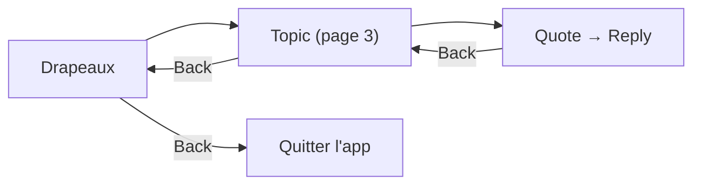

# Navigation
{: .fs-8 }

Ecrans, flows, deep linking et bottom navigation.
{: .fs-5 .fw-300 }

---

## Bottom Navigation

L'application utilise une barre de navigation en bas avec 4 onglets principaux + les reglages accessibles depuis chaque ecran.

```
┌───────────┬───────────┬───────────┬───────────┐
│  Drapeaux │  Forum    │  Recherche│  Messages  │
│  (accueil)│           │           │            │
└───────────┴───────────┴───────────┴────────────┘
```

**Drapeaux** est l'ecran d'accueil. C'est le point d'entree principal — la plupart des utilisateurs HFR ouvrent l'app pour verifier "quoi de neuf sur mes topics suivis".

---

## Navigation Graph


---

## Ecrans en detail

### Drapeaux (accueil)

L'ecran le plus important de l'app. Affiche les topics suivis par l'utilisateur.

**Tri :**
- **Par date** (defaut) : tous les topics melanges, tries par dernier message
- **Par categorie** : groupes par cat/subcat, chaque groupe trie par date

**Filtres :**
- **Tous** : tous les drapeaux confondus
- **Cyan** : topics ou l'utilisateur a participe
- **Favori** : topics marques d'une etoile jaune
- **Rouge** : marque de lecture (derniere position lue)

**Actions sur un topic :**
- Tap → ouvrir le topic a la derniere position non lue
- Long press → menu contextuel (retirer drapeau, copier URL, partager)
- Swipe → retirer le drapeau (avec undo)

### Topic (lecture)

L'ecran central de l'app. Affiche les posts d'un topic avec pagination.

**Navigation dans le topic :**
- Scroll vertical pour lire les posts
- Boutons page precedente / suivante
- Saut direct a une page (champ numero)
- Saut au premier / dernier post
- Indicateur de page courante / total

**Actions sur un post :**
- **Quoter** → ouvre l'editeur avec la citation pre-remplie
- **Editer** (si c'est notre post) → ouvre l'editeur avec le contenu actuel
- **Editer le FP** (si c'est notre topic, post #0) → editeur special avec sujet + sondage
- **Copier le texte**
- **Voir l'image en plein ecran**
- **Partager le lien du post**

### Forum (categories)

Navigation hierarchique dans le forum.

```
Categories
  └── Hardware
       ├── HFR
       ├── Overclocking
       └── ...
  └── Programmation
       ├── C/C++
       ├── Java
       └── ...
```

Chaque categorie affiche le nombre de topics et l'activite recente.

### Creation de topic

Formulaire complet :
- **Categorie** : selecteur hierarchique
- **Sous-categorie** : depend de la categorie choisie
- **Sujet** : titre du topic
- **Contenu** : editeur BBCode avec toolbar
- **Sondage** (optionnel) : question + options + choix multiple oui/non
- **Preview** : avant-premiere du rendu BBCode

### Messages

Deux onglets :

**MPs classiques :**
- Inbox : liste des conversations 1-to-1, triees par date
- Chaque MP affiche : sujet, correspondant, date, lu/non-lu
- Nouveau MP : destinataire + sujet + contenu

**MultiMPs :**
- Vue style drapeaux : fils de groupe tries par dernier message
- Etat lu/non-lu gere via **MPStorage local** (Room)
- Chaque MultiMP se comporte comme un topic : pagination, quote, reply
- Nouveau MultiMP : destinataires (2+) + sujet + contenu

### Recherche

- Recherche dans les topics (titre) et dans les posts (contenu)
- Filtres : categorie, auteur, date
- Resultats avec preview du contexte

---

## Deep Linking

Les URLs HFR doivent ouvrir directement le bon ecran dans l'app.

| Pattern URL | Ecran cible |
|-------------|-------------|
| `forum.hardware.fr/forum1.php?cat=X&post=Y&page=Z` | Topic page Z |
| `forum.hardware.fr/forum1.php?cat=X&post=Y` | Topic page 1 |
| `forum.hardware.fr/forum2.php?config=hfr.inc&cat=X&subcat=Y` | Liste topics |
| `forum.hardware.fr/forum1f.php` | Drapeaux |
| `forum.hardware.fr/forum1.php?cat=X&post=Y#t12345` | Post specifique |

Implementation via Compose Navigation deep links :

```kotlin
composable(
    route = "topic/{cat}/{post}/{page}",
    deepLinks = listOf(
        navDeepLink {
            uriPattern = "https://forum.hardware.fr/forum1.php?cat={cat}&post={post}&page={page}"
        }
    ),
) { backStackEntry ->
    TopicScreen(
        cat = backStackEntry.arguments?.getString("cat")?.toInt() ?: 0,
        post = backStackEntry.arguments?.getString("post")?.toInt() ?: 0,
        page = backStackEntry.arguments?.getString("page")?.toInt() ?: 1,
    )
}
```

---

## Back Stack

Le back stack est gere par Compose Navigation avec des regles specifiques :

- **Bottom nav** : chaque onglet conserve son propre back stack
- **Retour depuis un topic** : retour a la liste (drapeaux, forum, recherche) a la meme position de scroll
- **Retour depuis reply/edit** : retour au topic a la meme page
- **Deep link** : back → ecran d'accueil (drapeaux)


