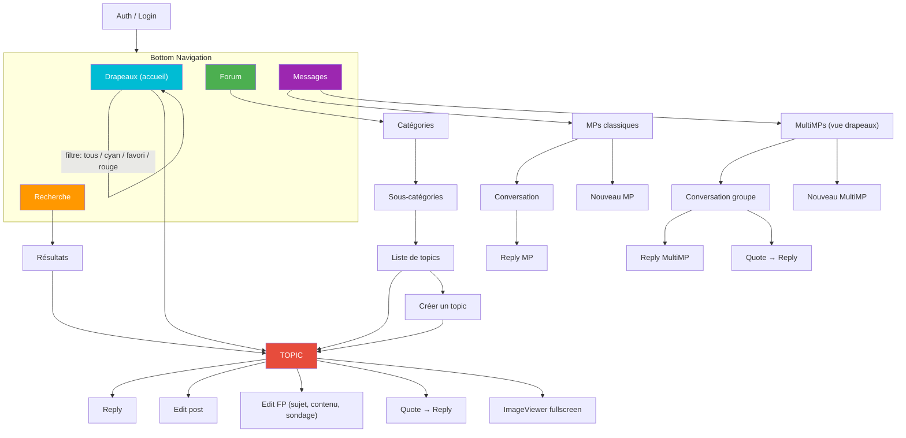
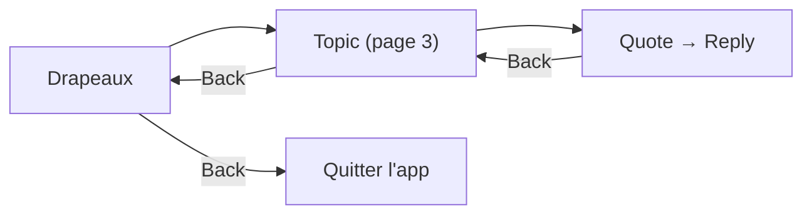

# Navigation
{: .fs-8 }

Écrans, flows, deep linking et bottom navigation.
{: .fs-5 .fw-300 }

---

## Bottom Navigation

L'application utilise une barre de navigation en bas avec 4 onglets principaux + les réglages accessibles depuis chaque écran.

```
┌───────────┬───────────┬───────────┬───────────┐
│  Drapeaux │  Forum    │  Recherche│  Messages  │
│  (accueil)│           │           │            │
└───────────┴───────────┴───────────┴────────────┘
```

**Drapeaux** est l'écran d'accueil. C'est le point d'entrée principal — la plupart des utilisateurs HFR ouvrent l'app pour vérifier "quoi de neuf sur mes topics suivis".

---

## Navigation Graph



---

## Écrans en détail

### Drapeaux (accueil)

L'écran le plus important de l'app. Affiche les topics suivis par l'utilisateur.

**Tri :**
- **Par date** (défaut) : tous les topics mélangés, triés par dernier message
- **Par catégorie** : groupes par cat/subcat, chaque groupe trie par date

**Filtres :**
- **Tous** : tous les drapeaux confondus
- **Cyan** : topics où l'utilisateur a participé
- **Favori** : topics marqués d'une étoile jaune
- **Rouge** : marque de lecture (dernière position lue)

**Actions sur un topic :**
- Tap → ouvrir le topic à la dernière position non lue
- Long press → menu contextuel (retirer drapeau, copier URL, partager)
- Swipe → retirer le drapeau (avec undo)

### Topic (lecture)

L'écran central de l'app. Affiche les posts d'un topic avec pagination.

**Navigation dans le topic :**
- Scroll vertical pour lire les posts
- Boutons page précédente / suivante
- Saut direct à une page (champ numéro)
- Saut au premier / dernier post
- Indicateur de page courante / total

**Actions sur un post :**
- **Quoter** → ouvre l'éditeur avec la citation pré-remplie
- **Editer** (si c'est notre post) → ouvre l'éditeur avec le contenu actuel
- **Editer le FP** (si `isFirstPostOwner`) → éditeur spécial avec sujet + sondage
- **Copier le texte**
- **Voir l'image en plein écran**
- **Partager le lien du post**

### Forum (catégories)

Navigation hiérarchique dans le forum.

```
Catégories
  └── Hardware
       ├── HFR
       ├── Overclocking
       └── ...
  └── Programmation
       ├── C/C++
       ├── Java
       └── ...
```

Chaque catégorie affiche le nombre de topics et l'activité récente.

### Création de topic

Formulaire complet :
- **Catégorie** : sélecteur hiérarchique
- **Sous-catégorie** : dépend de la catégorie choisie
- **Sujet** : titre du topic
- **Contenu** : éditeur BBCode avec toolbar
- **Sondage** (optionnel) : question + options + choix multiple oui/non
- **Preview** : avant-première du rendu BBCode

### Messages

Deux onglets :

**MPs classiques :**
- Inbox : liste des conversations 1-to-1, triées par date
- Chaque MP affiche : sujet, correspondant, date, lu/non-lu
- Nouveau MP : destinataire + sujet + contenu

**MultiMPs :**
- Vue style drapeaux : fils de groupe triés par dernier message
- État lu/non-lu géré via **MPStorage** (données synchronisées depuis un MP HFR dédié, cachées en Room)
- Chaque MultiMP se comporte comme un topic : pagination, quote, reply
- Nouveau MultiMP : destinataires (2+) + sujet + contenu

### Recherche

- Recherche dans les topics (titre) et dans les posts (contenu)
- Filtres : catégorie, auteur, date
- Résultats avec preview du contexte

---

## Deep Linking

Les URLs HFR doivent ouvrir directement le bon écran dans l'app.

| Pattern URL | Écran cible |
|-------------|-------------|
| `forum.hardware.fr/forum1.php?cat=X&post=Y&page=Z` | Topic page Z |
| `forum.hardware.fr/forum1.php?cat=X&post=Y` | Topic page 1 |
| `forum.hardware.fr/forum2.php?config=hfr.inc&cat=X&subcat=Y` | Liste topics |
| `forum.hardware.fr/forum1f.php` | Drapeaux |
| `forum.hardware.fr/forum1.php?cat=X&post=Y#t12345` | Post spécifique (traitement custom, voir ci-dessous) |

Implémentation via Compose Navigation 2.9 **type-safe routes** (`@Serializable` + `kotlinx.serialization`) :

```kotlin
@Serializable
data class TopicRoute(
    val cat: Int,
    val post: Int,
    val page: Int = 1,
    val scrollTo: Int? = null,  // numreponse cible pour deep link #t{numreponse}
)

composable<TopicRoute>(
    deepLinks = listOf(
        navDeepLink<TopicRoute>(
            basePath = "https://forum.hardware.fr/forum1.php",
        )
    ),
) { entry ->
    val route = entry.toRoute<TopicRoute>()
    TopicScreen(
        cat = route.cat,
        post = route.post,
        page = route.page,
        scrollTo = route.scrollTo,
    )
}
```

Avantages de l'API type-safe (v2.8+) : pas de strings magiques, compilation-safe, refactor IDE possible, sérialisation automatique des params.

### Cas particulier : lien vers un post spécifique

Compose Navigation ne supporte pas les fragments (`#t{numreponse}`) dans les deep links. Les URLs de type `forum.hardware.fr/forum1.php?cat=X&post=Y#t12345` nécessitent un traitement custom dans `MainActivity` :

```kotlin
// MainActivity.kt
private fun handleDeepLink(intent: Intent) {
    val uri = intent.data ?: return
    val fragment = uri.fragment // "t2781509"
    val scrollToPost = fragment?.removePrefix("t")?.toIntOrNull()

    val cat = uri.getQueryParameter("cat")
    val post = uri.getQueryParameter("post")
    val page = uri.getQueryParameter("page") ?: "1"

    navController.navigate(
        "topic/$cat/$post/$page" +
            (scrollToPost?.let { "?scrollTo=$it" } ?: "")
    )
}
```

La route `TopicRoute` accepte un paramètre optionnel `scrollTo: Int?` (voir définition ci-dessus). Le `TopicScreen` reçoit le `numreponse` cible et scroll jusqu'au bon post après chargement de la page.

### Predictive back

Compose Navigation 2.9 gère le predictive back (Android 14+) nativement — aucun code custom requis pour les écrans standards. Seuls les écrans à interaction custom (ex : éditeur avec draft) utilisent `PredictiveBackHandler` pour gérer la progression et proposer un dialog "Abandonner les modifications ?" :

```kotlin
@Composable
fun EditorScreen(...) {
    var showDiscardDialog by remember { mutableStateOf(false) }

    PredictiveBackHandler(enabled = draftContent.isNotEmpty()) { progress ->
        progress.collect { /* animation personnalisée si besoin */ }
        // à la fin : décider si on pop ou on montre le dialog
        showDiscardDialog = true
    }

    // ... rest of the screen
}
```

Manifest requis : `android:enableOnBackInvokedCallback="true"` sur `<application>`.

---

## Back Stack

Le back stack est géré par Compose Navigation avec des règles spécifiques :

- **Bottom nav** : chaque onglet conserve son propre back stack
- **Retour depuis un topic** : retour à la liste (drapeaux, forum, recherche) à la même position de scroll
- **Retour depuis reply/edit** : retour au topic à la même page
- **Deep link** : back → écran d'accueil (drapeaux)


