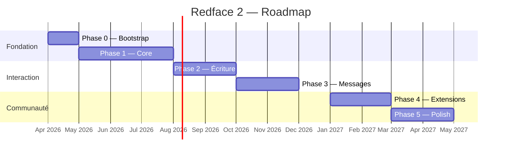

# Roadmap
{: .fs-8 }

Phases de développement, de la fondation au polish.
{: .fs-5 .fw-300 }

---

## Vue d'ensemble

---

## Phase 0 — Bootstrap

**Objectif :** un squelette d'app qui compile, avec CI, thème et navigation.

- [ ] Structure Gradle multi-modules
- [ ] CI GitHub Actions (build, lint, tests)
- [ ] Thème Material 3 (clair, sombre, AMOLED)
- [ ] Navigation graph (bottom nav + écrans vides)
- [ ] Hilt wiring
- [ ] Design system de base (typographie, couleurs, composants)

**Livrable :** une app qui démarre, affiche la bottom nav, et navigue entre des écrans placeholder.

---

## Phase 1 — Core (lecture seule)

**Objectif :** lire le forum. C'est 80% du use case.

- [ ] Login HFR (cookies persistants)
- [ ] Écran Drapeaux (accueil) — tri par date/catégorie, filtres
- [ ] Écran Topic — lecture, pagination, scroll fluide
- [ ] PostRenderer — rendu BBCode natif en Compose
- [ ] Écran Forum — catégories, sous-catégories, liste de topics
- [ ] Cache Room — topics et drapeaux
- [ ] Deep linking (URLs HFR → app)
- [ ] Prefetch pages suivantes
- [ ] Images + smileys (Coil)

**Livrable :** une app utilisable pour **lire** le forum au quotidien. Pas encore de possibilité d'écrire.

### PostRenderer — le sous-chantier critique

Le rendu natif Compose du BBCode HFR est le composant le plus complexe de toute l'app. Il doit gérer :

| Élément | Complexité |
|---------|-----------|
| Texte formaté (gras, italique, souligné, couleur, taille) | Moyenne |
| Citations imbriquées | Élevée |
| Blocs de code | Faible |
| Images inline | Moyenne |
| Smileys HFR | Moyenne (cache + mapping) |
| URLs cliquables | Faible |
| Spoilers (clic pour révéler) | Moyenne |
| Listes | Faible |

Le PostRenderer sera développé de manière incrémentale : texte brut d'abord, puis formatage, puis citations, puis images.

---

## Phase 2 — Écriture

**Objectif :** interagir avec le forum.

- [ ] Reply — répondre à un topic
- [ ] Quote — citer un post → reply pré-rempli
- [ ] Edit — éditer son propre post
- [ ] Edit FP — éditer le first post (sujet, contenu, sondage)
- [ ] Create topic — nouveau topic avec catégorie, sujet, contenu, sondage optionnel
- [ ] Toolbar BBCode — boutons de formatage dans l'éditeur
- [ ] Preview BBCode — avant-première du rendu
- [ ] Recherche

**Livrable :** une app complète pour lire ET écrire sur le forum.

---

## Phase 3 — Messages

**Objectif :** les messages privés, classiques et multi.

- [ ] Inbox MPs classiques — liste, lecture, reply
- [ ] Nouveau MP — création
- [ ] MultiMPs — liste avec vue drapeaux, lecture, reply, quote
- [ ] Nouveau MultiMP — création (2+ destinataires)
- [ ] Intégration MPStorage — synchronisation avec le MP de stockage HFR + cache Room
- [ ] Notifications MP

**Livrable :** gestion complète des MPs, y compris les MultiMPs avec état lu/non-lu.

---

## Phase 4 — Extensions communautaires

**Objectif :** les features inspirées des userscripts HFR.

- [ ] Architecture d'extensions (PostDecorator, TopicToolbarContributor)
- [ ] Bookmarks — sauvegarder des posts
- [ ] Blacklist — masquer des utilisateurs
- [ ] Alertes Qualitay — signaler un post remarquable
- [ ] Redflag — alertes intelligentes sur topics suivis

**Livrable :** les features communautaires les plus demandées, intégrées nativement.

---

## Phase 5 — Polish

**Objectif :** l'expérience utilisateur raffinée.

- [ ] Animations et transitions
- [ ] Mode offline complet (lecture + file d'attente d'écriture)
- [ ] Notifications push configurables
- [ ] Thème dynamique (Material You)
- [ ] Thème "HFR classique"
- [ ] Widgets Android
- [ ] Migration automatique des données Redface v1
- [ ] Tests de performance (scroll, cold start, mémoire)
- [ ] Publication Play Store

**Livrable :** une app prête pour le grand public.

---

## Participation

Chaque phase sera trackée via les [issues GitHub](https://github.com/ForumHFR/redface2/issues) et des milestones. Les contributions sont les bienvenues à partir de la Phase 1.

Pour contribuer :
1. Choisir une issue non assignée
2. Commenter pour signaler qu'on la prend
3. Ouvrir une PR sur une branche feature
4. Review par un mainteneur
