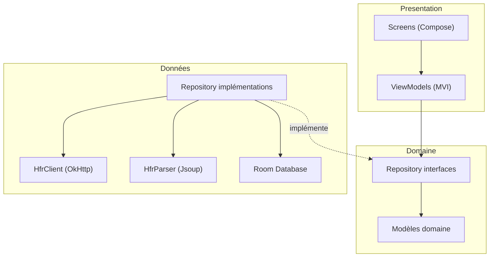
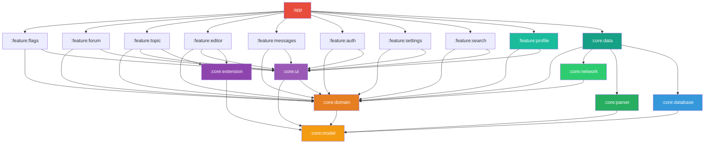
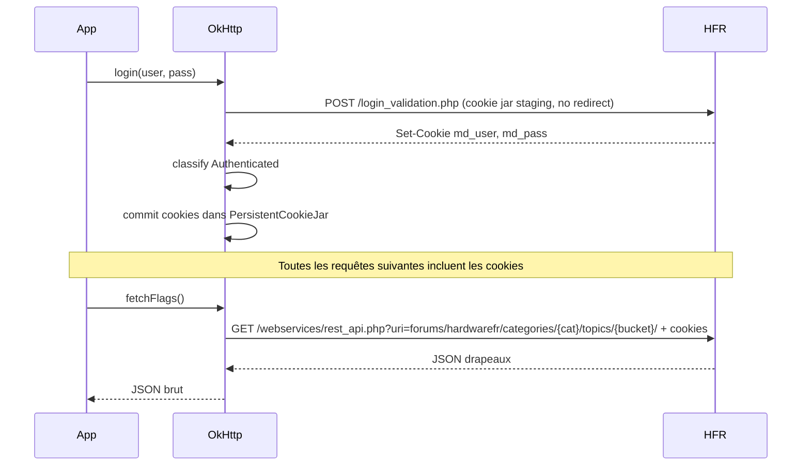

# Architecture
{: .fs-8 }

Modules Gradle, couches, data flow et stratégie de cache.
{: .fs-5 .fw-300 }

---

## Couches

L'application suit une architecture en 3 couches strictes. Chaque couche ne peut dépendre que de la couche en dessous. Les frontières sont **enforces par les modules Gradle** — pas de convention implicite.



- **Presentation** (`:feature:*`) : Compose UI + ViewModels MVI. Ne connait que les interfaces de repositories et les modèles domaine.
- **Domaine** (`:core:domain` + `:core:model`) : Interfaces de repositories + modèles purs. Aucune dépendance framework. Frontière de compilation.
- **Données** (`:core:data` + `:core:network` + `:core:parser` + `:core:database`) : Implémentations concrètes. Les features ne dépendent jamais de cette couche directement — Hilt injecte les implémentations.

---

## Modules Gradle



### Modules core

| Module | Responsabilité | Dépend de |
|--------|---------------|-----------|
| `:core:model` | Modèles domaine purs (`Topic`, `Post`, `PostContent`, `Category`, `Flag`, `MP`). Aucune dépendance Android. | rien |
| `:core:domain` | Interfaces de repositories (`TopicRepository`, `FlagRepository`, `AuthRepository`...) et règles métier partagées. Aucune dépendance framework. | `:core:model` |
| `:core:data` | Implémentations des repositories. Orchestre réseau (HTML + REST JSON), parser HTML et cache. Porte les DTO `@Serializable` REST et leurs mappers vers `:core:model`. Fournit les bindings Hilt. | `:core:domain`, `:core:network`, `:core:parser`, `:core:database` |
| `:core:network` | Deux clients : `HfrClient` (HTML brut sur `forum*.php`, login, MPs, mutations) et `HfrApiClient` (JSON REST sur `/webservices/rest_api.php`, browsing). Encapsulent OkHttp. Aucun type domaine exposé — du `String` brut ou des erreurs typées. Le helper de rewrite HATEOAS `HfrApiClient.rewriteHateoasHref(href)` vit ici. Cf. [ADR-003]({{ site.baseurl }}/adr/003-api-rest-hfr-hybride). | `:core:domain` (erreurs typées levées par les clients : `SessionExpiredException`, `HfrServerException` #324) |
| `:core:parser` | `HfrParser` : transforme le HTML HFR et, à partir de l'éditeur Phase 2, le BBCode HFR en modèles domaine, dont l'AST `PostContent`. Pas de parser JSON REST ici — les DTO REST vivent dans `:core:data`. | `:core:model` |
| `:core:database` | Room DB, DAOs, entities, mappers entity↔model. Cache locale + cache MPStorage. | `:core:model` |
| `:core:ui` | Thème Material 3 (`theme/`), `PostRenderer` (`post/`, `PostContent` → Compose), libellés d'erreur partagés (`error/`, mapping `HfrErrorKind` → string resource, #324), et composants de lecture partagés topic↔MP (#351, ADR-013) : `list/` (`LazyListScrollbar`, ascenseur intra-page #300) et `pager/` (géométrie pure du swipe de page #282 — seuils de commit, drag-follow, edge-hint — partagée par les deux gestes ; la machinerie `pointerInput` reste dans chaque feature : les deux surfaces paginent in-place depuis #895 étape 4, mais leurs couplages divergent — moteur in-ViewModel du topic avec re-key par page et slide-out, gate `isRefreshing` keep-content côté MP ; historiquement route-driven vs in-place, cf. ADR-013 amendée), et `zoom/` (machine de loupe pincée #182/#1098 partagée depuis le lot 6 de #1040 : `PinchZoomState`, `Modifier.pinchZoom`, `Modifier.pinchZoomTransform` et les calculs purs de `PinchZoomMath` ; chaque feature garde sa clé page/lecteur, son swipe et son pull-to-refresh, tous désarmés pendant le zoom). Le paquet `post/` porte en outre **`ReadingPostCard`** (+ `ReadingPostCardPresentation`), la **carte de lecture commune Topic↔MP** promue au lot 1 de #1040 : elle porte corps, slots d'identité, densité, mode plat et capacités par présence de callbacks — `TopicPostCard` et `MessageCard` n'en sont plus que les hôtes de chaque feature (cf. [reading-parity.md]({{ site.baseurl }}/specs/reading-parity)). D'autres sous-packages (`adaptive/`, `semantics/`, `util/`, `extensions/`) sont prévus mais n'apparaîtront qu'au fur et à mesure de l'arrivée des features qui les justifient — pas de module vide en avance. Seul module autorisé à instancier `ColorScheme`, `Typography`, `Shapes`. | `:core:model`, `:core:domain` (#324 : résolution des libellés partagés depuis `HfrErrorKind`) |
| `:core:extension` | Interfaces d'extension : `PostDecorator`, `TopicToolbarContributor`, `EditorToolbarContributor`. | `:core:model` |

### Modules feature (base)

Les features ne dépendent que de `:core:domain` (interfaces) et `:core:ui` (composants partagés). Exception volontaire : `:feature:topic` et `:feature:editor` peuvent aussi dépendre de `:core:extension`, car ce sont les deux points d'intégration des contributeurs (`PostDecorator`, `TopicToolbarContributor`, `EditorToolbarContributor`). Elles ne connaissent jamais la couche données — Hilt injecte les implémentations depuis `:core:data`.

| Module | Écrans | Dépend de |
|--------|--------|-----------|
| `:feature:flags` | Drapeaux (accueil) — onglets rouge/cyan/favoris, refresh, filtre CYAN lus | `:core:domain`, `:core:ui` |
| `:feature:forum` | Catégories, sous-catégories, liste de topics | `:core:domain`, `:core:ui` |
| `:feature:topic` | Lecture de topic, pagination | `:core:domain`, `:core:ui`, `:core:extension` |
| `:feature:editor` | Reply, edit, edit FP, preview BBCode, création topic | `:core:domain`, `:core:ui`, `:core:extension` |
| `:feature:messages` | MPs classiques, MultiMPs, création MP/MultiMP | `:core:domain`, `:core:ui` |
| `:feature:auth` | Login HFR | `:core:domain`, `:core:ui` |
| `:feature:search` | Recherche dans les topics et posts, filtres | `:core:domain`, `:core:ui` |
| `:feature:settings` | Préférences, thème, gestion cache | `:core:domain`, `:core:ui` |
| `:feature:profile` | Profil utilisateur — bottom sheet résumé + page complète (Phase 2 finish #208) | `:core:domain`, `:core:ui` |

### Modules feature (extensions communautaires — Phase 4)

Les 8 modules extension arrivent en **Phase 4** uniquement. En Phases 0 à 3, le projet compte **17 modules (8 core + 9 features de base)**, hors `:app` — les deux tableaux ci-dessus, et `settings.gradle.kts`, en font foi. Le décompte « 16 modules (8 core + 8 features) » de la décision initiale d'ADR-001 omettait `:feature:flags` (présent depuis la Phase 1) ; il est corrigé par l'amendement du 2026-07-05 de cette ADR. Les extensions sont des modules Gradle isolés qui s'enregistrent via Hilt `@IntoSet` — ajouter une extension ne demande aucune modification du code existant. La décision de découpage v1 est formalisée dans [ADR-001]({{ site.baseurl }}/adr/001-modules-gradle-v1).

> **Exception : la Blacklist (#509) a été livrée HORS module d'extension.** Anticipée avant l'ouverture formelle de la Phase 4 (bêta 0.15.0), elle ne passe **pas** par `:core:extension`/`PostDecorator` (qui n'existent pas encore) : son code vit dans `:core:model/blacklist`, `:core:domain/blacklist` (`BlacklistRepository`, `PseudoCanonicalizer`), `:core:data/blacklist` (DataStore JSON versionné, **pas** de Room) et `:feature:settings` (écran Réglages), avec le masquage de rendu côté `:feature:topic`. Le module `:feature:blacklist` et l'interface `PostDecorator` restent **prospectifs** (cf. [extensions.md]({{ site.baseurl }}/specs/extensions#architecture-dextensions)).

> **État réel des modules en Phase 2-3** : tous les modules core et feature de base sont déclarés dans `settings.gradle.kts`, mais `:core:extension` ne contient toujours que le squelette Gradle (`build.gradle.kts`) sans code Kotlin — l'interface `PostDecorator` n'existe que dans la prose de specs, pas dans le code. `:core:network` et `:core:database` ont reçu leur backbone Phase 1A (`HfrClient`, `TopicRepositoryImpl` cache-aside, schema Room v1). `:feature:auth` contient le login HFR Phase 1B.1 (`LoginScreen` / `LoginViewModel`). `:feature:settings` contient le `SettingsScreen` alpha Phase 2H pour le proxy utilisateur. C'est volontaire : le découpage est fixé dès le bootstrap (ADR-001) pour figer les frontières, mais le code arrive feature par feature. La prose ci-dessus décrit le **contrat cible** ; la réalité courante est trackée par la roadmap.

| Module | Fonction | Dépend de |
|--------|----------|-----------|
| `:feature:bookmarks` | Sauvegarder des posts | `:core:extension`, `:core:model`, `:core:database` |
| `:feature:blacklist` | Masquer des utilisateurs | `:core:extension`, `:core:model`, `:core:database` |
| `:feature:qualitay` | Signaler un post remarquable | `:core:extension`, `:core:model`, `:core:network` |
| `:feature:redflag` | Alertes intelligentes (via CF Worker) | `:core:extension`, `:core:model`, `:core:network` |
| `:feature:colortag` | Colorer et annoter les pseudos | `:core:extension`, `:core:model`, `:core:database` |
| `:feature:imagehost` | Upload et bibliothèque d'images | `:core:model`, `:core:network`, `:core:ui` |
| `:feature:gifpicker` | Recherche et insertion de GIFs | `:core:model`, `:core:network`, `:core:ui` |
| `:feature:stats` | Statistiques utilisateur | `:core:model`, `:core:network` |

### Module app

`:app` est le point d'entrée. Il :
- Configure Hilt (DI) — inclut `:core:data` pour le wiring des implémentations
- Définit la navigation globale (`RedfaceApp` + `NavDisplay`)
- Contient `MainActivity`
- Dépend de tous les modules feature (base + extensions)

> **Note Phase 1B.4 → Phase 2 finish (#198) — `:feature:flags` livré** : l'écran d'accueil (Drapeaux) vit dans `:feature:flags` avec `FlagsViewModel` (Hilt) + `FlagRepository` + 3 onglets (`FlagType.CYAN` = mes sujets, `RED` = lus uniquement, `FAVORITE`). `:app` ne fait que la navigation (`FlagsRoute(onOpenFlag, onLoginRequested, topBarActions)` après le polish #154 + #198). Le footer alpha initial (pseudo, logout, version, signalement, Diagnostics) qui vivait dans `FlagsRoute` puis temporairement sur `MessagesScreen` est désormais hoisté dans le menu compte global (`RedfaceAccountMenu` dans `:core:ui` + `AppAccountViewModel` dans `:app/navigation/`). Chaque écran principal accepte un slot `topBarActions: @Composable (() -> Unit)? = null` que le navigation host câble avec le menu — `:app` y injecte toujours `BuildConfig.VERSION_NAME/VERSION_CODE` pour afficher « Redface 2 — vX.Y (build N) ».

---

## Séparation des responsabilités

### `:core:domain` — interfaces

Les interfaces de repositories vivent dans le module domaine. Aucune dépendance framework.

> **Note Phase 1** : ces interfaces sont le **contrat cible**. `TopicRepository` est livré (cf. [#88](https://github.com/ForumHFR/redface2/pull/88)) — `TopicScreen` lit du vrai HFR via cache-aside Room. `AuthRepository` est livré en Phase 1B.1 pour le login HFR et l'observation de session. Les autres interfaces (`FlagRepository`, etc.) arrivent feature par feature avec leur implémentation `:core:data`.

```kotlin
// Dans :core:domain — le contrat
interface TopicRepository {
    /**
     * Émet d'abord la page en cache si elle existe, puis la version réseau fraîchement
     * fetchée et persistée. Cache-aside : la deuxième émission peut être identique à la
     * première si le réseau confirme le cache.
     */
    fun observeTopicPage(cat: Int, post: Int, page: Int): Flow<Topic>

    /** Force un fetch réseau ignorant le cache, et persiste le résultat. */
    suspend fun refreshTopicPage(cat: Int, post: Int, page: Int): Topic
}

interface FlagRepository {
    /**
     * Émet le succès en cache pour la session courante si disponible ; sinon `Loading`,
     * puis le résultat d'un fetch network (`Success(flags)` ou `Failure`). Les abonnés
     * reçoivent ensuite chaque [refresh] explicite via le SharedFlow par type.
     */
    fun observe(type: FlagType): Flow<FlagsResult>
    suspend fun refresh(type: FlagType)
    fun clearSessionCache()
}

interface AuthRepository {
    fun observeAuthState(): Flow<AuthState>
    suspend fun login(pseudo: String, password: String): Result<AuthState.Authenticated>
    suspend fun logout()
}

interface MessagesRepository {
    /**
     * Compteur de MPs non lus : `null` quand anonyme ou avant la première résolution,
     * Int sinon.
     */
    fun observeUnreadMpCount(): Flow<Int?>

    /** Page inbox MP classique (`forum1.php?cat=prive`). */
    suspend fun getPrivateMessageList(page: Int = 1): PrivateMessageListPage

    /** Cache RAM de session éventuel, puis revalidation réseau obligatoire. */
    fun getPrivateMessageThread(
        threadId: Int,
        page: Int = 1,
        fallbackCorrespondent: String? = null,
    ): Flow<PrivateMessageThreadPage>
}
```

`TopicRepository` est livré en Phase 1A (cf. [#88](https://github.com/ForumHFR/redface2/pull/88), [#89](https://github.com/ForumHFR/redface2/pull/89)). `prefetchNextPage` documenté dans la roadmap arrivera en Phase 1B sur `HfrClient` directement (avec `useAuth = false`), puis sera relayé par `TopicRepository.prefetchTopicPage(...)`. `MessagesRepository` est livré par étapes : Phase 1B.1 a ajouté `observeUnreadMpCount()` en bonus du login, puis le MVP Phase 3 #298 ajoute `getPrivateMessageList()` + `getPrivateMessageThread()` pour lire les MPs classiques. Depuis #1080, la lecture d'une conversation expose un flux de `PrivateMessageThreadPage` dont `Source` distingue `SESSION_CACHE` de `NETWORK` ; un hit RAM précède toujours une revalidation réseau. Les ViewModels de `:feature:messages` observent `AuthState` et purgent leur état privé en anonyme / logout / changement de session. L'écriture MP, le nouveau MP, les MultiMP et l'intégration MPStorage ont depuis été livrés en Phase 3 (cf. roadmap).

`PrivateMessageThreadRoute` reste volontairement opaque (`threadId`, `page`) : le sujet et le correspondant sont relus depuis la page `cat=prive` chargée, jamais persistés dans le back stack Navigation. Le paramètre `fallbackCorrespondent` du repository/parser est une capacité bas niveau pour les cas où une page ne révèle pas l'autre participant ; il ne doit pas être alimenté depuis une route sauvegardée. Le caractère multi-destinataire (MultiMP / « DT ») est prouvé depuis la page elle-même (`PrivateMessageThread.isMultiRecipient` = au moins deux auteurs non-`isOwnPost` distincts) et complété par un **hint éphémère** détenu en mémoire par le nav host (jamais une route, jamais le `title`/la liste de participants de la liste), issu du flag `PrivateMessageSummary.isMultiRecipient` de la ligne d'inbox et purgé à chaque transition d'auth comme le marquage « lu ». Ainsi l'en-tête de conversation affiche « Interlocuteurs multiples » même quand la page courante ne montre qu'un seul autre auteur, sans jamais sauvegarder de métadonnée privée.

`FlagRepository` + UI sont livrés en Phase 1B.2 → 1B.5, **migrés en REST en Phase 1D-1** (cf. ADR-003 et issue #110). `:core:data DefaultFlagRepository` itère sur les catégories publiques fournies par `ForumRepository.getCategories(forceRefreshIfStale = true)` (lecture one-shot garantie fraîche si le cache est périmé — #251 : l'ancien `observeCategories().first { !Loading }` capturait l'émission périmée du cache et sautait une catégorie ajoutée après le warm, rendant ses drapeaux invisibles ; filtrant `id > 0` pour éviter le 403 sur d'éventuels `cat=0` modos) et appelle pour chacune `HfrApiClient.getCategoryFlagTopics(cat, bucket = HfrRestFlagBucket.{PARTICIPATED,READ,FAVORITES}, page, resultsPerPage, useAuth = true)`. Chaque page est désérialisée en `RestListEnvelope<RestTopic>` (forme plate, contrat prouvé par la fixture `rest_cat23_participated.json`) puis mappée via `RestFlagMappers.toFlags(envelope, type, fallbackCat)` (`type` = bucket demandé, qui devient `Flag.type` ; le favori est porté à part par `Flag.isFavorite`, cf. `models.md`) pour produire `List<Flag>` (cf. [`models.md`]({{ site.baseurl }}/specs/models)). Les résultats des N catégories sont concaténés, **complétés par un supplément REST-only pour les sujets épinglés (sticky) flaggés** (#251) que les endpoints de bucket excluent dans les catégories **sans sous-catégorie** (observé sur cat 32 « IA »), puis triés globalement par `lastReplyAt` (REST `YYYY-MM-DD HH:mm`, donc tri lexicographique = chronologique inverse) ; sans ce tri global la liste serait groupée par cat au lieu d'être triée par activité comme l'attend l'écran. Le supplément (`DefaultFlagRepository.fetchStickyFlagSupplement`) lit la **page 1** de `categories/{cat}/topics/last/` (authentifié) pour chaque catégorie sans sous-catégorie, garde les lignes `is_sticky` dont le `flag_owntopic` route vers le bucket courant (`RestFlagMappers.toStickyFlags`, 1→CYAN/2→RED/3→FAVORITE) et les **fusionne avant** le tri et le cache, dédupliquées par `(cat, topicId)`. Il est **best-effort par catégorie** (un échec `topics/last` n'écroule pas le refresh) et **REST-only** (pas de fallback HTML `forum1f.php`, conforme à ADR-003). La voie globale `forums/hardwarefr/topics/{bucket}/` n'est **pas** exposée par `HfrApiClient` en Phase 1D-1 : son enveloppe groupée par catégorie n'a pas de fixture capturée et garder une API morte est un anti-pattern (cf. § "Le noyau avant l'écosystème" de l'AGENTS.md). Une PR de suivi pourra rajouter le helper et basculer la consommation une fois le payload capturé. Le scrape HTML `forum1f.php?owntopic=N` + `FlagsListParser` ont été retirés ; `getFlagsPage()` n'existe plus côté `HfrClient`. La séquence de flux reste identique : `flow { emit(Loading); emit(fetch); emitAll(refreshes) }` cold-collected — un `MutableSharedFlow<FlagsResult>` par `FlagType` rebroadcast les résultats des `refresh()` explicites. Cache mémoire par onglet pour la session HFR courante : revenir sur un onglet déjà chargé ne refetch pas implicitement, mais `refresh(type)` force toujours le réseau et `clearSessionCache()` vide tout au logout / changement de session. `FlagItem` rend une ligne dans `:core:ui`, et `:feature:flags FlagsRoute` compose les 3 onglets, le toggle « afficher les sujets participés déjà lus » (filtre client masquant les CYAN `hasUnread = false` par défaut, #154), et le bouton refresh. Les actions compte + outils alpha (pseudo, logout, version, Diagnostics, signalement CSAE) vivent depuis #198 dans le **menu compte global** (`RedfaceAccountMenu` dans `:core:ui`, alimenté par `AppAccountViewModel`) accessible depuis chaque écran principal via le slot `topBarActions` du header. Le placement temporaire sur `MessagesScreen` (polish #154) a été retiré ; depuis #298, `MessagesScreen` porte la liste MP classique read-only. Pas de cache Room en 1D-1 — la persistance des drapeaux arrive avec #26.

### `:core:network` — HfrClient + HfrApiClient

La couche réseau ne parse rien. Elle retourne du `String` (HTML ou JSON) ou des confirmations d'action. Deux clients coexistent depuis Phase 1C-A (cf. [ADR-003]({{ site.baseurl }}/adr/003-api-rest-hfr-hybride)) :

- **`HfrClient`** — endpoints HTML `forum*.php` : login, lecture posts, MPs, mutations drapeaux (`addflag.php` / `delflag.php`). La lecture des drapeaux est passée en REST en Phase 1D-1 — `getFlagsPage()` retiré.
- **`HfrApiClient`** — endpoints REST JSON `/webservices/rest_api.php?uri=…` : browsing (catégories, sous-catégories, topic listings, metadata topic). Fournit aussi le helper validant `rewriteHateoasHref(href)` qui transforme une URL HATEOAS `/api/…` en URL callable côté HFR.

```kotlin
@Singleton
class HfrClient @Inject constructor(
    @AuthenticatedClient private val authenticated: OkHttpClient,
    @AnonymousClient private val anonymous: OkHttpClient,
    @HfrBaseUrl private val baseUrl: HttpUrl,
) {
    // Phase 1A — livrée
    suspend fun getTopicPage(cat: Int, post: Int, page: Int, useAuth: Boolean = true): String

    // Phase 1B.1 — livrée
    suspend fun getPrivateMessageListPage(page: Int = 1): String

    // Phase 3 MVP — livrée
    suspend fun getPrivateMessageThreadPage(threadId: Int, page: Int = 1): String

    // Phase 2+ — à implémenter
    suspend fun postReply(cat: Int, post: Int, content: String): Result<Unit>
    suspend fun editPost(cat: Int, post: Int, numreponse: Int, content: String): Result<Unit>
    // ...
}
```

Le login HFR est isolé dans `:core:network.auth.AuthRemoteDataSource`, pas dans `HfrClient` : il POSTe `login_validation.php` avec un cookie jar de staging, classe la réponse, puis commite explicitement les cookies dans le `@AuthenticatedClient` seulement si la réponse est `Authenticated`.

`@AnonymousClient` (cookie jar = `CookieJar.NO_COOKIES`) permet à un caller — typiquement le prefetch de la page suivante — d'aller chercher du HTML sans que HFR ne marque les drapeaux comme lus côté serveur. Les écrans qui doivent honorer la lecture (lecture utilisateur) appellent avec `useAuth = true` (default).

### `:core:parser` — HfrParser

Le parser transforme le HTML HFR et, à partir de l'éditeur Phase 2, le BBCode HFR en modèles domaine. Isolé de toute logique réseau et UI.

> **Statut Phase 3 MVP #298** : `parseTopicPage` (Phase 1A) reste actif. Les MPs classiques utilisent `PrivateMessageListParser` pour l'inbox et `PrivateMessageThreadParser`, qui réutilise l'extracteur de posts commun (`PostsParser`) pour les messages d'une conversation. Le parser drapeaux HTML `FlagsListParser` (Phase 1B.2) a été retiré avec la migration REST des drapeaux (#110, ADR-003). `PostContentParser` et `TopicPageParser` existent comme classes internes derrière `HfrParser`. Les autres méthodes ci-dessous arrivent feature par feature : `parseEditPage` Phase 2, `parsePostContentFromBbcode` Phase 2 (parser BBCode pour preview éditeur), parsers d'écriture MP / MultiMP Phase 3.

```kotlin
class HfrParser @Inject constructor() {
    fun parseTopicPage(html: String): Topic                 // Phase 1 — livrée
    fun parsePostContentFromHtml(html: String): PostContent // Phase 1 — livrée (interne au module)
    fun parsePostContentFromBbcode(bbcode: String): PostContent // Phase 2 éditeur
    fun parseCategories(html: String): List<Category>       // Phase 1 fin
    fun parseEditPage(html: String): EditInfo               // Phase 2
    fun parsePrivateMessageList(html: String): PrivateMessageListPage // Phase 3 MVP
    fun parsePrivateMessageThread(html: String): PrivateMessageThread // Phase 3 MVP
    // ...
}

// Le parser drapeaux HTML a été retiré en Phase 1D-1 (#110) au profit
// de la lecture REST via `HfrApiClient.getCategoryFlagTopics(...)` + `RestFlagMappers`.
```

### `:core:data` — implémentations

Les implémentations de repositories orchestrent réseau, parser et cache. Elles vivent dans `:core:data`, jamais dans les features.

```kotlin
// Dans :core:data — l'implémentation (Phase 1A)
@Singleton
class TopicRepositoryImpl @Inject constructor(
    private val client: HfrClient,
    private val parser: HfrParser,
    private val topicDao: TopicDao,
    private val clock: Clock,
    @IoDispatcher private val ioDispatcher: CoroutineDispatcher,
) : TopicRepository {

    override fun observeTopicPage(cat: Int, post: Int, page: Int): Flow<Topic> = flow {
        // 1. Si on a une copie en cache, l'émettre tout de suite (UI réactive)
        val cached = withContext(ioDispatcher) { loadFromCache(cat, post, page) }
        if (cached != null) emit(cached)

        // 2. Re-fetch + re-parse + cache, puis émettre la version fraîche
        emit(refreshTopicPage(cat, post, page))
    }

    override suspend fun refreshTopicPage(cat: Int, post: Int, page: Int): Topic =
        withContext(ioDispatcher) {
            val html = client.getTopicPage(cat, post, page, useAuth = true)
            val topic = parser.parseTopicPage(html)
            val (topicEntity, postEntities) = TopicMappers.toEntities(topic, clock.instant())
            topicDao.upsertTopicPageWithPosts(topicEntity, postEntities)
            topic
        }
}
```

Le binding Hilt connecte l'interface à l'implémentation :

```kotlin
// Dans :core:data
@Module
@InstallIn(SingletonComponent::class)
abstract class RepositoryModule {
    @Binds
    abstract fun bindTopicRepository(impl: TopicRepositoryImpl): TopicRepository

    @Binds
    abstract fun bindFlagRepository(impl: DefaultFlagRepository): FlagRepository

    @Binds
    abstract fun bindForumRepository(impl: DefaultForumRepository): ForumRepository
}
```

`ForumRepository` (Phase 1C-A) consomme `HfrApiClient` et expose `observeCategories()` / `observeSubcategories(cat)` / `observeTopicList(cat, subcat?, page)` (et leurs `refresh*` jumeaux) en `Flow<ForumResult<…>>`, plus `getCategories(forceRefreshIfStale)` — une lecture **one-shot** des catégories (jamais `Loading`) pour les consommateurs qui *énumèrent* le catalogue (le fan-out drapeaux #251) au lieu de l'afficher réactivement : cache frais rendu tel quel, cache périmé re-fetché si `forceRefreshIfStale`, dégradation vers le dernier connu si le fetch échoue. Cache mémoire pour catégories et sous-catégories ; pas de Room en 1C-A (les listings de topics ne sont pas mis en cache disque). Cf. [ADR-003]({{ site.baseurl }}/adr/003-api-rest-hfr-hybride) pour la décision REST-first sur ces trois domaines.

Les ViewModels dans les features ne connaissent que l'interface :

```kotlin
// Dans :feature:topic — ne dépend que de :core:domain
@HiltViewModel
class TopicViewModel @Inject constructor(
    private val topicRepository: TopicRepository,  // interface, pas impl
) : ViewModel() { ... }
```

---

## Stratégie de cache

| Donnée | Stratégie | TTL |
|--------|-----------|-----|
| Pages topic lues | Cache Room (`topic_pages` + `posts`), cache-affichable + refresh BG si stale, anti-écrasement par prefetch anonyme via `authMode` | 60 s (`CachePolicy.topicPage`) |
| Listings topics REST | Mémoire processus, replay synchrone du dernier succès, refresh manuel = bypass TTL | 30 s (`CachePolicy.topicList`) |
| Drapeaux REST (par compte) | Cache Room (`flag_topics`) avec `userId` dans la clé primaire ; purge au logout / changement de compte par `CacheInvalidator` | 30 s (`CachePolicy.flags`) |
| Catégories | Cache mémoire HFR-public, replay sur stale puis refresh | 24 h (`CachePolicy.categories`) |
| Sous-catégories | Cache mémoire par `cat`, même sémantique stale-replay | 6 h (`CachePolicy.subcategories`) |
| Smileys (hors `PostContent` MP, voir ligne dédiée) | Cache Coil, ne changent jamais | Infini |
| Avatars | Cache Coil, ETag | 1 h |
| MultiMP flags | Room, jamais expire (donnée locale) | Permanent |
| Position de lecture MP (par compte/conversation) | Room (`mp_read_positions`), sauvegardée à chaque page affichée ; purge au logout / changement de compte par `CacheInvalidator` | Permanent jusqu'à déconnexion |
| Contenu des conversations MP | `PrivateMessageThreadSessionCache`, LRU mémoire processus globale de cinq pages, clé par compte/conversation/page ; hit immédiat puis revalidation réseau obligatoire ; purge logout / changement de compte par `CacheInvalidator` | Session processus |
| Médias d'un `PostContent` MP | Requêtes Coil avec `PostMediaDiskCachePolicy.DISABLED`, probe intrinsèque compris : cache mémoire autorisé, aucune lecture/écriture du cache disque ; purge globale des caches Coil au logout / changement de compte par `CacheInvalidator` | Bitmap Coil jusqu'à éviction/déconnexion ; métadonnées intrinsèques jusqu'à éviction/process death ; aucune nouvelle entrée disque |
| Préférences | DataStore | Permanent |

> **Acté — [ADR-013]({{ site.baseurl }}/adr/013-mp-lecture-cache-prefetch) (accepté 2026-06-12)** : politique de cache des conversations MP à trois étages — position de lecture locale par conversation (survit au process death, purgée à la déconnexion), cache RAM de session, cache Room du contenu en opt-in explicite (défaut OFF, purge au logout). **État réel** : les étages 1 et 2 sont livrés. La position locale existe depuis la Phase 3 ([#430](https://github.com/ForumHFR/redface2/issues/430)) via `MpReadPositionEntity`, `RoomPrivateMessageReadPositionStore` et la table `mp_read_positions`. Le contenu passe depuis #1080 par `PrivateMessageThreadSessionCache`, LRU de cinq pages sans écriture disque, avec génération avancée synchroniquement par `CacheInvalidator` avant les purges DAO. Depuis #1096, les médias issus de ce contenu restent eux aussi non persistants par défaut : leurs requêtes Coil désactivent le cache disque et une transition de compte purge le cache global historique, faute de marque permettant de distinguer les anciennes entrées MP des images publiques. L'étage 3 (cache Room du contenu, opt-in OFF) reste à implémenter.

### Sémantique fresh / stale

`observeTopicPage(cat, post, page)` :

1. Cache `AUTHENTICATED` + fresh → émet une seule fois, pas de réseau. C'est le cas snappy back-nav d'un utilisateur connecté.
2. Cache `ANONYMOUS` (fresh ou stale) → émet le cache pour un affichage immédiat puis lance un fetch authentifié pour upgrader la row vers `AUTHENTICATED` (champs per-user `isOwnPost`, `isEditable`, drapeau de lecture). Le `@Transaction` anti-écrasement décrit ci-dessous garantit que ce remplacement ne perd jamais une row `AUTHENTICATED` plus riche entre-temps.
3. Cache `AUTHENTICATED` + stale → émet le cache puis tente un refresh ; si le refresh échoue (offline, 502), l'erreur est swallowed et le stale reste à l'écran.
4. Cache absent → fetch direct ; les erreurs propagent au flow.

Le `refreshTopicPage` explicite **bypasse** le TTL et renvoie systématiquement du frais. Même règle pour `refreshCategories` / `refreshSubcategories` / `refreshTopicList`.

### Isolation par compte

Les drapeaux sont strictement scopés par pseudo (lowercase) dans `flag_topics.userId`. À la transition `Authenticated(A) → Anonymous` ou `Authenticated(A) → Authenticated(B)`, `CacheInvalidator` :

- vide les rows `flag_topics` pour l'ancien `userId` ;
- appelle `FlagRepository.clearSessionCache()` pour purger le cache mémoire ;
- vide les caches Coil mémoire et disque. Cette purge est volontairement globale : les anciennes
  entrées ne portent aucun marqueur MP/public, donc les images de sujets sont aussi évincées et
  seront retéléchargées à leur prochain affichage (#1096).

Les pages topic (`topic_pages` / `posts`) ne sont pas purgées : le HTML est partagé entre lecteurs, et la TTL courte de 60 s + le garde-fou `authMode` rendent la fuite de champs per-user (`isOwnPost`, `isEditable`) bornée.

### Anti-écrasement auth ↔ anonyme

Le prefetch anonyme (Phase 1D PR 4) ne doit **pas** remplacer un row authentifié plus riche. Chaque ligne persistée porte un `authMode` (`AUTHENTICATED` ou `ANONYMOUS`) ; un upsert anonyme sur une row authentifiée existante est silencieusement ignoré côté `TopicRepositoryImpl.persist`. À l'inverse, un fetch authentifié écrase toujours, pour garantir la fraîcheur des champs per-user.

### Prefetch intelligent

Pour donner l'impression que le forum est local :

```
Utilisateur lit la page 3 d'un topic
  → Prefetch page 4 en arrière-plan (anonyme, écrit en cache ANONYMOUS)
  → Quand il scroll vers le bas, la page 4 est déjà prête
```

Implémentation Phase 1D PR 4 (#108) :

- **Topic page** : `TopicViewModel` déclenche `topicRepository.prefetch(cat, post, page+1)` après chaque émission `Loaded`. Le job est rattaché à `viewModelScope` ; sortir de l'écran ou changer de page annule le job. Le transport commun de `HfrClient` maintient un pont d'annulation pendant `Call.execute()` **et** la lecture du corps : l'annulation invoque `Call.cancel()`, termine l'I/O côté client et laisse remonter `CancellationException`. **Le payload est persisté** comme row `ANONYMOUS` en Room — la prochaine `observeTopicPage` la lit immédiatement (paint snappy) puis re-fetch authentifié pour upgrader vers `AUTHENTICATED` (champs per-user).
- **Topic listing** : `CategoryViewModel` déclenche `forumRepository.prefetchTopicList(cat, subcat, page+1)` à chaque transition vers `Content`. Le job est annulé à chaque changement de `(subcat, page)` via le pattern `combine + onEach + cancel` standard. **Le payload est volontairement jeté** — pas de cache client peuplé. Un payload anonyme stripperait `is_read` et `last_post_read_id` qui sont nécessaires côté écran ; on ne fait que chauffer le CDN HFR pour la prochaine requête authentifiée.
- **Une seule page d'avance** par déclencheur. Pas de chaîne `n+2, n+3` — le coût ne paie pas le bénéfice et grossirait la facture pour des comportements rares.
- **Échecs swallowed** : un prefetch flaky ne doit jamais perturber l'affichage. Erreurs loguées en `Log.w`, puis avalées.

#### Règle critique : prefetch non-authentifié

Les requêtes de prefetch ne doivent **jamais** inclure les cookies de session — sinon HFR marque silencieusement les topics comme lus. Implémentation avec deux instances `OkHttpClient` (`@AuthenticatedClient` / `@AnonymousClient`) et test Konsist d'enforcement : voir [protocol-hfr.md § Règle critique prefetch non-authentifié]({{ site.baseurl }}/specs/protocol-hfr#règle-critique--prefetch-non-authentifié).

Côté cache disque, l'entrée est tagguée `authMode = ANONYMOUS` et **ne remplace pas** une row existante taguée `AUTHENTICATED` (cf. § Stratégie de cache).

> **Acté — [ADR-013]({{ site.baseurl }}/adr/013-mp-lecture-cache-prefetch) (accepté 2026-06-12)** : exception **bornée aux MP** — prefetch authentifié limité aux pages adjacentes (N−1/N+1) de la conversation `cat=prive` actuellement ouverte (l'état lu/non-lu serveur est binaire par conversation et déjà consommé à l'ouverture, vérifié live dans [#361](https://github.com/ForumHFR/redface2/issues/361#issuecomment-4663312132)) ; prefetch depuis la liste interdit. **Implémenté depuis [#1088](https://github.com/ForumHFR/redface2/pull/1088)** : `PrivateMessageThreadViewModel` borne et annule les pages adjacentes, `MessagesRepository.prefetchPrivateMessageThread` alimente le cache RAM, et la garde Konsist interdit ce point d'entrée hors du ViewModel de conversation. La règle générale ci-dessus reste en vigueur partout ailleurs. La preuve live multipage reste manquante, donc la matrice de parité ne revendique pas encore la livraison complète.
>
> **Clause dormante — non implémentée.** L'ADR-013 prévoit aussi de **suspendre le prefetch d'une conversation après un « marquer comme non lu » manuel**, jusqu'à sa réouverture. Cette clause n'est **pas** câblée et ne peut pas l'être aujourd'hui : l'app n'expose aucune action « marquer comme non lu » (le contrat `nonlu.php` est mesuré, l'affordance produit n'existe pas), donc il n'y a aucun état dormant à porter avant l'action. Le suivi est [#1087](https://github.com/ForumHFR/redface2/issues/1087) (ouvert) et la consigne vit dans le KDoc de `maybeSchedulePrivateMessagePrefetch`. Ne pas la lire comme livrée par #1088.

---

## Gestion de session

HFR utilise des cookies de session. Le flow d'authentification :



Les cookies sont persistés via un `PersistentCookieJar` adossé à un DataStore non chiffré (voir § Stockage sécurisé ci-dessous) pour éviter de se re-logguer à chaque lancement.

### Stockage sécurisé des credentials

**Option A retenue** (cycle [#24](https://github.com/ForumHFR/redface2/issues/24) thème 13, formalisée dans [ADR-002]({{ site.baseurl }}/adr/002-credentials-option-a)) : stack minimaliste **DataStore non chiffré**, protection au repos déléguée à **File-Based Encryption (FBE)** d'Android, **pas de password stocké**.

**Ce qui est stocké** : uniquement les **cookies de session HFR** (`md_user`, `md_pass`) — nécessaires pour rester connecté entre deux lancements de l'app.

**Ce qui n'est pas stocké** : le mot de passe en clair de l'utilisateur. À l'expiration de session (cookies invalidés côté HFR), l'app redirige vers l'écran de login — l'utilisateur ré-entre son mot de passe. Pas de re-login transparent silencieux.

**Protection au repos** :

- minSdk 29 garantit FBE active : `/data/data/<pkg>` est chiffré tant que le device est locké, avec une clé dérivée du PIN/pattern utilisateur.
- `android:allowBackup="false"` exclut les cookies du backup Google Drive.
- la sandbox d'app empêche les autres apps non-root d'y accéder.

> **Note** : `EncryptedSharedPreferences` (AndroidX Security) est déprécié à partir de `security-crypto 1.1.0-beta01` (04/06/2025), puis marqué deprecated en `1.1.0`. La release note officielle demande de préférer les APIs plateforme — la décision Option A va plus loin en supprimant la couche crypto custom redondante avec FBE.

**Rationale Option A (vs chiffrement custom envisagé initialement)** :
- Le **password transite en clair** dans le POST `login_validation.php` (HFR ne supporte pas le hash côté client). Tout chiffrement local du cookie reste **redondant face à un attaquant runtime** : il verrait le password lors du prochain login.
- FBE + sandbox + `allowBackup="false"` couvrent les menaces réalistes (app tierce, adb sur device locké, backup, forensic device locké).
- Tink est overkill pour un seul secret (rotation, AEAD streaming, multi-keyset — aucun n'est utile ici).
- Pas de clé Keystore custom = pas de gestion "clé invalidée par rotation système / restauration backup / perte StrongBox".
- Pas de biométrie : forum ≠ banque, complexité UX disproportionnée pour le scope v1.

---

## Gestion des erreurs

### Session expirée

Les fetchers authentifiés lèvent `SessionExpiredException` quand HFR renvoie la page de login à la place du payload demandé (URL finale `/login.php` / `/login_validation.php`, ou formulaire login en HTTP 200). L'écran concerné affiche un état session expirée et propose la reconnexion via la route de login livrée par `:feature:auth`. L'utilisateur ré-entre son mot de passe (Option A, pas de re-login transparent : le password n'est pas stocké).

### HFR indisponible

Le repository retourne `Result.failure` → le ViewModel affiche les données du cache Room + une bannière "HFR indisponible, données en cache". Retry automatique avec backoff exponentiel (2s, 4s, 8s, max 60s).

### Rate limiting

Interceptor OkHttp avec détection des réponses HTTP 429 et des patterns de blocage HFR. File d'attente côté client avec rate limit (max 2 req/s vers HFR). Backoff automatique sur 429.

### Breakage du parser

`HfrParser` wrappe chaque méthode dans `runCatching`. Sur échec, le HTML brut est loggé en mode debug pour diagnostic. Un smoke test CI (mensuel, cf. [contributing.md]({{ site.baseurl }}/guides/contributing#tests)) est **prévu** — il vérifierait que les sélecteurs CSS critiques (`HfrSelectors`) matchent toujours sur une vraie page HFR publique. **Pas encore implémenté** (aucun workflow `cron` à ce jour).

---

## Enforcement architecture au build

Une **partie** des règles d'architecture décrites plus haut est **enforcée mécaniquement** par **[Konsist](https://docs.konsist.lemonappdev.com/)** (Kotlin-first, AST parsing) — pas par une simple convention markdown. Couverture actuelle : **9 cas `@Test`** dans `ArchitectureKonsistTest`, soit **7 règles d'architecture** et **2 auto-tests des gardes** (les cas « … recognizes … usage shapes », qui vérifient que les regex de garde reconnaissent bloc `init`, initialiseur de propriété, appel sans récepteur, référence callable et forme pleinement qualifiée). Les 7 règles : features → pas de couche d'implémentation `:core:*` (`data`/`network`/`parser`/`database`, slice `/feature/`) ; `:core:extension` limité à `topic`/`editor` ; tokens M3 instanciés hors `:core:ui` (imports nommés `ColorScheme`/`Typography`/`Shapes`, scope étendu à `/app/src/main/` et aux autres `core/`) ; code authentifié-only (`/auth/`, `/messages/`) sans `@AnonymousClient`, star-import et usage pleinement qualifié compris ; `PrivateMessageThreadSessionCache` memory-only et silencieux (#1080/#316) ; `:feature:topic` → pas de `:feature:profile` (#208) ; sites d'appel de prefetch limités aux points d'entrée dédiés, avec l'allowlist de trois fichiers du prefetch MP authentifié (ADR-013 décision 3). **Non couverts à ce jour** : les dépendances autorisées **inter-`core`**, les frontières propres au module `:app` (seules deux règles l'atteignent : le scope des tokens M3 et le scan de production du prefetch MP), et l'instanciation M3 via fabriques (`lightColorScheme()`) ou usage pleinement qualifié. À étendre (cf. charte méthodo) — la prose ne doit pas affirmer plus que ce que Konsist vérifie réellement.

Choix Konsist plutôt que ArchUnit :
- Konsist voit les spécificités Kotlin : `sealed`/`data`/`internal`/`object`, extensions, expect/actual KMP.
- ArchUnit lit le bytecode (post-`javac`/`kotlinc`) et perd la sémantique Kotlin.
- Konsist est Kotlin-first, intègre plus simplement avec la stack Redface 2.

Règles implémentées dans `app/src/test/kotlin/fr/forumhfr/redface2/ArchitectureKonsistTest.kt` (la surface réelle est plus stricte que les exemples ci-dessous, qui restent illustratifs des invariants visés) :

```kotlin
class ArchitectureTest {
    @Test fun `features n'importent pas :core:data`() {
        Konsist.scopeFromProject()
            .files
            .filter { it.path.contains("/feature/") }
            .imports
            .assertFalse { it.name.startsWith("redface.core.data.") }
    }

    @Test fun `ColorScheme Typography Shapes instantiés uniquement dans :core:ui`() {
        Konsist.scopeFromProject()
            .files
            .filter { !it.path.contains("/core/ui/") }
            .functions()
            .assertFalse { func ->
                func.hasReturnType { it.name in setOf("ColorScheme", "Typography", "Shapes") }
            }
    }

    // Active depuis la Phase 1D PR 4 (#108) : le prefetch topic/listing existe, donc le test
    // a bien une surface à scanner. La forme réelle est plus stricte que cet exemple — elle
    // analyse le TEXTE des fonctions de ViewModel (un `maybeSchedulePrefetch` qui appelle
    // `refreshTopicPage` deux lignes plus bas est attrapé) et scanne tous les fichiers de
    // production pour borner le prefetch MP authentifié de #1088 à trois fichiers autorisés.
    @Test fun `prefetch utilise AnonymousClient`() {
        Konsist.scopeFromProject()
            .functions()
            .filter { it.name.startsWith("prefetch") }
            .assertTrue { fn ->
                fn.parameters.any { it.hasAnnotationOf(AnonymousClient::class) }
            }
    }
}
```

Les tests Konsist tournent en CI dès Phase 0 et bloquent les PR qui violent les règles.

---

## Protocole HFR

HFR n'a pas d'API publique. Redface 2 fait du scraping HTML et doit respecter plusieurs invariants (CSRF `hash_check`, anti-bot `verifrequet`, `numreponse` par catégorie, cookies de session, prefetch non-authentifié).

**Source de vérité** : [protocol-hfr.md]({{ site.baseurl }}/specs/protocol-hfr) — endpoints (`forum1.php`, `forum2.php`, `bddpost.php`, …), form fields par endpoint, `hash_check`, `verifrequet`, `numreponse`, `listenumreponse`, sessions, smileys, edge cases (posts supprimés, emails obfusqués, pagination, `cryptlink`), fixtures.
