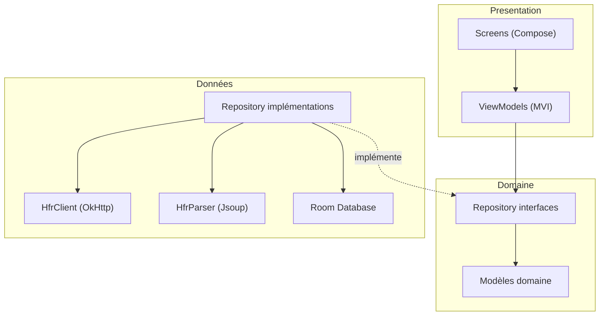
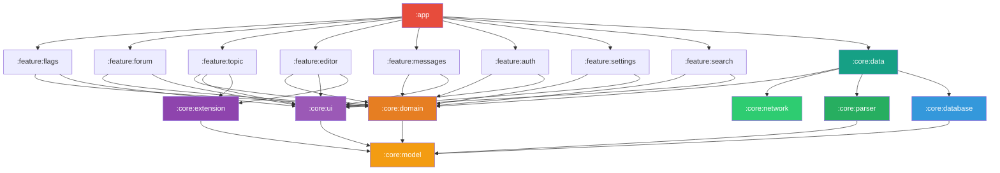
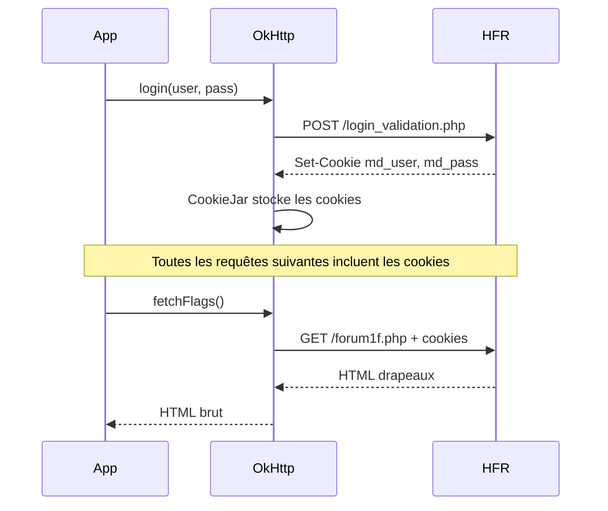

# Architecture
{: .fs-8 }

Modules Gradle, couches, data flow et stratégie de cache.
{: .fs-5 .fw-300 }

---

## Couches

L'application suit une architecture en 3 couches strictes. Chaque couche ne peut dépendre que de la couche en dessous. Les frontières sont **enforces par les modules Gradle** — pas de convention implicite.



- **Presentation** (`:feature:*`) : Compose UI + ViewModels MVI. Ne connait que les interfaces de repositories et les modèles domaine.
- **Domaine** (`:core:domain` + `:core:model`) : Interfaces de repositories + modèles purs. Aucune dépendance framework. Frontière de compilation.
- **Données** (`:core:data` + `:core:network` + `:core:parser` + `:core:database`) : Implémentations concrètes. Les features ne dépendent jamais de cette couche directement — Hilt injecte les implémentations.

---

## Modules Gradle



### Modules core

| Module | Responsabilité | Dépend de |
|--------|---------------|-----------|
| `:core:model` | Modèles domaine purs (`Topic`, `Post`, `PostContent`, `Category`, `Flag`, `MP`). Aucune dépendance Android. | rien |
| `:core:domain` | Interfaces de repositories (`TopicRepository`, `FlagRepository`, `AuthRepository`...) et règles métier partagées. Aucune dépendance framework. | `:core:model` |
| `:core:data` | Implémentations des repositories. Orchestre réseau, parser et cache. Fournit les bindings Hilt. | `:core:domain`, `:core:network`, `:core:parser`, `:core:database` |
| `:core:network` | `HfrClient` : requêtes HTTP, cookies, session, login. Encapsule OkHttp. Renvoie du HTML brut ou `Result<Unit>` — n'expose aucun type domaine. | rien |
| `:core:parser` | `HfrParser` : transforme le HTML HFR et, à partir de l'éditeur Phase 2, le BBCode HFR en modèles domaine, dont l'AST `PostContent`. | `:core:model` |
| `:core:database` | Room DB, DAOs, entities, mappers entity↔model. Cache locale + cache MPStorage. | `:core:model` |
| `:core:ui` | Thème Material 3 (`theme/`) et `PostRenderer` (`post/`, `PostContent` → Compose). D'autres sous-packages (`components/`, `adaptive/`, `semantics/`, `util/`, `extensions/`) sont prévus mais n'apparaîtront qu'au fur et à mesure de l'arrivée des features qui les justifient — pas de module vide en avance. Seul module autorisé à instancier `ColorScheme`, `Typography`, `Shapes`. | `:core:model` |
| `:core:extension` | Interfaces d'extension : `PostDecorator`, `TopicToolbarContributor`, `EditorToolbarContributor`. | `:core:model` |

### Modules feature (base)

Les features ne dépendent que de `:core:domain` (interfaces) et `:core:ui` (composants partagés). Exception volontaire : `:feature:topic` et `:feature:editor` peuvent aussi dépendre de `:core:extension`, car ce sont les deux points d'intégration des contributeurs (`PostDecorator`, `TopicToolbarContributor`, `EditorToolbarContributor`). Elles ne connaissent jamais la couche données — Hilt injecte les implémentations depuis `:core:data`.

| Module | Écrans | Dépend de |
|--------|--------|-----------|
| `:feature:flags` | Drapeaux (accueil) — onglets rouge/cyan/favoris, footer auth + MP | `:core:domain`, `:core:ui` |
| `:feature:forum` | Catégories, sous-catégories, liste de topics | `:core:domain`, `:core:ui` |
| `:feature:topic` | Lecture de topic, pagination | `:core:domain`, `:core:ui`, `:core:extension` |
| `:feature:editor` | Reply, edit, edit FP, preview BBCode, création topic | `:core:domain`, `:core:ui`, `:core:extension` |
| `:feature:messages` | MPs classiques, MultiMPs, création MP/MultiMP | `:core:domain`, `:core:ui` |
| `:feature:auth` | Login HFR | `:core:domain`, `:core:ui` |
| `:feature:search` | Recherche dans les topics et posts, filtres | `:core:domain`, `:core:ui` |
| `:feature:settings` | Préférences, thème, gestion cache | `:core:domain`, `:core:ui` |

### Modules feature (extensions communautaires — Phase 4)

Les 8 modules extension arrivent en **Phase 4** uniquement. En Phases 0 à 3, le projet compte 15 modules (8 core + 7 features base). Les extensions sont des modules Gradle isolés qui s'enregistrent via Hilt `@IntoSet` — ajouter une extension ne demande aucune modification du code existant. La décision de découpage v1 est formalisée dans [ADR-001]({{ site.baseurl }}/adr/001-modules-gradle-v1).

> **État réel des modules en Phase 1** : tous les modules core et feature de base sont déclarés dans `settings.gradle.kts`, mais certains ne contiennent encore que le squelette Gradle (`build.gradle.kts`) sans code Kotlin — `:core:extension` et `:feature:settings` notamment. `:core:network` et `:core:database` ont reçu leur backbone Phase 1A (`HfrClient`, `TopicRepositoryImpl` cache-aside, schema Room v1). `:feature:auth` contient le login HFR Phase 1B.1 (`LoginScreen` / `LoginViewModel`). C'est volontaire : le découpage est fixé dès le bootstrap (ADR-001) pour figer les frontières, mais le code arrive feature par feature. La prose ci-dessus décrit le **contrat cible** ; la réalité courante est trackée par la roadmap.

| Module | Fonction | Dépend de |
|--------|----------|-----------|
| `:feature:bookmarks` | Sauvegarder des posts | `:core:extension`, `:core:model`, `:core:database` |
| `:feature:blacklist` | Masquer des utilisateurs | `:core:extension`, `:core:model`, `:core:database` |
| `:feature:qualitay` | Signaler un post remarquable | `:core:extension`, `:core:model`, `:core:network` |
| `:feature:redflag` | Alertes intelligentes (via CF Worker) | `:core:extension`, `:core:model`, `:core:network` |
| `:feature:colortag` | Colorer et annoter les pseudos | `:core:extension`, `:core:model`, `:core:database` |
| `:feature:imagehost` | Upload et bibliothèque d'images | `:core:model`, `:core:network`, `:core:ui` |
| `:feature:gifpicker` | Recherche et insertion de GIFs | `:core:model`, `:core:network`, `:core:ui` |
| `:feature:stats` | Statistiques utilisateur | `:core:model`, `:core:network` |

### Module app

`:app` est le point d'entrée. Il :
- Configure Hilt (DI) — inclut `:core:data` pour le wiring des implémentations
- Définit la navigation globale (`RedfaceApp` + `NavDisplay`)
- Contient `MainActivity`
- Dépend de tous les modules feature (base + extensions)

> **Note Phase 1B.4 — `:feature:flags` livré** : l'écran d'accueil (Drapeaux) vit désormais dans `:feature:flags` avec `FlagsViewModel` (Hilt) + `FlagRepository` + 3 onglets (`FlagType.RED` / `CYAN` / `FAVORITE`). `:app` ne fait plus que la navigation (`FlagsRoute(versionName, versionCode, onOpenFlag, onLoginRequested)`) et passe `BuildConfig.VERSION_NAME/VERSION_CODE` en paramètres pour que l'écran puisse afficher le footer "Redface 2 — vX.Y (build N)" sans dépendre de la BuildConfig de `:app`.

---

## Séparation des responsabilités

### `:core:domain` — interfaces

Les interfaces de repositories vivent dans le module domaine. Aucune dépendance framework.

> **Note Phase 1** : ces interfaces sont le **contrat cible**. `TopicRepository` est livré (cf. [#88](https://github.com/ForumHFR/redface2/pull/88)) — `TopicScreen` lit du vrai HFR via cache-aside Room. `AuthRepository` est livré en Phase 1B.1 pour le login HFR et l'observation de session. Les autres interfaces (`FlagRepository`, etc.) arrivent feature par feature avec leur implémentation `:core:data`.

```kotlin
// Dans :core:domain — le contrat
interface TopicRepository {
    /**
     * Émet d'abord la page en cache si elle existe, puis la version réseau fraîchement
     * fetchée et persistée. Cache-aside : la deuxième émission peut être identique à la
     * première si le réseau confirme le cache.
     */
    fun observeTopicPage(cat: Int, post: Int, page: Int): Flow<Topic>

    /** Force un fetch réseau ignorant le cache, et persiste le résultat. */
    suspend fun refreshTopicPage(cat: Int, post: Int, page: Int): Topic
}

interface FlagRepository {
    /**
     * Émet `Loading`, puis le résultat d'un fetch network (`Success(flags)` ou `Failure`).
     * Les abonnés reçoivent ensuite chaque [refresh] explicite via le SharedFlow par type.
     */
    fun observe(type: FlagType): Flow<FlagsResult>
    suspend fun refresh(type: FlagType)
}

interface AuthRepository {
    fun observeAuthState(): Flow<AuthState>
    suspend fun login(pseudo: String, password: String): Result<AuthState.Authenticated>
    suspend fun logout()
}

interface MessagesRepository {
    /**
     * Compteur de MPs non lus : `null` quand anonyme ou avant la première résolution,
     * Int sinon. Phase 1B.1 livre uniquement ce compteur (preuve d'auth sur l'écran d'accueil) ;
     * la liste complète des MPs et la lecture de threads MP arrivent en Phase 1C.
     */
    fun observeUnreadMpCount(): Flow<Int?>
}
```

`TopicRepository` est livré en Phase 1A (cf. [#88](https://github.com/ForumHFR/redface2/pull/88), [#89](https://github.com/ForumHFR/redface2/pull/89)). `prefetchNextPage` documenté dans la roadmap arrivera en Phase 1B sur `HfrClient` directement (avec `useAuth = false`), puis sera relayé par `TopicRepository.prefetchTopicPage(...)`. `MessagesRepository` est livré en Phase 1B.1 en bonus du login : `:core:data DefaultMessagesRepository` combine l'observation de `AuthState` avec un fetch de `forum1.php?cat=prive` (parser dédié `:core:parser/messages/PrivateMessageListParser`) déclenché à chaque transition vers `Authenticated`. Le full pipeline messagerie (liste + threads) viendra en Phase 1C.

`FlagRepository` + parser + UI sont livrés en Phase 1B.2 → 1B.5 : `FlagsListParser` extrait `List<Flag>` depuis `forum1f.php?owntopic=N` (cf. [`models.md`]({{ site.baseurl }}/specs/models)), `:core:data DefaultFlagRepository` orchestre fetch + parse via `transformLatest`, `FlagItem` rend une ligne dans `:core:ui`, et `:feature:flags FlagsRoute` compose les 3 onglets HFR (drapeaux rouges / cyan / favoris) plus le footer auth + MP count + version + signalement CSAE. Pas de cache Room en 1B — la liste est rechargée à chaque transition `Authenticated` ou refresh utilisateur ; persistance reportée en Phase 1D (cf. roadmap `1D.2`).

### `:core:network` — HfrClient

Le client HTTP ne parse rien. Il retourne du HTML brut ou des confirmations d'action.

```kotlin
@Singleton
class HfrClient @Inject constructor(
    @AuthenticatedClient private val authenticated: OkHttpClient,
    @AnonymousClient private val anonymous: OkHttpClient,
    @HfrBaseUrl private val baseUrl: HttpUrl,
) {
    // Phase 1A — livrée
    suspend fun getTopicPage(cat: Int, post: Int, page: Int, useAuth: Boolean = true): String

    // Phase 1B+ — à implémenter
    suspend fun getFlags(): String
    suspend fun postReply(cat: Int, post: Int, content: String): Result<Unit>
    suspend fun editPost(cat: Int, post: Int, numreponse: Int, content: String): Result<Unit>
    // ...
}
```

Le login HFR est isolé dans `:core:network.auth.AuthRemoteDataSource`, pas dans `HfrClient` : il POSTe `login_validation.php`, classe la réponse, puis laisse le `@AuthenticatedClient` persister les cookies via `PersistentCookieJar`.

`@AnonymousClient` (cookie jar = `CookieJar.NO_COOKIES`) permet à un caller — typiquement le prefetch de la page suivante — d'aller chercher du HTML sans que HFR ne marque les drapeaux comme lus côté serveur. Les écrans qui doivent honorer la lecture (lecture utilisateur) appellent avec `useAuth = true` (default).

### `:core:parser` — HfrParser

Le parser transforme le HTML HFR et, à partir de l'éditeur Phase 2, le BBCode HFR en modèles domaine. Isolé de toute logique réseau et UI.

> **Statut Phase 1** : seule `parseTopicPage` est livrée (cf. `core/parser/.../HfrParser.kt`). `PostContentParser` et `TopicPageParser` existent comme classes internes du module. Les autres méthodes ci-dessous arrivent feature par feature : `parseFlags` quand `FlagsViewModel` réel arrive (Phase 1 fin), `parseEditPage` Phase 2, `parseMessageList` Phase 3, `parsePostContentFromBbcode` Phase 2 (parser BBCode pour preview éditeur).

```kotlin
class HfrParser @Inject constructor() {
    fun parseTopicPage(html: String): Topic                 // Phase 1 — livrée
    fun parsePostContentFromHtml(html: String): PostContent // Phase 1 — livrée (interne au module)
    fun parsePostContentFromBbcode(bbcode: String): PostContent // Phase 2 éditeur
    fun parseFlags(html: String): List<Flag>        // Phase 1 fin
    fun parseCategories(html: String): List<Category>       // Phase 1 fin
    fun parseEditPage(html: String): EditInfo               // Phase 2
    fun parseMessageList(html: String): List<PrivateMessage> // Phase 3
    // ...
}
```

### `:core:data` — implémentations

Les implémentations de repositories orchestrent réseau, parser et cache. Elles vivent dans `:core:data`, jamais dans les features.

```kotlin
// Dans :core:data — l'implémentation (Phase 1A)
@Singleton
class TopicRepositoryImpl @Inject constructor(
    private val client: HfrClient,
    private val parser: HfrParser,
    private val topicDao: TopicDao,
    private val clock: Clock,
    @IoDispatcher private val ioDispatcher: CoroutineDispatcher,
) : TopicRepository {

    override fun observeTopicPage(cat: Int, post: Int, page: Int): Flow<Topic> = flow {
        // 1. Si on a une copie en cache, l'émettre tout de suite (UI réactive)
        val cached = withContext(ioDispatcher) { loadFromCache(cat, post, page) }
        if (cached != null) emit(cached)

        // 2. Re-fetch + re-parse + cache, puis émettre la version fraîche
        emit(refreshTopicPage(cat, post, page))
    }

    override suspend fun refreshTopicPage(cat: Int, post: Int, page: Int): Topic =
        withContext(ioDispatcher) {
            val html = client.getTopicPage(cat, post, page, useAuth = true)
            val topic = parser.parseTopicPage(html)
            val (topicEntity, postEntities) = TopicMappers.toEntities(topic, clock.instant())
            topicDao.upsertTopicPageWithPosts(topicEntity, postEntities)
            topic
        }
}
```

Le binding Hilt connecte l'interface à l'implémentation :

```kotlin
// Dans :core:data
@Module
@InstallIn(SingletonComponent::class)
abstract class RepositoryModule {
    @Binds
    abstract fun bindTopicRepository(impl: TopicRepositoryImpl): TopicRepository

    @Binds
    abstract fun bindFlagRepository(impl: DefaultFlagRepository): FlagRepository
}
```

Les ViewModels dans les features ne connaissent que l'interface :

```kotlin
// Dans :feature:topic — ne dépend que de :core:domain
@HiltViewModel
class TopicViewModel @Inject constructor(
    private val topicRepository: TopicRepository,  // interface, pas impl
) : ViewModel() { ... }
```

---

## Stratégie de cache

| Donnée | Stratégie | Durée |
|--------|-----------|-------|
| Topics lus | Cache Room, invalidation au refresh | Jusqu'au refresh |
| Drapeaux | Cache Room, refresh au lancement + pull-to-refresh | 5 min TTL |
| Catégories | Cache Room, rarement change | 24h TTL |
| Smileys | Cache Coil, ne changent jamais | Infini |
| Avatars | Cache Coil, ETag | 1h TTL |
| MultiMP flags | Room, jamais expire (donnée locale) | Permanent |
| Préférences | DataStore | Permanent |

### Prefetch intelligent

Pour donner l'impression que le forum est local :

```
Utilisateur lit la page 3 d'un topic
  → Prefetch page 4 en arrière-plan
  → Quand il scroll vers le bas, la page 4 est déjà prête

Utilisateur ouvre ses drapeaux
  → Prefetch les 3 premiers topics (ceux qu'il ouvre le plus souvent)
```

Le prefetch respecte les conditions réseau : désactivé en mode économie de données ou réseau lent.

#### Règle critique : prefetch non-authentifié

Les requêtes de prefetch ne doivent **jamais** inclure les cookies de session — sinon HFR marque silencieusement les topics comme lus. Implémentation avec deux instances `OkHttpClient` (`@AuthenticatedClient` / `@AnonymousClient`) et test Konsist d'enforcement : voir [protocol-hfr.md § Règle critique prefetch non-authentifié]({{ site.baseurl }}/specs/protocol-hfr#règle-critique--prefetch-non-authentifié).

---

## Gestion de session

HFR utilise des cookies de session. Le flow d'authentification :



Les cookies sont persistés via un `PersistentCookieJar` adossé à un DataStore non chiffré (voir § Stockage sécurisé ci-dessous) pour éviter de se re-logguer à chaque lancement.

### Stockage sécurisé des credentials

**Option A retenue** (cycle [#24](https://github.com/ForumHFR/redface2/issues/24) thème 13, formalisée dans [ADR-002]({{ site.baseurl }}/adr/002-credentials-option-a)) : stack minimaliste **DataStore non chiffré**, protection au repos déléguée à **File-Based Encryption (FBE)** d'Android, **pas de password stocké**.

**Ce qui est stocké** : uniquement les **cookies de session HFR** (`md_user`, `md_pass`) — nécessaires pour rester connecté entre deux lancements de l'app.

**Ce qui n'est pas stocké** : le mot de passe en clair de l'utilisateur. À l'expiration de session (cookies invalidés côté HFR), l'app redirige vers l'écran de login — l'utilisateur ré-entre son mot de passe. Pas de re-login transparent silencieux.

**Protection au repos** :

- minSdk 29 garantit FBE active : `/data/data/<pkg>` est chiffré tant que le device est locké, avec une clé dérivée du PIN/pattern utilisateur.
- `android:allowBackup="false"` exclut les cookies du backup Google Drive.
- la sandbox d'app empêche les autres apps non-root d'y accéder.

> **Note** : `EncryptedSharedPreferences` (AndroidX Security) est déprécié à partir de `security-crypto 1.1.0-beta01` (04/06/2025), puis marqué deprecated en `1.1.0`. La release note officielle demande de préférer les APIs plateforme — la décision Option A va plus loin en supprimant la couche crypto custom redondante avec FBE.

**Rationale Option A (vs chiffrement custom envisagé initialement)** :
- Le **password transite en clair** dans le POST `login_validation.php` (HFR ne supporte pas le hash côté client). Tout chiffrement local du cookie reste **redondant face à un attaquant runtime** : il verrait le password lors du prochain login.
- FBE + sandbox + `allowBackup="false"` couvrent les menaces réalistes (app tierce, adb sur device locké, backup, forensic device locké).
- Tink est overkill pour un seul secret (rotation, AEAD streaming, multi-keyset — aucun n'est utile ici).
- Pas de clé Keystore custom = pas de gestion "clé invalidée par rotation système / restauration backup / perte StrongBox".
- Pas de biométrie : forum ≠ banque, complexité UX disproportionnée pour le scope v1.

---

## Gestion des erreurs

### Session expirée

Un futur `Interceptor` OkHttp détectera la redirection vers la page de login (HTTP 302 ou absence du cookie `md_user` dans la réponse). Il émettra un événement `SessionExpired` que `RedfaceApp` traduira en navigation vers la route de login livrée par `:feature:auth`. L'utilisateur ré-entre son mot de passe (Option A, pas de re-login transparent : le password n'est pas stocké).

### HFR indisponible

Le repository retourne `Result.failure` → le ViewModel affiche les données du cache Room + une bannière "HFR indisponible, données en cache". Retry automatique avec backoff exponentiel (2s, 4s, 8s, max 60s).

### Rate limiting

Interceptor OkHttp avec détection des réponses HTTP 429 et des patterns de blocage HFR. File d'attente côté client avec rate limit (max 2 req/s vers HFR). Backoff automatique sur 429.

### Breakage du parser

`HfrParser` wrappe chaque méthode dans `runCatching`. Sur échec, le HTML brut est loggé en mode debug pour diagnostic. Un smoke test CI hebdomadaire vérifie que les sélecteurs CSS critiques (`HfrSelectors`) matchent toujours sur une vraie page HFR publique.

---

## Enforcement architecture au build

Les règles d'architecture décrites plus haut (3 couches strictes, features → `:core:domain` + `:core:ui` uniquement, tokens M3 centralisés dans `:core:ui`) sont **enforcées mécaniquement** par **[Konsist](https://docs.konsist.lemonappdev.com/)** (Kotlin-first, AST parsing) — pas par une convention markdown.

Choix Konsist plutôt que ArchUnit :
- Konsist voit les spécificités Kotlin : `sealed`/`data`/`internal`/`object`, extensions, expect/actual KMP.
- ArchUnit lit le bytecode (post-`javac`/`kotlinc`) et perd la sémantique Kotlin.
- Konsist est Kotlin-first, intègre plus simplement avec la stack Redface 2.

Règles implémentées dans `app/src/test/kotlin/fr/forumhfr/redface2/ArchitectureKonsistTest.kt` (la surface réelle est plus stricte que les exemples ci-dessous, qui restent illustratifs des invariants visés) :

```kotlin
class ArchitectureTest {
    @Test fun `features n'importent pas :core:data`() {
        Konsist.scopeFromProject()
            .files
            .filter { it.path.contains("/feature/") }
            .imports
            .assertFalse { it.name.startsWith("redface.core.data.") }
    }

    @Test fun `ColorScheme Typography Shapes instantiés uniquement dans :core:ui`() {
        Konsist.scopeFromProject()
            .files
            .filter { !it.path.contains("/core/ui/") }
            .functions()
            .assertFalse { func ->
                func.hasReturnType { it.name in setOf("ColorScheme", "Typography", "Shapes") }
            }
    }

    // Activée Phase 1+ avec :core:network — cf. contributing.md § Konsist.
    // Tant qu'aucun code prefetch n'existe, le test n'a pas de surface à scanner
    // et ferait échouer Konsist sur scope vide.
    @Test fun `prefetch utilise AnonymousClient`() {
        Konsist.scopeFromProject()
            .functions()
            .filter { it.name.startsWith("prefetch") }
            .assertTrue { fn ->
                fn.parameters.any { it.hasAnnotationOf(AnonymousClient::class) }
            }
    }
}
```

Les tests Konsist tournent en CI dès Phase 0 et bloquent les PR qui violent les règles.

---

## Protocole HFR

HFR n'a pas d'API publique. Redface 2 fait du scraping HTML et doit respecter plusieurs invariants (CSRF `hash_check`, anti-bot `verifrequet`, `numreponse` par catégorie, cookies de session, prefetch non-authentifié).

**Source de vérité** : [protocol-hfr.md]({{ site.baseurl }}/specs/protocol-hfr) — endpoints (`forum1.php`, `forum2.php`, `bddpost.php`, …), form fields par endpoint, `hash_check`, `verifrequet`, `numreponse`, `listenumreponse`, sessions, smileys, edge cases (posts supprimés, emails obfusqués, pagination, `cryptlink`), fixtures.
