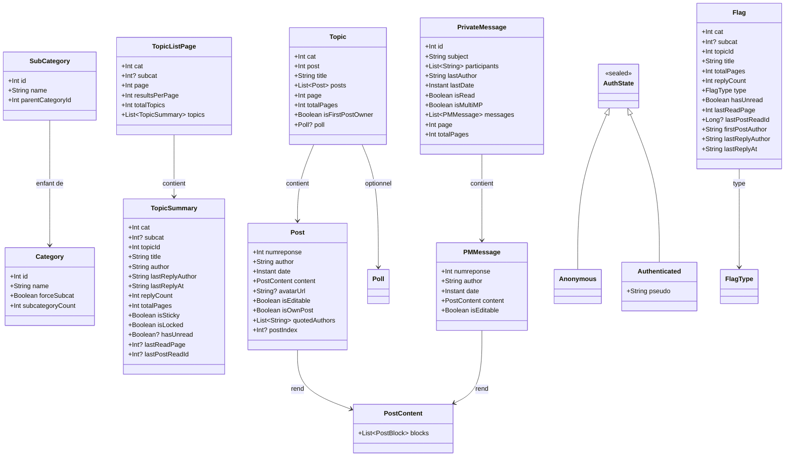

# Modèles de données
{: .fs-8 }

Structures du domaine métier.
{: .fs-5 .fw-300 }

---

## À définir avec les écrans

Certains modèles référencés dans `navigation.md` et `extensions.md` sont volontairement laissés à définir au moment d'implémenter leurs écrans, pour éviter la dette de spec pré-code :

- **`UserProfile`** — données du popup profil rapide (avatar, date inscription, nombre posts, localisation). Nécessaire Phase 2 pour la feature "Voir un profil utilisateur" (listée dans la section [Lecture du scope]({{ site.baseurl }}/specs/scope#lecture)) et son extension Phase 4 ["Infos profil rapides"]({{ site.baseurl }}/specs/extensions#infos-profil-rapides).
- **`UserStats`** — statistiques détaillées utilisateur (posts par cat, activité, topics créés). Nécessaire Phase 4 pour la feature "Stats utilisateur".

`TopicSummary` est livré en Phase 1C-A pour le Forum et la liste des topics — voir la section [Catégories et browsing](#catégories-et-browsing) ci-dessous.

Ces autres modèles émergeront du premier prototype de chaque écran. Pas de spec préventive à faire maintenant.

---

## Vue d'ensemble



---

## Authentification

État global de la session HFR exposé par `AuthRepository` (`:core:domain`). Phase 1B : alimenté par les cookies persistés (Option A — DataStore non chiffré + FBE plateforme, cf. [ADR-002]({{ site.baseurl }}/adr/002-credentials-option-a)).

```kotlin
sealed interface AuthState {
    data object Anonymous : AuthState
    data class Authenticated(val pseudo: String) : AuthState
}
```

Erreurs typées remontées par `AuthRepository.login()` (Phase 1B) :

```kotlin
sealed class LoginError : Exception() {
    data object InvalidCredentials : LoginError()   // mauvais pseudo/password
    data object RateLimited : LoginError()          // anti-flood HFR
    data class Network(override val cause: Throwable) : LoginError()  // I/O, DNS, TLS, timeout
    data class Unknown(val detail: String) : LoginError()    // HTML inattendu, cookie manquant
}
```

L'UI (`:feature:auth`) traduit chaque variante en `stringResource` localisée — les messages techniques côté domain ne sont **pas** affichés tels quels.

---

## Drapeaux

```kotlin
data class Flag(
    val cat: Int,
    val subcat: Int?,
    val topicId: Int,
    val title: String,
    val totalPages: Int,           // ceil(links.posts.count / posts_results_per_page) côté REST
    val replyCount: Int,           // max(links.posts.count - 1, 0) côté REST
    val type: FlagType,
    val hasUnread: Boolean,        // !is_read côté REST ; defensive true quand is_read absent
    val lastReadPage: Int,         // links.posts.href?page=N côté REST
    val lastPostReadId: Long?,     // last_post_read_id côté REST — id du DERNIER post lu (≠ premier non lu)
    val firstPostAuthor: String,
    val lastReplyAuthor: String,
    val lastReplyAt: String,       // timestamp brut HFR REST ("YYYY-MM-DD HH:mm"), parsing reporté
)

enum class FlagType {
    // Mapping confirmé via REST flag_owntopic + onglets HFR capturés :
    CYAN,       // sujets participés (`flag_owntopic=1`)
    RED,        // lus uniquement (`flag_owntopic=2`)
    FAVORITE,   // favoris (`flag_owntopic=3`)
}
```

> **Phase 1D-1 — REST migration** : `Flag` n'est plus alimenté par `forum1f.php` mais par les endpoints REST `forums/hardwarefr/topics/{participated,read,favorites}/` (cf. ADR-003 et `protocol-hfr.md`). Conséquences sur le modèle :
>
> - `views` (colonne « Lues » du HTML) **est retiré** : la REST ne l'expose pas. Plutôt que `Int?`-everywhere, le champ disparaît du modèle ; aucun consommateur UI n'en dépendait.
> - `firstUnreadPostId: Long` est remplacé par `lastPostReadId: Long?` : la REST expose `last_post_read_id` (id du **dernier post lu**, pas du premier non lu). Re-ancrer le scroll sur le dernier post lu reste un deep link utile sans inférer un premier-non-lu que la REST ne donne pas. `null` quand le payload omet le champ.
> - `lastReplyAt` est gardé en `String` brut au format REST (`YYYY-MM-DD HH:mm`) ; promotion en `Instant` reportée à un cas d'usage UI réel (tri par date, "il y a N minutes").

---

## Topics et Posts

```kotlin
data class Topic(
    val cat: Int,
    val post: Int,
    val subcat: Int,                 // Phase 2C : sous-cat HFR, requis par message.php/bddpost.php. Sentinel SUBCAT_UNKNOWN=-1 pour les caches pré-MIGRATION_3_4 (lecture autorisée, écriture désactivée). Jamais transmis tel quel à HFR.
    val title: String,
    val posts: List<Post>,
    val page: Int,
    val totalPages: Int,
    val isFirstPostOwner: Boolean,   // Phase 1 : figé à false par TopicPageParser tant que parseEditPage n'est pas livrée (Phase 2). Renseigné côté serveur via la page d'édition du FP.
    val poll: Poll?,
) {
    val hasSubcat: Boolean get() = subcat != SUBCAT_UNKNOWN

    companion object { const val SUBCAT_UNKNOWN: Int = -1 }
}

data class Post(
    val numreponse: Int,                 // unique par (cat), PAS globalement — clé composite (cat, numreponse) au niveau base
    val author: String,
    val date: Instant,                   // parsé depuis "dd-MM-yyyy à HH:mm:ss"
    val content: PostContent,            // AST sémantique, rendu par PostRenderer (cf. ADR-011)
    val avatarUrl: String?,
    val isEditable: Boolean,             // calculé client-side : post.author == currentUser && !isLocked
    val isOwnPost: Boolean,              // calculé client-side : post.author == currentUser
    val quotedAuthors: List<String>,     // dérivé de PostContent pour recherche, filtres et décorateurs
    val postIndex: Int?,                 // (page-1) * postsPerPage + position — null quand le parser n'a pas le contexte page/postsPerPage (preview, fixtures isolées). postsPerPage vient des préférences HFR de l'utilisateur, PAS une constante (voir UserSettings)
)

data class PostContent(
    val blocks: List<PostBlock>,
)

sealed interface PostBlock {
    data class Paragraph(val inlines: List<PostInline>) : PostBlock
    data class Quote(
        val author: String?,
        val numreponse: Int?,            // depuis [quotemsg=N,P,auteur], null si la source HTML ne l'expose pas
        val page: Int?,                  // idem, sert à reconstruire un lien vers le post cité quand disponible
        val content: PostContent,
    ) : PostBlock
    data class Spoiler(val label: String?, val content: PostContent) : PostBlock
    data class Image(val url: String, val description: String?) : PostBlock
    data class Fixed(val text: String) : PostBlock                           // BBCode [fixed], rendu monospace plein largeur
    data class CodeBlock(val text: String, val language: String?) : PostBlock // BBCode [code], language depuis <pre class="<lang>"> ; null si [code] sans hint. Phase 1 : aplatissement de la coloration syntaxique HFR (kw3/me1/st0/de1) en texte brut, coloration reportée Phase 2.
}

sealed interface PostInline {
    data class Text(val value: String) : PostInline
    data object LineBreak : PostInline                      // <br> nested dans un parent inline
    data class Strong(val children: List<PostInline>) : PostInline
    data class Emphasis(val children: List<PostInline>) : PostInline
    data class Underline(val children: List<PostInline>) : PostInline
    data class Strike(val children: List<PostInline>) : PostInline
    data class Color(val colorHex: String, val children: List<PostInline>) : PostInline
    data class Link(val url: String, val children: List<PostInline>) : PostInline
    data class InlineImage(val url: String, val description: String?) : PostInline
    data class Smiley(val kind: SmileyKind, val imageUrl: String?) : PostInline
}

sealed interface SmileyKind {
    data class Builtin(val code: String) : SmileyKind   // syntaxe HFR : :jap:, :o, :D
    data class Perso(val name: String) : SmileyKind     // syntaxe HFR : [:corran_horn]
}
```

`PostContent` est le contrat cible décrit par [ADR-011]({{ site.baseurl }}/adr/011-postcontent-ast). La dette de fragment HTML brut dans le slice topic fixe est résorbée par [#80](https://github.com/ForumHFR/redface2/pull/80) ; les blocs monospace `[fixed]` / `[code]` sont parsés depuis Phase 1 via [#79](https://github.com/ForumHFR/redface2/issues/79). `PostInline.Color.colorHex` conserve la couleur sous forme textuelle normalisée (`#RRGGBB` ou `#AARRGGBB`) pour préserver le round-trip BBCode HFR.

---

## Création et édition

```kotlin
data class NewTopic(
    val cat: Int,
    val subcat: Int,
    val subject: String,
    val content: String,
    val poll: PollData?,
)

data class FirstPostData(
    val subject: String,
    val content: String,
    val poll: PollData?,
)

data class PollData(
    val question: String,
    val options: List<String>,
    val multipleChoice: Boolean,
)

data class Poll(
    val question: String,
    val options: List<PollOption>,
    val multipleChoice: Boolean,
    val totalVotes: Int,
    val hasVoted: Boolean,
)

data class PollOption(
    val text: String,
    val votes: Int,
    val percentage: Float,
)
```

`EditInfo` est retourné par `HfrParser.parseEditPage(html)` (cf. [architecture.md]({{ site.baseurl }}/specs/architecture#core-parser--hfrparser)). Il capture l'état pré-rempli du formulaire d'édition HFR et ce qui doit être renvoyé côté `bdd.php` (cf. [protocol-hfr.md]({{ site.baseurl }}/specs/protocol-hfr#post-bddphp-edit)).

```kotlin
data class EditInfo(
    val cat: Int,
    val post: Int,                   // ID topic
    val numreponse: Int,             // ID post édité (unique par cat)
    val content: String,             // BBCode brut pré-rempli dans le textarea
    val isFirstPost: Boolean,        // édition du premier post (FP) ?
    val subject: String?,            // non-null uniquement si isFirstPost
    val subcat: Int?,                // non-null uniquement si isFirstPost (change de sous-cat possible)
    val poll: Poll?,                 // non-null si isFirstPost avec sondage existant
)
```

---

## Catégories et browsing

Modèles consommés par `:feature:forum` (Phase 1C-A). Les sources sont REST JSON via `HfrApiClient` (`:core:network`) puis mappés depuis les DTO `:core:data forum/RestForumDtos.kt` (cf. [ADR-003]({{ site.baseurl }}/adr/003-api-rest-hfr-hybride)).

```kotlin
data class Category(
    val id: Int,
    val name: String,
    val forceSubcat: Boolean,        // mirrors REST `force_subcat`
    val subcategoryCount: Int,        // mirrors REST `number_of_subcategories` (le payload public n'a pas de bloc `links` côté catégorie)
)

data class SubCategory(
    val id: Int,
    val name: String,
    val parentCategoryId: Int,        // injecté côté mapper (pas dans le JSON brut)
)

data class TopicSummary(
    val cat: Int,
    val subcat: Int?,                 // déduit du endpoint ou de `links.subcategory.href`
    val topicId: Int,
    val title: String,
    val author: String,
    val lastReplyAuthor: String,
    val lastReplyAt: String,          // raw `YYYY-MM-DD HH:mm`, parsing reporté
    val replyCount: Int,              // max(links.posts.count - 1, 0)
    val totalPages: Int,              // ceil(links.posts.count / postsResultsPerPage), où postsResultsPerPage vient de `links.posts.href?results_per_page=N`. Pas de constante 40 globale (cf. § "postsPerPage configurable").
    val isSticky: Boolean,            // mirrors `is_sticky`
    val isLocked: Boolean,            // mirrors `is_closed`
    val hasUnread: Boolean?,          // !is_read si présent en auth, null sinon
    val lastReadPage: Int?,           // page extraite de `links.posts.href?page=N` (auth uniquement). PAS `last_position` qui est l'index intra-page.
    val lastPostReadId: Int?,         // mirrors `last_post_read_id` si présent — id du dernier post lu, ancre pour le scroll.
    val flagType: FlagType?,          // dérivé de REST `flag_owntopic` : 1→CYAN, 2→RED, 3→FAVORITE, sinon null. Indépendant de `hasUnread`.
)

data class TopicListPage(
    val cat: Int,
    val subcat: Int?,
    val page: Int,
    val resultsPerPage: Int,
    val totalTopics: Int,             // mirrors `results_count`
    val topics: List<TopicSummary>,
)
```

**Champs absents en REST** : `views` n'est pas exposé en JSON — ne pas inventer `0`, ne pas l'afficher. Le calcul de pages côté topic (`TopicSummary.totalPages`) utilise le `results_per_page` exposé par `links.posts.href` (typiquement 40 dans les fixtures, mais c'est l'API qui décide — `40` n'est pas une constante globale, cf. [protocol-hfr.md § postsPerPage configurable]({{ site.baseurl }}/specs/protocol-hfr#postsperpage-configurable) pour la pagination HTML). Le `results_per_page` du wrapper REST englobe la **liste de topics**, distinct de celui imbriqué dans `links.posts.href` qui pagine les **posts** d'un topic.

---

## Écriture HFR

Types vivant dans `:core:model/write/` ; consommés par `:core:parser/write/`,
`:core:data/write/` et `:feature:editor`. Livrés en Phase 2C (#145) ; étendus
plus tard pour Edit / Quote / Edit FP / Create.

```kotlin
data class ReplyContext(
    val cat: Int,
    val subcat: Int,                 // requis ≥ 0 ; ReplyContext.init refuse le sentinel SUBCAT_UNKNOWN
    val topicId: Int,
    val page: Int,                   // page topic depuis laquelle l'utilisateur a cliqué "Répondre"
)

data class ReplyForm(
    val hashCheck: String,           // CSRF token HFR, jamais loggué
    val sujet: String,
    val hiddenFields: Map<String, String>,   // password filtré au parse ; pseudo anonyme filtré
    val isAnonymous: Boolean,
)

sealed interface ReplySubmitResult {
    data class Success(
        val refreshUrl: String?,     // <meta http-equiv="Refresh" content="N; url=…">
        val targetPage: Int?,        // dérivé du shape sujet_X_Y.htm
    ) : ReplySubmitResult
    data class Failure(val reason: ReplyFailureReason) : ReplySubmitResult
}

sealed interface ReplyFailureReason {
    data object EmptyMessage : ReplyFailureReason
    data object InvalidHashCheck : ReplyFailureReason
    data object AntiFlood : ReplyFailureReason
    data object TopicLocked : ReplyFailureReason
    data object LoginRequired : ReplyFailureReason   // form anonyme servi par HFR
    data object Unknown : ReplyFailureReason         // réponse non reconnue ; pas de raw body conservé (cf. KDoc)
}
```

Le contrat HFR sous-jacent est documenté dans [`protocol-hfr.md` § POST `bddpost.php`]({{ site.baseurl }}/specs/protocol-hfr). Les `ReplyFailureReason` mappent un-à-un sur les fixtures `write_*_error.html` / `write_*_response.html` capturées en Phase 2A.

---

## Messages privés

```kotlin
data class PrivateMessage(
    val id: Int,
    val subject: String,
    val participants: List<String>,
    val lastAuthor: String,         // dernier expéditeur
    val lastDate: Instant,
    val isRead: Boolean,            // HFR natif (classic) ou MPStorage (multi)
    val isMultiMP: Boolean,
    val messages: List<PMMessage>,  // conversation chargée à l'ouverture, peut être vide dans les listes
    val page: Int = 1,              // page courante dans la conversation
    val totalPages: Int = 1,
)

data class PMMessage(
    val numreponse: Int,
    val author: String,
    val date: Instant,
    val content: PostContent,       // AST sémantique, rendu par PostRenderer
    val isEditable: Boolean,        // calculé client-side : author == currentUser
)

data class NewMP(
    val recipient: String,
    val subject: String,
    val content: String,
)

data class NewMultiMP(
    val recipients: List<String>,
    val subject: String,
    val content: String,
)
```

---

## MPStorage

MPStorage est une bibliothèque cross-plateforme qui utilise un **MP HFR dédié** comme backend de stockage. Les données (drapeaux MultiMP, bookmarks, préférences) sont sérialisées en JSON dans le corps de ce message privé. Cela permet la synchronisation entre appareils sans serveur tiers.

```kotlin
// Données stockées dans le MP de stockage (format JSON)
data class MPStorageData(
    val multiMPFlags: Map<Int, MultiMPFlag>,  // clé = mpId
    val bookmarks: List<Bookmark>,
    val settings: MPStorageSettings,
)

data class MultiMPFlag(
    // mpId est la clé du Map, pas besoin de le dupliquer
    val lastReadDate: Instant,
    val pinned: Boolean,
)

data class MPStorageSettings(
    val compactFlags: Boolean = false,
    val defaultImageHost: String = "diberie",
)

data class Bookmark(
    val cat: Int,
    val post: Int,              // topic ID
    val numreponse: Int,        // post ID
    val topicTitle: String,
    val author: String,
    val preview: String,
    val createdAt: Instant,
)
```

L'app synchronise ces données avec le MP de stockage HFR et les cache localement dans Room pour des accès rapides. Cela garantit la compatibilité avec les userscripts existants qui utilisent le même mécanisme.

---

## Paramètres utilisateur

`UserSettings` capture les réglages du compte HFR qui influencent le rendu côté client. Le parser lit ces valeurs depuis `editprofil.php?page=3` à la connexion et les stocke en cache (Room + DataStore). **Aucun champ ne doit être hardcodé** dans le code applicatif — notamment `postsPerPage` (cf. [protocol-hfr.md]({{ site.baseurl }}/specs/protocol-hfr#postsperpage-configurable)).

```kotlin
data class UserSettings(
    val postsPerPage: Int,           // 20 / 40 / 60 — réglable HFR, défaut 40
    val showAvatars: Boolean,        // affichage des avatars dans les topics
    val showSignatures: Boolean,     // affichage des signatures
    val timezone: String,            // ex: "Europe/Paris"
    val language: String,            // "fr" | "en"
)
```

**Note** : le modèle est volontairement minimaliste pour la Phase 1. Les réglages secondaires (thème CSS HFR, jeu d'icônes, notifications MP, notifications mots-clés, fuseau numérique, réglages de signature) seront ajoutés Phase 2+ lors de l'implémentation de l'écran Paramètres, suivant la règle prototype-first de la méthodologie.

---

## Recherche

```kotlin
data class SearchQuery(
    val text: String,
    val cat: Int? = null,
    val author: String? = null,
    val dateFrom: LocalDate? = null,
    val dateTo: LocalDate? = null,
)

data class SearchResult(
    val cat: Int,
    val post: Int,              // topic ID
    val numreponse: Int,        // post ID dans la catégorie
    val topicTitle: String,
    val author: String,
    val date: Instant,
    val preview: String,
)
```

---

## Hébergement d'images

```kotlin
data class HostedImage(
    val id: String,
    val url: String,
    val thumbnailUrl: String?,
    val originalUrl: String?,
    val providerId: String,         // identifiant du provider ayant servi l'upload ou le rehost
    val deleteToken: String?,       // null si le provider ne supporte pas la suppression (ex : rehost)
    val uploadedAt: Instant,
    val sizeBytes: Long,
    val topicRef: TopicRef?,
)

data class TopicRef(
    val cat: Int,
    val post: Int,
    val title: String,
)
```

### Providers — interfaces séparées

Les capacités varient d'un provider à l'autre : certains supportent l'upload **et** le rehost, d'autres uniquement le rehost. Une seule interface `ImageProvider` avec des méthodes qui échouent sur certains providers serait fragile. On sépare en **deux interfaces distinctes**, implémentées indépendamment :

```kotlin
// :core:domain
interface UploadProvider {
    val id: String                  // "diberie", "superh", "imgur"
    val displayName: String

    /** Upload une image depuis les octets bruts. Retourne l'image hébergée. */
    suspend fun upload(bytes: ByteArray, filename: String?): Result<HostedImage>

    /** Supprime une image si le provider le supporte et si deleteToken est valide. */
    suspend fun delete(image: HostedImage): Result<Unit>
}

interface RehostProvider {
    val id: String                  // "rehost", "diberie-rehost", "superh-rehost"
    val displayName: String

    /** Rehost une image déjà en ligne par son URL. Retourne l'image copiée. */
    suspend fun rehost(sourceUrl: String): Result<HostedImage>
}
```

Un provider peut implémenter **les deux** interfaces si HFR expose les deux flux (exemple : `DiberieUploadProvider` implémente `UploadProvider`, `DiberieRehostProvider` implémente `RehostProvider`, ils peuvent partager un `HttpClient` commun).

Providers prévus en Phase 2 :

| `id` | Interface(s) | Notes |
|---|---|---|
| `diberie` | `UploadProvider` + `RehostProvider` | Rehost by dib (communauté HFR) |
| `superh` | `UploadProvider` + `RehostProvider` | super-h.fr |
| `imgur` | `UploadProvider` | API Imgur, fallback |
| `rehost` | `RehostProvider` | reho.st historique (plus d'upload manuel) |

Enregistrement via Hilt `@IntoSet` (cf. [extensions.md]({{ site.baseurl }}/specs/extensions#architecture-dextensions)) : ajouter un provider ne modifie pas le code existant.
