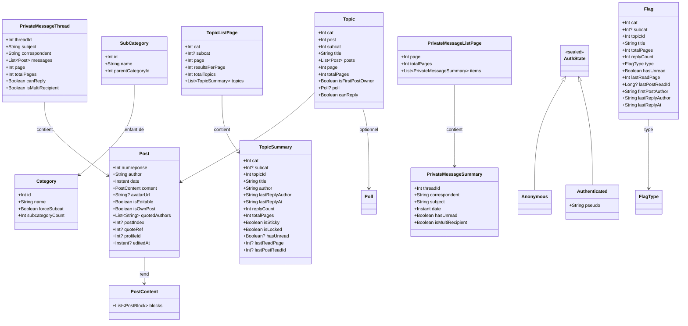

# Modèles de données
{: .fs-8 }

Structures du domaine métier.
{: .fs-5 .fw-300 }

---

## À définir avec les écrans

Certains modèles référencés dans `navigation.md` et `extensions.md` sont volontairement laissés à définir au moment d'implémenter leurs écrans, pour éviter la dette de spec pré-code :

- **`UserProfile`** — livré en Phase 2 finish (#208) — voir section [Profil utilisateur](#profil-utilisateur) ci-dessous.
- **`UserStats`** — statistiques détaillées utilisateur (posts par cat, activité, topics créés). Nécessaire Phase 4 pour la feature "Stats utilisateur".

`TopicSummary` est livré en Phase 1C-A pour le Forum et la liste des topics — voir la section [Catégories et browsing](#catégories-et-browsing) ci-dessous.

Ces autres modèles émergeront du premier prototype de chaque écran. Pas de spec préventive à faire maintenant.

---

---

## Profil utilisateur

Phase 2 finish (#208). Modèle `UserProfile` dans `:core:model`, parser dans `:core:parser/profile/ProfileParser.kt`. Champs fragiles nullables pour tolérance aux variations HFR.

```kotlin
data class UserProfile(
    val userId: Int,            // clé canonique — toujours non-null
    val pseudo: String,         // fallback sentinelle "?" documenté si toutes les sources sont vides
    val avatarUrl: String?,     // CDN HFR reconstruit depuis mesdiscussions-{N}.png
    val registeredAt: String?,  // format HFR brut "DD/MM/YYYY" — promotion Instant reportée
    val postCount: Int?,
    val location: String?,      // ville HFR, null si vide ou absent
    val signatureText: String?, // texte plat (Jsoup.text()) — round-trip BBCode hors scope MVP
    val rawFields: Map<String, String> = emptyMap(), // champs non promus (Profession, Loisirs, …)
)
```

`Post.profileId: Int?` (Phase 2 finish #208) — id numérique HFR extrait depuis `<a href="/hfr/profil-{N}.htm">` dans le toolbar de chaque post. Null pour les posts « Publicité » ou les reads anonymes sans lien profil. Persisté en Room v6 (`MIGRATION_5_6`). Clé canonique pour la navigation vers le profil — `post.author` et `post.avatarUrl` sont des hints d'affichage.

### Rôle de l'auteur — `AuthorRole` (#1112, #221)

Rôle forum d'un auteur (badge). Le rôle **n'est pas** dans le HTML du post ; il est **hybride**, à
deux sources publiques anonymes (cf. `protocol-hfr.md` § Rôle de l'auteur). Aucun champ n'est ajouté
à `Post` ni à `UserProfile`.

```kotlin
enum class AuthorRole {
    MEMBER,       // « Membre »
    MODERATOR,    // « Modérateur »
    ADMIN,        // « Administrateur »
    SUPER_ADMIN,  // « Super Administrateur »
    DEVELOPER,    // « Développeur »
    ARCHITECT,    // « Architecte / Développeur principal »
}
```

**Deux sources, deux clés** :

- **Primaire — annuaire staff GLOBAL, clé = pseudo.** Un seul GET (`message-smi-mp-aj.php?responsable=1`)
  donne la liste complète des responsables indexée par **pseudo**. C'est ce qui alimente le badge d'une
  liste de posts : 1 GET + lookups locaux par pseudo (pas de N+1). L'annuaire n'expose **aucun**
  `profileId`. Les pseudos HFR étant uniques, aucune confirmation par `profileId` n'est nécessaire.
- **Secondaire — page profil, clé = `Post.profileId`.** La page profil (`/hfr/profil-{id}.htm`, champ
  « Statut ») donne le rôle d'**un** auteur. Réservée à une demande explicite mono-utilisateur (écran
  profil, PR C) — **jamais** un fallback « requêter tous les `profileId` » si l'annuaire échoue.

Le mapping `libellé → AuthorRole` est **partagé** entre les deux sources (`authorRoleFromLabel` dans
`:core:parser`) et conserve les six rôles distincts : `Membre` → `MEMBER`, `Modérateur` →
`MODERATOR`, `Administrateur` → `ADMIN`, `Super Administrateur` → `SUPER_ADMIN`, `Développeur` →
`DEVELOPER`, `Architecte / Développeur principal` → `ARCHITECT`. Tout libellé absent ou non reconnu
→ l'entrée staff est ignorée, le profil rend `null`.

Résolu par `AuthorRoleRepository` (interface dans `:core:domain/author`, impl
`DefaultAuthorRoleRepository` dans `:core:data/author`) :

- **`suspend fun getStaff(): Map<String, AuthorRole>`** — clés = pseudos **canonicalisés**
  (`canonicalizePseudo`). Cache mémoire **unique** + TTL 24h ; single-flight unique. Échec réseau →
  **cache périmé** s'il existe (sans avancer son timestamp), sinon `emptyMap()` ; un parse vide
  n'écrase pas un cache valide.
- **`suspend fun getRole(profileId: Int): AuthorRole?`** — GET anonyme de la page profil ; cache LRU
  borné (~512) + TTL 24h, `null` (cache négatif) inclus ; single-flight par id ; échec réseau → `null`
  non caché.

Les deux partagent une **borne de parallélisme globale** (4 GET concurrents) et un scope propriétaire ;
`CancellationException` et erreurs inattendues remontent. Donnée **décorative / publique / best-effort**
(pas de badge si rôle indéterminé). **Pas de Room.**

---

## Vue d'ensemble



---

## Authentification

État global de la session HFR exposé par `AuthRepository` (`:core:domain`). Phase 1B : alimenté par les cookies persistés (Option A — DataStore non chiffré + FBE plateforme, cf. [ADR-002]({{ site.baseurl }}/adr/002-credentials-option-a)).

```kotlin
sealed interface AuthState {
    data object Anonymous : AuthState
    data class Authenticated(val pseudo: String) : AuthState
}
```

Erreurs typées remontées par `AuthRepository.login()` (Phase 1B) :

```kotlin
sealed class LoginError : Exception() {
    data object InvalidCredentials : LoginError()   // mauvais pseudo/password
    data object RateLimited : LoginError()          // anti-flood HFR
    data class Network(override val cause: Throwable) : LoginError()  // I/O, DNS, TLS, timeout
    data class Unknown(val detail: String) : LoginError()    // HTML inattendu, cookie manquant
}
```

L'UI (`:feature:auth`) traduit chaque variante en `stringResource` localisée — les messages techniques côté domain ne sont **pas** affichés tels quels.

---

## Drapeaux

```kotlin
data class Flag(
    val cat: Int,
    val subcat: Int?,
    val topicId: Int,
    val title: String,
    val totalPages: Int,           // ceil(links.posts.count / posts_results_per_page) côté REST
    val replyCount: Int,           // max(links.posts.count - 1, 0) côté REST
    val type: FlagType,            // bucket DEMANDÉ au fetch, jamais dérivé de flag_owntopic (#384)
    val isFavorite: Boolean,       // décoration étoile : flag_owntopic == 3, indépendante du bucket
    val hasUnread: Boolean,        // !is_read côté REST ; defensive true quand is_read absent
    val lastReadPage: Int,         // links.posts.href?page=N côté REST
    val lastPostReadId: Long?,     // last_post_read_id côté REST — id du DERNIER post lu (≠ premier non lu)
    val firstPostAuthor: String,
    val lastReplyAuthor: String,
    val lastReplyAt: String,       // timestamp brut HFR REST ("YYYY-MM-DD HH:mm"), parsing reporté
)

enum class FlagType {
    // Le type d'un Flag est TOUJOURS le bucket REST demandé au fetch
    // (participated/read/favorites), jamais dérivé de flag_owntopic (#384 :
    // le bucket participated renvoie aussi des lignes flag_owntopic=3).
    CYAN,       // bucket participated (« Mes sujets »)
    RED,        // bucket read (« Lus uniquement »)
    FAVORITE,   // bucket favorites (« Favoris »)
}
```

> **`type` vs `isFavorite` (#384 + suivi)** : `flag_owntopic` décrit le drapeau le plus fort
> SUR le sujet (3 = favori/étoile), pas le bucket d'appartenance — vérifié live (fixture
> `rest_cat13_participated_favorites.json`) : le bucket participated renvoie des sujets
> participés-ET-favoris avec `flag_owntopic=3`. Mapper ce champ vers `type` corrompait le
> cache Room par type (#384). `type` reste donc le bucket (routage, filtres, clé de cache) ;
> `isFavorite` ne porte que la **décoration** : la pastille d'un favori reste jaune dans
> « Mes sujets », quelle que soit la couleur du bucket (parité site, retour dev v118).

> **Phase 1D-1 — REST migration** : `Flag` n'est plus alimenté par `forum1f.php` mais par les endpoints REST `forums/hardwarefr/topics/{participated,read,favorites}/` (cf. ADR-003 et `protocol-hfr.md`). Conséquences sur le modèle :
>
> - `views` (colonne « Lues » du HTML) **est retiré** : la REST ne l'expose pas. Plutôt que `Int?`-everywhere, le champ disparaît du modèle ; aucun consommateur UI n'en dépendait.
> - `firstUnreadPostId: Long` est remplacé par `lastPostReadId: Long?` : la REST expose `last_post_read_id` (id du **dernier post lu**, pas du premier non lu). Re-ancrer le scroll sur le dernier post lu reste un deep link utile sans inférer un premier-non-lu que la REST ne donne pas. `null` quand le payload omet le champ.
> - `lastReplyAt` est gardé en `String` brut au format REST (`YYYY-MM-DD HH:mm`) ; promotion en `Instant` reportée à un cas d'usage UI réel (tri par date, "il y a N minutes").

---

## Topics et Posts

```kotlin
data class Topic(
    val cat: Int,
    val post: Int,
    val subcat: Int,                 // #213 : sous-cat de POST, lue sur l'input[name=subcat] du formulaire bddpost. subcat=0 est VALIDE et postable (catégorie sans sous-cat, ex. cat IA — capture live à l'appui). Sentinel SUBCAT_UNKNOWN=-1 quand aucun formulaire reply n'est présent (logged-out / prefetch anon / topic verrouillé / cache pré-MIGRATION_3_4) → lecture seule. Écriture gate sur subcat >= 0. Jamais transmis tel quel à HFR quand =-1.
    val title: String,
    val posts: List<Post>,
    val page: Int,
    val totalPages: Int,
    val isFirstPostOwner: Boolean,   // Phase 1 : figé à false par TopicPageParser tant que parseEditPage n'est pas livrée (Phase 2). Renseigné côté serveur via la page d'édition du FP.
    val poll: Poll?,
    val pollVoteForm: PollVoteForm? = null, // #779 : capacité de vote transitoire de CETTE page, présente uniquement avec poll.resultsAvailable=false. Jamais Room/SavedStateHandle/log ; le cache la réhydrate à null et force un GET authentifié pour retrouver le hash_check.
    val canReply: Boolean = false,   // #213 : postabilité = présence du formulaire bddpost dans la page topic (rendu uniquement en session authentifiée sur topic non verrouillé). Remplace l'ancien heuristique hasSubcat (subcat > 0), qui excluait à tort les cats IA postables (subcat=0) et faisait confiance au subcat du widget de recherche capturé logged-out. Persisté en Room v7 (MIGRATION_6_7). Défaut false : rows pré-v7 / prefetch anon en lecture seule jusqu'au prochain fetch authentifié. Gate Répondre/Citer/Modifier/Modifier-1er-message.
) {
    companion object { const val SUBCAT_UNKNOWN: Int = -1 }
}

data class Post(
    val numreponse: Int,                 // unique par (cat), PAS globalement — clé composite (cat, numreponse) au niveau base
    val author: String,
    val date: Instant,                   // parsé depuis "dd-MM-yyyy à HH:mm:ss"
    val content: PostContent,            // AST sémantique, rendu par PostRenderer (cf. ADR-011)
    val avatarUrl: String?,
    val isEditable: Boolean,             // Phase 2D (#147) : `true` quand la toolbar HFR du post expose un lien `<a href="…message.php?…&numreponse={post.numreponse}…">`. HFR ne le rend que pour les posts du compte authentifié sur un topic non verrouillé — on ne compare pas l'auteur localement. Persisté en Room depuis v1.
    val isOwnPost: Boolean,              // Phase 2D : équivalent à `isEditable` faute de signal HFR distinct au niveau topic page. Les deux champs restent séparés pour un futur raffinement (modo-can-edit, locked-but-own-post). Persisté en Room depuis v1.
    val quotedAuthors: List<String>,     // dérivé de PostContent pour recherche, filtres et décorateurs
    val postIndex: Int?,                 // Champ historique réservé (#1055), toujours null en production : aucun index global stable n'est établi depuis les pages HFR réelles. Conservé pour compatibilité avec la colonne Room v1, sans consommateur UI. Ne pas peupler sans caractériser la pagination et le cache sur fixtures réelles.
    val quoteRef: Int? = null,           // Phase 2C (#146/#227/#986) : rang 1-based du post dans sa page (`0` pour le récapitulatif de page 2+), parsé depuis le href quote et jamais recalculé depuis l'index local. Null = ref absent/obfusqué/verrouillé/anonyme. Persisté en Room v5. Topic peut citer sans ref (#227) ; MP masque « Citer » quand il manque (#1074).
    val profileId: Int? = null,          // Phase 2 finish (#208) : id numérique HFR du lien profil toolbar (cf. note en tête de page). Persisté en Room v6 (`MIGRATION_5_6`).
    val editedAt: Instant? = null,       // #362 : date de dernière édition parsée depuis le trailer `div.edited` (« Message édité par <auteur> le DD-MM-YYYY à HH:MM:SS »). Null = jamais édité — y compris un div.edited ne portant que le lien « Message cité N fois » (post cité jamais édité). Persisté en Room v8 (`MIGRATION_7_8`). Affiché dans le menu contextuel de post (« Édité le … »).
)

data class PostContent(
    val blocks: List<PostBlock>,
)

sealed interface PostBlock {
    data class Paragraph(val inlines: List<PostInline>) : PostBlock
    data class Quote(
        val author: String?,
        val numreponse: Int?,            // lu dans le href de l'ancre auteur de la citation (PostContentParser.parseQuote, CITATION_HREF_REGEX ou DYNAMIC_CITATION_HREF_REGEX) : c'est le fragment #t<num> qui est autoritaire, PAS le paramètre numreponse= (il vaut 0 sur les sujets authentifiés). Jamais dérivé du tag [quotemsg=…] du BBCode source, que le HTML rendu n'expose pas. Null si l'ancre manque (table.quote / table.oldquote d'un [quote] nu) ou si le href n'a aucune des deux formes
        val page: Int?,                  // même source : 1er groupe de la même regex (segment sujet_<id>_<page>.htm en anonyme, paramètre page= en authentifié). Sert à reconstruire un lien vers le post cité et à router le saut #625/#1093
        val content: PostContent,
    ) : PostBlock
    data class Spoiler(val label: String?, val content: PostContent) : PostBlock
    data class Image(val url: String, val description: String?) : PostBlock
    data class Fixed(val text: String) : PostBlock                           // BBCode [fixed], rendu monospace plein largeur
    data class CodeBlock(val text: String, val language: String?) : PostBlock // BBCode [code], language depuis <pre class="<lang>"> ; null si [code] sans hint. Phase 1 : aplatissement de la coloration syntaxique HFR (kw3/me1/st0/de1) en texte brut, coloration reportée Phase 2.
}

sealed interface PostInline {
    data class Text(val value: String) : PostInline
    data object LineBreak : PostInline                      // <br> nested dans un parent inline
    data class Strong(val children: List<PostInline>) : PostInline
    data class Emphasis(val children: List<PostInline>) : PostInline
    data class Underline(val children: List<PostInline>) : PostInline
    data class Strike(val children: List<PostInline>) : PostInline
    data class Color(val colorHex: String, val children: List<PostInline>) : PostInline
    data class Link(val url: String, val children: List<PostInline>) : PostInline
    data class InlineImage(val url: String, val description: String?) : PostInline
    data class Smiley(val kind: SmileyKind, val imageUrl: String?) : PostInline
}

sealed interface SmileyKind {
    data class Builtin(val code: String) : SmileyKind   // syntaxe HFR : :jap:, :o, :D
    data class Perso(val name: String) : SmileyKind     // syntaxe HFR : [:corran_horn]
}
```

`PostContent` est le contrat cible décrit par [ADR-011]({{ site.baseurl }}/adr/011-postcontent-ast). La dette de fragment HTML brut dans le slice topic fixe est résorbée par [#80](https://github.com/ForumHFR/redface2/pull/80) ; les blocs monospace `[fixed]` / `[code]` sont parsés depuis Phase 1 via [#79](https://github.com/ForumHFR/redface2/issues/79). `PostInline.Color.colorHex` conserve la couleur sous forme textuelle normalisée (`#RRGGBB` ou `#AARRGGBB`) pour préserver le round-trip BBCode HFR.

---

## Création et édition

```kotlin
data class NewTopic(
    val cat: Int,
    val subcat: Int,
    val subject: String,
    val content: String,
    val poll: PollData?,
)

data class FirstPostData(
    val subject: String,
    val content: String,
    val poll: PollData?,
)

data class PollData(
    val question: String,
    val options: List<String>,
    val multipleChoice: Boolean,
)

data class Poll(
    val question: String,
    val options: List<PollOption>,
    val multipleChoice: Boolean,
    val totalVotes: Int,
    val hasVoted: Boolean,
    val resultsAvailable: Boolean = true, // #697 — false = forme « formulaire » (pas encore voté)
    val maxSelections: Int? = null,       // #779 — mono=1 ; multi=caption « Sondage à N choix possibles » ; null=borne multi inconnue/ancien cache, jamais coercée à 1
    val closed: Boolean = false,          // état de clôture fourni par HFR ; fait foi pour désactiver l'écriture
    val expiresAt: LocalDateTime? = null, // heure murale HFR sans fuseau ; ne jamais convertir en Instant ni en déduire la clôture via l'horloge locale
    val blankVotes: Int? = null,          // 0 est une vraie valeur ; null = formulaire sans résultats, compteur absent ou ancien cache
)

data class PollOption(
    val text: String,
    val votes: Int,      // 0 et sans signification quand resultsAvailable = false
    val percentage: Float, // idem
)
```

HFR sert **deux formes** de sondage (#697) : la forme « résultats » (barres `.sondageLeft`, votes et
pourcentages) uniquement après avoir voté ou cliqué « voir les résultats », et la forme
« formulaire » (inputs radio/checkbox `name=reponse`) dans tous les autres cas — donc dans **toutes**
les lectures anonymes, ce que l'app reçoit. `resultsAvailable = false` marque cette seconde forme :
seuls `question`, `options[].text` et `multipleChoice` (déduit du type d'input : checkbox = multi)
sont porteurs de sens. `Poll.maxSelections` porte la borne de sélection du même DOM : `1` pour une
radio, la valeur de la caption pour un multi, `null` si cette borne est réellement inconnue. Le
contrat domaine/transport du vote est livré par #779 ; son orchestration MVI et son UI restent un
chantier séparé. `hasVoted` reste `false` sur la forme résultats et ne décide jamais de la capacité
de vote : seule la présence de `Topic.pollVoteForm` le fait.

`EditInfo` est retourné par `HfrParser.parseEditPage(html)` (cf. [architecture.md]({{ site.baseurl }}/specs/architecture#core-parser--hfrparser)). Il capture l'état pré-rempli du formulaire d'édition HFR et ce qui doit être renvoyé côté `bdd.php` (cf. [protocol-hfr.md]({{ site.baseurl }}/specs/protocol-hfr#post-bddphp-edit)).

```kotlin
data class EditInfo(
    val cat: Int,
    val post: Int,                   // ID topic
    val numreponse: Int,             // ID post édité (unique par cat)
    val content: String,             // BBCode brut pré-rempli dans le textarea
    val isFirstPost: Boolean,        // édition du premier post (FP) ?
    val subject: String?,            // non-null uniquement si isFirstPost
    val subcat: Int?,                // non-null uniquement si isFirstPost (change de sous-cat possible)
    val poll: Poll?,                 // non-null si isFirstPost avec sondage existant
)
```

---

## Catégories et browsing

Modèles consommés par `:feature:forum` (Phase 1C-A). Les sources sont REST JSON via `HfrApiClient` (`:core:network`) puis mappés depuis les DTO `:core:data forum/RestForumDtos.kt` (cf. [ADR-003]({{ site.baseurl }}/adr/003-api-rest-hfr-hybride)).

```kotlin
data class Category(
    val id: Int,
    val name: String,
    val forceSubcat: Boolean,        // mirrors REST `force_subcat`
    val subcategoryCount: Int,        // mirrors REST `number_of_subcategories` (le payload public n'a pas de bloc `links` côté catégorie)
)

data class SubCategory(
    val id: Int,
    val name: String,
    val parentCategoryId: Int,        // injecté côté mapper (pas dans le JSON brut)
)

data class TopicSummary(
    val cat: Int,
    val subcat: Int?,                 // déduit du endpoint ou de `links.subcategory.href`
    val topicId: Int,
    val title: String,
    val author: String,
    val lastReplyAuthor: String,
    val lastReplyAt: String,          // raw `YYYY-MM-DD HH:mm`, parsing reporté
    val replyCount: Int,              // max(links.posts.count - 1, 0)
    val totalPages: Int,              // ceil(links.posts.count / postsResultsPerPage), où postsResultsPerPage vient de `links.posts.href?results_per_page=N`. Pas de constante 40 globale (cf. § "postsPerPage configurable").
    val isSticky: Boolean,            // mirrors `is_sticky`
    val isLocked: Boolean,            // mirrors `is_closed`
    val hasUnread: Boolean?,          // !is_read si présent en auth, null sinon
    val lastReadPage: Int?,           // page extraite de `links.posts.href?page=N` (auth uniquement). PAS `last_position` qui est l'index intra-page.
    val lastPostReadId: Int?,         // mirrors `last_post_read_id` si présent — id du dernier post lu, ancre pour le scroll.
    val flagType: FlagType?,          // dérivé de REST `flag_owntopic` : 1→CYAN, 2→RED, 3→FAVORITE, sinon null. Indépendant de `hasUnread`.
)

data class TopicListPage(
    val cat: Int,
    val subcat: Int?,
    val page: Int,
    val resultsPerPage: Int,
    val totalTopics: Int,             // mirrors `results_count`
    val topics: List<TopicSummary>,
)
```

**Champs absents en REST** : `views` n'est pas exposé en JSON — ne pas inventer `0`, ne pas l'afficher. Le calcul de pages côté topic (`TopicSummary.totalPages`) utilise le `results_per_page` exposé par `links.posts.href` (typiquement 40 dans les fixtures, mais c'est l'API qui décide — `40` n'est pas une constante globale, cf. [protocol-hfr.md § postsPerPage configurable]({{ site.baseurl }}/specs/protocol-hfr#postsperpage-configurable) pour la pagination HTML). Le `results_per_page` du wrapper REST englobe la **liste de topics**, distinct de celui imbriqué dans `links.posts.href` qui pagine les **posts** d'un topic.

---

## Écriture HFR

Types vivant dans `:core:model/write/` ; consommés par `:core:parser/write/`,
`:core:data/write/` et `:feature:editor`. Livrés en Phase 2C (#145) ; étendus
plus tard pour Edit / Quote / Edit FP / Create.

```kotlin
data class ReplyContext(
    val cat: Int,
    val subcat: Int,                 // requis >= 0 ; `ReplyContext.init` refuse seulement le sentinel `SUBCAT_UNKNOWN` (-1). `0` est valide pour une catégorie sans sous-catégorie (cat IA, #213).
    val topicId: Int,
    val page: Int,                   // page topic depuis laquelle l'utilisateur a cliqué "Répondre"
    val quotedNumreponse: Int? = null, // Phase 2C (#146) : numreponse cité ; null = reply simple, non-null = quote (HFR `numrep` query param + POST field)
    val quoteRef: Int? = null,         // Phase 2C (#146/#227/#986) : rang 1-based dans la page (`0` pour le récapitulatif), transmis sans recalcul ; null = réponse simple ou citation topic sans ref (lien obfusqué), HFR cite alors via `numrep`
) {
    val isQuote: Boolean get() = quotedNumreponse != null
}

data class PrivateMessageQuote(
    val numreponse: Int,              // message privé cité, strictement positif
    val ref: Int,                     // rang 1-based dans la page source, obligatoire en MP (#1074)
)

data class PrivateMessageReplyContext(
    val threadId: Int,
    val page: Int,
    val quote: PrivateMessageQuote? = null, // null = réponse simple qui suit le lien réel ; non-null = GET citation typé
)

data class ReplyForm(
    val hashCheck: String,           // CSRF token HFR, jamais loggué
    val sujet: String,
    val hiddenFields: Map<String, String>,   // password filtré au parse ; pseudo anonyme filtré
    val isAnonymous: Boolean,
    val initialContent: String = "",  // Phase 2C (#146) : reply → "" ; quote → bloc `[quotemsg=…]` prérempli par HFR (verbatim, jamais reconstruit côté app)
)

data class PollVoteForm(              // #779 : extrait du form action*=vote.php de la page topic
    val hashCheck: String,            // token CSRF volatile ; peut être vide logged-out ; JAMAIS persisté/loggé
    val hiddenFields: Map<String, String>, // cat,p,page,sondage,owntopic,subcat,numeropost dans l'ordre DOM ; hash_check exclu
    val choices: List<PollVoteChoice>,
    val multipleChoice: Boolean,      // checkbox=true ; radio=false
    val maxSelections: Int?,          // mono=1 ; multi=caption ; null si borne inconnue
)

data class PollVoteChoice(
    val id: String,
    val name: String,                 // mono : reponse ; multi : reponseN
    val value: String,                // mono : index ; multi : 1
    val label: String,
)

sealed interface PollVoteResult {
    data object Accepted : PollVoteResult
    data object AlreadyVoted : PollVoteResult
    data class Failed(val reason: PollVoteFailureReason) : PollVoteResult
}

enum class PollVoteFailureReason {
    InvalidHashCheck, EmptySelection, InvalidSelection, TooManySelections,
    MalformedForm, UnexpectedResponse,
}

data class EditFirstPostContext(            // Phase 2D (#148) : édition du premier post d'un topic
    val cat: Int,
    val subcat: Int,                         // requis > 0
    val topicId: Int,                        // requis > 0
    val page: Int,                           // require page == 1 ; le FP vit toujours page 1 par définition
    val numreponse: Int,                     // requis > 0 ; numreponse du premier post (≠ topicId)
)

data class TopicForm(                        // Phase 2D (#148) : forme topic-level du formulaire HFR
    val hashCheck: String,                   // jamais loggué, jamais persisté Compose
    val subject: String,                     // pré-rempli depuis `<input name="sujet">`
    val initialContent: String,              // BBCode existant via wholeText() de la textarea
    val selectedSubcat: Int,                 // option HFR currently selected du `<select name="subcat">`
    val subcategoryChoices: List<TopicFormSubcategoryChoice>,
    val hiddenFields: Map<String, String>,   // password + delete + champs poll filtrés ; checkboxes/radios suivent `checked`
    val options: ReplyFormOptions,           // signature / smileyDisabled / emailNotification
    val msgIcon: String?,                    // icône `checked` (defense-in-depth source-of-truth)
    val poll: TopicPollForm,                 // read-only en Phase 2D #148 ; champs sondage préservés verbatim
    val isAnonymous: Boolean,
)

data class TopicFormSubcategoryChoice(
    val id: Int?,                            // null pour « Aucune » — jamais soumis
    val label: String,
    val selected: Boolean,
)

data class TopicPollForm(
    val present: Boolean,                    // `have_sondage` coché côté HFR
    val fields: Map<String, String>,         // have_sondage, textreponse0..10, allowvisitor, max_votes, jour/mois/annee/heure/minute
    val editableInThisVersion: Boolean = false, // false en Phase 2D #148 — UI affiche note read-only
)

sealed interface ReplySubmitResult {
    data class Success(
        val refreshUrl: String?,     // <meta http-equiv="Refresh" content="N; url=…">
        val targetPage: Int?,        // dérivé du shape sujet_X_Y.htm
        val numreponse: Int? = null, // dérivé du fragment #t{N} ; quote / edit / edit-FP exposent
                                     // le post id, reply pur anchor #bas et reste null (issue #200)
    ) : ReplySubmitResult
    data class Failure(val reason: ReplyFailureReason) : ReplySubmitResult
}

sealed interface ReplyFailureReason {
    data object EmptyMessage : ReplyFailureReason
    data object InvalidHashCheck : ReplyFailureReason
    data object AntiFlood : ReplyFailureReason
    data object TopicLocked : ReplyFailureReason
    data object LoginRequired : ReplyFailureReason   // form anonyme servi par HFR
    data object Unknown : ReplyFailureReason         // réponse non reconnue ; pas de raw body conservé (cf. KDoc)
}
```

Les formulaires d'écriture sont transitoires. En particulier, `PollVoteForm.hashCheck` ne traverse
jamais Room ni `SavedStateHandle` et n'est jamais loggé ; un round-trip cache conserve `Poll` mais
remet `Topic.pollVoteForm` à `null`. Les gardes pré-POST produisent tous les
`PollVoteFailureReason` sauf `UnexpectedResponse`, réservé au parser de réponse.

Les contrats HFR sous-jacents sont documentés dans [`protocol-hfr.md` § Form fields critiques]({{ site.baseurl }}/specs/protocol-hfr#form-fields-critiques). Les `ReplyFailureReason` mappent un-à-un sur les fixtures `write_*_error.html` / `write_*_response.html` capturées en Phase 2A.

---

## Messages privés

```kotlin
data class PrivateMessageSummary(
    val threadId: Int,              // HFR `post` id de la conversation `cat=prive`
    val correspondent: String,      // pseudo de l'autre participant
    val subject: String,
    val date: Instant,              // dernière activité
    val hasUnread: Boolean,         // marker `closedbp.gif`
    val isMultiRecipient: Boolean = false, // "Interlocuteurs multiples" (MultiMP / DT)
)

data class PrivateMessageListPage(
    val page: Int,
    val totalPages: Int,
    val items: List<PrivateMessageSummary>,
)

data class PrivateMessageThread(
    val threadId: Int,
    val subject: String,
    val correspondent: String,
    val messages: List<Post>,       // même structure HTML que les posts de topic
    val page: Int,
    val totalPages: Int,
    val canReply: Boolean = false,
    val isMultiRecipient: Boolean = false, // prouvé si ≥2 auteurs non-own distincts sur la page
)

data class NewMP(
    val recipient: String,
    val subject: String,
    val content: String,
)

data class NewMultiMP(
    val recipients: List<String>,
    val subject: String,
    val content: String,
)
```

Le MVP Phase 3 #298 ne couvrait que la **lecture** des MPs classiques
(`PrivateMessageSummary`, `PrivateMessageListPage`, `PrivateMessageThread`). La suite
Phase 3 est **désormais livrée** (Phase 3 close) : `NewMP` et `NewMultiMP` (composition),
reply MP (#301), citation simple par message (#1074, contrat GET mesuré en 1:1 par #1041 puis en DT
le 2026-08-17, mais aucun POST live), gestion des membres MultiMP via
`newdest` (#606/#612), et
MPStorage (lecture + seed des positions DT + écriture opt-in #593/#597, cf. § MPStorage
ci-dessous). Le seul reste hors clôture est la synchronisation MPStorage bidirectionnelle
complète + cache Room (→ #6, Phase 4).

---

## MPStorage

MPStorage est une bibliothèque cross-plateforme (HFRGMTools/Wiripse, en production depuis ~2019) qui utilise un **MP HFR dédié** comme backend de stockage : sujet = hash fixe `a2bcc09b796b8c6fab77058ff8446c34`, destinataire = compte tiers `MultiMP`. Le **premier post** de ce MP contient un document JSON **partagé par tous les userscripts** (DTCloud pour les drapeaux DT, HFR4K, …). Redface 2 adopte **l'enveloppe v0.1 de facto telle quelle** — décision actée dans [ADR-014]({{ site.baseurl }}/adr/014-mpstorage-v01-de-facto) (accepté 2026-06-12, cf. exploration [#6](https://github.com/ForumHFR/redface2/issues/6)) : toute extension Redface 2 passe par de **nouvelles clés additives** dans l'entrée v0.1, jamais par un nouveau format — la compatibilité avec les userscripts existants est non négociable.

Enveloppe réelle (source : `MPStorage.user.js` + doc Wiripse, confrontées le 2026-06-10 ; **jeu de 16 clés observé sur un vrai document le 2026-06-14** — les valeurs ci-dessous sont **synthétiques/scrubées**, aucun id de MP privé réel n'est publié) :

```json
{
  "data": [
    {
      "version": "0.1",
      "mpFlags": { "list": [ { "uri": "https://forum.hardware.fr/forum2.php?config=hfr.inc&cat=prive&post=900100&page=12&…#t900101", "post": 900100, "page": 12, "href": "t900101", "p": "1" } ], "active": true },
      "blacklist": { "…": "" }, "hfrChat": {}, "superFavs": {}, "hfr4k": {}, "egoQuote": {},
      "egoPost": {}, "lastRead": {}, "ezzziDrap": {}, "fastDelete": {}, "fastValid": {},
      "catMP": {}, "oemMP": {},
      "sourceName": "DTCloud_GM", "lastUpdate": 1764545018539
    }
  ],
  "sourceName": "DTCloud_GM",
  "lastUpdate": 1764545018539
}
```

Notes de format vérifiées sur le document réel : `mpFlags.list[].post` est un **entier**, `page` un entier, `p` une **string** ; toutes les `uri` portent `cat=prive` → **`mpFlags` adresse des conversations MP de groupe (« DT »), pas des topics publics** (`post` = threadId MP). Chaque outil pose ses clés dans l'entrée v0.1 partagée (≥ 14 clés tierces ici) : `sourceName`/`lastUpdate` sont ceux du **dernier écrivain**, dupliqués à la racine ET dans l'entrée v0.1.

Modèles Kotlin (lecture seule, Phase 3) :

```kotlin
/**
 * Document du premier post du MP storage. Parsing TOLÉRANT : seules les clés que
 * Redface 2 consomme sont projetées ; le JSON intégral est conservé dans
 * [rawEnvelope] pour le futur read-modify-write (écriture = full overwrite
 * last-write-wins, les clés des autres outils doivent survivre au round-trip).
 */
data class MpStorageDocument(
    val sourceName: String?,                 // dernier OUTIL écrivain (pas par-outil)
    val mpFlags: List<MpStorageFlagEntry>,   // section DTCloud, vide si absente
    val rawEnvelope: String,                 // JSON intégral, jamais reconstruit champ à champ
)

/**
 * Position de REPRISE DE LECTURE d'une conversation DT (≥ 3 pseudos) — ce n'est
 * NI un lu/non-lu (le lu/non-lu MP est le dot serveur, cf. #361), NI un pinned.
 */
data class MpStorageFlagEntry(
    val threadId: Int,      // `post` côté wire
    val page: Int,
    val numreponse: Int?,   // `href` = "t<numreponse>" côté wire
    val uri: String?,       // format desktop exact, relayé verbatim
)
```

Règles non négociables (exploration #6) :

- **Préserver les clés inconnues** : l'écriture MPStorage est un remplacement intégral sans verrou (last-write-wins) — perdre `hfr4k` ou toute clé tierce casserait les userscripts de l'utilisateur.
- **Jamais de reset destructif** sur contenu invalide (le piège de la bibliothèque d'origine) : un document illisible = lecture en échec explicite, pas un écrasement par le défaut.
- **Découverte** = **scan client-side de la boîte de réception MP**, PAS une recherche serveur. C'est le mécanisme réel de `MPStorage.user.js` (`findStorageMPOnPage`), confirmé au niveau du source le 2026-06-14 : l'index de titres HFR ne renvoie **jamais** le hash 32-hex (la recherche par titre du #406 d'origine renvoyait `NotFound` sur tout compte réel). On pagine `forum1.php?cat=prive&page=N` et on matche une conversation dont le **sujet** == hash (parser `PrivateMessageListParser`), jusqu'à `MAX_DISCOVERY_PAGES`. L'absence de MP storage (compte n'ayant jamais utilisé DTCloud) reste le **cas nominal premier**.
- **Cache par compte** (`mp_storage_locations`, Room, purgé au logout par `CacheInvalidator` — pas DataStore, pour aligner la purge sur `mp_read_positions`/`uploaded_images`) : `threadId` + `numreponse` du premier post sont mémorisés après la première découverte → les fetches suivants lisent directement le formulaire d'édition sans rescanner l'inbox. C'est exactement l'optimisation de l'userscript (cache de `mpId`/`mpRepId`). Un cache périmé (formulaire d'édition introuvable) → purge + rescan.
- **Lecture** = GET du formulaire d'édition du premier post (`message.php?cat=prive&post=<mpId>&numreponse=<repId>`), textarea `content_form` (contenu brut, pas le HTML rendu). `numreponse` du premier post = `name.split('t')[1]` du premier `a[name]` de la page de conversation (`forum2.php`).
- **Application des positions DT** (livré) : `mpFlags.list[]` → `PrivateMessageReadPositionStore` (table `mp_read_positions`, ADR-018 décision 2), **seed local-prioritaire** : on n'écrit la position que si la conversation n'a pas de position locale ou si la page stockée est **plus avancée** — MPStorage ne fait jamais reculer une page déjà dépassée localement. Déclenché une fois par session sur l'écran liste MP, gated par le réglage « section DT ».
- **Écriture** (différée, opt-in) = POST `bdd.php?config=hfr.inc` `cat=prive` (édition) en read-modify-write juste avant le POST, jamais une édition par page vue. Champs observés dans le source : `content_form`, `post`, `numreponse`, `pseudo`, `cat=prive`, `verifrequet=1100`, `sujet=<hash>`, `hash_check`. Création (si jamais nécessaire) = POST `bddpost.php` avec en plus `dest=MultiMP`. Validité = `data && lastUpdate` (sinon la lib reset au défaut — à NE PAS reproduire).

---

## Paramètres utilisateur

`UserSettings` capture les réglages du compte HFR qui influencent le rendu côté client. Le parser lit ces valeurs depuis `editprofil.php?page=3` à la connexion et les stocke en cache (Room + DataStore). **Aucun champ ne doit être hardcodé** dans le code applicatif — notamment `postsPerPage` (cf. [protocol-hfr.md]({{ site.baseurl }}/specs/protocol-hfr#postsperpage-configurable)).

```kotlin
data class UserSettings(
    val postsPerPage: Int,           // 20 / 40 / 60 — réglable HFR, défaut 40
    val showAvatars: Boolean,        // affichage des avatars dans les topics
    val showSignatures: Boolean,     // affichage des signatures
    val timezone: String,            // ex: "Europe/Paris"
    val language: String,            // "fr" | "en"
)
```

**Note** : le modèle est volontairement minimaliste pour la Phase 1. Les réglages secondaires (thème CSS HFR, jeu d'icônes, notifications MP, notifications mots-clés, fuseau numérique, réglages de signature) seront ajoutés Phase 2+ lors de l'implémentation de l'écran Paramètres, suivant la règle prototype-first de la méthodologie.

---

## Recherche

```kotlin
data class SearchQuery(
    val text: String,
    val cat: Int? = null,
    val author: String? = null,
    val dateFrom: LocalDate? = null,
    val dateTo: LocalDate? = null,
)

data class SearchResult(
    val cat: Int,
    val post: Int,              // topic ID
    val numreponse: Int,        // post ID dans la catégorie
    val topicTitle: String,
    val author: String,
    val date: Instant,
    val preview: String,
)
```

---

## Hébergement d'images

```kotlin
data class HostedImage(
    val id: String,
    val url: String,
    val thumbnailUrl: String?,
    val originalUrl: String?,
    val providerId: String,         // identifiant du provider ayant servi l'upload ou le rehost
    val deleteToken: String?,       // null si le provider ne supporte pas la suppression (ex : rehost)
    val uploadedAt: Instant,
    val sizeBytes: Long,
    val topicRef: TopicRef?,
)

data class TopicRef(
    val cat: Int,
    val post: Int,
    val title: String,
)
```

### Providers — interfaces séparées

Les capacités varient d'un provider à l'autre : certains supportent l'upload **et** le rehost, d'autres uniquement le rehost. Une seule interface `ImageProvider` avec des méthodes qui échouent sur certains providers serait fragile. On sépare en **deux interfaces distinctes**, implémentées indépendamment :

```kotlin
// :core:domain
interface UploadProvider {
    val id: String                  // "diberie", "superh", "imgur"
    val displayName: String

    /** Upload une image depuis les octets bruts. Retourne l'image hébergée. */
    suspend fun upload(bytes: ByteArray, filename: String?): Result<HostedImage>

    /** Supprime une image si le provider le supporte et si deleteToken est valide. */
    suspend fun delete(image: HostedImage): Result<Unit>
}

interface RehostProvider {
    val id: String                  // "rehost", "diberie-rehost", "superh-rehost"
    val displayName: String

    /** Rehost une image déjà en ligne par son URL. Retourne l'image copiée. */
    suspend fun rehost(sourceUrl: String): Result<HostedImage>
}
```

Un provider peut implémenter **les deux** interfaces si HFR expose les deux flux (exemple : `DiberieUploadProvider` implémente `UploadProvider`, `DiberieRehostProvider` implémente `RehostProvider`, ils peuvent partager un `HttpClient` commun).

Providers prévus en Phase 2 :

| `id` | Interface(s) | Notes |
|---|---|---|
| `diberie` | `UploadProvider` + `RehostProvider` | Rehost by dib (communauté HFR) |
| `superh` | `UploadProvider` + `RehostProvider` | super-h.fr |
| `imgur` | `UploadProvider` | API Imgur, fallback |
| `rehost` | `RehostProvider` | reho.st historique (plus d'upload manuel) |

Enregistrement via Hilt `@IntoSet` (cf. [extensions.md]({{ site.baseurl }}/specs/extensions#architecture-dextensions)) : ajouter un provider ne modifie pas le code existant.
