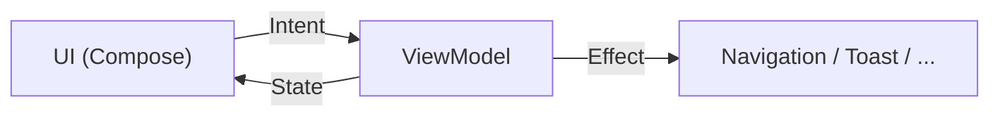

# Pattern MVI
{: .fs-8 }

Model-View-Intent : le pattern d'architecture UI de Redface 2.
{: .fs-5 .fw-300 }

---

## Principe

MVI impose un **flux de données unidirectionnel** (UDF — Unidirectional Data Flow). L'utilisateur émet des Intents, le ViewModel produit un nouveau State, Compose dessine le State.



Trois concepts :

- **State** : l'état complet de l'écran. Immutable. Un seul objet `data class`.
- **Intent** : une action de l'utilisateur. `sealed interface`. Pur, sans logique.
- **Effect** : un événement one-shot (navigation, snackbar, vibration). Ne fait pas partie du state car il ne doit pas être rejoué à la recomposition.

### Note terminologique

Ce que ce document appelle "MVI" est techniquement du **MVVM + UDF** — le pattern recommandé par Google pour Compose. La distinction est principalement terminologique :

- **MVVM classique** : ViewModel expose des `LiveData`/`StateFlow`, la View observe. Le flux peut être bidirectionnel.
- **MVI / MVVM+UDF** : le flux est strictement unidirectionnel. Les actions passent par des Intents (ou Events), le ViewModel produit un nouveau State immutable. C'est ce que fait ce projet.

Le code est le même. On utilise le terme "MVI" dans ce projet par convention, mais un développeur habitué au MVVM Android retrouvera ses repères.

### Méthodologie MVI hybride

 Conformément à la [méthodologie triple-hybride]({{ site.baseurl }}/specs/methodology) (SDD + Prototype + TDD) :

- **Spec les contrats** (types `State`, `Intent`, `Effect`) — c'est le contrat public du ViewModel, utile pour le Screen et les tests. Ces types sont documentés ci-dessous pour chaque écran.
- **TDD les helpers purs** (`matchesFilter`, `comparatorFor`, mappers, reducers déterministes). Red → Green → Refactor, testables isolément.
- **Prototype le Screen Compose**. L'UI émerge du code, pas de la spec — l'exemple complet ci-dessous montre les *patterns* (`send(intent)`, `ObserveAsEvents`, `PullToRefreshBox`) mais la mise en page réelle est itérée à partir de la Phase 1.

Les exemples ViewModel ci-dessous sont **des squelettes illustratifs** — certains détails (timer 5 s, rollback, mutex) sont documentés parce qu'ils encodent des patterns non-triviaux, pas parce qu'ils sont figés dans la pierre.

---

## Écran Drapeaux (accueil)

```kotlin
// ── State ──────────────────────────────────────────
data class FlagsState(
    val flags: List<FlaggedTopic> = emptyList(),
    val filteredFlags: List<FlaggedTopic> = emptyList(),
    val sortMode: SortMode = SortMode.BY_DATE,
    val filter: FlagFilter = FlagFilter.ALL,
    val isLoading: Boolean = false,
    val isRefreshing: Boolean = false,
    val error: String? = null,
)

enum class SortMode { BY_DATE, BY_CATEGORY }
enum class FlagFilter { ALL, CYAN, FAVORITE, READ }

// ── Intents ────────────────────────────────────────
sealed interface FlagsIntent {
    data object Refresh : FlagsIntent
    data class SetSort(val mode: SortMode) : FlagsIntent
    data class SetFilter(val filter: FlagFilter) : FlagsIntent
    data class OpenTopic(val topic: FlaggedTopic) : FlagsIntent
    data class RemoveFlag(val topic: FlaggedTopic) : FlagsIntent
    data class UndoRemoveFlag(val topic: FlaggedTopic) : FlagsIntent
}

// ── Effects ────────────────────────────────────────
sealed interface FlagsEffect {
    data class NavigateToTopic(val cat: Int, val post: Int, val page: Int) : FlagsEffect
    data class ShowUndo(val topic: FlaggedTopic) : FlagsEffect
    data class Error(val message: String) : FlagsEffect
}
```

### ViewModel

```kotlin
@HiltViewModel
class FlagsViewModel @Inject constructor(
    private val flagRepository: FlagRepository,
) : ViewModel() {

    private val _state = MutableStateFlow(FlagsState())
    val state = _state.asStateFlow()

    private val _effects = Channel<FlagsEffect>()
    val effects = _effects.receiveAsFlow()

    init { send(FlagsIntent.Refresh) }

    fun send(intent: FlagsIntent) {
        when (intent) {
            is FlagsIntent.Refresh -> refresh()
            is FlagsIntent.SetSort -> {
                _state.update { it.copy(sortMode = intent.mode) }
                updateFilteredFlags()
            }
            is FlagsIntent.SetFilter -> {
                _state.update { it.copy(filter = intent.filter) }
                updateFilteredFlags()
            }
            is FlagsIntent.OpenTopic -> openTopic(intent.topic)
            is FlagsIntent.RemoveFlag -> removeFlag(intent.topic)
            is FlagsIntent.UndoRemoveFlag -> undoRemoveFlag(intent.topic)
        }
    }

    private fun refresh() {
        viewModelScope.launch {
            _state.update { it.copy(isRefreshing = true) }
            flagRepository.getFlags()
                .onSuccess { flags ->
                    _state.update { it.copy(flags = flags, isRefreshing = false, error = null) }
                    updateFilteredFlags()
                }
                .onFailure { e ->
                    _state.update { it.copy(isRefreshing = false, error = e.message) }
                }
        }
    }

    private fun openTopic(topic: FlaggedTopic) {
        viewModelScope.launch {
            _effects.send(FlagsEffect.NavigateToTopic(topic.cat, topic.postId, topic.lastReadPage))
        }
    }

    // Les Jobs de cancellation du timer "undo" vivent hors StateFlow car ils ne font pas
    // partie de l'état UI observable — seule leur existence est pertinente pour annuler.
    // Équivalent d'une map de transactions en cours (pattern mutex/debounce).
    private val pendingRemovals = mutableMapOf<Int, Job>()

    private fun removeFlag(topic: FlaggedTopic) {
        // 1. Retirer de l'UI immédiatement
        _state.update { it.copy(flags = it.flags - topic) }
        updateFilteredFlags()

        // 2. Lancer un timer avec undo
        val job = viewModelScope.launch {
            _effects.send(FlagsEffect.ShowUndo(topic))
            delay(5_000)

            // 3. Timeout expiré → exécuter côté serveur
            flagRepository.removeFlag(topic)
                .onFailure {
                    // Rollback si le réseau échoue
                    _state.update { it.copy(flags = it.flags + topic) }
                    updateFilteredFlags()
                    _effects.send(FlagsEffect.Error("Impossible de retirer le drapeau"))
                }
        }
        pendingRemovals[topic.postId] = job
    }

    private fun undoRemoveFlag(topic: FlaggedTopic) {
        pendingRemovals.remove(topic.postId)?.cancel()
        _state.update { it.copy(flags = it.flags + topic) }
        updateFilteredFlags()
    }

    private fun updateFilteredFlags() {
        _state.update { state ->
            val filtered = state.flags
                .filter { matchesFilter(it, state.filter) }
                .sortedWith(comparatorFor(state.sortMode))
            state.copy(filteredFlags = filtered)
        }
    }

    // Helpers pure — testables isolément.
    private fun matchesFilter(topic: FlaggedTopic, filter: FlagFilter): Boolean = when (filter) {
        FlagFilter.ALL       -> true
        FlagFilter.CYAN      -> topic.flagType == FlagType.CYAN
        FlagFilter.FAVORITE  -> topic.flagType == FlagType.FAVORITE
        FlagFilter.READ      -> topic.flagType == FlagType.READ
    }

    private fun comparatorFor(mode: SortMode): Comparator<FlaggedTopic> = when (mode) {
        SortMode.BY_DATE     -> compareByDescending { it.lastDate }
        SortMode.BY_CATEGORY -> compareBy<FlaggedTopic> { it.categoryName }
            .thenByDescending { it.lastDate }
    }
}
```

### Screen (Compose)

Le Screen Compose émerge en **Phase 1+ (prototype-first)**, conformément à la [méthodologie hybride](#méthodologie-mvi-hybride). Les patterns invariants qu'il doit respecter :

- Collecter le state via `collectAsStateWithLifecycle()` (pas `collectAsState()` seul)
- Observer les effects via [`ObserveAsEvents`](#utilitaire--observeasevents) (pas `LaunchedEffect` nu — évite la navigation fantôme en arrière-plan)
- Splitter en `<Name>Screen` (stateful, `hiltViewModel()`) et `<Name>Content` (stateless, `@Preview`-able) — voir [Convention](#convention)
- Utiliser les APIs Material 3 actuelles (`PullToRefreshBox`, pas Accompanist `SwipeRefresh` déprécié)

La mise en page concrète (`Column` vs `Scaffold`, composants `FlagsToolbar`, `FlagItem`, etc.) est itérée à partir du code dès Phase 1, pas figée ici.

---

## Écran Topic (lecture)

> **Statut Phase 1 — slice topic fixe** : le `TopicUiState` réellement exposé par `feature/topic/.../TopicUiState.kt` est aujourd'hui `(request: TopicRequest, mode: Mode, availablePages: List<Int>)` avec `Mode = Loading | Loaded(topic) | Error(message) | Placeholder`, et l'unique intent est `Retry`. Le contrat ci-dessous est la **cible Phase 1 fin / Phase 2** quand pagination, edit FP, flag et image viewer arriveront. La forme actuelle vient du fait que le slice fixe charge une fixture HFR via `TopicFixtureRepository` et n'a pas encore de pagination réseau ni d'actions sur posts. Cohérent avec la méthodologie hybride (squelette illustratif, pas figé).

```kotlin
data class TopicUiState(
    val title: String = "",
    val posts: List<Post> = emptyList(),
    val currentPage: Int = 1,
    val totalPages: Int = 1,
    val isLoading: Boolean = false,
    val isFirstPostOwner: Boolean = false,
    val poll: Poll? = null,
    val error: String? = null,
)

sealed interface TopicIntent {
    data class LoadPage(val page: Int) : TopicIntent
    data object NextPage : TopicIntent
    data object PrevPage : TopicIntent
    data object Refresh : TopicIntent
    data class QuotePost(val numreponse: Int) : TopicIntent
    data class EditPost(val numreponse: Int) : TopicIntent
    data object EditFirstPost : TopicIntent
    data class FlagTopic(val type: FlagType) : TopicIntent
    data class OpenImage(val url: String) : TopicIntent
}

sealed interface TopicEffect {
    data class NavigateToReply(val cat: Int, val post: Int, val quote: String?) : TopicEffect
    data class NavigateToEdit(val cat: Int, val post: Int, val numreponse: Int) : TopicEffect
    data class NavigateToEditFirstPost(val cat: Int, val post: Int) : TopicEffect
    data class NavigateToImage(val url: String) : TopicEffect
    data class Error(val message: String) : TopicEffect
}
```

---

## Écran Editor (reply / edit / FP)

L'éditeur est partagé entre reply, edit et edit FP. Le mode détermine les champs visibles.

```kotlin
data class EditorState(
    val mode: EditorMode = EditorMode.Reply,
    val content: String = "",
    val subject: String = "",           // visible en mode EditFirstPost
    val poll: PollData? = null,         // visible en mode EditFirstPost
    val isSending: Boolean = false,
    val preview: PostContent? = null,   // AST de preview issue du BBCode courant, rendu par PostRenderer
    val error: String? = null,
)

enum class EditorMode {
    Reply,           // nouveau message dans un topic existant
    Edit,            // éditer un post existant
    EditFirstPost,   // éditer le first post (sujet + sondage + cat + subcat)
}

// Le mode "création de topic" (NewTopic) n'est pas un EditorMode : c'est un écran distinct
// (`NewTopicScreen`) avec son propre formulaire (sélecteur cat/subcat hiérarchique, sujet
// obligatoire) et son propre ViewModel. Il partage seulement le rendu de preview Compose
// (`PostRenderer` + parser BBCode) avec l'éditeur.

sealed interface EditorIntent {
    data class UpdateContent(val text: String) : EditorIntent
    data class UpdateSubject(val text: String) : EditorIntent
    data class InsertBBCode(val tag: String) : EditorIntent
    data object Preview : EditorIntent
    data object Send : EditorIntent
}
```

---

## Écran Messages

```kotlin
data class MessagesState(
    val activeTab: MessageTab = MessageTab.CLASSIC,
    val classicMPs: List<PrivateMessage> = emptyList(),
    val multiMPs: List<PrivateMessage> = emptyList(),
    val isLoading: Boolean = false,
    val error: String? = null,
)

enum class MessageTab { CLASSIC, MULTI }

sealed interface MessagesIntent {
    data class SwitchTab(val tab: MessageTab) : MessagesIntent
    data object Refresh : MessagesIntent
    data class OpenMP(val mp: PrivateMessage) : MessagesIntent
    data object NewMP : MessagesIntent
    data object NewMultiMP : MessagesIntent
}
```

---

## Convention

Chaque feature suit la même structure de fichiers (source set : `src/main/kotlin/`, cf. [`contributing.md`]({{ site.baseurl }}/guides/contributing#convention-par-feature) pour les règles de nommage détaillées) :

```
feature/topic/src/main/kotlin/fr/forumhfr/redface2/feature/topic/
  ├── TopicScreen.kt        // @Composable, collecte state + effects
  ├── TopicContent.kt       // @Composable stateless, previewable (si extrait)
  ├── TopicViewModel.kt     // MVI ViewModel (Hilt-injected via @HiltViewModel)
  ├── TopicUiState.kt       // État UI + Intents (consolidés tant que court)
  └── TopicRequest.kt       // Paramètre d'entrée du screen (DTO dérivé de TopicRoute)

feature/topic/src/test/kotlin/fr/forumhfr/redface2/feature/topic/
  └── TopicViewModelTest.kt // JUnit 4 + Turbine, fixture-driven
```

La `NavKey` (`TopicRoute`) ne vit **pas** dans le module feature : elle est déclarée côté `:app` dans `app/src/main/kotlin/.../navigation/RedfaceNavigation.kt` sous le sealed interface `RedfaceNavKey`. C'est la convention canonique pour Redface 2 — les routes `@Serializable` sont centralisées dans `:app` pour éviter les dépendances circulaires entre features. Détails dans [`contributing.md`]({{ site.baseurl }}/guides/contributing#convention-par-feature).

Cette convention garantit la cohérence et facilite l'onboarding des contributeurs.

---

## Utilitaire : ObserveAsEvents

Helper lifecycle-aware pour collecter les effects sans les traiter en arrière-plan. Vit dans `:core:ui` et est utilisé par tous les screens.

```kotlin
@Composable
fun <T> ObserveAsEvents(
    flow: Flow<T>,
    onEvent: (T) -> Unit,
) {
    val lifecycleOwner = LocalLifecycleOwner.current
    LaunchedEffect(flow, lifecycleOwner) {
        lifecycleOwner.repeatOnLifecycle(Lifecycle.State.STARTED) {
            flow.collect(onEvent)
        }
    }
}
```

Sans ce helper, les effects émis pendant que l'app est en arrière-plan seraient traités immédiatement (navigation fantôme, snackbars invisibles). `repeatOnLifecycle(STARTED)` garantit que les effects ne sont consommés que quand l'écran est au premier plan.
