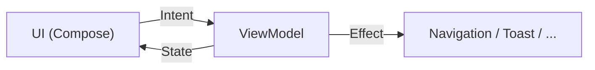

# Pattern MVI
{: .fs-8 }

Model-View-Intent : le pattern d'architecture UI de Redface 2.
{: .fs-5 .fw-300 }

---

## Principe

MVI impose un **flux de données unidirectionnel** (UDF — Unidirectional Data Flow). L'utilisateur émet des Intents, le ViewModel produit un nouveau State, Compose dessine le State.


```mermaid
graph LR
    A["UI (Compose)"] -->|"Intent"| B["ViewModel"]
    B -->|"State"| A
    B -->|"Effect"| C["Navigation / Toast / ..."]
```

Trois concepts :

- **State** : l'état complet de l'écran. Immutable. Un seul objet `data class`.
- **Intent** : une action de l'utilisateur. `sealed interface`. Pur, sans logique.
- **Effect** : un événement one-shot (navigation, snackbar, vibration). Ne fait pas partie du state car il ne doit pas être rejoué à la recomposition.

### Note terminologique

Ce que ce document appelle "MVI" est techniquement du **MVVM + UDF** — le pattern recommandé par Google pour Compose. La distinction est principalement terminologique :

- **MVVM classique** : ViewModel expose des `LiveData`/`StateFlow`, la View observe. Le flux peut être bidirectionnel.
- **MVI / MVVM+UDF** : le flux est strictement unidirectionnel. Les actions passent par des Intents (ou Events), le ViewModel produit un nouveau State immutable. C'est ce que fait ce projet.

Le code est le même. On utilise le terme "MVI" dans ce projet par convention, mais un développeur habitué au MVVM Android retrouvera ses repères.

### Méthodologie MVI hybride

 Conformément à la [méthodologie triple-hybride]({{ site.baseurl }}/specs/methodology) (SDD + Prototype + TDD) :

- **Spec les contrats** (types `State`, `Intent`, `Effect`) — c'est le contrat public du ViewModel, utile pour le Screen et les tests. Ces types sont documentés ci-dessous pour chaque écran.
- **TDD les helpers purs** (`matchesFilter`, `comparatorFor`, mappers, reducers déterministes). Red → Green → Refactor, testables isolément.
- **Prototype le Screen Compose**. L'UI émerge du code, pas de la spec — l'exemple complet ci-dessous montre les *patterns* (`send(intent)`, `ObserveAsEvents`, `PullToRefreshBox`) mais la mise en page réelle est itérée à partir de la Phase 1.

Les exemples ViewModel ci-dessous sont **des squelettes illustratifs** — certains détails (timer 5 s, rollback, mutex) sont documentés parce qu'ils encodent des patterns non-triviaux, pas parce qu'ils sont figés dans la pierre.

---

## Écran Drapeaux (accueil)

> **Statut Phase 1B.4 → 1B.5 livré** : le `FlagsViewModel` réel expose plusieurs `StateFlow` séparés (auth, MP, onglet courant, liste de drapeaux du tab) plutôt qu'un seul `FlagsState` agrégé, et un nombre limité d'actions (`selectTab`, `refresh`, `logout`). Pas de tri, pas de filtre, pas de `RemoveFlag`/`UndoRemoveFlag`, pas de pull-to-refresh : ces capacités sont **hors scope Phase 1B** et arriveront au plus tôt en Phase 1D / Phase 2 quand un cas d'usage le justifie. Un bouton « Actualiser » force néanmoins un fetch réseau explicite sur l'onglet courant, pour éviter que le cache mémoire de session ne bloque le dogfood. Le squelette illustratif Phase 1+ ci-dessous a été remplacé par la forme actuellement shippée.

### ViewModel — forme livrée

```kotlin
@HiltViewModel
class FlagsViewModel @Inject constructor(
    authRepository: AuthRepository,
    private val flagRepository: FlagRepository,
    messagesRepository: MessagesRepository,
) : ViewModel() {

    private var observedPseudo: String? = null

    private val _selectedTab = MutableStateFlow(FlagType.CYAN)
    val selectedTab: StateFlow<FlagType> = _selectedTab.asStateFlow()

    val authState: StateFlow<AuthState?> =
        authRepository.observeAuthState()
            .stateIn(viewModelScope, SharingStarted.Eagerly, initialValue = null)

    val unreadMpCount: StateFlow<Int?> =
        messagesRepository.observeUnreadMpCount()
            .stateIn(viewModelScope, SharingStarted.Eagerly, initialValue = null)

    @OptIn(ExperimentalCoroutinesApi::class)
    val flagsState: StateFlow<FlagsResult?> = authState
        .onEach(::clearFlagsCacheIfSessionChanged)
        .flatMapLatest { state ->
            when (state) {
                null, AuthState.Anonymous -> flowOf(null)
                is AuthState.Authenticated -> selectedTab.flatMapLatest { type ->
                    // The .map { it as FlagsResult? } upcast is required so the `when`
                    // branches share a common type — `flowOf(null)` is `Flow<Nothing?>`,
                    // and stateIn needs the upstream `Flow<FlagsResult?>`.
                    flagRepository.observe(type).map { it as FlagsResult? }
                }
            }
        }
        .stateIn(viewModelScope, SharingStarted.Eagerly, initialValue = null)

    fun selectTab(type: FlagType) { _selectedTab.value = type }

    fun refresh() {
        viewModelScope.launch { flagRepository.refresh(_selectedTab.value) }
    }

    fun logout() {
        viewModelScope.launch {
            flagRepository.clearSessionCache()
            authRepository.logout()
        }
    }

    private fun clearFlagsCacheIfSessionChanged(state: AuthState?) {
        when (state) {
            null -> Unit
            AuthState.Anonymous -> {
                observedPseudo = null
                flagRepository.clearSessionCache()
            }
            is AuthState.Authenticated -> {
                if (observedPseudo != state.pseudo) {
                    flagRepository.clearSessionCache()
                }
                observedPseudo = state.pseudo
            }
        }
    }
}
```

`FlagRepository` est livrée comme un contrat à deux verbes (cf. `core/domain/.../FlagRepository.kt`) :

```kotlin
interface FlagRepository {
    fun observe(type: FlagType): Flow<FlagsResult>
    suspend fun refresh(type: FlagType)
    fun clearSessionCache()
}

sealed class FlagsResult {
    data object Loading : FlagsResult()
    data class Success(val flags: List<Flag>) : FlagsResult()
    data class Failure(val cause: Throwable) : FlagsResult()
}
```

Les noms de champs (`Flag.cat`, `Flag.topicId`, `Flag.type`, `Flag.replyCount`, `Flag.totalPages`, `Flag.lastReadPage`, …) suivent strictement [`models.md`]({{ site.baseurl }}/specs/models#drapeaux). Pas de `topic.postId` ni `topic.flagType` ni `topic.lastDate` — ces noms n'existent pas dans le modèle.

### Cible future (Phase 1D / Phase 2)

Quand le besoin arrive, on pourra élargir le contrat :

- ajout d'intents `RemoveFlag` / `UndoRemoveFlag` (avec timer `delay(5_000)` + rollback réseau, pattern documenté dans `:feature:topic`),
- pré-calcul UI `filteredFlags` derived avec un `SortMode` / `FlagFilter`,
- `PullToRefreshBox` Material 3 sur le `LazyColumn` (l'API Phase 1B se contente d'un bouton « Réessayer » sur état d'erreur).

Quand cette extension arrive, `FlagsState` agrégé peut redevenir préférable au triplet de `StateFlow` actuel ; ce sera un changement scope au moment du chantier, documenté ici à ce moment-là — pas avant.

### Screen (Compose) — forme livrée

`feature/flags/src/main/kotlin/.../FlagsRoute.kt` est l'entrée stateful (récupère `FlagsViewModel` via `hiltViewModel()`, collecte ses `StateFlow` via `collectAsStateWithLifecycle()`). Le footer (auth, MP unread, version, bouton signalement, logout) et l'écran lui-même (3 onglets, liste, retry) cohabitent dans le même composable parce que la surface utile reste petite Phase 1B. Le découpage `<Name>Screen` / `<Name>Content` reste l'objectif quand la complexité justifie le coût (filtre, tri, undo) — cf. cible Phase 1D.

---

## Écran Topic (lecture)

> **Statut Phase 1A** : le `TopicUiState` réellement exposé par `feature/topic/.../TopicUiState.kt` est aujourd'hui `(request: TopicRequest, mode: Mode, availablePages: List<Int>)` avec `Mode = Loading | Loaded(topic) | Error(message)`, et l'unique intent est `Retry`. Le ViewModel collecte `TopicRepository.observeTopicPage(...)` (cache-aside : émet le cache puis le fresh) et calcule `availablePages = (1..topic.totalPages).toList()` à chaque émission. Le contrat ci-dessous est la **cible Phase 1 fin / Phase 2** quand pull-to-refresh, edit FP, flag et image viewer arriveront. La forme actuelle reflète qu'il n'y a pas encore d'actions sur posts ni de pagination explicite — cohérent avec la méthodologie hybride (squelette illustratif, pas figé).
>
> **Statut Phase 1D-2 (#107)** : seul `TopicEffect.ScrollToPost` est livré ; il pilote le scroll one-shot vers un `numreponse` quand un deep link arrive avec `?scrollTo=N`. Les autres effets listés ci-dessous (`NavigateToReply`, `NavigateToEdit`, `NavigateToEditFirstPost`, `NavigateToImage`, `Error`) restent du **contrat cible Phase 2** — ils ne sont ni émis ni câblés tant que les actions correspondantes (réponse, édition, viewer image, surface d'erreur) n'arrivent pas.

```kotlin
data class TopicUiState(
    val title: String = "",
    val posts: List<Post> = emptyList(),
    val currentPage: Int = 1,
    val totalPages: Int = 1,
    val isLoading: Boolean = false,
    val isFirstPostOwner: Boolean = false,
    val poll: Poll? = null,
    val error: String? = null,
)

sealed interface TopicIntent {
    data class LoadPage(val page: Int) : TopicIntent
    data object NextPage : TopicIntent
    data object PrevPage : TopicIntent
    data object Refresh : TopicIntent
    data class QuotePost(val numreponse: Int) : TopicIntent
    data class EditPost(val numreponse: Int) : TopicIntent
    data object EditFirstPost : TopicIntent
    data class FlagTopic(val type: FlagType) : TopicIntent
    data class OpenImage(val url: String) : TopicIntent
}

sealed interface TopicEffect {
    /** Phase 1D-2 (#107) — one-shot scroll demand consumed by `LaunchedEffect(Unit)`. */
    data class ScrollToPost(val numreponse: Int) : TopicEffect
    data class NavigateToReply(val cat: Int, val post: Int, val quote: String?) : TopicEffect
    data class NavigateToEdit(val cat: Int, val post: Int, val numreponse: Int) : TopicEffect
    data class NavigateToEditFirstPost(val cat: Int, val post: Int) : TopicEffect
    data class NavigateToImage(val url: String) : TopicEffect
    data class Error(val message: String) : TopicEffect
}
```

---

## Écran Editor (reply / edit / FP)

L'éditeur est partagé entre reply, edit et edit FP. Le mode détermine les champs visibles.

```kotlin
data class EditorState(
    val mode: EditorMode = EditorMode.Reply,
    val content: String = "",
    val subject: String = "",           // visible en mode EditFirstPost
    val poll: PollData? = null,         // visible en mode EditFirstPost
    val isSending: Boolean = false,
    val preview: PostContent? = null,   // AST de preview issue du BBCode courant, rendu par PostRenderer
    val error: String? = null,
)

enum class EditorMode {
    Reply,           // nouveau message dans un topic existant
    Edit,            // éditer un post existant
    EditFirstPost,   // éditer le first post (sujet + sondage + cat + subcat)
}

sealed interface EditorIntent {
    data class UpdateContent(val text: String) : EditorIntent
    data class UpdateSubject(val text: String) : EditorIntent
    data class InsertBBCode(val tag: String) : EditorIntent
    data object Preview : EditorIntent
    data object Send : EditorIntent
}
```

> **Statut Phase 1 — placeholder, pas une décision figée** : l'enum `EditorMode` actuelle (3 valeurs, pas de `NewTopic`) vient du bootstrap navigation Phase 0 (commit `66e242c`, par GPT-5 Codex). C'était un état de code minimal pour faire compiler le graphe de routes et naviguer entre placeholders, **pas un arbitrage produit**. Aucune action de création de topic, d'édition, de reply ou d'édition FP n'est encore implémentée — l'`EditorScreen` reste un placeholder.
>
> **Décision Phase 2 — découpage en deux écrans** ([#86](https://github.com/ForumHFR/redface2/issues/86)) : quand l'éditeur réel arrivera, il sera découpé par **famille métier** plutôt que par mode unique :
>
> ```kotlin
> // Post-level editor — édition de niveau post (contenu BBCode seulement)
> enum class PostEditorMode { Reply, Edit }
>
> // Topic-level editor — édition de niveau topic (sujet + cat/subcat + contenu + sondage)
> enum class TopicFormMode { New, EditFirstPost }
> ```
>
> Les deux écrans partagent leurs **capacités** via composables `:core:ui` (`BBCodeToolbar`, `BBCodePreview`, `PollEditor`, `CatSubcatPicker`) et use cases `:core:domain` (`validateBbcode`). `BBCodePreview` reçoit un `PostContent` déjà parsé (ou une lambda `() -> PostContent`) — il **ne parse pas lui-même**, ce qui garde `:core:ui` libre de toute logique métier. Le parsing BBCode reste une responsabilité `:core:parser` (`parsePostContentFromBbcode`) exposée aux features via une interface/use case injectée, afin de préserver la frontière `:feature:*` → `:core:domain` + `:core:ui` (les ViewModels appellent le use case et passent le `PostContent` résultant à `BBCodePreview`). Pas de duplication, juste deux contrats de formulaire distincts. Rationale : l'endpoint HFR n'est pas une bonne frontière UI (`Reply` et `NewTopic` passent tous deux par `bddpost.php` mais leurs formulaires diffèrent ; `EditFirstPost` et `NewTopic` partagent presque toute la structure malgré des endpoints différents). La frontière utile est **post-level** vs **topic-level**.
>
> Cette section sera révisée quand l'éditeur Phase 2 sera prototypé — c'est cohérent avec la méthodologie hybride (prototype-first sur l'UI). Voir [#86](https://github.com/ForumHFR/redface2/issues/86) pour le suivi.

---

## Écran Messages

```kotlin
data class MessagesState(
    val activeTab: MessageTab = MessageTab.CLASSIC,
    val classicMPs: List<PrivateMessage> = emptyList(),
    val multiMPs: List<PrivateMessage> = emptyList(),
    val isLoading: Boolean = false,
    val error: String? = null,
)

enum class MessageTab { CLASSIC, MULTI }

sealed interface MessagesIntent {
    data class SwitchTab(val tab: MessageTab) : MessagesIntent
    data object Refresh : MessagesIntent
    data class OpenMP(val mp: PrivateMessage) : MessagesIntent
    data object NewMP : MessagesIntent
    data object NewMultiMP : MessagesIntent
}
```

---

## Convention

Chaque feature suit la même structure de fichiers (source set : `src/main/kotlin/`, cf. [`contributing.md`]({{ site.baseurl }}/guides/contributing#convention-par-feature) pour les règles de nommage détaillées) :

```
feature/topic/src/main/kotlin/fr/forumhfr/redface2/feature/topic/
  ├── TopicScreen.kt        // @Composable, collecte state + effects
  ├── TopicContent.kt       // @Composable stateless, previewable (si extrait)
  ├── TopicViewModel.kt     // MVI ViewModel (Hilt-injected via @HiltViewModel)
  ├── TopicUiState.kt       // État UI + Intents (consolidés tant que court)
  └── TopicRequest.kt       // Paramètre d'entrée du screen (DTO dérivé de TopicRoute)

feature/topic/src/test/kotlin/fr/forumhfr/redface2/feature/topic/
  └── TopicViewModelTest.kt // JUnit 4 + Turbine, fixture-driven
```

La `NavKey` (`TopicRoute`) ne vit **pas** dans le module feature : elle est déclarée côté `:app` dans `app/src/main/kotlin/.../navigation/RedfaceNavigation.kt` sous le sealed interface `RedfaceNavKey`. C'est la convention canonique pour Redface 2 — les routes `@Serializable` sont centralisées dans `:app` pour éviter les dépendances circulaires entre features. Détails dans [`contributing.md`]({{ site.baseurl }}/guides/contributing#convention-par-feature).

Cette convention garantit la cohérence et facilite l'onboarding des contributeurs.

---

## Utilitaire : ObserveAsEvents

Helper lifecycle-aware pour collecter les effects sans les traiter en arrière-plan. Vit dans `:core:ui` et est utilisé par tous les screens.

```kotlin
@Composable
fun <T> ObserveAsEvents(
    flow: Flow<T>,
    onEvent: (T) -> Unit,
) {
    val lifecycleOwner = LocalLifecycleOwner.current
    LaunchedEffect(flow, lifecycleOwner) {
        lifecycleOwner.repeatOnLifecycle(Lifecycle.State.STARTED) {
            flow.collect(onEvent)
        }
    }
}
```

Sans ce helper, les effects émis pendant que l'app est en arrière-plan seraient traités immédiatement (navigation fantôme, snackbars invisibles). `repeatOnLifecycle(STARTED)` garantit que les effects ne sont consommés que quand l'écran est au premier plan.
