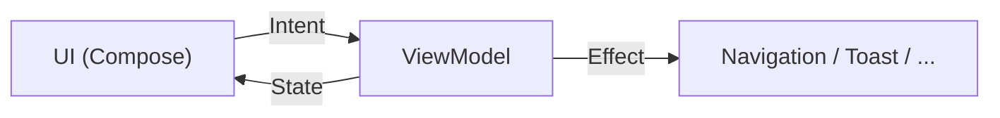

# Pattern MVI
{: .fs-8 }

Model-View-Intent : le pattern d'architecture UI de Redface 2.
{: .fs-5 .fw-300 }

---

## Principe

MVI impose un **flux de données unidirectionnel** (UDF — Unidirectional Data Flow). L'utilisateur émet des Intents, le ViewModel produit un nouveau State, Compose dessine le State.


```mermaid
graph LR
    A["UI (Compose)"] -->|"Intent"| B["ViewModel"]
    B -->|"State"| A
    B -->|"Effect"| C["Navigation / Toast / ..."]
```

Trois concepts :

- **State** : l'état complet de l'écran. Immutable. Un seul objet `data class`.
- **Intent** : une action de l'utilisateur. `sealed interface`. Pur, sans logique.
- **Effect** : un événement one-shot (navigation, snackbar, vibration). Ne fait pas partie du state car il ne doit pas être rejoué à la recomposition.

### Note terminologique

Ce que ce document appelle "MVI" est techniquement du **MVVM + UDF** — le pattern recommandé par Google pour Compose. La distinction est principalement terminologique :

- **MVVM classique** : ViewModel expose des `LiveData`/`StateFlow`, la View observe. Le flux peut être bidirectionnel.
- **MVI / MVVM+UDF** : le flux est strictement unidirectionnel. Les actions passent par des Intents (ou Events), le ViewModel produit un nouveau State immutable. C'est ce que fait ce projet.

Le code est le même. On utilise le terme "MVI" dans ce projet par convention, mais un développeur habitué au MVVM Android retrouvera ses repères.

### Méthodologie MVI hybride

 Conformément à la [méthodologie triple-hybride]({{ site.baseurl }}/specs/methodology) (SDD + Prototype + TDD) :

- **Spec les contrats** (types `State`, `Intent`, `Effect`) — c'est le contrat public du ViewModel, utile pour le Screen et les tests. Ces types sont documentés ci-dessous pour chaque écran.
- **TDD les helpers purs** (`matchesFilter`, `comparatorFor`, mappers, reducers déterministes). Red → Green → Refactor, testables isolément.
- **Prototype le Screen Compose**. L'UI émerge du code, pas de la spec — l'exemple complet ci-dessous montre les *patterns* (`send(intent)`, `ObserveAsEvents`, `PullToRefreshBox`) mais la mise en page réelle est itérée à partir de la Phase 1.

Les exemples ViewModel ci-dessous sont **des squelettes illustratifs** — certains détails (timer 5 s, rollback, mutex) sont documentés parce qu'ils encodent des patterns non-triviaux, pas parce qu'ils sont figés dans la pierre.

---

## Écran Drapeaux (accueil)

> **Statut Phase 2 finish livré** : le `FlagsViewModel` réel expose plusieurs `StateFlow` séparés (auth, onglet courant `FlagTab`, liste de drapeaux du tab, `isRefreshing`, `removeFlagState`/`removeFlagEvent`) plutôt qu'un seul `FlagsState` agrégé. Onglets via `FlagTab` (Cyan/Red/Favorite + **Super**, placeholder « super favoris » sans backend, `flagType == null`). Le filtre CYAN « afficher les cyans déjà lus » se pilote par **re-tap de l'onglet Cyan** (le `FilterChip` a été retiré). Le **retrait d'un drapeau** (#99, `delflag.php`, confirmation + pas d'undo optimiste) est livré. Le **pull-to-refresh** (`PullToRefreshBox` M3) a remplacé le bouton « Actualiser ». `logout()` ne vit plus ici (déplacé dans `AppAccountViewModel`, #198). Le squelette illustratif ci-dessous reflète la forme shippée.

### ViewModel — forme livrée

```kotlin
@OptIn(ExperimentalCoroutinesApi::class)
@HiltViewModel
class FlagsViewModel @Inject constructor(
    private val authRepository: AuthRepository,
    private val flagRepository: FlagRepository,
) : ViewModel() {

    private var observedPseudo: String? = null

    // Phase 2 finish — 4 onglets via FlagTab (Cyan/Red/Favorite/Super). FlagTab.flagType est
    // nullable : Super est un placeholder « super favoris à venir » sans backend (flagType == null
    // → aucun fetch). Les 3 autres mappent vers FlagType.
    private val _selectedTab = MutableStateFlow<FlagTab>(FlagTab.Cyan)
    val selectedTab: StateFlow<FlagTab> = _selectedTab.asStateFlow()

    // CYAN-only client filter (default hides `hasUnread = false`). Le toggle est déclenché par un
    // re-tap de l'onglet Cyan déjà sélectionné (le FilterChip a été retiré).
    private val _showReadParticipatedTopics = MutableStateFlow(false)
    val showReadParticipatedTopics: StateFlow<Boolean> = _showReadParticipatedTopics.asStateFlow()

    // Anchored over the existing list during the user-driven pull-to-refresh round-trip
    // (Material 3 PullToRefreshBox a remplacé le bouton « Actualiser »). Même pattern que ForumViewModel.
    private val _isRefreshing = MutableStateFlow(false)
    val isRefreshing: StateFlow<Boolean> = _isRefreshing.asStateFlow()

    // #99 — retrait d'un drapeau : confirmation (RemoveFlagState Idle/Confirming/Removing) +
    // évènement one-shot (RemoveFlagEvent Success/Failure) consommé par l'écran pour un snackbar.
    val removeFlagState: StateFlow<RemoveFlagState> // = _removeFlagState.asStateFlow()
    val removeFlagEvent: StateFlow<RemoveFlagEvent?> // = _removeFlagEvent.asStateFlow()

    val authState: StateFlow<AuthState?> =
        authRepository.observeAuthState()
            .stateIn(viewModelScope, SharingStarted.Eagerly, initialValue = null)

    val flagsState: StateFlow<FlagsResult?> = authState
        .onEach(::clearFlagsCacheIfSessionChanged)
        .flatMapLatest { state ->
            when (state) {
                null, AuthState.Anonymous -> flowOf<FlagsResult?>(null)
                is AuthState.Authenticated -> selectedTab.flatMapLatest { tab ->
                    when (val type = tab.flagType) {
                        null -> flowOf<FlagsResult?>(null) // Super placeholder : pas de fetch
                        else -> combine(
                            flagRepository.observe(type),
                            _showReadParticipatedTopics,
                        ) { result, showRead -> filterReadParticipatedIfNeeded(result, type, showRead) }
                    }
                }
            }
        }
        .stateIn(viewModelScope, SharingStarted.Eagerly, initialValue = null)

    // Re-tap Cyan déjà sélectionné → toggle du filtre via le setter (point de mutation unique).
    fun selectTab(tab: FlagTab) {
        if (tab == FlagTab.Cyan && _selectedTab.value == FlagTab.Cyan) {
            setShowReadParticipatedTopics(!_showReadParticipatedTopics.value)
            return
        }
        _selectedTab.value = tab
    }
    fun setShowReadParticipatedTopics(value: Boolean) { _showReadParticipatedTopics.value = value }

    fun refresh() { // no-op sur Super (flagType == null)
        val type = _selectedTab.value.flagType ?: return
        viewModelScope.launch {
            _isRefreshing.value = true
            try { flagRepository.refresh(type) } finally { _isRefreshing.value = false }
        }
    }

    // requestRemoveFlag(flag) → Confirming ; confirmRemoveFlag() → Removing → flagRepository.removeFlag
    // → one-shot event ; consumeRemoveFlagEvent() après affichage du snackbar.
    // NB : logout() ne vit plus ici — déplacé dans AppAccountViewModel (#198, menu compte global).

    private fun filterReadParticipatedIfNeeded(
        result: FlagsResult,
        type: FlagType,
        showReadParticipated: Boolean,
    ): FlagsResult {
        if (type != FlagType.CYAN || showReadParticipated) return result
        return when (result) {
            is FlagsResult.Success -> result.copy(flags = result.flags.filter { it.hasUnread })
            else -> result
        }
    }

    private fun clearFlagsCacheIfSessionChanged(state: AuthState?) {
        when (state) {
            null -> Unit
            AuthState.Anonymous -> {
                observedPseudo = null
                flagRepository.clearSessionCache()
            }
            is AuthState.Authenticated -> {
                if (observedPseudo != state.pseudo) {
                    flagRepository.clearSessionCache()
                }
                observedPseudo = state.pseudo
            }
        }
    }
}
```

> **Polish #154 → #198** — `MessagesRepository` n'est plus injectée dans `FlagsViewModel` : l'ancien `unreadMpCount` était surfacé dans le footer Drapeaux mais ce footer (pseudo, logout, version, signalement, Diagnostics) est passé par `MessagesScreen` (#154) avant d'être hoisté en Phase 2 finish (#198) dans le menu compte global (`RedfaceAccountMenu`, alimenté par `AppAccountViewModel`) accessible depuis chaque écran principal. Le compteur MP reviendra à côté de la liste réelle des MPs, pas en tant qu'overlay temporaire.

`FlagRepository` est livrée comme un contrat à deux verbes (cf. `core/domain/.../FlagRepository.kt`) :

```kotlin
interface FlagRepository {
    fun observe(type: FlagType): Flow<FlagsResult>
    suspend fun refresh(type: FlagType)
    fun clearSessionCache()
}

sealed class FlagsResult {
    data object Loading : FlagsResult()
    data class Success(val flags: List<Flag>) : FlagsResult()
    data class Failure(val cause: Throwable) : FlagsResult()
}
```

Les noms de champs (`Flag.cat`, `Flag.topicId`, `Flag.type`, `Flag.replyCount`, `Flag.totalPages`, `Flag.lastReadPage`, …) suivent strictement [`models.md`]({{ site.baseurl }}/specs/models#drapeaux). Pas de `topic.postId` ni `topic.flagType` ni `topic.lastDate` — ces noms n'existent pas dans le modèle.

### Cible future (Phase 1D / Phase 2)

Quand le besoin arrive, on pourra élargir le contrat :

- ajout d'intents `RemoveFlag` / `UndoRemoveFlag` (avec timer `delay(5_000)` + rollback réseau, pattern documenté dans `:feature:topic`),
- pré-calcul UI `filteredFlags` derived avec un `SortMode` / `FlagFilter`,
- `PullToRefreshBox` Material 3 sur le `LazyColumn` (l'API Phase 1B se contente d'un bouton « Réessayer » sur état d'erreur).

Quand cette extension arrive, `FlagsState` agrégé peut redevenir préférable au triplet de `StateFlow` actuel ; ce sera un changement scope au moment du chantier, documenté ici à ce moment-là — pas avant.

### Screen (Compose) — forme livrée

`feature/flags/src/main/kotlin/.../FlagsRoute.kt` est l'entrée stateful (récupère `FlagsViewModel` via `hiltViewModel()`, collecte ses `StateFlow` via `collectAsStateWithLifecycle()`). Depuis le polish #154 et la refonte Phase 2 finish, `FlagsRoute` se concentre sur la liste : 4 onglets (Cyan / Lu / Favoris / **Super** placeholder), toggle « afficher les sujets participés déjà lus » (CYAN, via re-tap de l'onglet), pull-to-refresh `PullToRefreshBox` (plus de bouton Actualiser), retrait d'un drapeau par **swipe-to-remove** (`SwipeToDismissBox` M3, swipe end-to-start) qui ouvre le dialog de confirmation (#99) — le swipe ne supprime jamais la ligne seul (la ligne est ramenée à `Settled` via `reset()`, la suppression réelle n'a lieu qu'après confirmation, quand le repo évince l'item du cache), branche login si anonyme, branche reconnect si `SessionExpiredException`. Pas de footer alpha — les actions compte (pseudo / logout) et outils (Diagnostics, signalement, version) vivent depuis #198 dans le menu compte global injecté via `topBarActions: @Composable (() -> Unit)? = null`. Le découpage `<Name>Screen` / `<Name>Content` reste l'objectif quand la complexité justifie le coût (filtre, tri, undo) — cf. cible Phase 2.

---

## Écran Topic (lecture)

> **Statut Phase 1A** : le `TopicUiState` réellement exposé par `feature/topic/.../TopicUiState.kt` est aujourd'hui `(request: TopicRequest, mode: Mode, availablePages: List<Int>)` avec `Mode = Loading | Loaded(topic) | Error(message)`, et l'unique intent est `Retry`. Le ViewModel collecte `TopicRepository.observeTopicPage(...)` (cache-aside : émet le cache puis le fresh) et calcule `availablePages = (1..topic.totalPages).toList()` à chaque émission. Le contrat ci-dessous est la **cible Phase 1 fin / Phase 2** quand pull-to-refresh, edit FP, flag et image viewer arriveront. La navigation de page est désormais **route-driven** (le swipe gauche/droite #282 et les contrôles de pager appellent tous `onOpenPage(targetPage)`, qui remplace la `TopicRoute` courante — ce n'est pas un intent du `TopicUiState`) ; les actions sur posts (réponse, édition, viewer image) restent la cible Phase 2. Cohérent avec la méthodologie hybride (squelette illustratif, pas figé).
>
> **Statut Phase 1D-2 (#107) + Phase 2 (#200)** : `TopicEffect.ScrollToPost` (deep link + post-submit avec numreponse extrait) et `TopicEffect.ScrollToEndOfPage` + `TopicEffect.PostSubmitRefreshFailed` (post-submit, cf. #200) sont livrés. `ScrollToPost` pilote le scroll one-shot vers un `numreponse` connu ; `ScrollToEndOfPage` est émis pour la plain reply (HFR anchor `#bas`, numreponse non extractible) afin que l'utilisateur voie son post en bas de la page rafraîchie ; `PostSubmitRefreshFailed` est émis quand le force-refresh post-submit a échoué et que la screen doit prévenir l'utilisateur (Toast côté `TopicScreen`) que la soumission est partie côté HFR mais que la page locale n'a pas pu être rafraîchie. Les autres effets listés ci-dessous (`NavigateToReply`, `NavigateToEdit`, `NavigateToEditFirstPost`, `NavigateToImage`, `Error`) restent du **contrat cible Phase 2** — ils ne sont ni émis ni câblés tant que les actions correspondantes (réponse, édition, viewer image, surface d'erreur) n'arrivent pas.

```kotlin
data class TopicUiState(
    val title: String = "",
    val posts: List<Post> = emptyList(),
    val currentPage: Int = 1,
    val totalPages: Int = 1,
    val isLoading: Boolean = false,
    val isFirstPostOwner: Boolean = false,
    val poll: Poll? = null,
    val error: String? = null,
)

sealed interface TopicIntent {
    data class LoadPage(val page: Int) : TopicIntent
    data object NextPage : TopicIntent
    data object PrevPage : TopicIntent
    data object Refresh : TopicIntent
    data class QuotePost(val numreponse: Int) : TopicIntent
    data class EditPost(val numreponse: Int) : TopicIntent
    data object EditFirstPost : TopicIntent
    data class FlagTopic(val type: FlagType) : TopicIntent
    data class OpenImage(val url: String) : TopicIntent
}

sealed interface TopicEffect {
    /** Phase 1D-2 (#107) — one-shot scroll demand consumed by `LaunchedEffect(Unit)`. */
    data class ScrollToPost(val numreponse: Int) : TopicEffect
    /** Phase 2 (#200) — scroll to the last post on the force-refreshed page when HFR anchored `#bas`. */
    data object ScrollToEndOfPage : TopicEffect
    /** Phase 2 (#200) — Toast trigger when the post-submit force refresh failed but HFR accepted the post. */
    data object PostSubmitRefreshFailed : TopicEffect
    data class NavigateToReply(val cat: Int, val post: Int, val quote: String?) : TopicEffect
    data class NavigateToEdit(val cat: Int, val post: Int, val numreponse: Int) : TopicEffect
    data class NavigateToEditFirstPost(val cat: Int, val post: Int) : TopicEffect
    data class NavigateToImage(val url: String) : TopicEffect
    data class Error(val message: String) : TopicEffect
}
```

---

## Écran Editor (post-level reply / edit) + formulaire de topic

Phase 2B-A (#86 + #144) a séparé l'éditeur en **deux familles** plutôt qu'en un mode unique. Phase 2C ajoute les deux mutations HFR principales : le submit reply (#145, via `bddpost.php`) et la quote MVP (#146, même endpoint POST mais GET form via `numrep={cited}&ref={N}`). Phase 2D ajoute deux écrans complémentaires : `PostEditorMode.Edit` (#147) édite un post arbitraire via `message.php?…&numreponse={N}` + POST `bdd.php` ; `TopicFormMode.EditFirstPost` (#148) édite le premier post d'un topic, exposant en plus `sujet` et `subcat` (le formulaire topic-level vit dans `TopicFormScreen`). Phase 2E (#149) ajoute la **création** d'un nouveau topic via `TopicFormMode.New` : FAB sur `ForumCategoryScreen` (visible en `AuthState.Authenticated` uniquement), composer `TopicFormScreen` mode `New` (sujet + dropdown sous-catégorie obligatoire + BBCode), POST `bddpost.php`. Le sondage à la création reste hors scope tant qu'une fixture POST sondage n'a pas été capturée.

```kotlin
// Post-level editor — édition de niveau post (contenu BBCode seulement)
enum class PostEditorMode { Reply, Edit }

// Topic-level form — sujet + cat/subcat + contenu + sondage
enum class TopicFormMode { New, EditFirstPost }

data class PostEditorState(
    val mode: PostEditorMode,
    val cat: Int,
    val topicId: Int?,
    val numreponse: Int?,
    val page: Int?,                       // (Phase 2C) page topic en cours
    val subcat: Int?,                     // (Phase 2C) sous-cat HFR, requis pour reply
    val quotedNumreponse: Int? = null,    // (Phase 2C #146) numreponse cité ; null = reply, non-null = quote
    val quoteRef: Int? = null,            // (Phase 2C #146/#227) ref opaque parsé depuis le href quote quand disponible ; null accepté sur quote obfusquée
    val draft: TextFieldValue = TextFieldValue(),
    val preview: PostContent = PostContent(blocks = emptyList()),
    val isPreviewVisible: Boolean = false,
    val validation: BbcodeValidation = BbcodeValidation.Idle,
    val isLoadingForm: Boolean = false,   // GET message.php avant submit
    val isSubmitting: Boolean = false,    // POST bddpost.php (reply/quote) ou bdd.php (edit) en cours
    val submitError: SubmitError? = null,
    val draftHydratedFromForm: Boolean = false, // (Phase 2C #146) draft initialisé une fois depuis ReplyForm.initialContent
)

sealed interface PostEditorIntent {
    data class ContentChanged(val value: TextFieldValue) : PostEditorIntent
    data class ToolbarActionClicked(val action: BbcodeAction) : PostEditorIntent
    data object TogglePreview : PostEditorIntent
    data object SubmitClicked : PostEditorIntent       // Phase 2C (Reply / Quote) + Phase 2D (Edit)
    data object ErrorDismissed : PostEditorIntent      // (Phase 2C)
}

// Effets one-shot bypassant le state (jamais rejoués sur recomposition)
sealed interface PostEditorEffect {
    data class SubmitSucceeded(val targetPage: Int?) : PostEditorEffect
}
```

> **Statut Phase 2C+2D+2E — Reply + Quote + Edit post + Edit FP + Create topic MVP livrés** : deux ViewModels coexistent — `PostEditorViewModel` (post-level : Reply via `ReplyRepository`, Edit post via `EditPostRepository`) et `TopicFormViewModel` (topic-level : Edit FP + Create via `TopicFormRepository`). Côté Create (#149) : `init` route sur `loadNewTopicFormIfPossible()`, `canSubmit` mode-aware, `subjectHydratedFromServer` + `draftHydratedFromServer` initialisés à `true` dès l'init (rien à hydrater côté serveur — l'utilisateur écrit du neuf) ; effet dédié `TopicFormEffect.NewTopicCreated(cat, subcat, newTopicId?, newNumreponse?)`. Le `<select name=subcat>` du form Create n'a aucune option `selected` (parser `parseNewTopic` accepte ce cas), l'utilisateur choisit dans le dropdown ; si `request.subcat` vient d'une chip catégorie, on présélectionne ce subcat dans le state. Tous trois repositories partagent `HfrClient`, le parser de réponse (`ReplySubmitResponseParser`), et la sémantique d'erreurs (`ReplyFailureReason`). Côté contrat : reply/quote POSTent `bddpost.php`, edit post et edit FP POSTent `bdd.php` ; `TopicFormScreen` ajoute en plus un champ `sujet` modifiable et exposera la sous-catégorie (re-catégorisation autorisée). Anti-clobber par champ : côté post-level `draftHydratedFromForm` / `optionsHydratedFromForm` ; côté topic-level `subjectHydratedFromServer` / `draftHydratedFromServer` / `optionsHydratedFromForm` (hydratation indépendante par champ pour qu'un fetch lent puisse compléter ce que l'utilisateur n'a pas touché). Ces flags empêchent aussi un refetch silencieux sur `InvalidHashCheck` d'écraser le travail utilisateur. Sur succès, `SubmitSucceeded(targetPage, scrollTo?)` — la navigation pop l'éditeur et recharge la page topic ; pour edit post et edit FP, `scrollTo = numreponse` cible le post édité. Sondage : Phase 2D #148 préserve les champs verbatim sans muter (édition active reportée à une future fixture). Création de topic (#149 Phase 2E) est livrée — voir le paragraphe au-dessus.
>
> Les deux écrans partagent leurs **capacités** via composables `:core:ui` (`BbcodeTextField`, `BbcodeToolbar`, `BbcodePreview`, et plus tard `PollEditor`, `CatSubcatPicker`). `BbcodePreview` reçoit un `PostContent` déjà parsé — il **ne parse pas lui-même**, ce qui garde `:core:ui` libre de toute logique métier. Le parsing BBCode reste une responsabilité `:core:parser` (`parsePostContentFromBbcode`) exposée aux features via une interface `BbcodePreviewParser` (`:core:domain`) injectée par Hilt, afin de préserver la frontière `:feature:*` → `:core:domain` + `:core:ui` (les ViewModels appellent le use case et passent le `PostContent` résultant à `BbcodePreview`). Pas de duplication, juste deux contrats de formulaire distincts. Rationale : l'endpoint HFR n'est pas une bonne frontière UI (`Reply` et `NewTopic` passent tous deux par `bddpost.php` mais leurs formulaires diffèrent ; `EditFirstPost` et `NewTopic` partagent presque toute la structure malgré des endpoints différents). La frontière utile est **post-level** vs **topic-level**.

> **Phase 2B-B (#144) — polish toolbar** : `BbcodeAction` est devenu un `sealed interface` (au lieu d'`enum class`) pour porter `Color(colorHex)`. La toolbar expose désormais une palette couleur Material 3 (chip + `DropdownMenu` 5 swatches). Contrat HFR : `[#RRGGBB]…[/#RRGGBB]`, la balise fermante reprend le hex — pas de `[/color]`. Preview locale toujours synchrone et non bloquante ; preview serveur `apercu.php` reportée tant qu'aucune divergence HFR n'apparaît. Listes BBCode (`[list]/[*]`) restent hors AST mais survivent en texte brut (`BbcodeContentParserTest::full list block survives`).

---

## Écran Messages

```kotlin
data class MessagesUiState(
    val mode: Mode = Mode.Loading,
    val page: Int = 1,
    val totalPages: Int = 1,
    val isRefreshing: Boolean = false,
) {
    sealed interface Mode {
        data object RequiresLogin : Mode
        data object Loading : Mode
        data class Content(val conversations: List<PrivateMessageSummary>) : Mode
        // #316 : aucun message brut — un IOException/SessionExpiredException peut embarquer
        // l'URL `forum2.php?cat=prive&post=<id>` et fuiter l'identifiant de conversation.
        data object Error : Mode
    }
}

sealed interface MessagesIntent {
    data object Refresh : MessagesIntent
    data class OpenThread(val threadId: Int) : MessagesIntent
    data object NewMP : MessagesIntent
    data object NewMultiMP : MessagesIntent
}
```

Le MVP Phase 3 #298 implémente uniquement la lecture des MPs classiques : liste
`PrivateMessageSummary` + conversation `PrivateMessageThread`. Les onglets MultiMP,
réponse, quote et création restent des intents de phase suivante.

---

## Convention

Chaque feature suit la même structure de fichiers (source set : `src/main/kotlin/`, cf. [`contributing.md`]({{ site.baseurl }}/guides/contributing#convention-par-feature) pour les règles de nommage détaillées) :

```
feature/topic/src/main/kotlin/fr/forumhfr/redface2/feature/topic/
  ├── TopicScreen.kt        // @Composable, collecte state + effects
  ├── TopicContent.kt       // @Composable stateless, previewable (si extrait)
  ├── TopicViewModel.kt     // MVI ViewModel (Hilt-injected via @HiltViewModel)
  ├── TopicUiState.kt       // État UI + Intents (consolidés tant que court)
  └── TopicRequest.kt       // Paramètre d'entrée du screen (DTO dérivé de TopicRoute)

feature/topic/src/test/kotlin/fr/forumhfr/redface2/feature/topic/
  └── TopicViewModelTest.kt // JUnit 4 + Turbine, fixture-driven
```

La `NavKey` (`TopicRoute`) ne vit **pas** dans le module feature : elle est déclarée côté `:app` dans `app/src/main/kotlin/.../navigation/RedfaceNavigation.kt` sous le sealed interface `RedfaceNavKey`. C'est la convention canonique pour Redface 2 — les routes `@Serializable` sont centralisées dans `:app` pour éviter les dépendances circulaires entre features. Détails dans [`contributing.md`]({{ site.baseurl }}/guides/contributing#convention-par-feature).

Cette convention garantit la cohérence et facilite l'onboarding des contributeurs.

---

## Utilitaire : ObserveAsEvents

Helper lifecycle-aware pour collecter les effects sans les traiter en arrière-plan. Vit dans `:core:ui` et est utilisé par tous les screens.

```kotlin
@Composable
fun <T> ObserveAsEvents(
    flow: Flow<T>,
    onEvent: (T) -> Unit,
) {
    val lifecycleOwner = LocalLifecycleOwner.current
    LaunchedEffect(flow, lifecycleOwner) {
        lifecycleOwner.repeatOnLifecycle(Lifecycle.State.STARTED) {
            flow.collect(onEvent)
        }
    }
}
```

Sans ce helper, les effects émis pendant que l'app est en arrière-plan seraient traités immédiatement (navigation fantôme, snackbars invisibles). `repeatOnLifecycle(STARTED)` garantit que les effects ne sont consommés que quand l'écran est au premier plan.
