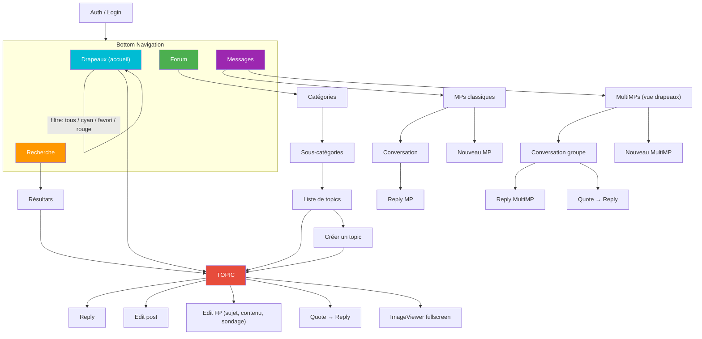
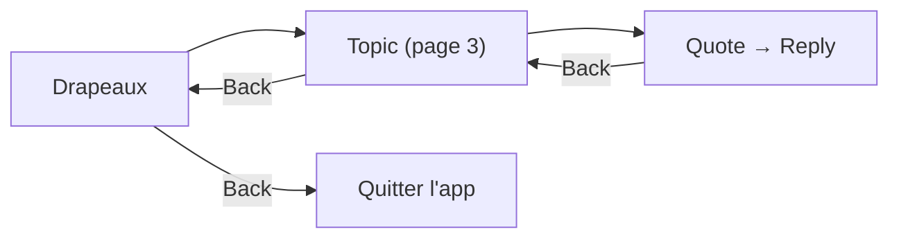

# Navigation
{: .fs-8 }

Écrans, flows, deep linking et bottom navigation.
{: .fs-5 .fw-300 }

---

## Bottom Navigation

L'application utilise une barre de navigation en bas avec 4 onglets principaux + les réglages accessibles depuis chaque écran.

```
┌───────────┬───────────┬───────────┬───────────┐
│  Drapeaux │  Forum    │  Recherche│  Messages  │
│  (accueil)│           │           │            │
└───────────┴───────────┴───────────┴────────────┘
```

**Drapeaux** est l'écran d'accueil. C'est le point d'entrée principal — la plupart des utilisateurs HFR ouvrent l'app pour vérifier "quoi de neuf sur mes topics suivis".

---

## Navigation Graph



> **Lecture du graphe** : ce diagramme décrit le **flow utilisateur**, pas le découpage en `NavKey`. Les sept routes typées réelles sont `FlagsListRoute`, `ForumRoute`, `CategoryRoute`, `TopicRoute`, `SearchRoute`, `MessagesRoute`, `EditorRoute` (cf. § Implémentation ci-dessous). Plusieurs nœuds du graphe sont des **states internes au screen** plutôt que des routes distinctes : `TABMP` / `TABMULTI` correspondent à `MessageTab.CLASSIC` / `MessageTab.MULTI` dans le `MessagesState` ; `CATS` / `SUBCATS` / `TOPICLIST` sont couverts par la même `CategoryRoute(cat, subcat?)`. Le mapping flow → routes typées est explicite dans le code de `entryProvider` plus bas.

---

## Écrans en détail

### Drapeaux (accueil)

L'écran le plus important de l'app. Affiche les topics suivis par l'utilisateur.

**Tri :**
- **Par date** (défaut) : tous les topics mélangés, triés par dernier message
- **Par catégorie** : groupes par cat/subcat, chaque groupe trie par date

**Filtres :**
- **Tous** : tous les drapeaux confondus
- **Cyan** : topics où l'utilisateur a participé
- **Favori** : topics marqués d'une étoile jaune
- **Rouge** : marque de lecture (dernière position lue)

**Actions sur un topic :**
- Tap → ouvrir le topic à la dernière position non lue
- Long press → menu contextuel (retirer drapeau, copier URL, partager)
- Swipe → retirer le drapeau (avec undo)

### Topic (lecture)

L'écran central de l'app. Affiche les posts d'un topic avec pagination.

**Navigation dans le topic :**
- Scroll vertical pour lire les posts
- Boutons page précédente / suivante
- Saut direct à une page (champ numéro)
- Saut au premier / dernier post
- Indicateur de page courante / total

**Actions sur un post :**
- **Quoter** → ouvre l'éditeur avec la citation pré-remplie
- **Editer** (si c'est notre post) → ouvre l'éditeur avec le contenu actuel
- **Editer le FP** (si `isFirstPostOwner`) → éditeur spécial avec sujet + sondage
- **Copier le texte**
- **Voir l'image en plein écran**
- **Partager le lien du post**

### Forum (catégories)

Navigation hiérarchique dans le forum.

```
Catégories
  └── Hardware
       ├── HFR
       ├── Overclocking
       └── ...
  └── Programmation
       ├── C/C++
       ├── Java
       └── ...
```

Chaque catégorie affiche le nombre de topics et l'activité récente.

### Création de topic

Formulaire complet :
- **Catégorie** : sélecteur hiérarchique
- **Sous-catégorie** : dépend de la catégorie choisie
- **Sujet** : titre du topic
- **Contenu** : éditeur BBCode avec toolbar
- **Sondage** (optionnel) : question + options + choix multiple oui/non
- **Preview** : avant-première du rendu du BBCode

### Messages

Deux onglets :

**MPs classiques :**
- Inbox : liste des conversations 1-to-1, triées par date
- Chaque MP affiche : sujet, correspondant, date, lu/non-lu
- Nouveau MP : destinataire + sujet + contenu

**MultiMPs :**
- Vue style drapeaux : fils de groupe triés par dernier message
- État lu/non-lu géré via **MPStorage** (données synchronisées depuis un MP HFR dédié, cachées en Room)
- Chaque MultiMP se comporte comme un topic : pagination, quote, reply
- Nouveau MultiMP : destinataires (2+) + sujet + contenu

### Recherche

- Recherche dans les topics (titre) et dans les posts (contenu)
- Filtres : catégorie, auteur, date
- Résultats avec preview du contexte

---

## Deep Linking

Les URLs HFR doivent ouvrir directement le bon écran dans l'app.

| Pattern URL | Écran cible | Statut |
|-------------|-------------|--------|
| `forum.hardware.fr/forum1.php?cat=X&post=Y&page=Z` | Topic page Z | Phase 1 |
| `forum.hardware.fr/forum1.php?cat=X&post=Y` | Topic page 1 | Phase 1 |
| `forum.hardware.fr/forum2.php?config=hfr.inc&cat=X&subcat=Y` | Liste topics | Phase 1 |
| `forum.hardware.fr/forum1f.php` | Drapeaux | Phase 1 |
| `forum.hardware.fr/forum1.php?cat=X&post=Y#t12345` | Post spécifique (traitement custom, voir ci-dessous) | Phase 1 |
| `forum.hardware.fr/forum2.php?config=hfr.inc&cat=prive&page=Z` | Inbox MP / conversation | Phase 3 |

Les liens vers MP arrivent en **Phase 3** uniquement (cycle messages privés + MultiMP). Le code de `parseHfrDeepLink` ignore aujourd'hui ces URLs — elles retombent sur le `else -> null` et l'app ouvre l'écran d'accueil par défaut. Le pattern n'est pas figé : il faudra confirmer sur un MP réel à la mise en chantier de la feature `:feature:messages`.

Implémentation via **Compose Navigation 3** (1.1.0+, stable depuis 08/04/2026). Les routes sont des types `@Serializable` qui implémentent un sealed interface marqueur `RedfaceNavKey : NavKey` :

```kotlin
// app/src/main/kotlin/.../navigation/RedfaceNavigation.kt
@Serializable sealed interface RedfaceNavKey : NavKey

@Serializable data object FlagsListRoute : RedfaceNavKey
@Serializable data object ForumRoute : RedfaceNavKey
@Serializable data object SearchRoute : RedfaceNavKey
@Serializable data object MessagesRoute : RedfaceNavKey
@Serializable data class CategoryRoute(
    val cat: Int,
    val subcat: Int? = null,
) : RedfaceNavKey
@Serializable data class TopicRoute(
    val cat: Int,
    val post: Int,
    val page: Int = 1,
    val scrollTo: Int? = null,            // numreponse cible pour #t{numreponse}
) : RedfaceNavKey
@Serializable data class EditorRoute(
    val mode: EditorMode,
    val cat: Int,
    val post: Int? = null,
) : RedfaceNavKey

@Serializable enum class EditorMode { Reply, Edit, EditFirstPost }
```

Chaque onglet de bottom nav a son propre back stack (`rememberNavBackStack`), partagé via une `Map<TopLevelDestination, NavBackStack<NavKey>>` côté `RedfaceApp`. Le rendu se fait via l'API stable `NavDisplay(backStack, onBack, entryDecorators, entryProvider)` — pas besoin du couple `rememberDecoratedNavEntries` + `rememberSceneState` pour le cas single-pane :

```kotlin
@Composable
private fun RedfaceNavHost(backStack: NavBackStack<NavKey>) {
    NavDisplay(
        backStack = backStack,
        onBack = {
            if (backStack.size > 1) {
                backStack.removeAt(backStack.lastIndex)
            }
        },
        entryDecorators = listOf(
            rememberSaveableStateHolderNavEntryDecorator(),
            rememberViewModelStoreNavEntryDecorator(),
        ),
        entryProvider = entryProvider {
            entry<FlagsListRoute> { FlagsScreen(onOpenUnreadTopic = { /* ... */ }) }
            entry<ForumRoute> { ForumScreen(onOpenCategory = { /* ... */ }) }
            entry<SearchRoute> { SearchScreen(onOpenResult = { /* ... */ }) }
            entry<MessagesRoute> { MessagesScreen(onOpenTopic = { /* ... */ }) }
            entry<CategoryRoute> { route -> CategoryScreen(cat = route.cat, subcat = route.subcat, onOpenTopic = { /* ... */ }) }
            entry<TopicRoute> { route ->
                TopicScreen(
                    request = TopicRequest(route.cat, route.post, route.page, route.scrollTo),
                    onReply = { postId ->
                        backStack.add(EditorRoute(EditorMode.Reply, route.cat, postId))
                    },
                    onOpenPage = { targetPage ->
                        backStack.removeAt(backStack.lastIndex)
                        backStack.add(route.copy(page = targetPage, scrollTo = null))
                    },
                )
            }
            entry<EditorRoute> { route ->
                EditorScreen(mode = route.mode.name, cat = route.cat, post = route.post)
            }
        },
    )
}
```

`NavigationSuiteScaffold` (Material 3 Adaptive) commute la `currentDestination` (état `rememberSaveable`) et passe le back stack actif à `RedfaceNavHost`. Les autres back stacks restent en mémoire — quand l'utilisateur revient sur l'onglet Forum, il retombe à l'écran où il l'a quitté.

**Avantages Nav 3 vs Nav 2.x pour Redface 2** :
- Le back stack est du **state observable standard** — facile à persister/restaurer, à inspecter pour debug, à manipuler dans des tests
- Plusieurs back stacks indépendants (un par onglet) sans avoir à hiérarchiser un nav graph
- Intégration directe avec `ListDetailPaneScaffold` (Material 3 Adaptive 1.2+) — la liste et le détail vivent dans le même back stack mais s'affichent en parallèle sur tablette
- API stable simple : `NavDisplay(backStack, onBack, entryDecorators, entryProvider { entry<…> })`, pas de DSL graph à apprendre

### Cas particulier : lien vers un post spécifique

Nav 3 (comme Nav 2.x) **ne gère pas les fragments URI** (`#t{numreponse}`) nativement : on parse l'URI dans `RedfaceApp`, on identifie l'**onglet cible** (drapeaux, forum, …) et on **réinitialise** le back stack de cet onglet pour que le bouton retour ramène à la racine de l'onglet plutôt qu'à un état antérieur arbitraire :

```kotlin
// app/.../navigation/RedfaceNavigation.kt — extrait
@Composable
fun RedfaceApp(intent: Intent?) {
    val flagsBackStack = rememberNavBackStack(FlagsListRoute)
    val forumBackStack = rememberNavBackStack(ForumRoute)
    val searchBackStack = rememberNavBackStack(SearchRoute)
    val messagesBackStack = rememberNavBackStack(MessagesRoute)
    var currentDestination by rememberSaveable { mutableStateOf(TopLevelDestination.Flags) }

    val backStacks = mapOf(
        TopLevelDestination.Flags to flagsBackStack,
        TopLevelDestination.Forum to forumBackStack,
        TopLevelDestination.Search to searchBackStack,
        TopLevelDestination.Messages to messagesBackStack,
    )

    LaunchedEffect(intent) {
        val parsed = intent?.data?.let(::parseHfrDeepLink) ?: return@LaunchedEffect
        currentDestination = parsed.destination
        resetStack(
            backStack = backStacks.getValue(parsed.destination),
            root = parsed.destination.rootRoute,
            route = parsed.route,
        )
    }
    // Pour la suite (NavigationSuiteScaffold avec les 4 onglets, Surface wrapper et
    // RedfaceNavHost(backStack = backStacks.getValue(currentDestination))), voir
    // app/src/main/kotlin/.../navigation/RedfaceNavigation.kt ligne 126-142.
}

private data class ParsedDeepLink(val destination: TopLevelDestination, val route: RedfaceNavKey)

private fun parseHfrDeepLink(uri: Uri): ParsedDeepLink? = when (uri.path) {
    "/forum1.php" -> {
        val cat = uri.getQueryParameter("cat")?.toIntOrNull() ?: return null
        val post = uri.getQueryParameter("post")?.toIntOrNull() ?: return null
        val page = uri.getQueryParameter("page")?.toIntOrNull() ?: 1
        val scrollTo = uri.fragment?.removePrefix("t")?.toIntOrNull()
        ParsedDeepLink(
            destination = TopLevelDestination.Flags,
            route = TopicRoute(cat = cat, post = post, page = page, scrollTo = scrollTo),
        )
    }
    "/forum2.php" -> {
        val cat = uri.getQueryParameter("cat")?.toIntOrNull() ?: return null
        ParsedDeepLink(
            destination = TopLevelDestination.Forum,
            route = CategoryRoute(cat = cat, subcat = uri.getQueryParameter("subcat")?.toIntOrNull()),
        )
    }
    "/forum1f.php" -> ParsedDeepLink(TopLevelDestination.Flags, FlagsListRoute)
    else -> null
}

private fun resetStack(
    backStack: NavBackStack<NavKey>,
    root: RedfaceNavKey,
    route: RedfaceNavKey,
) {
    backStack.clear()
    backStack.add(root)
    if (route != root) backStack.add(route)
}
```

Le `TopicScreen` reçoit le `scrollTo` (numreponse cible) via la `TopicRoute` et scroll jusqu'au bon post après chargement de la page.

> **Politique de back stack sur deep link** : on **réinitialise** le back stack de l'onglet cible (`resetStack`) plutôt qu'on n'empile sur l'historique courant. Rationale : un deep link entrant doit poser un état de navigation **prévisible** — back ramène à la racine de l'onglet, pas à un mélange d'écrans visités avant le deep link. Cf. § Back Stack ci-dessous.

### Predictive back

Nav 3 intègre `PredictiveBackHandler` via `NavDisplay` — aucun code custom requis pour les écrans standards. Seuls les écrans à interaction custom (ex : éditeur avec draft) ajoutent leur propre handler :

```kotlin
@Composable
fun EditorScreen(state: EditorState, onIntent: (EditorIntent) -> Unit) {
    var showDiscardDialog by remember { mutableStateOf(false) }

    PredictiveBackHandler(enabled = state.content.isNotEmpty()) { progress ->
        progress.collect { /* animation personnalisée si besoin */ }
        showDiscardDialog = true  // à la fin, on demande confirmation
    }

    // ... rest of the screen
}
```

Manifest requis : `android:enableOnBackInvokedCallback="true"` sur `<application>`.

### Multi-pane adaptatif (tablette, foldables)

> **Statut Phase 5+** — multi-pane n'est pas livré en Phase 1. Le snippet ci-dessous est **illustratif** : il montre comment `NavDisplay` se compose avec `ListDetailPaneScaffold` (Material 3 Adaptive 1.2+) sur le même back stack, en utilisant les signatures **réelles** des screens livrés par Phase 1 (`FlagsScreen`, `TopicScreen` via `TopicRequest`, `EditorScreen`). Quand le mode tablette arrivera, on partira de cette base.

```kotlin
@Composable
fun AdaptiveNavHost(backStack: NavBackStack<NavKey>) {
    val isExpanded = currentWindowAdaptiveInfo().windowSizeClass.windowWidthSizeClass !=
        WindowWidthSizeClass.COMPACT

    if (isExpanded) {
        ListDetailPaneScaffold(
            listPane = {
                FlagsScreen(
                    onOpenUnreadTopic = {
                        backStack.add(
                            TopicRoute(
                                cat = FixedTopicFixtures.cat,
                                post = FixedTopicFixtures.post,
                                page = 1,
                            ),
                        )
                    },
                    onOpenTrackedCategory = {
                        backStack.add(CategoryRoute(cat = 23, subcat = 0))
                    },
                )
            },
            detailPane = {
                when (val current = backStack.lastOrNull()) {
                    is TopicRoute -> TopicScreen(
                        request = TopicRequest(
                            cat = current.cat,
                            post = current.post,
                            page = current.page,
                            scrollTo = current.scrollTo,
                        ),
                        onReply = { postId ->
                            backStack.add(EditorRoute(EditorMode.Reply, current.cat, postId))
                        },
                        onOpenPage = { targetPage ->
                            backStack.removeAt(backStack.lastIndex)
                            backStack.add(current.copy(page = targetPage, scrollTo = null))
                        },
                    )
                    is EditorRoute -> EditorScreen(
                        mode = current.mode.name,
                        cat = current.cat,
                        post = current.post,
                    )
                    else -> Text("Select a topic")
                }
            },
        )
    } else {
        RedfaceNavHost(backStack = backStack)
    }
}
```

Quand `FlagsScreen` quittera le slice fixe (PR #80) pour exposer un vrai modèle `FlaggedTopic` (cf. [models.md § À définir avec les écrans]({{ site.baseurl }}/specs/models#à-définir-avec-les-écrans)), la lambda passée à `onOpenUnreadTopic` recevra le topic concerné et `backStack.add(TopicRoute(topic.cat, topic.postId, topic.lastReadPage))` deviendra trivial. Pour l'instant, la fixture `FixedTopicFixtures` est utilisée comme cible, en cohérence avec `RedfaceNavigation.kt`.

---

## Back Stack

Nav 3 expose le back stack comme un `NavBackStack<NavKey>` observable, puis `NavDisplay` le rend directement entry par entry. Règles Redface 2 :

- **Bottom nav** : chaque onglet conserve son propre back stack (un `rememberNavBackStack(...)` par onglet, le `NavDisplay` actif reçoit celui de la `currentDestination`). Quand l'utilisateur change d'onglet, le back stack précédent reste en mémoire et reprend où il en était.
- **Retour depuis un topic** : retour à la liste (drapeaux, forum, recherche) à la même position de scroll — l'entrée précédente est conservée dans la liste tant qu'elle est dans le back stack.
- **Retour depuis reply/edit** : retour au topic à la même page.
- **Deep link** : on identifie l'onglet cible et on **réinitialise** son back stack via `resetStack(root, route)` (cf. § Cas particulier : lien vers un post spécifique). Conséquence prévisible : back depuis le deep link ramène à la racine de l'onglet (drapeaux, forum, …), pas à un état pré-deep-link arbitraire.


