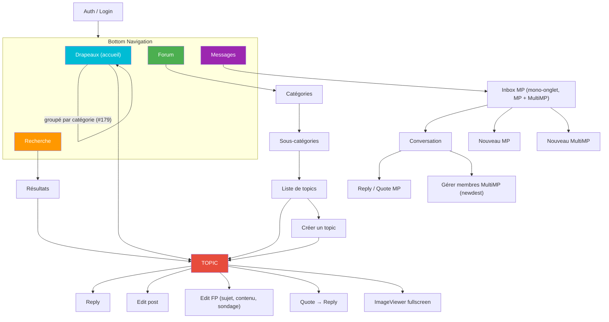
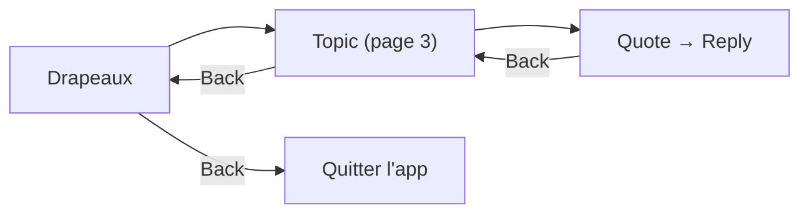

# Navigation
{: .fs-8 }

Écrans, flows, deep linking et bottom navigation.
{: .fs-5 .fw-300 }

---

## Bottom Navigation

L'application utilise une barre de navigation en bas avec 4 onglets principaux + les réglages accessibles depuis chaque écran.

```
┌───────────┬───────────┬───────────┬───────────┐
│  Drapeaux │  Forum    │  Recherche│  Messages  │
│  (accueil)│           │           │            │
└───────────┴───────────┴───────────┴────────────┘
```

**Drapeaux** est l'écran d'accueil. C'est le point d'entrée principal — la plupart des utilisateurs HFR ouvrent l'app pour vérifier "quoi de neuf sur mes topics suivis".

---

## Navigation Graph


```mermaid
graph TB
    LOGIN[Auth / Login] --> HOME

    subgraph HOME["Bottom Navigation"]
        FLAGS["Drapeaux (accueil)"]
        FORUM[Forum]
        SEARCH[Recherche]
        MSGS[Messages]
    end

    FLAGS -->|"onglets: cyan / lu / favoris / super / DT (conditionnel)"| FLAGS
    FLAGS -->|"groupé par catégorie (#179)"| FLAGS
    FLAGS --> TOPIC

    FORUM --> CATS[Catégories]
    CATS --> SUBCATS[Sous-catégories]
    SUBCATS --> TOPICLIST[Liste de topics]
    TOPICLIST --> TOPIC
    TOPICLIST --> NEWTOPIC["Créer un topic"]

    SEARCH --> RESULTS[Résultats]
    RESULTS --> TOPIC

    MSGS --> INBOX["Inbox MP (mono-onglet, MP + MultiMP)"]
    INBOX --> CONV[Conversation]
    INBOX --> NEWMP["Nouveau MP"]
    INBOX --> NEWMULTI["Nouveau MultiMP"]
    CONV --> REPLYMP["Reply / Quote MP"]
    CONV --> MEMBERS["Gérer membres MultiMP (newdest)"]

    TOPIC --> REPLY[Reply]
    TOPIC --> EDIT["Edit post"]
    TOPIC --> EDITFP["Edit FP (sujet, contenu, sondage)"]
    TOPIC --> QUOTE["Quote → Reply"]
    TOPIC --> IMAGE[ImageViewer fullscreen]

    NEWTOPIC --> TOPIC

    style FLAGS fill:#00bcd4,color:#fff
    style FORUM fill:#4caf50,color:#fff
    style SEARCH fill:#ff9800,color:#fff
    style MSGS fill:#9c27b0,color:#fff
    style TOPIC fill:#e74c3c,color:#fff
```

> **Lecture du graphe** : ce diagramme décrit le **flow utilisateur**, pas le découpage en `NavKey`. Les routes typées réelles sont `FlagsListRoute`, `ForumRoute`, `CategoryRoute`, `TopicRoute`, `SearchRoute`, `MessagesRoute`, `PrivateMessageThreadRoute`, `PostEditorRoute`, `TopicFormRoute`, `ProfileFullRoute` (Phase 2 finish #208) (cf. § Implémentation ci-dessous). Plusieurs nœuds du graphe sont des **states internes au screen** plutôt que des routes distinctes : `INBOX` est la boîte de réception MP **mono-onglet** (MP classiques et MultiMP confondus ; l'onglet « DT » dédié vit dans les Drapeaux, pas dans Messages) ; `CATS` / `SUBCATS` / `TOPICLIST` sont couverts par la même `CategoryRoute(cat, subcat?, page)`. Le mapping flow → routes typées est explicite dans le code de `entryProvider` plus bas.

---

## Écrans en détail

### Drapeaux (accueil)

L'écran le plus important de l'app. Affiche les topics suivis par l'utilisateur.

> **Refonte #603 livrée (bêta 0.18.0)** — top bar dédiée (indicateur d'onglet, recherche, avatar), marqueurs de ligne repensés, sheet d'actions à l'appui long, super-favoris locaux, « config rapide » au tap sur la barre basse : voir [ADR-017]({{ site.baseurl }}/adr/017-refonte-vue-drapeaux). Les invariants fonctionnels ci-dessous restent valides ; pour la surface visuelle, le code fait foi (`FlagsTopBar.kt`, `FlagActionsSheet.kt`, `FlagsRoute.kt`).

**Onglets** (`FlagTab`, un `FlagType` chacun sauf `Super` et `Dt`) :
- **Mes sujets** (cyan) : topics où l'utilisateur a participé. Re-tap de l'onglet déjà sélectionné → toggle « +lus » (afficher/masquer les cyans déjà lus, #154).
- **Lu** (rouge) : topics lus uniquement (drapeau de lecture sans participation).
- **Favoris** : topics marqués d'une étoile jaune.
- **Super** : super-favoris **locaux** — sélection épinglée par l'utilisateur via le sheet d'appui long, persistée côté app (`SuperFavoriteRepository`, cf. [ADR-017]({{ site.baseurl }}/adr/017-refonte-vue-drapeaux)) ; aucun backend HFR.
- **DT** (conditionnel) : 5e onglet listant les conversations MultiMP / DT. **Visible uniquement** quand le réglage « section DT » est actif (`state.showDtTab`, persisté via `UserPreferencesRepository`, **défaut OFF**). Source code : `FlagsViewModel` (sealed `FlagTab` incl. `Dt`), `FlagsRoute.kt` (rendu conditionnel). Comportement :
  - **Liste** = union des MultiMP connus de **MPStorage** (`mpFlags.list[]`) et de la **1re page de l'inbox** MP. **Limite connue** : seule la première page de l'inbox est scannée — une conversation MultiMP poussée au-delà de la 1re page (et absente de MPStorage) n'apparaît pas dans l'onglet DT.
  - **Non-lus par défaut** : l'onglet affiche d'abord les conversations non lues ; un **clic sur l'onglet** déjà sélectionné révèle aussi les conversations lues.
  - **Pull-to-refresh** (#588) pour resynchroniser.
  - **Reprise de lecture** = **position** (page/ancre), pas un lu/non-lu serveur (MPStorage ne stocke qu'une position de reprise par conversation, cf. [ADR-018]({{ site.baseurl }}/adr/018-mp-cache-disque-opt-in) décision 2 / #361 et [ADR-014]({{ site.baseurl }}/adr/014-mpstorage-v01-de-facto) §5).

**Recherche locale (#603 PR2, #739)** : la loupe de la top bar filtre **côté client** les titres de l'onglet courant (le sujet des conversations pour l'onglet DT) — HFR n'offre aucune recherche serveur des drapeaux (cf. [ADR-003]({{ site.baseurl }}/adr/003-api-rest-hfr-hybride)) et la liste est déjà chargée, donc aucun fetch supplémentaire. Le filtre est insensible à la casse **et aux accents** (#739 : « cafe » trouve « café » et inversement ; ligatures `œ`/`æ` tolérées) via le repli partagé `foldForSearch()` de `:core:domain` (`search/SearchFolding.kt`), le même que la recherche du Forum et celle des Réglages. Requête vide = liste inchangée (sections vides de parité web conservées) ; en vue groupée, une catégorie sans résultat est masquée.

**Regroupement par catégorie (#179, vue par défaut)** :
- À l'intérieur de chaque onglet réel, les topics sont **groupés par catégorie**, dans l'ordre canonique du forum (cf. `ForumRepository.observeCategories()` ; ordre de secours en dur si le catalogue n'est pas encore chargé). C'est la parité avec la vue web « Vos sujets ».
- Chaque catégorie est une bande séparatrice (`stickyHeader`). Par défaut, les **catégories vides sont conservées** (parité web) avec un placeholder par onglet (« Aucun nouveau message » pour cyan, « Aucun sujet dans cette catégorie » sinon).
- Le regroupement est **purement client-side** : group-by sur `Flag.cat` de la liste plate déjà chargée, aucun fetch authentifié supplémentaire (invariant prefetch-non-auth). Une catégorie absente du catalogue n'est jamais filtrée : elle tombe en section « inconnue » en fin de liste (anti-régression #251).

**Préférences d'affichage (#179, persistées via `UserPreferencesRepository` / DataStore)** :
- **Grouper par catégorie** (défaut : activé) : désactivé, l'écran rend la **liste à plat** héritée (tous les drapeaux d'un coup, ordre dernière réponse, sans bandes de catégorie). Permet de conserver la lecture à plat des drapeaux.
- **Masquer les catégories sans message non lu** (défaut : désactivé = parité web) : en vue groupée, cache les catégories qui n'ont aucun drapeau non lu. Le toggle cyan « +lus » **prime** sur ce filtre : afficher les sujets participés déjà lus garde leurs catégories visibles (sinon les deux réglages se contrediraient). Sans effet en vue à plat. Si le filtre vide toutes les sections, un placeholder « Aucune catégorie avec un message non lu » est affiché (corps jamais blanc, ancre pull-to-refresh préservée #229).

**Réglages par type de drapeau (#309)** : un master **« Réglages différents par onglet »** (défaut : désactivé) contrôle la portée des deux préférences ci-dessus :
- **désactivé** : un réglage **global** unique partagé par tous les onglets ;
- **activé** : chaque type de drapeau (cyan / rouge / favoris) garde ses propres valeurs, avec **repli sur la valeur globale toggle par toggle** (`UserPreferencesRepository.observeFlagsViewSettings(type)` résout global vs per-type). Les clés per-type sont **sticky** : désactiver le master ne les efface pas, le réactiver restaure le réglage par onglet précédent.

**Deux surfaces de réglage** (miroir) :
- un **bottom sheet M3** (`ModalBottomSheet`, « Affichage des drapeaux ») ouvert depuis la top bar Drapeaux ou via la « config rapide » (tap sur la barre de navigation basse, #603) — masqué en anonyme (gate `canConfigureView`) ; il édite la portée courante (globale, ou l'onglet sélectionné quand le master est activé) et affiche un libellé de portée explicite ;
- le miroir dans **Réglages > Drapeaux** (master « Réglages différents par onglet » + les deux toggles globaux qui servent de valeurs par défaut/repli).

**Pastille « pages à lire » (#814)** : en fin de ligne, `+N` est teinté selon le **retard** et non selon la couleur du drapeau — 1-2 pages neutre (`surfaceVariant`), 3-9 accentué (`tertiaryContainer`), ≥ 10 alerte (`error`) ; paliers dans `lagTone` (`:core:model`), couleurs dans `lagToneColors` (`:core:ui`, rôles M3 canoniques, donc suivis en light / dark / AMOLED / accent). Demande de thibw (fil DEV).

**Actions sur un topic :**
- Tap → ouvrir le topic à la dernière position non lue
- **Appui long** → sheet d'actions du drapeau (`FlagActionsSheet`, #603/ADR-017) : retrait avec confirmation (#99), super-favori, métadonnées du sujet. Le retrait n'est **pas** annulable dans l'app (pas d'undo).
- **Swipe horizontal** → change d'onglet (#660) ; il ne retire jamais un drapeau (l'ancien swipe-to-remove a été remplacé par l'appui long lors de la refonte #603).

### Profil utilisateur (Phase 2 finish #208)

Accessible depuis la lecture topic via un tap sur l'avatar ou le pseudo d'un post (quand `Post.profileId != null`).

**Flow :**
1. `TopicScreen` émet `onOpenProfile(userId, pseudo, avatarUrl)` — callback sans dépendance sur `:feature:profile`.
2. `:app` (`RedfaceApp`) ouvre une **`ModalBottomSheet`** (`ProfilePreviewSheet`) avec : avatar carré/arrondi, pseudo, localisation, date d'inscription, nombre de posts, bouton « Voir le profil complet ».
3. Si le chargement échoue, la sheet reste lisible avec le pseudo/avatar hint + message d'erreur.
4. Bouton « Voir le profil complet » navigue vers `ProfileFullRoute(userId, pseudo, avatarUrl?)` sur le back stack de l'onglet d'origine (celui depuis lequel la sheet a été ouverte), même si l'utilisateur change d'onglet pendant que la sheet est visible.
5. `ProfileFullRoute` affiche la page complète avec tous les champs disponibles.

**Routes :**

```kotlin
@Serializable data class ProfileFullRoute(
    val userId: Int,        // clé canonique — jamais null
    val pseudo: String,     // hint d'affichage avant chargement
    val avatarUrl: String? = null, // hint d'affichage avant chargement
) : RedfaceNavKey
```

**Contrainte de frontière** : `:feature:topic` ne dépend **pas** de `:feature:profile`. Le callback `onOpenProfile` est la seule surface d'interaction. `:app` possède la `ModalBottomSheet` et la route complète.

**Limites connues** : le bouton « Derniers messages » dans la page complète est désactivé (marqué « à venir »). Aucune route stable vers les posts d'un utilisateur n'existe en Phase 2. La route sera activée dans une future PR quand la recherche par auteur sera disponible.

### Topic (lecture)

L'écran central de l'app. Affiche les posts d'un topic avec pagination.

> **Refonte #604 en cours** (vagues 1-4 livrées en dev 0.19.x→0.24.x) — skeleton de chargement
> (`TopicLoadingSkeleton`), header dissous (pilule « page X / Y » cliquable → feuille de navigation),
> cartes de frontière de page (`PageBoundaryCard`/`EndOfTopicCard`), repère « dernier message lu »
> traversant (#600). Côté écriture, la surface par défaut est l'**éditeur plein écran** (#951) ; la
> réponse rapide en bottom sheet (`QuickReplySheet`) est un préréglage expérimental opt-in (réglage
> « Surface d'écriture », #806), avec escalade vers l'éditeur plein écran (le brouillon suit, #405)
> et bascule multi-quote en plein écran au-delà d'un seuil propre à ce préréglage. Depuis le
> 2026-09-02 (#949), son champ BBCode grandit jusqu'à 15 lignes façon RF1, avec un plafond réduit par
> la hauteur utile restante quand l'IME ou le paysage serrent la fenêtre afin de garder l'action
> d'envoi visible. Le rendu des citations dans le composer est en arbitrage (#805 : BBCode inline par
> défaut, cartes en option). La navigation par pages ci-dessous (#282/#307) reste exacte.

**Navigation dans le topic :**
- Scroll vertical pour lire les posts
- Boutons page précédente / suivante
- **Swipe horizontal gauche/droite pour changer de page (#282)** — geste « drag-follow » (la page suit le doigt, résistance amortie aux bords, retour haptique à l'armement et au commit, edge-glow discret). Implémenté par `Modifier.topicPageSwipe` (`feature/topic/.../TopicSwipe.kt`, helpers purs testés) ; il appelle le **même** callback `onOpenPage(targetPage)` que les boutons de pager. Depuis #895 étape 4 (12/07/2026), `onOpenPage` alimente `TopicViewModel.switchToPage()` : la pagination est **in-ViewModel**, la `TopicRoute` est figée à l'entrée et un changement de page ne traverse plus la navigation (à la livraison de #282 la navigation était route-driven — remplacement de la `TopicRoute` compensé par un `transitionSpec` Topic→Topic instantané, retiré à l'étape 5 de #895). Le geste est gaté tant que l'entrée nav n'est pas `RESUMED` (protège les transitions d'**entrée** dans le topic) et ne déclenche jamais d'action destructive.
- Saut direct à une page (champ numéro)
- Saut au premier / dernier post
- Indicateur de page courante / total
- **Atterrissage depuis un drapeau (#600/#1137)** — le `scrollTo` d'un drapeau est le **dernier post lu** (`last_post_read_id`, cf. [protocol-hfr.md]({{ site.baseurl }}/specs/protocol-hfr)), rendu avec le repère « Dernier message lu » sous ce post, dans le même item de liste. Si ce post tient dans le viewport, il est aligné en haut (comportement historique). S'il le dépasse, c'est le **haut du repère** qui est posé sur la ligne d'atterrissage (offset = hauteur de l'item − hauteur du repère) : le repère et le premier post non lu sont à l'écran, le corps du post déjà lu est entièrement au-dessus, accessible d'un geste vers le haut (décision pure `lastReadLandingOffset`, hauteur du repère mesurée à sa composition). La sémantique « dernier lu » voyage avec l'effet (`ScrollToPost.lastRead`), posée par le seul producteur drapeau du ViewModel — jamais re-déduite de la requête côté écran. Le ré-ancrage #197 pendant le décodage des images ré-applique le **même** alignement, re-décidé à chaque frame sur la hauteur courante du post (qui grandit à mesure que ses images arrivent). Les autres producteurs de `scrollTo` (saut de citation, deep link, résultat de recherche) gardent l'alignement en haut du post.
- **Restauration de la position de lecture par page (#307, réarchitecturée par #895 étape 4)** — revenir sur une page déjà visitée (swipe, pager, FAB, back) ré-atterrit à la position de scroll quittée, pas en haut. **Intra-topic** (l'entrée nav survit au changement de page depuis #895), les ancres vivent dans le `TopicViewModel` retenu : carte RAM par page visitée, ancre de la page courante en miroir dans `SavedStateHandle` (process death), atterrissages délivrés par le moteur de pages (ancre sauvée > pas de lecture « page - 1 » en bas #412 > haut). **Cross-entrée** (quitter le topic puis le rouvrir dans la session), `:app` garde un cache session `(cat, post, page) → ancre` hoisté dans `RedfaceApp` (jumeau du cache de titres, borné à 128 avec éviction des ancres les moins récemment sauvegardées), sauvegardé sous la page **canonique** au `onDispose` de l'écran (le moteur peut avoir changé de page depuis l'entrée) et consulté à l'entrée suivante seulement. Priorité stricte d'entrée résolue par `resolveTopicScrollRestoration` (`app/.../navigation/TopicScrollRestore.kt`, résolveur pur testé) : `scrollTo` route > ancre sauvée > haut de page — les atterrissages de mi-parcours historiques (post-submit, retour de saut de citation) sont depuis #895 des effets du moteur in-ViewModel (`applySubmitResult`, chaîne de sauts), plus des niveaux de ce résolveur. Cf. `TopicScrollAnchor` (`feature/topic/.../TopicScrollAnchor.kt`).

**Actions sur un post :**
- **Citer** → éditeur plein écran pré-armé avec la citation (surface par défaut depuis #951). Le réglage expérimental « Surface d'écriture » (#806) permet d'ouvrir à la place la feuille de réponse rapide : sous « Toujours la feuille », « Citer » ouvre la feuille (escalade possible vers le plein écran) et « Citer N » (multi-quote) bascule en plein écran à partir de 3 citations (seuil épinglé par test, propre à ce préréglage) ; sous « Feuille sauf citations », toute citation ouvre directement le plein écran. Rendu des citations : cf. arbitrage #805
- **Editer** (si c'est notre post) → ouvre l'éditeur avec le contenu actuel
- **Editer le FP** (si `isFirstPostOwner`) → éditeur spécial avec sujet + sondage
- **Copier le texte**
- **Voir l'image en plein écran**
- **Partager le lien du post**

### Forum (catégories)

Navigation hiérarchique dans le forum.

```
Catégories
  └── Hardware
       ├── HFR
       ├── Overclocking
       └── ...
  └── Programmation
       ├── C/C++
       ├── Java
       └── ...
```

Chaque catégorie affiche le nombre de topics et l'activité récente.

### Création de topic

Formulaire complet :
- **Catégorie** : sélecteur hiérarchique
- **Sous-catégorie** : dépend de la catégorie choisie
- **Sujet** : titre du topic
- **Contenu** : éditeur BBCode avec toolbar
- **Sondage** (optionnel) : question + options + choix multiple oui/non
- **Preview** : avant-première du rendu du BBCode

### Menu compte global

Issue #198 — chaque écran principal (Drapeaux, Forum, Recherche, Messages) accepte un slot `topBarActions: @Composable (() -> Unit)? = null` dans son header. Le navigation host (`RedfaceApp` dans `app/.../RedfaceNavigation.kt`) instancie une seule `AppAccountViewModel` partagée et y branche un composant `RedfaceAccountMenu` (vivant dans `:core:ui/account/`) qui surface :

- état compte (« Anonyme » / « Connecté en tant que X » / « Compte en cours de vérification… » pendant le warmup DataStore) ;
- action `Se connecter` ou `Se déconnecter` selon `AuthState` ;
- `Paramètres alpha`, `Diagnostics alpha`, `Signaler un contenu` (mailto `xat@azora.fr`) ;
- footer version `v{name} (build {code})`.

Le badge est un carré à coins arrondis (8dp), **pas un cercle**, cohérent avec [`RedfaceUserAvatar`]({{ site.baseurl }}/specs/models#post). L'anti-flicker auth est préservé : tant que `authState == null`, le badge montre `…` plutôt que `?` pour ne pas surfacer transitoirement un état « Anonyme ». La déconnexion (`AppAccountViewModel.logout`) vide d'abord `FlagRepository.clearSessionCache()` avant `AuthRepository.logout()` ; cet ordering est verrouillé par `AppAccountViewModelTest` côté `:app`.

Depuis le MVP Phase 3 (#298), l'onglet `Messages` affiche l'inbox des MP (MP classiques et
MultiMP confondus, cf. § Messages ci-dessous) et ouvre une conversation ; la lecture seule
du MVP a depuis été étendue à la réponse (#301), à la citation simple par message (#1074),
à la composition de MP/MultiMP et à la
gestion des membres d'un MultiMP (#606/#612). L'écran observe l'état d'authentification : en
anonyme ou après déconnexion, les données privées déjà chargées sont purgées et remplacées
par un état « connexion requise ».

### Messages

Inbox **mono-onglet** : `MessagesScreen` (`feature/messages/.../MessagesScreen.kt`, KDoc « the private-message inbox ») affiche la boîte de réception MP, MP classiques 1-to-1 et conversations de groupe (MultiMP / DT) confondus dans la même liste. Il n'y a **pas** d'onglet « MultiMPs » distinct dans Messages : les MultiMP apparaissent dans l'inbox (drapeau « Interlocuteurs multiples », `isMultiRecipient`) et disposent d'un **onglet « DT » conditionnel dans les Drapeaux** (cf. § Drapeaux > Onglets ci-dessus), pas d'une surface dédiée ici.

- **Inbox** : liste des conversations triées par date (`forum1.php?cat=prive`). Chaque entrée affiche sujet, correspondant, date, indicateur lu/non-lu (dot binaire serveur, cf. [ADR-018]({{ site.baseurl }}/adr/018-mp-cache-disque-opt-in)/#361 — **pas** d'état MPStorage/Room en lieu et place du drapeau serveur), et un marqueur « Interlocuteurs multiples » pour les MultiMP.
- **Lecture d'une conversation** : `forum2.php?cat=prive&post={threadId}&page={page}`, même rendu `PostRenderer` que les posts de topic. Swipe de pages in-place + ascenseur + pull-to-refresh (#351 a/b, ADR-018 décision 1).
- **Zoom pincé** (#182/#1098, lot 6 de #1040) : la loupe éphémère de la vue Topic est montée à l'identique dans la conversation — `PinchZoomState` + `Modifier.pinchZoom` / `pinchZoomTransform` de `:core:ui/zoom/`, à rendu identique au pixel près. Elle est **globale et éphémère** : la clé de page réinitialise le zoom, un chip « 1× » remet au repos, et pendant le zoom le défilement natif, le swipe de page et le pull-to-refresh sont **désarmés** (les gestes eux-mêmes, pas seulement leurs effets) ; l'axe vertical est alors piloté par la machine de zoom.
- **Saut vers le message cité** (#625/#1093) : un appui sur l'en-tête « *Pseudo* a écrit : » d'une citation navigue vers le message cité. La page et le `numreponse` viennent du permalien de l'ancre, dont HFR sert deux formes (statique anonyme, `forum2.php` authentifié — cf. [protocol-hfr.md]({{ site.baseurl }}/specs/protocol-hfr) § « En-tête d'une citation rendue »). L'atterrissage est arbitré par une **autorité unique** côté écran, `PrivateMessagePageLandingEffect` : même page sans recharge ; autre page seulement après l'émission réseau terminale ; page réellement parsée adoptée si HFR rabat la demande ; cible absente consommée sans scroll ; changement de page ou de compte invalidant. **Le retour dédié #782 n'est pas empilé en MP** : le bouton système garde la sortie de conversation tant que les ancres de scroll par page (#307/#895 F3) ne sont pas livrées côté MP — empiler un retour de saut sans ancre ramènerait en haut de la page précédente, pas à la position quittée.
- **Réponse** (#301) : le FAB global « Répondre » ouvre le composer (formulaire sourcé depuis le lien réel de `message.php`, fallback formulaire embarqué — cf. `DefaultPrivateMessageWriteRepository`) ; gaté sur `thread.canReply`. Ce flux ne porte aucune référence de citation et conserve notamment le `newdest` servi par HFR.
- **Citation simple** (#1074) : le bouton « Citer » du pied de carte ouvre le même composer avec une cible typée `(numreponse, ref)` ; l'action est masquée si le rang 1-based `ref` manque. L'app reconstruit le GET `message.php` documenté, puis consomme verbatim le `content_form` prérempli. Les trois sens de `numrep`, mesurés en 1:1 par #1041 puis reproduits en DT par #1074, sont dans [protocol-hfr.md]({{ site.baseurl }}/specs/protocol-hfr) § « MP/DT — citer un message ». Le formulaire ne sert aucun champ caché `ref` ; la capture DT ne sert pas non plus de `newdest`. Aucun POST live n'a été émis.
- **Citation multiple** (#1074) : l'ajout/retrait du panier vit dans le menu contextuel du message, tandis que le FAB « Citer N » de la conversation ouvre le composer et se vide par appui long. Chaque sélection conserve page, `numreponse` et `ref` dans son locator ; le composer récupère séquentiellement un formulaire par sélection avec ces coordonnées, échoue si un préremplissage est blanc, puis concatène les `[quotemsg]` servis par HFR dans l'ordre de sélection. Le premier formulaire porte le POST. Les captures prouvent le contrat d'un formulaire unitaire, pas le résultat live de l'enchaînement ni l'acceptation serveur d'un POST multi-blocs.
- **Nouveau MP** : composition d'un MP 1-to-1 (destinataire + sujet + contenu).
- **Nouveau MultiMP** : composition d'une conversation de groupe (2+ destinataires + sujet + contenu).
- **Gérer les membres d'un MultiMP** (#606/#612) : l'owner peut ajouter/retirer des destinataires via le champ `newdest` au POST de réponse (cf. [protocol-hfr.md]({{ site.baseurl }}/specs/protocol-hfr#mpdt--ajoutretrait-de-membres-newdest)).
- **Badge MP** (#313) : compteur de MP non lus surfacé dans la bottom nav.

> La **position de reprise de lecture** des conversations est locale (table Room `mp_read_positions`, ADR-018 décision 2), seedée depuis MPStorage pour les DT (ADR-014 §5). Ce n'est **pas** un lu/non-lu : l'état lu/non-lu serveur reste le dot binaire par conversation.

### Recherche

**Recherche globale / filtrée** (Phase 2) :
- Recherche dans les topics (titre) et dans les posts (contenu) sur tout le forum, via `GET /forum1.php?recherches=1&...`
- Filtres : catégorie (pivot), titre seul / titre + contenu, fourchette de dates
- Résultats avec preview du contexte (`Dernier message correspondant`)

**Recherche intra-topic** (#576/#585/#546, livrée) :
- Rechercher un mot-clé **dans le sujet courant** depuis l'écran Topic, avec saut entre les occurrences (résultat précédent / suivant), mode **filtre par pseudo** (`spseudo`) et option **tout le sujet**.
- `TopicSearch` / `TopicSearchRepository(Impl)` / `HfrClient.searchInTopic` via `POST /transsearch.php` (cf. [protocol-hfr.md]({{ site.baseurl }}/specs/protocol-hfr#post-transsearchphp--recherche-intra-topic)). La réponse est une page de topic re-parsée, positionnée sur l'occurrence.

---

## Deep Linking

Les URLs HFR doivent ouvrir directement le bon écran dans l'app.

| Pattern URL | Écran cible | Statut |
|-------------|-------------|--------|
| `forum.hardware.fr/forum1.php?cat=X&subcat=Y&page=Z` | Liste des topics de la catégorie X, page Z | Phase 1 |
| `forum.hardware.fr/forum2.php?cat=X&post=Y&page=Z#tN` | Topic Y page Z, avec scroll vers le post N | Phase 1 |
| `forum.hardware.fr/hfr/<Cat>/…/<slug>-sujet_Y_Z.htm#tN` | Topic Y page Z, catégorie résolue depuis le slug, avec scroll vers N | Phase 4 (#1032 PR2) |
| `forum.hardware.fr/forum1f.php` | Drapeaux | Phase 1 |
| `forum.hardware.fr/forum1.php?config=hfr.inc&cat=prive&page=Z` | Navigateur (inbox MP non routée dans l'app) | Fallback navigateur |
| `forum.hardware.fr/forum2.php?config=hfr.inc&cat=prive&post=Y&page=Z` | Navigateur (conversation MP non routée dans l'app) | Fallback navigateur |
| Autre chemin `/hfr/…` (profil, `liste_sujet`, slug de catégorie inconnu…) | Navigateur | Fallback navigateur |

> **Deep links MP** : les contrats `cat=prive` ci-dessus sont confirmés par fixtures HFR
> réelles, mais ne sont pas encore routés vers `MessagesRoute` / `PrivateMessageThreadRoute`.
> `resolveHfrDeepLink` les ouvre donc explicitement dans le navigateur au lieu d'échouer en silence.

Le manifest garde deux filtres distincts, sans `autoVerify` : les chemins legacy exacts
(`/forum1.php`, `/forum2.php`, `/forum1f.php`) et le préfixe volontairement large `/hfr/`.
La sur-capture du second filtre est intentionnelle : `resolveHfrDeepLink` valide l'action, le
schéma et le host, route les topics reconnus, puis délègue toute URL HFR non routable au navigateur.

Comme `hardware.fr` est un domaine tiers, Redface 2 ne peut pas être *vérifié* comme handler et
l'utilisateur doit l'activer manuellement. Pour rendre cet opt-in découvrable (#1032 PR3), la ligne
Réglages → « Réseau et cache » → « Ouverture des liens HFR » affiche l'état courant — lu via
`DomainVerificationManager` (API 31+ ; « inconnu » avant Android 12 (API < 31), statut non lisible) et décidé par
la fonction pure `hfrLinkHandlingStatusOf` (`:core:ui/browser`) — et ouvre directement l'écran système
« Ouvrir par défaut » (`ACTION_APP_OPEN_BY_DEFAULT_SETTINGS`, repli `ACTION_APPLICATION_DETAILS_SETTINGS`).
La description se rafraîchit à l'`ON_RESUME` pour refléter un changement fait dans les réglages système.

Implémentation via **Compose Navigation 3** (1.1.0+, stable depuis 08/04/2026). Les routes sont des types `@Serializable` qui implémentent un sealed interface marqueur `RedfaceNavKey : NavKey` :

```kotlin
// app/src/main/kotlin/.../navigation/RedfaceNavigation.kt
@Serializable sealed interface RedfaceNavKey : NavKey

@Serializable data object FlagsListRoute : RedfaceNavKey
@Serializable data object ForumRoute : RedfaceNavKey
@Serializable data object SearchRoute : RedfaceNavKey
@Serializable data object MessagesRoute : RedfaceNavKey
@Serializable data class PrivateMessageThreadRoute(
    val threadId: Int,                     // id `post` HFR de la conversation `cat=prive`
    val page: Int = 1,
) : RedfaceNavKey                         // route opaque : pas de sujet/correspondant privé
@Serializable data class PrivateMessageReplyRoute(
    val threadId: Int,
    val page: Int = 1,
    val openRecipientManager: Boolean = false,
    val quotedNumreponse: Int? = null,     // null avec quoteRef pour une réponse simple
    val quoteRef: Int? = null,             // rang 1-based obligatoire avec quotedNumreponse (#1074)
) : RedfaceNavKey                         // aucun BBCode ni href privé dans le back stack
@Serializable data class CategoryRoute(
    val cat: Int,
    val subcat: Int? = null,
    val page: Int = 1,
) : RedfaceNavKey
@Serializable data class TopicRoute(
    val cat: Int,
    val post: Int,
    val page: Int = 1,
    val scrollTo: Int? = null,            // numreponse cible pour #t{numreponse}
    val submitSignal: Long? = null,       // Phase 2 (#200) — bumpé à System.currentTimeMillis() par le
                                          // navigation host quand l'éditeur pop après un submit réussi.
                                          // Invalide la route key, force la rebuild du ViewModel, et fait
                                          // appeler `refreshTopicPage` (skip cache) pour que le post
                                          // fraîchement publié soit visible. Reste null sur tous les autres
                                          // chemins (deep link, pagination, retour Flags/Forum).
    val postSubmitOverflowLanding: Boolean = false, // #226 — true seulement sur la route re-poussée
                                          // après qu'une réponse simple a débordé sur une nouvelle
                                          // dernière page. Couplé à un submitSignal frais (force-fetch,
                                          // jamais de cache stale) ; signale au ViewModel que c'est
                                          // l'atterrissage d'overflow : scroller en bas SANS re-rediriger
                                          // (anti-chase si un post concurrent pousse encore totalPages).
) : RedfaceNavKey
@Serializable data class PostEditorRoute(
    val mode: PostEditorMode,
    val cat: Int,
    val topicId: Int? = null,             // requis pour Reply (Phase 2C)
    val numreponse: Int? = null,          // requis à terme pour Edit
    val page: Int? = null,                // page topic en cours, requis Reply (#145)
    val subcat: Int? = null,              // sous-cat HFR de POST, requis Reply (#145). subcat=0 valide (cat sans sous-cat, #213). TopicScreen ne pousse PostEditorRoute que si topic.canReply (présence du formulaire bddpost)
    val quotedNumreponse: Int? = null,    // Phase 2C (#146) : null = reply simple ; non-null = quote (numreponse du post cité)
    val quoteRef: Int? = null,            // Phase 2C (#146/#227/#986) : rang 1-based dans la page (`0` pour le récapitulatif), transmis sans recalcul ; null accepté côté topic (HFR cite via `numrep`)
) : RedfaceNavKey

@Serializable data class TopicFormRoute(
    val mode: TopicFormMode,
    val cat: Int? = null,
    val subcat: Int? = null,
    val topicId: Int? = null,
    val page: Int? = null,                // Phase 2D (#148) — page topic (1 pour EditFirstPost)
    val numreponse: Int? = null,          // Phase 2D (#148) — numreponse du premier post
) : RedfaceNavKey

@Serializable enum class PostEditorMode { Reply, Edit }
@Serializable enum class TopicFormMode { New, EditFirstPost }
```

Chaque onglet de bottom nav a son propre back stack (`rememberNavBackStack`), partagé via une `Map<TopLevelDestination, NavBackStack<NavKey>>` côté `RedfaceApp`. Le rendu se fait via l'API stable `NavDisplay(backStack, onBack, entryDecorators, entryProvider)` — pas besoin du couple `rememberDecoratedNavEntries` + `rememberSceneState` pour le cas single-pane :

```kotlin
@Composable
private fun RedfaceNavHost(backStack: NavBackStack<NavKey>) {
    NavDisplay(
        backStack = backStack,
        onBack = {
            if (backStack.size > 1) {
                backStack.removeAt(backStack.lastIndex)
            }
        },
        entryDecorators = listOf(
            rememberSaveableStateHolderNavEntryDecorator(),
            rememberViewModelStoreNavEntryDecorator(),
        ),
        entryProvider = entryProvider {
            entry<FlagsListRoute> {
                FlagsRoute(
                    onOpenFlag = { flag -> /* ... */ },
                    onLoginRequested = { /* ... */ },
                    topBarActions = accountMenu,
                )
            }
            entry<ForumRoute> { ForumScreen(onOpenCategory = { /* ... */ }, topBarActions = accountMenu) }
            entry<SearchRoute> { SearchScreen(onOpenTopic = { /* ... */ }, topBarActions = accountMenu) }
            entry<MessagesRoute> {
                MessagesScreen(
                    readThreadIds = readPrivateMessageThreadIds,
                    onOpenThread = { threadId, isMultiRecipient ->
                        if (isMultiRecipient) {
                            multiRecipientThreadIds = multiRecipientThreadIds + threadId
                        }
                        backStack.add(PrivateMessageThreadRoute(threadId))
                    },
                    topBarActions = accountMenu,
                )
            }
            entry<PrivateMessageThreadRoute> { route ->
                PrivateMessageThreadScreen(
                    request = PrivateMessageThreadRequest(
                        threadId = route.threadId,
                        page = route.page,
                    ),
                    isMultiRecipientHint = route.threadId in multiRecipientThreadIds,
                    onLoaded = { onPrivateMessageThreadLoaded(route.threadId) },
                    onBack = { backStack.removeAt(backStack.lastIndex) },
                    topBarActions = accountMenu,
                )
            }
            entry<CategoryRoute> { route ->
                ForumCategoryScreen(
                    request = CategoryRequest(
                        cat = route.cat,
                        initialSubcat = route.subcat,
                        initialPage = route.page,
                    ),
                    onOpenTopic = { topic ->
                        backStack.add(
                            TopicRoute(
                                cat = topic.cat,
                                post = topic.topicId,
                                page = topic.lastReadPage ?: 1,
                                scrollTo = topic.lastPostReadId,
                            ),
                        )
                    },
                )
            }
            entry<TopicRoute> { route ->
                TopicScreen(
                    request = TopicRequest(route.cat, route.post, route.page, route.scrollTo),
                    // #213: TopicScreen exposes subcat from the parsed topic page; the
                    // reply button is disabled when `topic.canReply` is false (no bddpost
                    // reply form on the page: logged-out / prefetch anon row, locked topic,
                    // or a cached row from before the v7 Room migration). subcat=0 (cat
                    // without sub-category) is a valid, postable value.
                    onReply = { subcat, page ->
                        backStack.add(
                            PostEditorRoute(
                                PostEditorMode.Reply,
                                route.cat,
                                topicId = route.post,
                                page = page,
                                subcat = subcat,
                            ),
                        )
                    },
                    // Phase 2D (#147): edit uses `PostEditorMode.Edit` and routes
                    // through `EditPostRepository` (bdd.php) ; success refreshes
                    // the topic and scrolls to the edited post.
                    onEdit = { subcat, page, numreponse ->
                        backStack.add(
                            PostEditorRoute(
                                PostEditorMode.Edit,
                                route.cat,
                                topicId = route.post,
                                numreponse = numreponse,
                                page = page,
                                subcat = subcat,
                            ),
                        )
                    },
                    // Phase 2C (#146): quote shares the destination with reply ; the
                    // editor switches behavior based on `quotedNumreponse != null`.
                    onQuote = { subcat, page, quotedNumreponse, quoteRef ->
                        backStack.add(
                            PostEditorRoute(
                                PostEditorMode.Reply,
                                route.cat,
                                topicId = route.post,
                                page = page,
                                subcat = subcat,
                                quotedNumreponse = quotedNumreponse,
                                quoteRef = quoteRef,
                            ),
                        )
                    },
                    onOpenPage = { targetPage ->
                        backStack.removeAt(backStack.lastIndex)
                        backStack.add(route.copy(page = targetPage, scrollTo = null))
                    },
                )
            }
            entry<PostEditorRoute> { route ->
                PostEditorScreen(
                    request = PostEditorRequest(
                        route.mode,
                        route.cat,
                        route.topicId,
                        route.numreponse,
                        route.page,
                        route.subcat,
                    ),
                    // Phase 2C (#145): pop editor + replace topic entry to refresh the
                    // target page (defaults to the page the user replied from when HFR
                    // does not surface a different one in the meta refresh URL).
                    onSubmitSucceeded = { targetPage ->
                        backStack.removeAt(backStack.lastIndex)
                        val topicEntry = backStack.lastOrNull() as? TopicRoute
                        if (topicEntry != null) {
                            backStack.removeAt(backStack.lastIndex)
                            backStack.add(topicEntry.copy(page = targetPage ?: topicEntry.page, scrollTo = null))
                        }
                    },
                )
            }
            entry<TopicFormRoute> { route ->
                TopicFormScreen(
                    mode = route.mode,
                    cat = route.cat,
                    subcat = route.subcat,
                    topicId = route.topicId,
                )
            }
        },
    )
}
```

`NavigationSuiteScaffold` (Material 3 Adaptive) commute la `currentDestination` (état `rememberSaveable`) et passe le back stack actif à `RedfaceNavHost`. Les autres back stacks restent en mémoire — quand l'utilisateur revient sur l'onglet Forum, il retombe à l'écran où il l'a quitté.

**Retour à la racine d'un onglet (#667)** : à la racine d'un onglet **secondaire** (≠ Drapeaux, back stack de taille 1), le `BackHandler` interne de `NavDisplay` est désactivé et le retour fermait l'application (bug #667). `RedfaceApp` intercepte ce cas via un `BackHandler` parent (`enabled = currentDestination != Flags && activeBackStack.size == 1`) qui **revient à l'onglet précédemment visité**, à défaut Drapeaux. L'historique d'onglets est un **MRU** (`tabHistory`, `rememberSaveable`) alimenté par un point d'entrée unique (`switchTab`, partagé par le tap de barre, le deep link et le retour-racine) ; les helpers purs `tabHistoryOnSwitch` / `tabBackTarget` (testés, `TabBackStackTest`) garantissent l'absence d'oscillation (le retour **dépile** sans réempiler). À la racine de **Drapeaux** (accueil), le retour garde le comportement par défaut (quitter/mettre en arrière-plan). `RedfaceNavHost.onRootBack` double le mécanisme par sécurité si une future version de nav3 invoquait `onBack` à la racine. Le FAB de retour immersif (#518) passe par le même `OnBackPressedDispatcher`, donc il est couvert.

**Avantages Nav 3 vs Nav 2.x pour Redface 2** :
- Le back stack est du **state observable standard** — facile à persister/restaurer, à inspecter pour debug, à manipuler dans des tests
- Plusieurs back stacks indépendants (un par onglet) sans avoir à hiérarchiser un nav graph
- Intégration directe avec `ListDetailPaneScaffold` (Material 3 Adaptive 1.2+) — la liste et le détail vivent dans le même back stack mais s'affichent en parallèle sur tablette
- API stable simple : `NavDisplay(backStack, onBack, entryDecorators, entryProvider { entry<…> })`, pas de DSL graph à apprendre

### Cas particulier : lien vers un post spécifique

Nav 3 (comme Nav 2.x) **ne gère pas les fragments URI** (`#t{numreponse}`) nativement : on résout l'URI dans `RedfaceApp`, on identifie l'**onglet cible** (drapeaux, forum, …) et on **réinitialise** le back stack de cet onglet pour que le bouton retour ramène à la racine de l'onglet plutôt qu'à un état antérieur arbitraire. Le parseur legacy et le parseur d'URLs jolies appliquent la même règle d'ancre : une ancre sur une page 1 potentiellement mensongère demande d'abord la résolution serveur de la page réelle ; une page explicite supérieure à 1 est conservée.

```kotlin
// app/.../navigation/RedfaceNavigation.kt — extrait
@Composable
internal fun RedfaceApp(intentDelivery: IntentDelivery?) {
    val context = LocalContext.current
    val flagsBackStack = rememberNavBackStack(FlagsListRoute)
    val forumBackStack = rememberNavBackStack(ForumRoute)
    val searchBackStack = rememberNavBackStack(SearchRoute)
    val messagesBackStack = rememberNavBackStack(MessagesRoute)
    var currentDestination by rememberSaveable { mutableStateOf(TopLevelDestination.Flags) }

    val backStacks = mapOf(
        TopLevelDestination.Flags to flagsBackStack,
        TopLevelDestination.Forum to forumBackStack,
        TopLevelDestination.Search to searchBackStack,
        TopLevelDestination.Messages to messagesBackStack,
    )

    var lastResolvedDeepLinkDeliveryId by rememberSaveable { mutableStateOf<Long?>(null) }
    LaunchedEffect(intentDelivery?.id) {
        val delivery = intentDelivery ?: return@LaunchedEffect
        if (!shouldApplyDeepLinkDelivery(delivery.id, lastResolvedDeepLinkDeliveryId)) {
            return@LaunchedEffect
        }
        lastResolvedDeepLinkDeliveryId = delivery.id // avant tout effet externe

        when (val resolution = resolveHfrDeepLink(delivery.intent)) {
            is HfrDeepLinkResolution.Route -> {
                val parsed = resolution.parsed
                switchTab(parsed.destination)
                resetStack(
                    backStack = backStacks.getValue(parsed.destination),
                    root = parsed.destination.rootRoute,
                    route = parsed.route,
                )
            }
            is HfrDeepLinkResolution.BrowserFallback -> {
                openUrlInExternalBrowser(context, resolution.uri)
            }
            HfrDeepLinkResolution.Ignore -> Unit
        }
    }
}
```

Pour #1203, `MainActivity` attribue à chaque livraison un identifiant monotone, initialisé à `0`.
Dans `onCreate`, l'identifiant présent dans `savedInstanceState` est restauré tel quel et le suivant
vaut `id + 1` ; sans identifiant sauvegardé, l'identifiant courant est utilisé. Chaque `onNewIntent`
incrémente ensuite le compteur, et `onSaveInstanceState` persiste l'identifiant courant. Le garde
`shouldApplyDeepLinkDelivery(deliveryId, lastResolvedDeliveryId)` applique donc toute livraison dont
l'identifiant diffère du dernier consommé. Un **re-tap volontaire** du même lien reçoit un nouvel
identifiant et est honoré ; lors d'une **recréation** (rotation ou restauration de process),
l'identifiant courant et `lastResolvedDeliveryId` sont restaurés depuis le même `Bundle`, donc le
lien déjà consommé n'est pas rejoué. La résolution détaillée vit dans `HfrDeepLinkResolution.kt` ;
le parseur JVM pur de la forme jolie vit dans `:core:parser` et ne dépend pas d'`android.net.Uri`.

Le `TopicScreen` reçoit le `scrollTo` (numreponse cible) via la `TopicRoute` et scroll jusqu'au bon post après chargement de la page. Un `scrollTo` non nul prime toujours sur la position de lecture sauvegardée (#307) — cf. § Topic (lecture).

> **Politique de back stack sur deep link** : on **réinitialise** le back stack de l'onglet cible (`resetStack`) plutôt qu'on n'empile sur l'historique courant. Rationale : un deep link entrant doit poser un état de navigation **prévisible** — back ramène à la racine de l'onglet, pas à un mélange d'écrans visités avant le deep link. Cf. § Back Stack ci-dessous.

### Predictive back

Nav 3 intègre `PredictiveBackHandler` via `NavDisplay` — aucun code custom requis pour les écrans standards. Seuls les écrans à interaction custom (ex : éditeur avec draft) ajoutent leur propre handler ; Phase 2B-A livre `PostEditorScreen` sans cette confirmation (pas encore de draft persistant) — l'exemple ci-dessous reste le pattern cible quand la persistance arrivera :

```kotlin
@Composable
fun PostEditorScreen(state: PostEditorState, onIntent: (PostEditorIntent) -> Unit) {
    var showDiscardDialog by remember { mutableStateOf(false) }

    PredictiveBackHandler(enabled = state.draft.text.isNotEmpty()) { progress ->
        progress.collect { /* animation personnalisée si besoin */ }
        showDiscardDialog = true  // à la fin, on demande confirmation
    }

    // ... rest of the screen
}
```

Manifest requis : `android:enableOnBackInvokedCallback="true"` sur `<application>`.

### Multi-pane adaptatif (tablette, foldables)

> **Statut Phase 5+** — multi-pane n'est pas livré en Phase 1. Dans le snippet ci-dessous :
>
> - le **pattern de composition** (`NavDisplay` + `ListDetailPaneScaffold` sur le même back stack, switch `WindowSizeClass`) est **illustratif** — c'est ce qui sera implémenté Phase 5+ ;
> - les **signatures de screens** appelées (`FlagsRoute(onOpenFlag, onLoginRequested, topBarActions)`, `MessagesScreen(onOpenThread: (threadId, isMultiRecipient) -> Unit, readThreadIds, topBarActions)`, `PrivateMessageThreadScreen(request, isMultiRecipientHint, onLoaded, onBack, onQuote: (threadId, page, quote) -> Unit, topBarActions)`, `SearchScreen(onOpenTopic, topBarActions)`, `ForumScreen(onOpenCategory, topBarActions)`, `TopicScreen(request: TopicRequest, onReply: (subcat, page) -> Unit, onQuote: (subcat, page, quotedNumreponse, quoteRef) -> Unit, onEdit: (subcat, page, numreponse) -> Unit, onEditFirstPost: (subcat, page, numreponse) -> Unit, onOpenPage)`, `PostEditorScreen(request: PostEditorRequest, onSubmitSucceeded: (targetPage?, scrollTo?, quotedNumreponses) -> Unit)`, `TopicFormScreen(request: TopicFormRequest, onSubmitSucceeded: (targetPage?, scrollTo?) -> Unit)`) sont les signatures réelles livrées dans le repo, **abrégées à leurs params structurants** — les slots additionnels (`onBack`, `onTitleLoaded`, `onOpenProfile`, `restoreScrollAnchor`/`onScrollAnchorSaved` #307…) vivent dans les fichiers cités (cf. `feature/topic/.../TopicScreen.kt`, `feature/flags/.../FlagsRoute.kt`, `feature/messages/.../MessagesScreen.kt`, `feature/search/.../SearchScreen.kt`, `feature/editor/.../PostEditorScreen.kt`, `feature/editor/.../TopicFormScreen.kt`). Le slot `topBarActions: @Composable (() -> Unit)? = null` carrie le menu compte global depuis #198 — cf. § « Menu compte global ».
>
> Le call-site `onOpenFlag = { flag -> backStack.add(TopicRoute(flag.cat, flag.topicId, flag.lastReadPage, scrollTo = ...)) }` passe désormais le topic concerné — Phase 1B.4 a remplacé le placeholder mock par la liste réelle des drapeaux.

```kotlin
@Composable
fun AdaptiveNavHost(backStack: NavBackStack<NavKey>) {
    val isExpanded = currentWindowAdaptiveInfo().windowSizeClass.windowWidthSizeClass !=
        WindowWidthSizeClass.COMPACT

    if (isExpanded) {
        ListDetailPaneScaffold(
            listPane = {
                FlagsRoute(
                    onOpenFlag = { flag ->
                        backStack.add(
                            TopicRoute(
                                cat = flag.cat,
                                post = flag.topicId,
                                page = flag.lastReadPage,
                                scrollTo = flag.lastPostReadId
                                    ?.takeIf { it in 1L..Int.MAX_VALUE.toLong() }
                                    ?.toInt(),
                            ),
                        )
                    },
                    onLoginRequested = { backStack.add(LoginRoute) },
                )
            },
            detailPane = {
                when (val current = backStack.lastOrNull()) {
                    is TopicRoute -> TopicScreen(
                        request = TopicRequest(
                            cat = current.cat,
                            post = current.post,
                            page = current.page,
                            scrollTo = current.scrollTo,
                        ),
                        onReply = { subcat, page ->
                            backStack.add(PostEditorRoute(PostEditorMode.Reply, current.cat, topicId = current.post, page = page, subcat = subcat))
                        },
                        onOpenPage = { targetPage ->
                            backStack.removeAt(backStack.lastIndex)
                            backStack.add(current.copy(page = targetPage, scrollTo = null))
                        },
                    )
                    is PostEditorRoute -> PostEditorScreen(
                        request = PostEditorRequest(current.mode, current.cat, current.topicId, current.numreponse, current.page, current.subcat),
                        onSubmitSucceeded = { /* multi-pane refresh handled by parent observer */ },
                    )
                    is TopicFormRoute -> TopicFormScreen(
                        mode = current.mode,
                        cat = current.cat,
                        subcat = current.subcat,
                        topicId = current.topicId,
                    )
                    else -> Text("Select a topic")
                }
            },
        )
    } else {
        RedfaceNavHost(backStack = backStack)
    }
}
```

Phase 1B.4 a livré `FlagsRoute` (dans `:feature:flags`) avec le vrai modèle `Flag` ; en Phase 1D-1 le scroll anchor est passé de `firstUnreadPostId` à `lastPostReadId` (REST `last_post_read_id`) : `backStack.add(TopicRoute(flag.cat, flag.topicId, flag.lastReadPage, scrollTo = flag.lastPostReadId?.takeIf { it in 1L..Int.MAX_VALUE.toLong() }?.toInt()))`. Phase 1C-A a ensuite remplacé les placeholders Forum/Category par `ForumScreen` + `ForumCategoryScreen` alimentés par `ForumRepository` REST. Le polish pré-Phase 2 (#154) a retiré les constantes `DEMO_TOPIC_*` et leurs callbacks : `SearchScreen()` n'expose plus de bouton de navigation. La Phase 2 finish (#198) a hoisté les actions compte (login/logout) et outils alpha (Diagnostics, signalement, version) vers le **menu compte global** (`RedfaceAccountMenu` dans `:core:ui`, `AppAccountViewModel` dans `:app/navigation/`) injecté par `topBarActions` dans chaque écran principal. Le MVP Phase 3 #298 remplace ensuite le placeholder `MessagesScreen` par la liste MP classique + `PrivateMessageThreadRoute` en lecture seule.

---

## Back Stack

Nav 3 expose le back stack comme un `NavBackStack<NavKey>` observable, puis `NavDisplay` le rend directement entry par entry. Règles Redface 2 :

- **Bottom nav** : chaque onglet conserve son propre back stack (un `rememberNavBackStack(...)` par onglet, le `NavDisplay` actif reçoit celui de la `currentDestination`). Quand l'utilisateur change d'onglet, le back stack précédent reste en mémoire et reprend où il en était.
- **Retour depuis un topic** : retour à la liste (drapeaux, forum, recherche) à la même position de scroll — l'entrée précédente est conservée dans la liste tant qu'elle est dans le back stack.
- **Retour depuis reply/edit** : retour au topic à la même page.
- **Deep link** : on identifie l'onglet cible et on **réinitialise** son back stack via `resetStack(root, route)` (cf. § Cas particulier : lien vers un post spécifique). Conséquence prévisible : back depuis le deep link ramène à la racine de l'onglet (drapeaux, forum, …), pas à un état pré-deep-link arbitraire.


```mermaid
graph LR
    A["Drapeaux"] --> B["Topic (page 3)"]
    B --> C["Quote → Reply"]
    C -->|"Back"| B
    B -->|"Back"| A
    A -->|"Back"| EXIT["Quitter l'app"]
```
