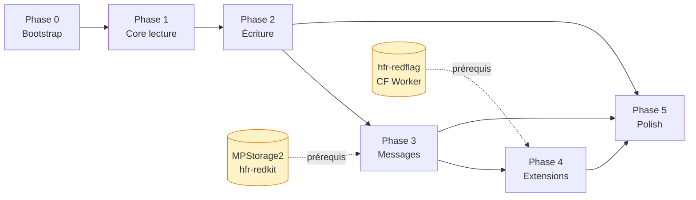

# Roadmap
{: .fs-8 }

Phases de développement, de la fondation au polish.
{: .fs-5 .fw-300 }

---

## Vue d'ensemble

Les phases sont **ordonnées par dépendances techniques**, pas datées. Le rythme réel dépend des contributeurs et des dépendances externes (ex. MPStorage2 dans hfr-redkit à finaliser avant la Phase 3). Cohérent avec la [méthodologie triple-hybride]({{ site.baseurl }}/specs/methodology) (prototype-driven).

Pour la liste des capabilities et des non-goals, voir le [scope fonctionnel]({{ site.baseurl }}/specs/scope).

### Dashboard des phases

| Phase | Objectif | Taille | Dépend de | Statut |
|---|---|---|---|---|
| **0 — Bootstrap** | Squelette qui compile, CI, thème, navigation | S | — | ✅ Livrée |
| **1 — Core** | Lecture du forum (drapeaux, topics, forum, deep links) | XL | Phase 0 | ✅ Livrée (AAB `0.1.0-phase1.7` / `app-v38` / specs v0.8.4) |
| **2 — Écriture** | Post / edit / quote / create topic / recherche / proxy alpha | L | Phase 1 | En close-out |
| **3 — Messages** | MPs classiques + MultiMPs avec sync | M | Phase 2 + **MPStorage2** (hfr-redkit) | À faire |
| **4 — Extensions** | Bookmarks, Blacklist, Qualitay, Redflag | L | Phase 3 + **hfr-redflag Worker** | À faire |
| **5 — Polish** | Animations, offline, thème dynamique, Play Store | M | Phases 2, 3, 4 | À faire |

**Taille** : S = petit sous-chantier, M = quelques composants, L = plusieurs features indépendantes, XL = écran majeur + parseurs + cache (ex. `PostRenderer` natif).

### Graphe des dépendances

Les dépôts en cylindre (`MPStorage2`, `hfr-redflag`) sont des **dépendances externes** hors de ce repo — leur état bloque le démarrage de la phase qui les consomme.

---

## Phase 0 — Bootstrap ✅ livrée

**Objectif :** un squelette d'app qui compile, avec CI, thème et navigation.

- [x] Structure Gradle multi-modules (8 core + 7 features base déclarés ; certains modules conservent un `build.gradle.kts` vide en attente de leur cycle, cf. ADR-001)
- [x] CI GitHub Actions (`detektAll`, `lintDebug`, `test`, `testDebugUnitTest`, `:app:assembleDebug`)
- [x] Thème Material 3 dans `:core:ui` (clair, sombre, AMOLED — Material You + HFR Classique différés Phase 5)
- [x] Navigation graph Compose Navigation 3 (bottom nav 4 onglets + back stacks par onglet, cf. [navigation.md]({{ site.baseurl }}/specs/navigation))
- [x] Hilt wiring (`build-logic` convention plugins, KSP, `@HiltAndroidApp`)
- [x] Design system de base (typographie, couleurs, composants thème)
- [x] Build signed AAB — pipeline `--init-script` + stamping `redface2-v<vc>-<YYYYMMDD>-<sha>.aab`

**Livrable :** une app qui démarre, affiche la bottom nav et navigue entre les écrans Phase 1 (drapeaux placeholder Phase 0 ; remplacé par la liste réelle en Phase 1B.4 ; forum/search/messages placeholder, topic fixe, éditeur placeholder).

---

## Phase 1 — Core (lecture seule) ✅ livrée

**Objectif :** lire le forum. C'est 80% du use case.

- [x] **Login HFR (cookies persistants)** — `:feature:auth.LoginScreen` + `AuthRepository` cache-aside (DataStore + `PersistentCookieJar`), session persistée via `md_user`/`md_pass`, commit cookies seulement après classification `Authenticated`, détection session expirée sur endpoints authentifiés (cf. [ADR-002]({{ site.baseurl }}/adr/002-credentials-option-a) — DataStore non chiffré + FBE, AAB v14 / `0.1.0-phase1b.0`, hardening v24 / `0.1.0-phase1b.10`)
- [x] **Écran Drapeaux (accueil)** — `:feature:flags.FlagsRoute` + `FlagRepository` (REST `forums/hardwarefr/topics/{participated,read,favorites}/` depuis Phase 1D-1 #110, anciennement HTML `forum1f.php?owntopic={1,2,3}`), 3 onglets (« Mes sujets » / « Lus uniquement » / « Favoris »), boutons « Réessayer » / « Actualiser » sans pull-to-refresh complet en 1B, filtre client CYAN masquant les sujets participés déjà lus par défaut (#154). Le footer alpha initial (pseudo, logout, version, signalement, Diagnostics) a vécu temporairement sur `MessagesScreen` (#154), puis a été hoisté en Phase 2 finish (#198) dans le menu compte global (`RedfaceAccountMenu`) accessible depuis chaque écran principal via un slot `topBarActions`. `MessagesScreen` redevient un placeholder Phase 3.
- [x] **Slice topic fixe** — historique : `TopicScreen` a rendu une fixture HFR via parser → AST → renderer le temps que le pipeline réseau soit posé
- [x] **Parser HTML topic** — `:core:parser` produit `PostContent` depuis le HTML HFR (cf. [PR #78](https://github.com/ForumHFR/redface2/pull/78))
- [x] **PostRenderer Compose** — rendu natif `PostContent` dans `:core:ui` (paragraphes, citations imbriquées avec collapse, spoilers, smileys builtin/perso, images, couleurs ; cf. [ADR-011]({{ site.baseurl }}/adr/011-postcontent-ast) et [PR #80](https://github.com/ForumHFR/redface2/pull/80))
- [x] **Écran Topic réel** — `TopicRepository` cache-aside (OkHttp + parser + Room) livré ([PR #88](https://github.com/ForumHFR/redface2/pull/88)) puis branché sur `TopicScreen` (1A-bind), `TopicFixtureRepository` supprimé
- [x] **Écran Topic — lecture longue Phase 1D-2 (#107)** : Précédent / Suivant + indicateur page X/Y + champ "Aller à la page" pour les longs topics ; rangée 1..N gardée en complément ≤ 40 pages. `TopicEffect.ScrollToPost(numreponse)` consommé une seule fois par `LaunchedEffect(Unit)` (re-emit empêché par un flag interne au ViewModel). Deep link `forum2.php?cat=N&post=M&page=P#tID` ouvre la page P et scrolle au post `tID` quand il est présent. Back stack préservé : tap sur une page replace l'entrée TopicRoute (pas de push), back ramène au caller.
- [x] **Écran Forum 1C-A REST-first** — `:feature:forum.ForumScreen` (19 catégories) + `ForumCategoryScreen` (subcats + topics paginés). Source REST `/webservices/rest_api.php` via `HfrApiClient` (`:core:network`) et `ForumRepository` (`:core:data`), cf. [ADR-003]({{ site.baseurl }}/adr/003-api-rest-hfr-hybride)
- [x] **Écran Forum 1C-B** — Material 3 `PullToRefreshBox` sur `ForumScreen` / `ForumCategoryScreen` (contenu préservé pendant le refresh, pas de `SwipeRefresh` Accompanist), badge drapeau par topic dérivé du REST `flag_owntopic` (CYAN / RED / FAVORITE), recherche locale dans la page courante (titre / auteur / dernier réponseur, accent-insensitive)
- [x] **Cache Room Phase 1D-3 (#26)** — pages topic + posts persistés avec TTL, `authMode` anti-écrasement, drapeaux REST persistés par compte dans `flag_topics`, purge logout / changement de pseudo via `CacheInvalidator`
- [x] Deep linking (URLs HFR → app) — `parseHfrDeepLink` corrigé (mapping `forum1.php` ↔ `forum2.php` inversé, fixé en 1C-A) et branché sur les écrans réels Forum/Category/Topic
- [x] **Prefetch pages suivantes Phase 1D-4 (#108)** — topic `page + 1` persisté en `ANONYMOUS` sans écraser l'authentifié, listing forum `page + 1` warm-up anonyme sans exposer le payload ; annulation au changement de page / sortie d'écran
- [x] **Images + smileys (Coil 3) — Phase 1D-5 (#109)** — `SingletonImageLoader.Factory` côté `:app` avec `AnimatedImageDecoder.Factory()` (autoplay GIFs builtins + perso). `:core:ui` `PostMediaDisplayPolicy` centralise les tailles : builtin 18×18, perso 70×50 (`ContentScale.Fit`, bucket aligné sur la distribution wikismilies), inline image 240×180 borné (`ContentScale.Inside`), block image largeur parent + hauteur max 480dp + arrondi + état loading/error. Pas de mesure intrinsèque async ni `FlowRow` — décision B+ verrouillée par Codex (re-évaluable Phase 2/4 si le bucket fixe reste insuffisant).
- [x] **Blocs monospace `[fixed]` / `[code]` (#79)** — `PostBlock.Fixed(text)` et `PostBlock.CodeBlock(text, language?)` parsés depuis `<table class="fixed">` / `<table class="code">` ; `PostRenderer` rend chaque bloc dans une `Card surfaceContainerHighest` à police monospace avec scroll horizontal sur overflow. Coloration syntaxique aplatie en texte brut (Phase 2).

**Livrable :** une app utilisable pour **lire** le forum au quotidien. Pas encore de possibilité d'écrire.

### PostRenderer — le sous-chantier critique

Le rendu natif Compose du contenu HFR est le composant le plus complexe de toute l'app. Il doit gérer :

| Élément | Complexité |
|---------|-----------|
| Texte formaté (gras, italique, souligné, couleur, taille) | Moyenne |
| Citations imbriquées | Élevée |
| Blocs de code | Faible |
| Images inline | Moyenne |
| Smileys HFR | Moyenne (cache + mapping) |
| URLs cliquables | Faible |
| Spoilers (clic pour révéler) | Moyenne |
| Listes | Faible |

Le PostRenderer sera développé de manière incrémentale : texte brut d'abord, puis formatage, puis citations, puis images.

---

## Phase 2 — Écriture

**Objectif :** interagir avec le forum.

- [x] **2A — Reality check protocole d'écriture HFR (#81) + références écosystème (#32)** — fixtures live, spec écriture alignée HFR, page `docs/guides/references.md` consolidée. Mergé via PR #159 (writes) + PR #160 (références).
- [x] **2B-A — Socle éditeur local (#86, refs #144)** — `PostEditorRoute` / `TopicFormRoute`, `PostEditorScreen` + ViewModel, toolbar BBCode complète (gras / italique / souligné / barré / quote / code / cpp / fixed / spoiler / url / image), preview locale via `parsePostContentFromBbcode`. Pas encore d'envoi HFR — local seulement.
- [x] **2C — Reply MVP (#145)** — POST réel `bddpost.php` via `ReplyRepository` (`:core:domain/write/` + `:core:data/write/`), `PostEditorViewModel` wire submit + erreurs typées (`empty`, `invalid_token`, `antiflood`, `locked`, `login_required`). Migration Room v3 → v4 ajoute `subcat` à `topic_pages` ; HFR write contract recapturé sur fixtures Phase 2A.
- [x] **Quote MVP (#146)** — bouton « Citer » par post dans `TopicScreen`, `PostEditorRoute` étendu avec `quotedNumreponse` + `quoteRef` (opaque, parsé depuis le href HFR), GET `message.php?…&numrep={cited}&ref={N}`, `ReplyForm.initialContent` hydrate le draft une seule fois sans écraser une saisie utilisateur, POST `bddpost.php` avec `numrep={cited}` et `numreponse=""`. Réutilise le `ReplyRepository` ; pas de `QuoteRepository`.
- [x] **Edit post MVP (#147)** — bouton « Modifier » par post éditable détecté depuis la toolbar HFR (lien `message.php?…&numreponse=N`). GET edit form, hydratation du draft depuis le BBCode existant, POST `bdd.php?config=hfr.inc` avec `numreponse={N}` et `numrep=""`. `EditPostRepository` distinct du `ReplyRepository` ; partage les parsers, options, classification d'erreurs. `delete=1` filtré (hors scope). Refresh topic + scroll vers le post édité.
- [x] **Edit FP MVP (#148)** — édition du sujet + contenu BBCode du premier post via `TopicFormScreen` dédié. `TopicFormParser` extrait `sujet`, `subcat` sélectionnée + choix complet du `<select>`, `MsgIcon` checked, options checkboxes, et préserve les champs sondage / `toread1..5` verbatim. POST `bdd.php?config=hfr.inc` avec `sujet` modifiable et `subcat` re-catégorisable ; `delete` filtré (suppression hors scope). `Topic.isFirstPostOwner` détecté depuis la toolbar du premier post (page 1 uniquement). Édition active du sondage : reportée — fixture avec sondage existant nécessaire avant de prouver le contrat.
- [x] **Edit FP polish (#178)** — recatégorisation exposée via le dropdown sous-catégorie pour `TopicFormMode.EditFirstPost`, avec submit du `selectedSubcat` existant ; l'UX sondage reste honnête (préservation verbatim uniquement tant que les fixtures POST sondage manquent).
- [x] **Create topic MVP (#149 Phase 2E)** — depuis `ForumCategoryScreen`, FAB « Nouveau topic » (visible en `AuthState.Authenticated` uniquement), composer dédié `TopicFormScreen` mode `New` (sujet + dropdown sous-catégorie obligatoire + BBCode toolbar + options HFR), POST `bddpost.php?config=hfr.inc` via `TopicFormRepository.submitNewTopic`. `from_subcat` (chip d'arrivée) reste distinct du `subcat` final (dropdown). Sur succès avec ids extractibles, navigation directe vers le nouveau topic ; sinon refresh de la sous-catégorie cible + Toast. Sondage actif à la création : reporté tant qu'aucune fixture POST sondage n'a été capturée.
- [x] **Toolbar BBCode (#144 Phase 2B-B)** — palette couleur Material 3 (`BbcodeAction.Color(#RRGGBB)` + dropdown 5 swatches) ajoutée à la toolbar partagée `:core:ui/BbcodeToolbar`. `BbcodeAction` est devenu un `sealed interface` pour porter le hex. Listes BBCode (`[list]/[*]`) restent **hors AST** en Phase 2B : le parser les conserve en texte brut sans crash (cf. `BbcodeContentParserTest`), à revoir Phase 4 quand un renderer liste sera utile. Smileys perso et upload images : #11.
- [x] **Preview BBCode** — livré 2B-A en local via `parsePostContentFromBbcode` ; preview serveur `apercu.php` reportée tant qu'aucune divergence HFR ne le justifie.
- [x] **Smileys éditeur MVP (#11 partiel, Phase 2F-B + 2F-C)** — picker `ModalBottomSheet` Material 3 dans `PostEditorScreen` (Reply / Quote / Edit, Phase 2F-B) **et** dans `TopicFormScreen` (Edit FP + New topic, Phase 2F-C). Onglet **Standard** : 25 builtins HFR servis depuis la constante `BUILTIN_HFR_SMILEYS` (codes dérivés de `write_reply_form_open_topic.html`). Onglet **Wiki** : recherche live via `GET /message-smi-mp-aj.php?config=hfr.inc&user_id={id}&findsmilies={query}` (contrat vérifié 2026-05-22, `user_id` parsé depuis `find_smilies_timer('hfr.inc', N)` du form HTML et plumb dans `ReplyForm.userId`/`TopicForm.userId`), debounce 300 ms + gate `query.length > 2` alignés sur le composer HFR. Insertion via `insertBbcodeToken(" $token ")` qui reproduit la convention `putSmiley` JS. Le rendu adaptatif des smileys inline dans les posts est sorti du scope et tracé dans #175. Hors scope #11 conservé : favoris, récents, upload smiley perso, GIFs externes, catalogue offline.
- [ ] **Dogfood rendu smileys (#131 / #175, Phase 2F-D)** — comparer visuellement RF2 au rendu web HFR sur de vrais topics ; garder le bucket fixe 70×50 si acceptable, ou livrer le rendu adaptatif #175 si le dogfood invalide ce compromis.
- [x] **Médias éditeur Phase 2F-E (#189)** — helper MVP d'insertion d'image par URL distante : dialog Material 3 depuis la toolbar partagée, validation `http(s)` uniquement, insertion `[img]url[/img]` au curseur dans Reply / Quote / Edit / Edit FP / New topic. Upload/rehost, favoris/récents smileys, GIFs externes et sync MPStorage sont différés aux phases ultérieures (#190).
- [x] **Recherche HFR MVP (#150 partiel, Phase 2G-A/B)** — recherche via `GET /forum1.php?recherches=1&...` (le form HFR `POST /search.php` renvoie une page de transition meta-refresh, on hit le GET canonique directement). Parser couvre les shapes capturées : `no-results` (page `.hop` minimaliste), `pivot single` (1 cat hit), `pivot multi` (N cats hit, sélecteur via `<select name="cat">` dans `
`), `explicit cat` (listing standard sans bannière), et les extraits contenu `Dernier message correspondant` avec lien `forum2.php?...numreponse=...` quand HFR les fournit. Écran Recherche : champ + IME Search + bouton, choix Titres+messages/Titres/Messages, états idle/loading/empty/error/results, pivot horizontal pour relancer dans une autre catégorie. Navigation → `TopicRoute(cat, post, page, scrollTo)` quand le résultat porte un `numreponse`, sinon page 1.
- [x] **Recherche HFR bugfix (#188, Phase 2G-B)** — les catégories de pivot de recherche sont rendues en rail horizontal borné (single-line + ellipsis), ce qui évite les libellés verticaux du style « Linux et OS Alternatifs » sur écran étroit.
- [ ] Recherche HFR filtres avancés auteur/date + pagination — backlog non bloquant après stabilisation du MVP, à ouvrir en issue dédiée si le besoin reste confirmé après #188.
- [ ] Retirer un drapeau (delflag) — swipe + undo (#99, Phase 2G-C)
- [x] **Réglage proxy utilisateur (#187, Phase 2H)** — écran Settings alpha, persistance DataStore, branchement HFR-only pour OkHttp + Coil (seuls `hardware.fr` / `*.hardware.fr` passent par le proxy ; les images externes restent en direct), proxy HTTP avec authentification optionnelle, et guide utilisateur. Le MVP demande un redémarrage de l'app après changement ; pas de proxy embarqué, PAC, SOCKS ou bypass list.

**Livrable :** une app complète pour lire ET écrire sur le forum.

---

## Phase 3 — Messages

**Objectif :** les messages privés, classiques et multi.

- [ ] Inbox MPs classiques — liste, lecture, reply
- [ ] Nouveau MP — création
- [ ] MultiMPs — liste avec vue drapeaux, lecture, reply, quote
- [ ] Nouveau MultiMP — création (2+ destinataires)
- [ ] Intégration MPStorage — synchronisation avec le MP de stockage HFR + cache Room
- [ ] Notifications MP

**Livrable :** gestion complète des MPs, y compris les MultiMPs avec état lu/non-lu.

---

## Phase 4 — Extensions communautaires

**Objectif :** les features inspirées des userscripts HFR.

- [ ] Architecture d'extensions (PostDecorator, TopicToolbarContributor)
- [ ] Bookmarks — sauvegarder des posts
- [ ] Blacklist — masquer des utilisateurs
- [ ] Alertes Qualitay — signaler un post remarquable
- [ ] Redflag — alertes intelligentes sur topics suivis

**Livrable :** les features communautaires les plus demandées, intégrées nativement.

---

## Phase 5 — Polish

**Objectif :** l'expérience utilisateur raffinée.

- [ ] Animations et transitions
- [ ] Mode offline complet (lecture + file d'attente d'écriture)
- [ ] Notifications push configurables
- [ ] Thème dynamique (Material You)
- [ ] Thème "HFR classique"
- [ ] Widgets Android
- [ ] Tests de performance (scroll, cold start, mémoire)
- [ ] Release automation
  - Signed release build (keystore en GitHub Secrets)
  - Publication Play Store (arbitrage Fastlane vs Gradle Play Publisher)
  - Beta testing (Play Console internal testing privilégié vs Firebase App Distribution)
  - Création compte développeur ForumHFR si inexistant

**Livrable :** une app prête pour le grand public.

---

## Participation

Chaque phase sera trackée via les [issues GitHub](https://github.com/ForumHFR/redface2/issues) et des milestones. Les contributions sont les bienvenues à partir de la Phase 1.

Pour contribuer :
1. Choisir une issue non assignée
2. Commenter pour signaler qu'on la prend
3. Ouvrir une PR sur une branche feature
4. Review par un mainteneur
