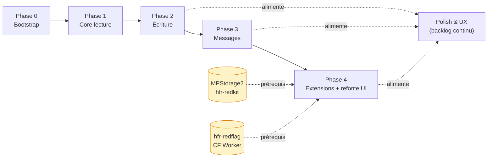

# Roadmap
{: .fs-8 }

Phases de développement, de la fondation au polish.
{: .fs-5 .fw-300 }

---

## Vue d'ensemble

> **Les phases sont des ÉPICS THÉMATIQUES, pas une chronologie.** Elles regroupent le travail par thème (lecture, écriture, messages, extensions, polish), pas par ordre de livraison. **Le « quand » est porté par les releases** — l'historique réel des livraisons se lit dans les `CHANGELOG.md` (racine + `app/CHANGELOG.md`) et les `versionName` des bêtas/prod, pas dans la numérotation des phases. Une feature peut donc être livrée « en avance » sur sa phase (ex. la Blacklist, thème Phase 4, shippée en bêta 0.15.0 avant l'ouverture formelle de la Phase 4).
>
> Corollaire : **« Polish & UX » (ex-Phase 5) n'est pas une étape finale mais un backlog continu** alimenté tout au long du projet. Le milestone GitHub correspondant a été renommé en ce sens (« Polish & UX (backlog continu) »), et le label `phase-5` est devenu `polish`.

Les phases gardent un **ordre de dépendances techniques** (on ne livre pas l'écriture avant la lecture), pas un calendrier. Le rythme réel dépend des contributeurs et des dépendances externes. Cohérent avec la [méthodologie triple-hybride]({{ site.baseurl }}/specs/methodology) (prototype-driven).

Pour la liste des capabilities et des non-goals, voir le [scope fonctionnel]({{ site.baseurl }}/specs/scope).

### Dashboard des phases

| Phase | Objectif | Taille | Dépend de | Statut |
|---|---|---|---|---|
| **0 — Bootstrap** | Squelette qui compile, CI, thème, navigation | S | — | ✅ Livrée |
| **1 — Core** | Lecture du forum (drapeaux, topics, forum, deep links) | XL | Phase 0 | ✅ Livrée (AAB `0.1.0-phase1.7` / `app-v38` / specs v0.8.4) |
| **2 — Écriture** | Post / edit / quote / create topic / recherche / proxy alpha | L | Phase 1 | ✅ Livrée |
| **3 — Messages** | MPs classiques + MultiMPs (lecture + écriture + DT + sync de position) | M | Phase 2 | ✅ Livrée (clôture #598 ; sync MPStorage bidirectionnelle complète + cache Room reportés → #6, Phase 4) |
| **4 — Extensions + refonte UI pré-1.0** | Bookmarks, Qualitay, Redflag + refonte Drapeaux (#603) / Topic (#604) + hygiène repo (#605) ; Blacklist déjà livrée | L | Phase 3 + **hfr-redflag Worker** | 🚧 En cours |
| **Polish & UX** | Animations, offline, thème dynamique, Play Store, raffinements UX | — | continu | ♾️ Backlog continu (pas une étape finale) |

**Taille** : S = petit sous-chantier, M = quelques composants, L = plusieurs features indépendantes, XL = écran majeur + parseurs + cache (ex. `PostRenderer` natif).

### Graphe des dépendances

Les dépôts en cylindre (`MPStorage2`, `hfr-redflag`) sont des **dépendances externes** hors de ce repo — leur état bloque le démarrage de la phase qui les consomme. Note : la **lecture** MPStorage (positions DT) est livrée en Phase 3 **sans** dépendre de MPStorage2 (l'enveloppe v0.1 de facto a été adoptée, cf. [ADR-014]({{ site.baseurl }}/adr/014-mpstorage-v01-de-facto)) ; le prérequis MPStorage2 ne pèse plus que sur la **sync complète** de Phase 4 (#6). « Polish & UX » n'est pas une phase terminale : c'est un **backlog continu** alimenté par toutes les phases.

---

## Phase 0 — Bootstrap ✅ livrée

**Objectif :** un squelette d'app qui compile, avec CI, thème et navigation.

- [x] Structure Gradle multi-modules (8 core + 8 features base déclarés ; certains modules conservent un `build.gradle.kts` vide en attente de leur cycle, cf. ADR-001)
- [x] CI GitHub Actions (`detektAll`, `lintDebug`, `test`, `testDebugUnitTest`, `:app:assembleDebug`)
- [x] Thème Material 3 dans `:core:ui` (clair, sombre, AMOLED — Material You + HFR Classique différés Phase 5)
- [x] Navigation graph Compose Navigation 3 (bottom nav 4 onglets + back stacks par onglet, cf. [navigation.md]({{ site.baseurl }}/specs/navigation))
- [x] Hilt wiring (`build-logic` convention plugins, KSP, `@HiltAndroidApp`)
- [x] Design system de base (typographie, couleurs, composants thème)
- [x] Build signed AAB — pipeline `--init-script` + stamping `redface2-v<vc>-<YYYYMMDD>-<sha>.aab`

**Livrable :** une app qui démarre, affiche la bottom nav et navigue entre les écrans Phase 1 (drapeaux placeholder Phase 0 ; remplacé par la liste réelle en Phase 1B.4 ; forum/search/messages placeholder, topic fixe, éditeur placeholder).

---

## Phase 1 — Core (lecture seule) ✅ livrée

**Objectif :** lire le forum. C'est 80% du use case.

- [x] **Login HFR (cookies persistants)** — `:feature:auth.LoginScreen` + `AuthRepository` cache-aside (DataStore + `PersistentCookieJar`), session persistée via `md_user`/`md_pass`, commit cookies seulement après classification `Authenticated`, détection session expirée sur endpoints authentifiés (cf. [ADR-002]({{ site.baseurl }}/adr/002-credentials-option-a) — DataStore non chiffré + FBE, AAB v14 / `0.1.0-phase1b.0`, hardening v24 / `0.1.0-phase1b.10`)
- [x] **Écran Drapeaux (accueil)** — `:feature:flags.FlagsRoute` + `FlagRepository` (REST `forums/hardwarefr/topics/{participated,read,favorites}/` depuis Phase 1D-1 #110, anciennement HTML `forum1f.php?owntopic={1,2,3}`), 3 onglets (« Mes sujets » / « Lus uniquement » / « Favoris »), boutons « Réessayer » / « Actualiser » sans pull-to-refresh complet en 1B, filtre client CYAN masquant les sujets participés déjà lus par défaut (#154). Le footer alpha initial (pseudo, logout, version, signalement, Diagnostics) a vécu temporairement sur `MessagesScreen` (#154), puis a été hoisté en Phase 2 finish (#198) dans le menu compte global (`RedfaceAccountMenu`) accessible depuis chaque écran principal via un slot `topBarActions`. `MessagesScreen` redevient un placeholder Phase 3.
- [x] **Slice topic fixe** — historique : `TopicScreen` a rendu une fixture HFR via parser → AST → renderer le temps que le pipeline réseau soit posé
- [x] **Parser HTML topic** — `:core:parser` produit `PostContent` depuis le HTML HFR (cf. [PR #78](https://github.com/ForumHFR/redface2/pull/78))
- [x] **PostRenderer Compose** — rendu natif `PostContent` dans `:core:ui` (paragraphes, citations imbriquées avec collapse, spoilers, smileys builtin/perso, images, couleurs ; cf. [ADR-011]({{ site.baseurl }}/adr/011-postcontent-ast) et [PR #80](https://github.com/ForumHFR/redface2/pull/80))
- [x] **Écran Topic réel** — `TopicRepository` cache-aside (OkHttp + parser + Room) livré ([PR #88](https://github.com/ForumHFR/redface2/pull/88)) puis branché sur `TopicScreen` (1A-bind), `TopicFixtureRepository` supprimé
- [x] **Écran Topic — lecture longue Phase 1D-2 (#107)** : Précédent / Suivant + indicateur page X/Y + champ "Aller à la page" pour les longs topics ; rangée 1..N gardée en complément ≤ 40 pages. `TopicEffect.ScrollToPost(numreponse)` consommé une seule fois par `LaunchedEffect(Unit)` (re-emit empêché par un flag interne au ViewModel). Deep link `forum2.php?cat=N&post=M&page=P#tID` ouvre la page P et scrolle au post `tID` quand il est présent. Back stack préservé — et depuis #895 étape 4 (12/07/2026) un changement de page ne traverse plus la navigation du tout : la `TopicRoute` est figée à l'entrée et `TopicViewModel.switchToPage()` fait le travail (la formulation « tap sur une page replace l'entrée TopicRoute » décrivait le modèle route-driven, périmé ; corrigé #1041).
- [x] **Écran Forum 1C-A REST-first** — `:feature:forum.ForumScreen` (19 catégories) + `ForumCategoryScreen` (subcats + topics paginés). Source REST `/webservices/rest_api.php` via `HfrApiClient` (`:core:network`) et `ForumRepository` (`:core:data`), cf. [ADR-003]({{ site.baseurl }}/adr/003-api-rest-hfr-hybride)
- [x] **Écran Forum 1C-B** — Material 3 `PullToRefreshBox` sur `ForumScreen` / `ForumCategoryScreen` (contenu préservé pendant le refresh, pas de `SwipeRefresh` Accompanist), badge drapeau par topic dérivé du REST `flag_owntopic` (CYAN / RED / FAVORITE), recherche locale dans la page courante (titre / auteur / dernier réponseur, accent-insensitive)
- [x] **Cache Room Phase 1D-3 (#26)** — pages topic + posts persistés avec TTL, `authMode` anti-écrasement, drapeaux REST persistés par compte dans `flag_topics`, purge logout / changement de pseudo via `CacheInvalidator`
- [x] Deep linking (URLs HFR → app) — `parseHfrDeepLink` corrigé (mapping `forum1.php` ↔ `forum2.php` inversé, fixé en 1C-A) et branché sur les écrans réels Forum/Category/Topic
- [x] **Prefetch pages suivantes Phase 1D-4 (#108)** — topic `page + 1` persisté en `ANONYMOUS` sans écraser l'authentifié, listing forum `page + 1` warm-up anonyme sans exposer le payload ; annulation au changement de page / sortie d'écran
- [x] **Images + smileys (Coil 3) — Phase 1D-5 (#109)** — `SingletonImageLoader.Factory` côté `:app` avec `AnimatedImageDecoder.Factory()` (autoplay GIFs builtins + perso). `:core:ui` `PostMediaDisplayPolicy` centralise les tailles : builtin 18×18, perso 70×50 (`ContentScale.Fit`, bucket aligné sur la distribution wikismilies), inline image 240×180 borné (`ContentScale.Inside`), block image largeur parent + hauteur max 480dp + arrondi + état loading/error. Pas de mesure intrinsèque async ni `FlowRow` — décision B+ verrouillée par Codex (re-évaluable Phase 2/4 si le bucket fixe reste insuffisant). **MAJ Phase 2F : le bucket fixe des smileys a été remplacé par un rendu intrinsèque (mesure native Coil, no-upscale, cap abs 70sp/240sp + cap relatif 0.9×largeur, `AboveBaseline`+line-growth) en #175 / PR #222 — cf. `protocol-hfr.md` § Smileys. Les images inline `[img]` restent en bucket fixe (migration intrinsèque suivie en #224 ; validation visuelle smileys app↔web en #131).**
- [x] **Blocs monospace `[fixed]` / `[code]` (#79)** — `PostBlock.Fixed(text)` et `PostBlock.CodeBlock(text, language?)` parsés depuis `<table class="fixed">` / `<table class="code">` ; `PostRenderer` rend chaque bloc dans une `Card surfaceContainerHighest` à police monospace avec scroll horizontal sur overflow. Coloration syntaxique aplatie en texte brut (Phase 2).

**Livrable :** une app utilisable pour **lire** le forum au quotidien. Pas encore de possibilité d'écrire.

### PostRenderer — le sous-chantier critique

Le rendu natif Compose du contenu HFR est le composant le plus complexe de toute l'app. Il doit gérer :

| Élément | Complexité |
|---------|-----------|
| Texte formaté (gras, italique, souligné, couleur, taille) | Moyenne |
| Citations imbriquées | Élevée |
| Blocs de code | Faible |
| Images inline | Moyenne |
| Smileys HFR | Moyenne (cache + mapping) |
| URLs cliquables | Faible |
| Spoilers (clic pour révéler) | Moyenne |
| Listes | Faible |

Le PostRenderer sera développé de manière incrémentale : texte brut d'abord, puis formatage, puis citations, puis images.

---

## Phase 2 — Écriture

**Objectif :** interagir avec le forum.

- [x] **2A — Reality check protocole d'écriture HFR (#81) + références écosystème (#32)** — fixtures live, spec écriture alignée HFR, page `docs/guides/references.md` consolidée. Mergé via PR #159 (writes) + PR #160 (références).
- [x] **2B-A — Socle éditeur local (#86, refs #144)** — `PostEditorRoute` / `TopicFormRoute`, `PostEditorScreen` + ViewModel, toolbar BBCode complète (gras / italique / souligné / barré / quote / code / cpp / fixed / spoiler / url / image), preview locale via `parsePostContentFromBbcode`. Pas encore d'envoi HFR — local seulement.
- [x] **2C — Reply MVP (#145)** — POST réel `bddpost.php` via `ReplyRepository` (`:core:domain/write/` + `:core:data/write/`), `PostEditorViewModel` wire submit + erreurs typées (`empty`, `invalid_token`, `antiflood`, `locked`, `login_required`). Migration Room v3 → v4 ajoute `subcat` à `topic_pages` ; HFR write contract recapturé sur fixtures Phase 2A.
- [x] **Quote MVP (#146, hardening #227)** — bouton « Citer » par post dans `TopicScreen`, gate sur `Topic.canReply` (pas sur `quoteRef`), `PostEditorRoute` étendu avec `quotedNumreponse` + `quoteRef` optionnel. GET `message.php?…&numrep={cited}` avec `&ref={N}` seulement quand HFR l'a exposé en clair ; HFR préremplit quand même `[quotemsg=…]` avec `numrep` seul sur les liens obfusqués. `ReplyForm.initialContent` hydrate le draft une seule fois sans écraser une saisie utilisateur, POST `bddpost.php` avec `numrep={cited}` et `numreponse=""`. Réutilise le `ReplyRepository` ; pas de `QuoteRepository`.
- [x] **Edit post MVP (#147)** — bouton « Modifier » par post éditable détecté depuis la toolbar HFR (lien `message.php?…&numreponse=N`). GET edit form, hydratation du draft depuis le BBCode existant, POST `bdd.php?config=hfr.inc` avec `numreponse={N}` et `numrep=""`. `EditPostRepository` distinct du `ReplyRepository` ; partage les parsers, options, classification d'erreurs. `delete=1` filtré (hors scope). Refresh topic + scroll vers le post édité.
- [x] **Edit FP MVP (#148)** — édition du sujet + contenu BBCode du premier post via `TopicFormScreen` dédié. `TopicFormParser` extrait `sujet`, `subcat` sélectionnée + choix complet du `<select>`, `MsgIcon` checked, options checkboxes, et préserve les champs sondage / `toread1..5` verbatim. POST `bdd.php?config=hfr.inc` avec `sujet` modifiable et `subcat` re-catégorisable ; `delete` filtré (suppression hors scope). `Topic.isFirstPostOwner` détecté depuis la toolbar du premier post (page 1 uniquement). Édition active du sondage : reportée — fixture avec sondage existant nécessaire avant de prouver le contrat.
- [x] **Edit FP polish (#178)** — recatégorisation exposée via le dropdown sous-catégorie pour `TopicFormMode.EditFirstPost`, avec submit du `selectedSubcat` existant ; l'UX sondage reste honnête (préservation verbatim uniquement tant que les fixtures POST sondage manquent).
- [x] **Create topic MVP (#149 Phase 2E + #214/#206 finish)** — depuis `ForumCategoryScreen`, FAB « Nouveau topic » (visible en `AuthState.Authenticated` uniquement), composer dédié `TopicFormScreen` mode `New` (sujet + dropdown sous-catégorie obligatoire + BBCode toolbar + options HFR), POST `bddpost.php?config=hfr.inc` via `TopicFormRepository.submitNewTopic`. `from_subcat` (chip d'arrivée) reste distinct du `subcat` final (dropdown). La réponse succès live refresh vers la liste cible et ne renvoie aucun topic id : l'app revient donc sur la sous-catégorie cible avec Toast et met en évidence le sujet créé par correspondance exacte du titre. Sondage actif à la création : reporté tant qu'aucune fixture POST sondage n'a été capturée.
- [x] **Toolbar BBCode (#144 Phase 2B-B)** — palette couleur Material 3 (`BbcodeAction.Color(#RRGGBB)` + dropdown 5 swatches) ajoutée à la toolbar partagée `:core:ui/BbcodeToolbar`. `BbcodeAction` est devenu un `sealed interface` pour porter le hex. Listes BBCode (`[list]/[*]`) restent **hors AST** en Phase 2B : le parser les conserve en texte brut sans crash (cf. `BbcodeContentParserTest`), à revoir Phase 4 quand un renderer liste sera utile. Smileys perso et upload images : #11.
- [x] **Preview BBCode** — livré 2B-A en local via `parsePostContentFromBbcode` ; preview serveur `apercu.php` reportée tant qu'aucune divergence HFR ne le justifie.
- [x] **Smileys éditeur MVP (#11 partiel, Phase 2F-B + 2F-C)** — picker `ModalBottomSheet` Material 3 dans `PostEditorScreen` (Reply / Quote / Edit, Phase 2F-B) **et** dans `TopicFormScreen` (Edit FP + New topic, Phase 2F-C). Onglet **Standard** : 25 builtins HFR servis depuis la constante `BUILTIN_HFR_SMILEYS` (codes dérivés de `write_reply_form_open_topic.html`). Onglet **Wiki** : recherche live via `GET /message-smi-mp-aj.php?config=hfr.inc&user_id={id}&findsmilies={query}` (contrat vérifié 2026-05-22, `user_id` parsé depuis `find_smilies_timer('hfr.inc', N)` du form HTML et plumb dans `ReplyForm.userId`/`TopicForm.userId`), debounce 300 ms + gate `query.length > 2` alignés sur le composer HFR. Insertion via `insertBbcodeToken(" $token ")` qui reproduit la convention `putSmiley` JS. Le rendu adaptatif des smileys inline dans les posts est sorti du scope et tracé dans #175. Hors scope #11 conservé : favoris, récents, upload smiley perso, GIFs externes, catalogue offline.
- [ ] **Dogfood rendu smileys (#131 / #175, Phase 2F-D)** — comparer visuellement RF2 au rendu web HFR sur de vrais topics ; garder le bucket fixe 70×50 si acceptable, ou livrer le rendu adaptatif #175 si le dogfood invalide ce compromis.
- [x] **Médias éditeur Phase 2F-E (#189)** — helper MVP d'insertion d'image par URL distante : dialog Material 3 depuis la toolbar partagée, validation `http(s)` uniquement, insertion `[img]url[/img]` au curseur dans Reply / Quote / Edit / Edit FP / New topic. Upload/rehost, favoris/récents smileys, GIFs externes et sync MPStorage sont différés aux phases ultérieures (#190).
- [x] **Recherche HFR MVP (#150 partiel, Phase 2G-A/B)** — recherche via `GET /forum1.php?recherches=1&...` (le form HFR `POST /search.php` renvoie une page de transition meta-refresh, on hit le GET canonique directement). Parser couvre les shapes capturées : `no-results` (page `.hop` minimaliste), `pivot single` (1 cat hit), `pivot multi` (N cats hit, sélecteur via `<select name="cat">` dans `
`), `explicit cat` (listing standard sans bannière), et les extraits contenu `Dernier message correspondant` avec lien `forum2.php?...numreponse=...` quand HFR les fournit. Écran Recherche : champ + IME Search + bouton, choix Titres+messages/Titres/Messages, états idle/loading/empty/error/results, pivot horizontal pour relancer dans une autre catégorie. Navigation → `TopicRoute(cat, post, page, scrollTo)` quand le résultat porte un `numreponse`, sinon page 1.
- [x] **Recherche HFR bugfix (#188, Phase 2G-B)** — les catégories de pivot de recherche sont rendues en rail horizontal borné (single-line + ellipsis), ce qui évite les libellés verticaux du style « Linux et OS Alternatifs » sur écran étroit.
- [ ] Recherche HFR filtres avancés auteur/date + pagination — backlog non bloquant après stabilisation du MVP, à ouvrir en issue dédiée si le besoin reste confirmé après #188.
- [x] **Profil utilisateur (#208, Phase 2 finish)** — tap sur avatar/pseudo d'un post ouvre un bottom sheet résumé (avatar carré/arrondi, pseudo, localisation, inscription, posts). Bouton « Voir le profil complet » navigue vers la page détaillée. `Post.profileId` extrait du lien toolbar HFR et persisté en Room v6. Module `:feature:profile` avec `ProfileViewModel` (AssistedInject), `ProfilePreviewSheet` (ModalBottomSheet M3) et `ProfileScreen`. Frontière `:feature:topic` → `:feature:profile` zéro (callback `onOpenProfile` hoisted dans `:app`). Bouton « Derniers messages » désactivé (pas de route stable, marqué « à venir »).
- [x] **Retirer un drapeau (delflag) (#99, Phase 2 finish)** — retrait par **swipe-to-remove** (`SwipeToDismissBox` M3, swipe end-to-start) sur chaque ligne dans `:feature:flags`, avec **confirmation Material 3 obligatoire avant l'appel réseau** (le swipe ouvre le dialog mais ne supprime jamais la ligne seul ; **pas d'undo optimiste** : `addflag` n'est pas prouvé pour tous les types, donc rien à re-poser après coup). Suppression unitaire via `GET /user/delflag.php` authentifié (mapping `FlagType`→`owntopic` 1/2/3, classée sur « Drapeau effacé avec succès » ; cf. `protocol-hfr.md`). Succès → éviction des caches mémoire + Room (clé `cat+topicId+type`) et ré-émission immédiate ; échec → aucun cache touché + snackbar d'erreur. Action désactivée pendant l'appel (anti double-tap). Suppression en masse (`manageaction.php`) hors scope.
- [x] **Réglage proxy utilisateur (#187, Phase 2H)** — écran Settings alpha, persistance DataStore, branchement HFR-only pour OkHttp + Coil (seuls `hardware.fr` / `*.hardware.fr` passent par le proxy ; les images externes restent en direct), proxy HTTP avec authentification optionnelle, et guide utilisateur. Le MVP demande un redémarrage de l'app après changement ; pas de proxy embarqué, PAC, SOCKS ou bypass list.
- [x] **Swipe pour changer de page de topic (#282, Phase 2 finish)** — geste horizontal gauche/droite « drag-follow » dans `TopicScreen` (la page suit le doigt, résistance amortie aux bords, retour haptique armement/commit, edge-glow discret), implémenté par `Modifier.topicPageSwipe` (`feature/topic/.../TopicSwipe.kt`, helpers purs testés). Il appelle le **même** `onOpenPage(targetPage)` que les boutons de pager (à la livraison : navigation route-driven, remplaçait la `TopicRoute`, avec transition Topic→Topic instantanée dédiée ; **depuis #895 étape 4, le même `onOpenPage` alimente le moteur de pagination in-ViewModel — route figée à l'entrée, `transitionSpec` dédié retiré**) ; geste gaté tant que l'entrée nav n'est pas `RESUMED`. Aucune action destructive.

**Livrable :** une app complète pour lire ET écrire sur le forum.

---

## Phase 3 — Messages

**Objectif :** les messages privés, classiques et multi.

- [x] Inbox MPs classiques — liste + lecture en read-only (#298)
- [x] Reply MP classique (#301) + citation simple par message (#1074, lot 4 de #1040) — le FAB global « Répondre » conserve le formulaire réel et son `newdest` ; le pied de chaque message citable ouvre un GET typé avec `numrep` et son rang `ref` 1-based. Le formulaire et le BBCode prérempli ont été mesurés en #1041 ; aucun POST live n'a été émis, le corps client est verrouillé par MockWebServer. Cf. [protocol-hfr.md]({{ site.baseurl }}/specs/protocol-hfr)
- [x] Nouveau MP — création
- [x] MultiMPs — liste avec vue drapeaux, lecture, reply, onglet « DT » des Drapeaux listant les MultiMP + reprise de lecture MPStorage livré 2026-06-19, app-v166. La citation simple et multiple par message (#1074) est livrée comme sur les MP classiques. Le GET d'une citation a été mesuré en DT le 2026-08-17 : mêmes 20 champs cachés que le 1:1, `cat=prive`, `numreponse` vide, `numrep` = message cité, aucun `ref` caché et aucun `newdest`. Le `ref=0` sans `numreponse` appartient au formulaire de **réponse** DT owner et ne décrit pas la citation. Vérifié aussi sur appareil : « Citer » ouvre l'éditeur prérempli par HFR sans erreur ; aucun POST live n'a été émis. La citation multiple enchaîne côté client un GET typé par sélection et concatène les préremplissages, mais ni cet enchaînement ni le POST de plusieurs `[quotemsg]` n'ont été mesurés live.
- [x] Nouveau MultiMP — création (2+ destinataires)
- [x] Intégration MPStorage — **lecture livrée** (découverte par scan inbox + parsing + seed des positions DT) **et écriture déclencheur de synchronisation de la position de lecture DT livrée** (`writeBackFlagIfPresent` UPDATE-ONLY, **opt-in OFF par défaut**, #593/#597 via PR #608, RMW guardé + verify-after-write + cap 64 KiB, POST `bdd.php cat=prive` non observé live). **Activation opt-in par défaut + cache Room du contenu + synchronisation bidirectionnelle = Phase 4 (#6/#577)** (ADR-013 déc. 2/3 + ADR-014 §4).
- [x] Notifications MP (#313)
- [x] Recherche intra-topic (#546/#576/#585) — `transsearch.php`, saut préc./suiv., filtre pseudo, tout-le-sujet
- [x] Mode plein écran (#518)
- [x] Onglet « DT » conditionnel dans les Drapeaux (réglage section DT, OFF par défaut)

**Livrable :** gestion complète des MPs, y compris les MultiMPs (lecture, écriture, membres) et la reprise de position de lecture DT.

> **Statut (2026-06-20) — Phase 3 ✅ Livrée (clôture #598).** L'épic Messages est livré et shippé :
> MP lecture (#298), reply MP (#301 — le « quote » revendiqué par ce bilan n'a jamais existé côté MP, corrigé le 2026-08-12 par #1041), nouveau MP + nouveau MultiMP, gestion des membres
> MultiMP via `newdest` (#606/#612), onglet DT + reprise de position MPStorage, recherche
> intra-topic (#546), plein écran (#518), parité des gestes de lecture topic↔MP (#351 a/b/c), et
> le déclencheur de synchronisation de position de lecture DT (#597, UPDATE-ONLY opt-in OFF).
>
> **Reste explicitement reporté (hors clôture Phase 3)** :
> - **Synchronisation MPStorage bidirectionnelle complète + activation opt-in par défaut + cache Room** → umbrella **#6**, requalifié **Phase 4** (questions de fond non tranchées : fréquence, conflits, format v1/v2, clé write-back).
> - **#531** (réconcilier le lu/non-lu serveur des MP, re-unread best-effort) — **polish**, pas du fonctionnel manquant ; suivi en backlog **Polish & UX**, pas dans la clôture.
>
> Lancer `/spec-reality` pour figer l'alignement specs↔code avant un bump de version specs.

---

## Phase 4 — Extensions communautaires + refonte UI pré-1.0 🚧 en cours

**Objectif :** les features inspirées des userscripts HFR **et** la refonte UI avant la 1.0.

**Extensions communautaires :**
- [ ] Architecture d'extensions (`PostDecorator`, `TopicToolbarContributor`) — **prospective**, `:core:extension` est encore une coquille vide (cf. [extensions.md]({{ site.baseurl }}/specs/extensions#architecture-dextensions))
- [ ] Bookmarks — sauvegarder des posts
- [x] **Blacklist — masquer des utilisateurs** — ✅ **livrée par anticipation** (bêta 0.15.0, #509), hors module d'extension dédié (DataStore JSON + `:feature:settings`, cf. [extensions.md]({{ site.baseurl }}/specs/extensions#blacklist--livrée))
- [ ] Alertes Qualitay — signaler un post remarquable
- [ ] Redflag — alertes intelligentes sur topics suivis (dépend du Worker `hfr-redflag`)

**Synchronisation MPStorage (suite Phase 3, requalifiée ici) :**
- [ ] Activation de l'écriture MPStorage opt-in par défaut + clé write-back tranchée (#597 reste OFF en attendant) — umbrella **#6** / **#577**
- [ ] Cache Room du contenu MP (opt-in, ADR-013 étage 3) + synchronisation bidirectionnelle

### Refonte UI pré-1.0

Mandat de refonte des écrans chauds avant la 1.0 (post HFR XaTriX 2788560) :
- [x] **Refonte de la vue Drapeaux** — #603 (livrée, bêta 0.18.0 — [ADR-017]({{ site.baseurl }}/adr/017-refonte-vue-drapeaux))
- [x] **Refonte de la vue Topic** — #604 (livrée, bêta 0.37.0 : cinq vagues, moteur de pagination in-VM #895, loupe #182, passe images #876 ; reliquats en Vue · Topic 2)
- [x] **Hygiène repo / audit des dérives** — exécutée (2026-06) ; #605 requalifiée en ombrelle de suivi Phase 4

**Livrable :** les features communautaires les plus demandées + une UI refondue prête pour la 1.0.

---

## Polish & UX — backlog continu ♾️

> **Pas une étape finale.** Anciennement « Phase 5 ». Le milestone GitHub est renommé
> « Polish & UX (backlog continu) » et le label `phase-5` est devenu `polish`. Les
> raffinements sont livrés en continu tout au long du projet — beaucoup le sont déjà
> (thème AMOLED #286, transitions, swipe de pages, ascenseur, etc.). L'historique de
> livraison se lit dans les `CHANGELOG.md` (racine + `app/CHANGELOG.md`), pas ici.

**Objectif :** l'expérience utilisateur raffinée, en continu.

- [ ] Animations et transitions (raffinements continus)
- [ ] Mode offline complet (lecture + file d'attente d'écriture)
- [ ] Notifications push configurables
- [ ] Thème dynamique (Material You)
- [ ] Thème "HFR classique"
- [ ] Widgets Android
- [ ] Tests de performance (scroll, cold start, mémoire)
- [x] Release automation — pipeline bêta/prod live (Play open testing + F-Droid, signed AAB via `--init-script`, guard CI `versionName`)

**Livrable :** une app continuellement raffinée pour le grand public.

---

## Participation

Chaque phase sera trackée via les [issues GitHub](https://github.com/ForumHFR/redface2/issues) et des milestones. Les contributions sont les bienvenues à partir de la Phase 1.

Pour contribuer :
1. Choisir une issue non assignée
2. Commenter pour signaler qu'on la prend
3. Ouvrir une PR sur une branche feature
4. Review par un mainteneur
